# 使用 k-Means 算法进行遥感影像的语义分割

> 原文：[`towardsdatascience.com/semantic-segmentation-of-remote-sensing-imagery-using-k-means-e4c165d9218e?source=collection_archive---------2-----------------------#2024-03-14`](https://towardsdatascience.com/semantic-segmentation-of-remote-sensing-imagery-using-k-means-e4c165d9218e?source=collection_archive---------2-----------------------#2024-03-14)

## 从零开始在 Python 中实现🐍

[](https://medium.com/@alexroz?source=post_page---byline--e4c165d9218e--------------------------------)[](https://towardsdatascience.com/?source=post_page---byline--e4c165d9218e--------------------------------) [Aleksei Rozanov](https://medium.com/@alexroz?source=post_page---byline--e4c165d9218e--------------------------------)

·发表于 [Towards Data Science](https://towardsdatascience.com/?source=post_page---byline--e4c165d9218e--------------------------------) ·9 分钟阅读·2024 年 3 月 14 日

--

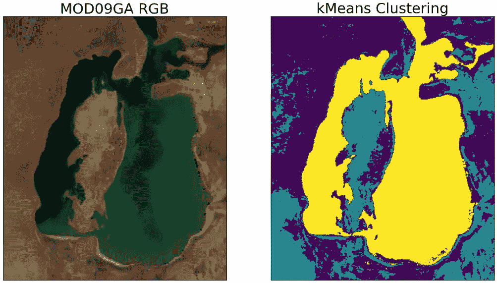

图片由 [作者](https://medium.com/@alexroz) 提供。

在我看来，最简单且最具天才的机器学习模型之一是 k-Means 聚类算法。它属于无监督学习算法的一类，能够在没有标签的数据集中发现模式。它最令人愉悦的特点是没有复杂的数学运算，基本上任何一位高中生都能成功实现并使用这个方法。所以在这篇文章中，我想分享如何仅使用*numpy*和*pandas*库在 Python 中从零开始构建 k-Means 算法，并将其应用于一个实际问题——卫星影像的语义分割。

## 首先，让我们谈谈我们所拥有的数据。

在我之前的一篇文章中，我谈到了咸海缩小的问题。结果，我们通过 Google Earth Engine 获得了来自 MODIS 的遥感影像，这强烈表明海水正在干涸。因此，我想知道，如何使用机器学习的语义分割来估算 2000 年到 2023 年间水面变化？答案就是 k-Means！

[](https://medium.com/@alexroz/how-can-a-sea-disappear-case-study-of-the-aral-sea-using-python-and-modis-data-c59429cb73dd?source=post_page-----e4c165d9218e--------------------------------) [## 海洋如何消失？使用 Python 和 MODIS 数据对咸海的案例研究。

### 让我们创建一个时间推移视频，看看它是否真实！

medium.com](https://medium.com/@alexroz/how-can-a-sea-disappear-case-study-of-the-aral-sea-using-python-and-modis-data-c59429cb73dd?source=post_page-----e4c165d9218e--------------------------------)

在深入编码之前，我们先来看一下在本教程中将使用的数据。这是同一地区的两张 RGB 图像，间隔 23 年，然而很明显，土地表面特性和大气条件（云、气溶胶等）是不同的。这就是为什么我决定为每张图像分别训练两个独立的 k-均值模型。

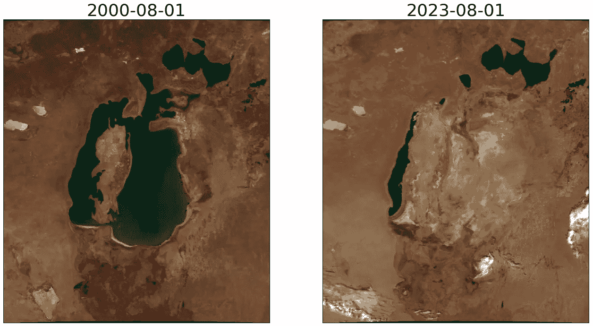

图片来自[作者](https://medium.com/@alexroz)。

> 要跟随这个教程，你可以下载并运行这个笔记本[**这里**](https://github.com/alexxxroz/Medium/blob/main/Medium_k_Means.ipynb)。

首先，我们导入必要的库并将数据上传到笔记本：

```py
import pandas as pd
import numpy as np
import matplotlib.pyplot as plt
import matplotlib.image as mpimg

img = mpimg.imread('MOD_01.jpg')
img2 = mpimg.imread('MOD_24.jpg')
```

你可以看到图像覆盖的区域相当大，所以我建议稍微放大一些：

```py
img = img[140:600,110:500,:]
img2 = img2[140:600,110:500,:]

fig, ax = plt.subplots(ncols=2, figsize=(16,9))
ax[0].imshow(img)
ax[1].imshow(img2)
for i in range(2):
  ax[i].set_facecolor('black')
  ax[i].set_xticks([])
  ax[i].set_yticks([])
ax[0].set_title('2000-08-01', fontsize=26)
ax[1].set_title('2023-08-01', fontsize=26)
plt.show()
```

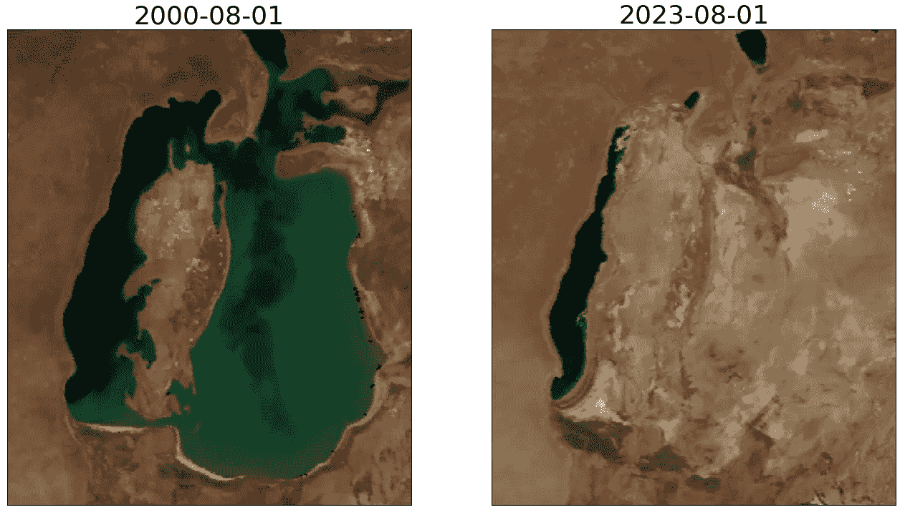

图片来自[作者](https://medium.com/@alexroz)。

在机器学习阶段之前的最后一步，我们将图像转换为*pandas*数据框（每个图像通道一列）。这样做是为了便于我解释。如果你想要优化，使用*numpy*数组会更好。

```py
df = pd.DataFrame({'R': img[:,:, 0].flatten(), 'G': img[:,:, 1].flatten(), 'B':img[:,:, 2].flatten()})
df2 = pd.DataFrame({'R': img2[:,:, 0].flatten(), 'G': img2[:,:, 1].flatten(), 'B':img2[:,:, 2].flatten()})
```

# k-均值

那么算法背后的思想是什么呢？

想象一下你用两个标准来判断食物的味道：甜度和价格。记住这一点，我会给你一组可能的食物选项：

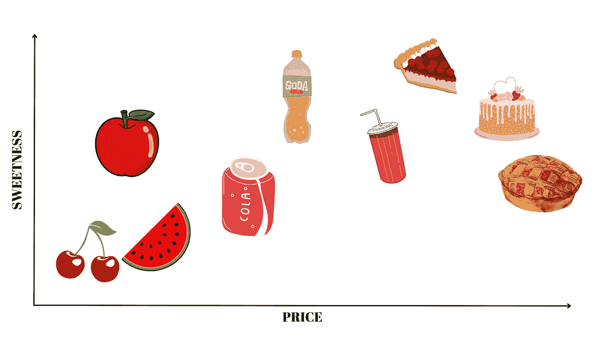

图片来自[作者](https://medium.com/@alexroz)。

我敢打赌你的大脑已经将选项分成了三个簇：水果、饮料和烘焙食品。基本上，你在无意识中将这 2 维数据进行了聚类，这些数据由一对值定义——（甜度；价格）。

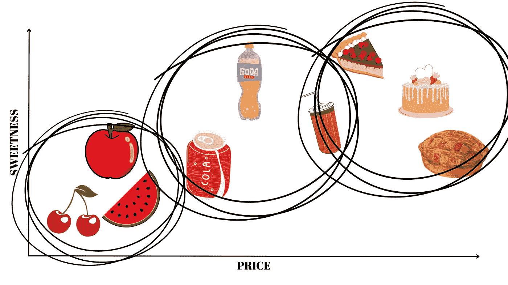

图片来自[作者](https://medium.com/@alexroz)。

在**k-均值**的情况下，算法的目标非常相似——在 n 维空间中找到一个*预设的*簇数量**k**（例如，除了甜度和价格，你还想考虑营养、健康、冰箱中食物的存在，在这种情况下，n = 5）。

# 该算法包括以下几个阶段：

## I. 定义簇的数量。

如我之前提到的，**k**在 k-均值中是你最终希望得到的簇的数量，你应该在训练模型之前设置这个值。

## II. 随机初始化质心。

质心是 k-均值算法中的一个重要部分。基本上，质心是一个圆形，中心由一组坐标定义，每个质心代表一个簇。例如，在我们之前的例子中有三个质心。

## III. 计算距离并分配簇。

现在我们需要找出每个点距离每个质心的远近。根据这些计算，我们将每个点分配给最远的质心（簇）。

## IV. 计算新的质心。

现在我们的每个簇至少包含一个点，所以是时候重新计算质心了，方法是取所有簇内点的平均坐标。

就这样！我们重复步骤 2 到 4，直到质心不再发生变化。

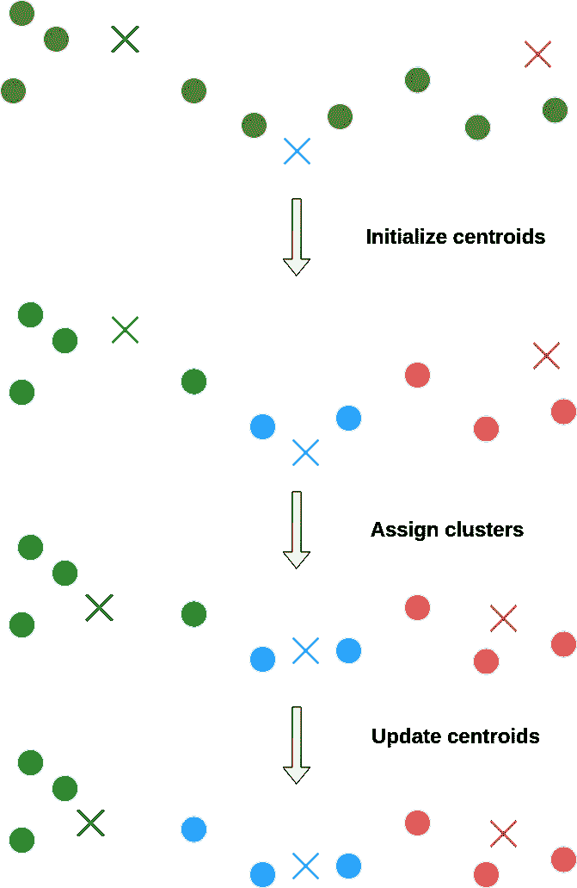

图片来源：[作者](https://medium.com/@alexroz)。

# 代码时间。

现在让我们将这个非常简单的 k-Means 思想封装成 Python 代码。

> 提醒：在这个任务中，我们有**3D**问题，也就是说，我们的**X**、**Y**和**Z**分别是**红色**、**绿色**和**蓝色**图像通道！

```py
def kmeans(data, K, kind):
  L = list()
  new_centroids = data.sample(K).values

  data = distance(data.copy(), new_centroids, kind)
  old_centroids = new_centroids.copy()
  new_centroids = np.array([data[data.Class == Class][['R', 'G', 'B']].mean().values for Class in data.loc[:,'C1':f'C{K}'].columns])
  i = 1
  print(f'Iteration: {i}\tDistance: {abs(new_centroids.mean()-old_centroids.mean())}')
  while abs(new_centroids.mean()-old_centroids.mean())>0.001:
    L.append(abs(new_centroids.mean()-old_centroids.mean()))
    data = distance(data, new_centroids, kind)
    old_centroids = new_centroids.copy()
    new_centroids = np.array([data[data.Class == Class][['R', 'G', 'B']].mean().values for Class in data.loc[:,'C1':f'C{K}'].columns])
    i+=1
    print(f'Iteration: {i}\tDistance: {abs(new_centroids.mean()-old_centroids.mean())}')
  print(f"k-Means has ended with {i} iteratinons")
  return data, L
```

在第一阶段，我们创建一个列表**L**，收集所有簇之间的距离，方便之后可视化，并从数据集中随机抽取 K 个点作为质心（或者，你也可以为质心分配随机值）。

```py
L = list()
new_centroids = data.sample(K).values
```

现在我们需要计算质心和数据点之间的距离。在数据科学中有很多不同的距离度量，但让我们聚焦于以下几种——欧几里得距离、曼哈顿距离、切比雪夫距离。

对于欧几里得距离：

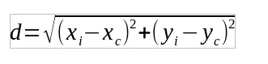

图片来源：[作者](https://medium.com/@alexroz)。

对于曼哈顿距离：

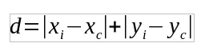

图片来源：[作者](https://medium.com/@alexroz)。

对于切比雪夫距离：

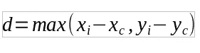

图片来源：[作者](https://medium.com/@alexroz)。

为了使用这些公式，让我们为**任何**维度数量编写一个通用函数：

```py
def distance(data, centroids, kind):
  #kind = euclidean, manhattan, chebyshev
  #Here we add to the dataframe as many clusters C-ith as needed
  cols=list()
  for i in range(1,k+1):
    if kind=='euclidean':
      data[f'C{i}'] = ((centroids[i-1][0]-data.R)**2+(centroids[i-1][1]-data.G)**2+(centroids[i-1][2]-data.B)**2)**0.5
    elif kind=='manhattan':
      data[f'C{i}'] = abs(centroids[i-1][0]-data.R)+abs(centroids[i-1][1]-data.G)+abs(centroids[i-1][2]-data.B)
    elif kind=='chebyshev':
      merged=pd.concat([centroids[i-1][0]-data.R, centroids[i-1][1]-data.G, centroids[i-1][2]-data.B], axis=1)
      data[f'C{i}'] = merged.max(axis=1)
    cols.append(f'C{i}')
  data['Class'] = data[cols].abs().idxmin(axis=1) #assigning clusters to points
  return data #returning the dataframe with k cluster columns and one Class column with the final cluster
```

现在我们可以简单地计算距离，并将每个数据点分配到一个簇中。因此，我们的新质心变成了旧的，所以我们将它们存储在另一个变量中，并重新计算新的质心。为了做到这一点，我们遍历每个簇，并对所有坐标求均值（在我们的案例中，是对 RGB 通道求均值）。因此，变量 new_centroids 的形状是**(k,3)**。

```py
data = distance(data.copy(), new_centroids, kind)
old_centroids = new_centroids.copy()
new_centroids = np.array([data[data.Class == Class][['R', 'G', 'B']].mean().values for Class in data.loc[:,'C1':f'C{K}'].columns])
```

最后，我们重复所有这些步骤，直到质心坐标不再变化。我将这个条件表示为：簇的平均坐标差应小于 0.001。但是你可以尝试其他的数值。

```py
while abs(new_centroids.mean()-old_centroids.mean())>0.001:
    L.append(abs(new_centroids.mean()-old_centroids.mean()))
    data = distance(data, new_centroids, kind)
    old_centroids = new_centroids.copy()
    new_centroids = np.array([data[data.Class == Class][['R', 'G', 'B']].mean().values for Class in data.loc[:,'C1':f'C{K}'].columns])
```

就这样，算法准备好进行训练了！所以我们将 k 设置为 3，并将结果存储到字典中。

```py
k = 3
segmented_1, segmented_2, distances_1, distances_2 = {}, {}, {}, {}
segmented_1['euclidean'], distances_1['euclidean'] = kmeans(df, k, 'euclidean')
segmented_2['euclidean'], distances_2['euclidean'] = kmeans(df2, k, 'euclidean')
segmented_1['manhattan'], distances_1['manhattan'] = kmeans(df, k, 'manhattan')
segmented_2['manhattan'], distances_2['manhattan'] = kmeans(df2, k, 'manhattan')
segmented_1['chebyshev'], distances_1['chebyshev'] = kmeans(df, k, 'chebyshev')
segmented_2['chebyshev'], distances_2['chebyshev'] = kmeans(df2, k, 'chebyshev')
```

正如你所看到的，我决定比较所有的距离度量，并且很明显在这个任务中曼哈顿距离是最快的。

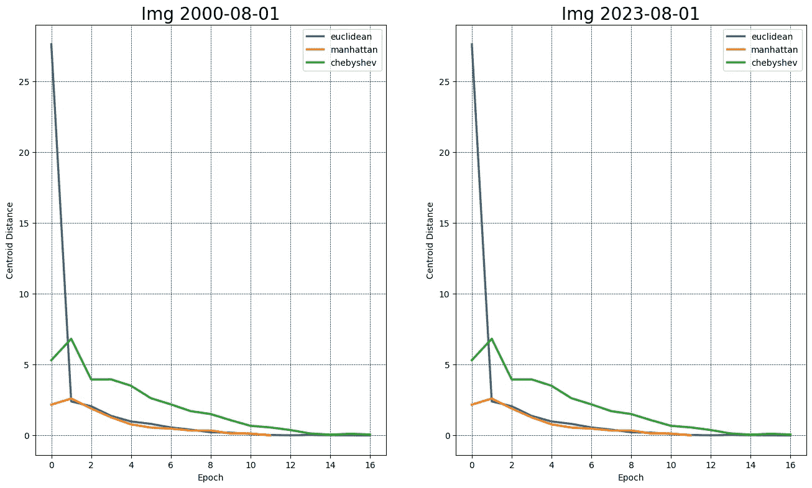

图片来源：[作者](https://medium.com/@alexroz)。

在可视化簇之前，让我们将簇的名称转换为整数类型：

```py
d = {'C1':0, 'C2': 1, 'C3':2}
for key in segmented_1.keys():
  segmented_1[key].Class = segmented_1[key].Class.apply(lambda x: d[x])
  segmented_2[key].Class = segmented_2[key].Class.apply(lambda x: d[x])
```

现在是时候做出最终的图表了！

```py
for key in segmented_1.keys():
  fig, ax = plt.subplots(ncols=2, nrows=2, figsize=(10,10))
  ax[0, 0].imshow(img)
  ax[0, 1].imshow(segmented_1[key].Class.values.reshape(460,390))
  ax[0, 0].set_title('MOD09GA RGB', fontsize=18)
  ax[0, 1].set_title(f'kMeans\n{key[0].upper()+key[1:]} Distance', fontsize=18)

  ax[1, 0].imshow(img2)
  ax[1, 1].imshow(segmented_2[key].Class.values.reshape(460,390))
  ax[1, 0].set_title('MOD09GA RGB', fontsize=18)
  ax[1, 1].set_title(f'kMeans\n{key[0].upper()+key[1:]} Distance', fontsize=18)

  for i in range(2):
    for j in range(2):
      ax[i, j].set_facecolor('black')
      ax[i, j].set_xticks([])
      ax[i, j].set_yticks([])

  plt.savefig(f'{key}.png')
  plt.tight_layout()
  plt.show()
```

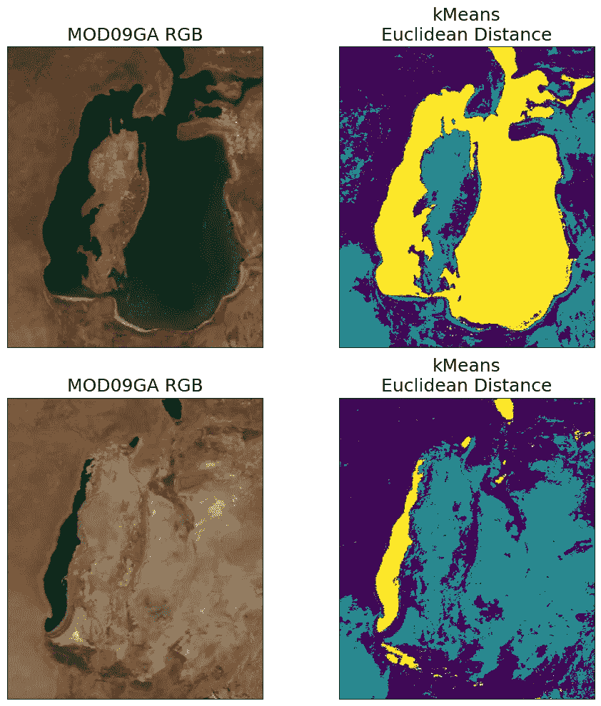

图片来源：[作者](https://medium.com/@alexroz)。

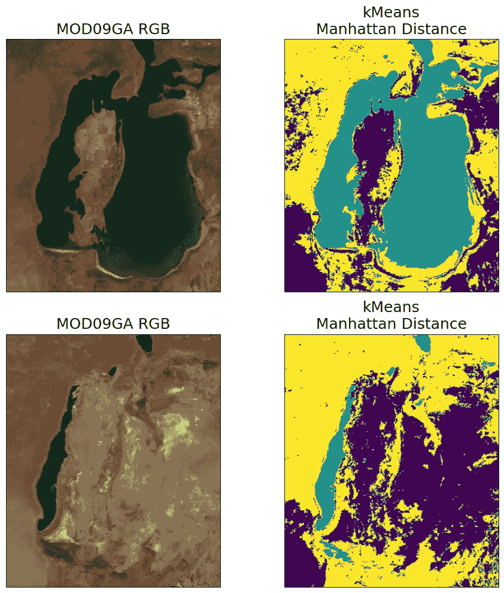

图片来源：[作者](https://medium.com/@alexroz)。

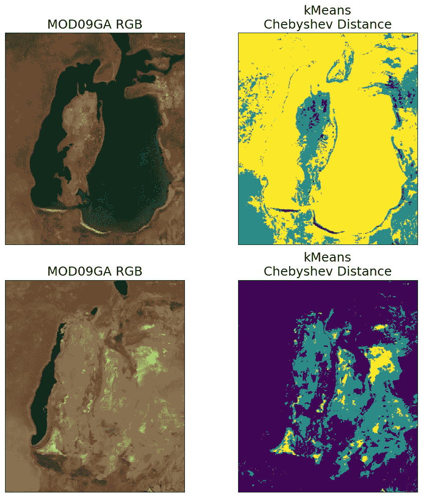

图片来源：[作者](https://medium.com/@alexroz)。

不难看出，欧几里得距离和曼哈顿距离是最适合这个任务的距离度量。但为了确保这一点，让我们通过轮廓系数评估 k-Means 聚类结果。当没有聚类点的标签真实值时，这个指标对于训练结果的评估非常完美。

为了计算它，我们将使用*sklearn*函数[[1]](https://scikit-learn.org/stable/modules/generated/sklearn.metrics.silhouette_score.html#sklearn.metrics.silhouette_score)。

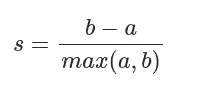

图片来源：[sklearn](https://scikit-learn.org/stable/modules/generated/sklearn.metrics.silhouette_score.html#sklearn.metrics.silhouette_score)。

+   **a —** 样本与同一类中所有其他点之间的平均距离。

+   **b —** 样本与*下一个最近的簇*中所有其他点之间的平均距离。

轮廓系数的值范围是[-1,1]。没错，这个计算开销比较大，因为你需要多次计算成千上万的点之间的距离，所以要准备好等待。

```py
scores_1, scores_2 = {}, {}
for key in segmented_1.keys(): #key is a metric for the distance estimation
  scores_1[key]=round(silhouette_score(segmented_1[key].loc[:, :'C3'], segmented_1[key].Class, metric=key),2)
  scores_2[key]=round(silhouette_score(segmented_2[key].loc[:, :'C3'], segmented_2[key].Class, metric=key),2)
  print(f'Distance: {key}\t Img 1: {scores_1[key]}\t Img 2: {scores_2[key]}')
```

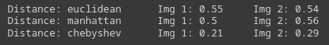

图片来源：[作者](https://medium.com/@alexroz)。

现在你可以看到我们已经证明了这一点：欧几里得距离和曼哈顿距离的表现非常相似，所以让我们使用这两者来估计水面面积的损失。

```py
for metric, Class in zip(['euclidean', 'manhattan'], [2,1]):
  img1_water = np.count_nonzero(segmented_1[metric].Class.values == Class)*500*500*1e-6 #pixel size is 500, so the area is 500*500 and to convert to km2 * 1e-6
  img2_water = np.count_nonzero(segmented_2[metric].Class.values == Class)*500*500*1e-6

  print(f'Distance: {metric}\tWater Area Before: {round(img1_water)}km\u00b2\tWater Area After: {round(img2_water)}km\u00b2\tChange: -{100-round(img2_water/img1_water*100)}%')
```

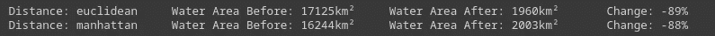

图片来源：[作者](https://medium.com/@alexroz)。

— — — —

距离度量：欧几里得距离

水域面积（前期）：17125 平方千米

水域面积（后期）：1960 平方千米

变化：-89%

— — — — —

距离度量：曼哈顿距离

水域面积（前期）：16244 平方千米

水域面积（后期）：2003 平方千米

变化：-88%

如你所见，根据我们的聚类结果，水面面积的变化几乎是**90%（!!!）的水体损失**，这是亚尔尔海萎缩是一个全球性悲剧的真实证明……

===========================================

**参考文献：**

[1] [`scikit-learn.org/stable/modules/generated/sklearn.metrics.silhouette_score.html#sklearn.metrics.silhouette_score`](https://scikit-learn.org/stable/modules/generated/sklearn.metrics.silhouette_score.html#sklearn.metrics.silhouette_score)

===========================================

***我在 Medium 上的所有出版物都是免费的开放访问，所以如果你关注我，我将非常感激！***

P.s. 我对（地理）数据科学、机器学习/人工智能和气候变化充满热情。如果你想一起做一些项目，请通过[LinkedIn](https://www.linkedin.com/in/alexxxroz/)与我联系。

🛰️关注获取更多信息🛰️
