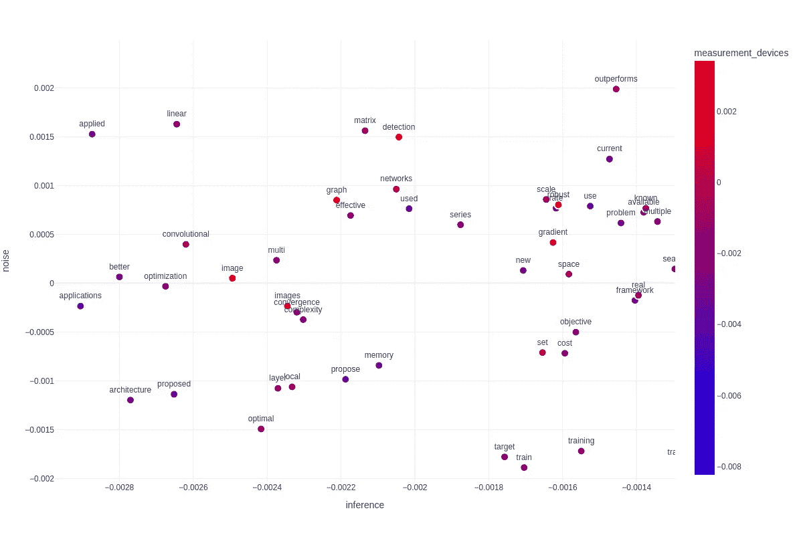

# 语义信号分离

> 原文：[`towardsdatascience.com/semantic-signal-separation-769f43b46779?source=collection_archive---------2-----------------------#2024-02-11`](https://towardsdatascience.com/semantic-signal-separation-769f43b46779?source=collection_archive---------2-----------------------#2024-02-11)

## 使用变换器和主题建模理解语义结构

[](https://medium.com/@power.up1163?source=post_page---byline--769f43b46779--------------------------------)[](https://towardsdatascience.com/?source=post_page---byline--769f43b46779--------------------------------) [Márton Kardos](https://medium.com/@power.up1163?source=post_page---byline--769f43b46779--------------------------------)

·发表于 [Towards Data Science](https://towardsdatascience.com/?source=post_page---byline--769f43b46779--------------------------------) ·阅读时间 10 分钟·2024 年 2 月 11 日

--

我们生活在大数据的时代。现在说数据是 21 世纪的石油已经成了一个陈词滥调，但它确实如此。数据收集的做法使得几乎每个人手中都堆积了大量数据。

然而，解释数据并非易事，许多行业和学术界仍然依赖于那些提供极少解释的解决方案。虽然深度学习对于预测非常有用，但它很少能让从业者理解数据背后的机制和结构。

文本数据尤其棘手。虽然自然语言和“主题”等概念对人类来说非常直观易懂，但要给语义结构制定操作性定义却远非易事。

在本文中，我将介绍不同的关于发现自然语言中潜在语义结构的概念化方法，我们将看看理论的操作性定义，最后我将通过案例研究展示该方法的实用性。

# 理论：什么是“主题”？

尽管“主题”对我们人类来说似乎是一个完全直观且不言自明的术语，但当我们试图给它一个有用且信息丰富的定义时，情况却并非如此。幸运的是，牛津词典的定义可以帮助我们：

> 一种被讨论、写作或研究的主题。

嗯，这并没有让我们更接近可以用计算术语表述的内容。请注意，“主题”一词被用来掩盖所有复杂的细节。然而，这不应使我们气馁，我们当然可以做得更好。


学科的语义空间

在自然语言处理（NLP）中，我们经常使用语义的空间定义。听起来可能有些花哨，但本质上我们假设文本/语言的语义内容可以在某个连续的空间中表达（通常是高维空间），在这个空间中，相关的概念或文本会比不相关的更接近。如果我们接受这种语义理论，我们可以很容易地为主题提出两种可能的定义。

## 作为语义聚类的主题

一种直观的概念化是将主题视为语义空间中相互紧密相关的段落/概念组，而这些组与其他文本的相关性较低。顺便提一下，这意味着一个段落*只能属于一个主题*。


学科的语义聚类

这种聚类概念化也有助于我们从*层级*的角度思考主题。你可以想象，“动物”这个主题可能包含两个子聚类，一个是“真核生物”，另一个是“原核生物”，然后你可以沿着这个层次结构往下走，直到在树的叶子节点，你会发现实际的概念实例。

当然，这种方法的一个局限性是，较长的段落可能包含多个主题。解决这一问题的一种方法是将文本拆分成更小的原子部分（例如单词），然后在这些部分上建模，但我们也可以完全抛弃聚类的概念化。

## 作为语义轴的主题

我们还可以将主题视为语料库中语义空间的潜在维度。换句话说：我们不是描述有哪些文档群组，而是通过寻找潜在的**语义信号**来解释文档中的变化。


学科语义空间中的潜在轴

> 我们通过找到潜在的语义信号来解释文档中的变化。

你可以举个例子，想象一下，餐厅评论背后最重要的语义轴可能是：

1.  对食物的满意度

1.  对服务的满意度

希望你能理解为什么这种概念化对于某些目的有用。我们不再仅仅寻找“好评”和“差评”，而是去理解这些评价之间差异的驱动因素。这种理论化的流行文化例子当然是政治坐标系。同样，我们并不是仅仅寻找“保守派”和“进步派”，而是去找到那些区分它们的**因素**。

# 让我们开始建模吧！

既然我们已经解决了哲学问题，就可以动手设计基于我们概念理解的计算模型了。

## 语义表示

经典的语义表示方法是所谓的**词袋模型**。本质上，你做出了一个非常强烈、几乎是显而易见的错误假设，即文档中无序的词汇集合构成了它的语义内容。虽然这些表示方式存在许多问题（如[维度灾难](https://en.wikipedia.org/wiki/Curse_of_dimensionality)、离散空间等），但通过数十年的研究，它们已被证明是有用的。

幸运的是，技术已经超越了这些表示方式，我们可以使用能够在上下文中表示文本的模型。[Sentence Transformers](http://sbert.net)是基于变换器（Transformer）的模型，可以将段落编码成一个高维的连续空间，其中语义相似性通过向量之间的高[余弦相似度](https://en.wikipedia.org/wiki/Cosine_similarity)来表示。在这篇文章中，我将主要关注使用这些表示的模型。

## 聚类模型

目前在主题建模社区中最广泛使用的模型（如[Top2Vec](https://github.com/ddangelov/Top2Vec), [BERTopic](https://maartengr.github.io/BERTopic/index.html)）是基于聚类的主题概念化方法。


BERTopic 发现的语义空间中的集群（图源自 BERTopic 文档）

他们在以下步骤中发现主题：

1.  使用[UMAP](https://umap-learn.readthedocs.io/en/latest/)降低语义表示的维度

1.  使用[HDBSCAN](https://hdbscan.readthedocs.io/en/latest/index.html)发现集群层次结构

1.  使用事后描述性方法（c-TF-IDF，接近聚类中心）估计每个集群的术语重要性

这些模型已经获得了广泛的关注，主要得益于它们可解释的主题描述、恢复层次结构的能力，以及从数据中学习主题数目的能力。

> 如果我们想要建模主题内容的细微差别，并理解语义的因素，单靠聚类模型是不够的。

我不打算深入讨论这些方法的实际优势和局限性，但它们中的大多数源于上述的哲学考虑。

## 语义信号分离

如果我们要在语料库中发现语义轴线，我们将需要一个新的统计模型。

我们可以从经典的主题模型中汲取灵感，例如**潜在语义分配（LSA）**。LSA 利用矩阵分解技术，在*词袋模型*表示中找到潜在的成分。LSA 的主要目标是找出高度相关的词汇，并将它们的共现解释为一个潜在的语义成分。

由于我们不再处理词袋模型，单纯解释相关性可能不是最优策略。正交性并不等于统计独立性。换句话说：仅仅因为两个组件不相关，并不意味着它们在统计上是独立的。

> 正交性并不等于统计独立性

其他学科幸运地提出了分解模型，可以发现最大程度上独立的组件。**独立成分分析**已经广泛应用于神经科学中，用于从脑电图数据中发现并去除噪声信号。


使用 PCA 和 ICA 演示正交性与独立性的区别（图源自 scikit-learn 的文档）

语义信号分离的主要思想是，我们可以通过使用独立成分分析（ICA）分解表示，发现语料库中文本的最大独立语义信号。

我们可以通过提取语料库中在给定维度上排名最高的术语，获得人类可读的主题描述。

# 案例研究：机器学习论文

为了展示语义信号分离在理解语料库中语义变化方面的有效性，我们将在一个大约 118k 机器学习摘要的数据集上拟合一个模型。

再次重申我们这里要实现的目标：我们希望建立所有机器学习论文分布的维度。换句话说，我们想为这个语料库建立一个语义空间理论。

为此，我们将使用我开发的一个 Python 库，叫做[Turftopic](https://x-tabdeveloping.github.io/turftopic/)，它实现了大多数使用 transformer 表示的主题模型，包括语义信号分离。此外，我们还将安装 HuggingFace 数据集库，以便下载当前的语料库。

```py
pip install turftopic datasets
```

让我们从 HuggingFace 下载数据：

```py
from datasets import load_dataset

ds = load_dataset("CShorten/ML-ArXiv-Papers", split="train")
```

然后，我们将对这些数据运行语义信号分离。我们将使用[all-MiniLM-L12-v2](https://huggingface.co/sentence-transformers/all-MiniLM-L12-v2)句子变换器，因为它速度较快，但提供合理高质量的嵌入。

```py
from turftopic import SemanticSignalSeparation

model = SemanticSignalSeparation(10, encoder="all-MiniLM-L12-v2")
model.fit(ds["abstract"])

model.print_topics()
```


语义信号分离在摘要中找到的主题

这些是我们在语料库中找到的十个维度的最高排名关键词。你可以看到，大多数这些关键词相当容易理解，并且已经帮助你看出机器学习论文中的差异背后的根本原因。

我将集中讨论三个维度，稍微随意一些，因为我发现它们很有趣。我是一个贝叶斯信徒，所以主题 7 看起来很有意思，因为它似乎描述了概率性、基于模型和因果性的论文。主题 6 似乎与噪声检测和去除有关，而主题 1 主要涉及测量设备。

我们将生成一个图表，展示词汇的一个子集，并显示每个术语在这些组成部分上的排名。

首先，让我们从模型中提取词汇，并选择一些词汇显示在我们的图表上。我选择了基于频率处于 99 百分位数的词汇（这样它们仍然能在散点图上保持一定的可见性）。

```py
import numpy as np

vocab = model.get_vocab()

# We will produce a BoW matrix to extract term frequencies
document_term_matrix = model.vectorizer.transform(ds["abstract"])
frequencies = document_term_matrix.sum(axis=0)
frequencies = np.squeeze(np.asarray(frequencies))

# We select the 99th percentile
selected_terms_mask = frequencies > np.quantile(frequencies, 0.99)
```

我们将创建一个*DataFrame*，包含三个选定维度和术语，以便后续轻松绘图。

```py
import pandas as pd

# model.components_ is a n_topics x n_terms matrix
# It contains the strength of all components for each word.
# Here we are selecting components for the words we selected earlier

terms_with_axes = pd.DataFrame({
    "inference": model.components_[7][selected_terms],
    "measurement_devices": model.components_[1][selected_terms],
    "noise": model.components_[6][selected_terms],
    "term": vocab[selected_terms]
 })
```

我们将使用 Plotly 图形库创建一个交互式散点图进行解释。X 轴将是推断/贝叶斯主题，Y 轴将是噪声主题，点的颜色将由测量设备主题决定。

```py
import plotly.express as px

px.scatter(
    terms_with_axes,
    text="term",
    x="inference",
    y="noise",
    color="measurement_devices",
    template="plotly_white",
    color_continuous_scale="Bluered",
).update_layout(
    width=1200,
    height=800
).update_traces(
    textposition="top center",
    marker=dict(size=12, line=dict(width=2, color="white"))
)
```


按语义轴分布的语料库中最常见术语的图

我们已经可以从这个可视化中推断出很多关于语料库语义结构的信息。例如，我们可以看到，关注效率、在线拟合和算法的论文在统计推断上的得分非常低，这在某种程度上是直观的。另一方面，语义信号分离已经帮助我们通过基于数据的方法确认，深度学习论文并不太关注统计推断和贝叶斯建模。我们可以从词汇“网络”和“网络”（以及“卷积”）在我们的贝叶斯轴上的排名非常低看出这一点。这是该领域受到的一项批评。我们刚刚通过实证证据支持了这一说法。

> 深度学习论文对统计推断和贝叶斯建模并不十分关注，这是该领域受到的一项批评。我们刚刚通过实证证据支持了这一说法。

我们还可以看到，聚类和分类对噪声非常关注，但基于代理的模型和强化学习则不太关注。

另外，我们可能观察到的一个有趣模式是噪声轴与测量设备之间的关系。术语“图像”、“图像”、“检测”和“鲁棒”在我们的测量轴上得分非常高。这些词汇也位于图表中噪声检测/去除较高的区域，而统计推断的讨论较少。这向我们表明，测量设备捕获了大量噪声，而文献试图解决这些问题，但主要不是通过将噪声纳入统计模型，而是通过预处理。这是非常有道理的，因为例如，神经科学以其非常广泛的预处理流程而著称，而且许多神经科学模型在处理噪声时遇到困难。



测量设备输出中的噪声通过预处理来应对

我们还可以观察到，在测量设备上的得分最低的术语是“文本”和“语言”。这似乎表明，自然语言处理和机器学习研究并不太关注语言的神经学基础和心理语言学。注意，“潜在”和“表示”在测量设备上的得分也相对较低，这表明神经科学中的机器学习研究并不特别关注表示学习。


文本和语言与测量设备的关系很少

当然，从这里出发的可能性是无限的，我们可以花费更多时间解释模型的结果，但我的目的是展示，通过使用语义信号分离，我们已经能够在语料库中找到观点，并建立一个语义学理论。

> 语义信号分离应该主要作为一种探索性手段，用于建立理论，而不是将其结果视为假设的证明。

我想强调的一点是，语义信号分离应该主要作为一种探索性手段，用于建立理论，而不是将其结果视为假设的证明。我的意思是，我们的结果足以让我们直观地理解语料库中区分因素的差异，然后建立一个关于发生了什么以及为什么发生的理论，但这不足以证明该理论的正确性。

# 结论

探索性数据分析可能会令人困惑，当然也没有一种适用于所有情况的解决方案来理解你的数据。我们一起探讨了如何通过基于模型的方法，从理论到计算公式，再到实践，提升我们对数据的理解。

我希望本文在分析大规模文本语料库中的话语时能对你有所帮助。如果你打算深入了解主题模型和探索性文本分析，确保也查看一下我其他的文章，因为它们会更详细地讨论这些主题的某些方面。

*((除非另有说明，所有图表均由作者制作。))*
