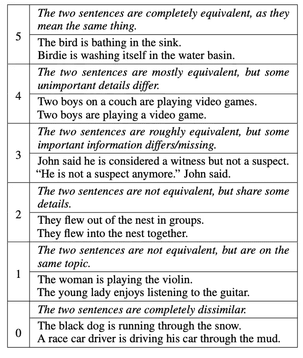
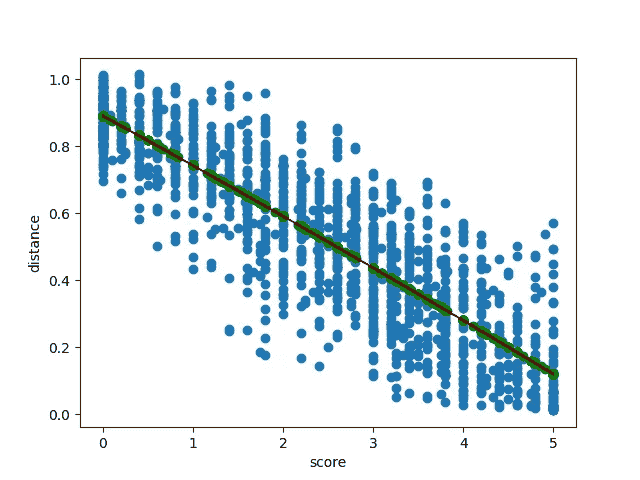

# 语义压缩文本以节省 LLM 成本

> 原文：[`towardsdatascience.com/semantically-compress-text-to-save-on-llm-costs-0b3e62b0c43a?source=collection_archive---------2-----------------------#2024-12-20`](https://towardsdatascience.com/semantically-compress-text-to-save-on-llm-costs-0b3e62b0c43a?source=collection_archive---------2-----------------------#2024-12-20)

## LLM 很棒……前提是它们能容纳你的所有数据

 [Lou Kratz](https://lou-kratz.medium.com/?source=post_page---byline--0b3e62b0c43a--------------------------------)

·发表于 [Towards Data Science](https://towardsdatascience.com/?source=post_page---byline--0b3e62b0c43a--------------------------------) ·8 分钟阅读·2024 年 12 月 20 日

--

图片由 [Christopher Burns](https://unsplash.com/@christopher__burns?utm_source=medium&utm_medium=referral) 提供，来自 [Unsplash](https://unsplash.com/?utm_source=medium&utm_medium=referral)

*最初发布于* [*https://blog.developer.bazaarvoice.com*](https://blog.developer.bazaarvoice.com/2024/10/28/semantically-compress-text-to-save-on-llm-costs/) *2024 年 10 月 28 日。*

# 引言

大型语言模型是处理非结构化文本的绝佳工具，但如果你的文本无法适应上下文窗口该怎么办？Bazaarvoice 在构建我们的 AI 评论摘要功能时正面临着这个挑战：数百万条用户评论根本无法容纳到即使是最新的 LLM 的上下文窗口中，即便能够容纳，也会非常昂贵。

在这篇文章中，我将分享 Bazaarvoice 如何通过压缩输入文本而不丢失语义来解决这个问题。具体而言，我们使用了一种多次传递的层次聚类方法，使我们能够明确地调整想要在压缩中失去的细节程度，而不管选择的是哪种嵌入模型。最终的技术使我们的评论摘要功能在财务上变得可行，并为我们未来继续扩展业务奠定了基础。

# 问题

Bazaarvoice 已经收集了近 20 年的用户生成产品评论，因此我们拥有 *大量* 的数据。这些产品评论完全是非结构化的，长度和内容各不相同。大型语言模型是处理非结构化文本的优秀工具：它们能够处理非结构化数据，并在干扰信息中识别出相关的信息片段。

然而，LLM 也有它们的局限性，其中之一就是上下文窗口：即一次可以输入到网络中的标记数量（大致为单词数量）。如 Athropic 的 Claude 3 版本这样的最先进的大型语言模型具有高达 200,000 个标记的极大上下文窗口。这意味着你可以将小小说嵌入其中，但互联网仍然是一个庞大且不断增长的数据集合，我们的用户生成的产品评论也不例外。

在构建“评论摘要”功能时，我们遇到了上下文窗口的限制，该功能可以总结我们客户网站上某个特定产品的所有评论。然而，在过去的 20 年里，许多产品积累了成千上万的评论，这些评论迅速超出了 LLM 的上下文窗口限制。事实上，我们甚至有些产品拥有数百万条评论，这就需要对 LLM 进行大规模的重新工程，才能够在一次提示中处理这些评论。

即使从技术上可行，成本也会相当高昂。所有大型语言模型（LLM）提供商都会根据输入和输出的标记数量收费。当我们接近每个产品的上下文窗口限制时，考虑到我们拥有数百万条数据，我们很容易就会产生超过六位数的云托管费用。

# 我们的方法

尽管面临这些技术和财务的限制，我们还是成功地发布了“评论摘要”功能，专注于一个非常简单的见解：许多评论传达的是相同的意思。实际上，摘要的核心理念就是基于这一点：评论摘要捕捉了评论者反复出现的见解、主题和情感。我们意识到可以利用这一数据重复性来减少需要发送到 LLM 的文本量，从而避免达到上下文窗口限制，*同时*减少我们系统的运营成本。

为了实现这一目标，我们需要识别出表达相同意思的文本段落。这类任务说起来容易做起来难：人们常常用不同的词汇或短语来表达相同的意思。

幸运的是，识别文本是否语义相似一直是自然语言处理领域的一个活跃研究方向。Agirre 等人在 2013 年的研究（*SEM 2013 共享任务：语义文本相似度。在第二届词汇和计算语义联合会议*）中，甚至发布了一个由人类标注的语义相似句子数据集，称为 STS Benchmark。在这个数据集中，他们要求人类根据 1 到 5 的评分标准，指示文本句子是否语义相似或不同，如下表所示（来自 Cer 等人的[《SemEval-2017 任务 1：语义文本相似性多语种和跨语种聚焦评估》](https://aclanthology.org/S17-2001/)）：

STSBenchmark 数据集通常用于评估文本嵌入模型在其高维空间中能多好地关联语义相似的句子。具体来说，使用皮尔逊相关系数来衡量嵌入模型在多大程度上能够代表人类的判断。

因此，我们可以使用这种嵌入模型从产品评论中识别语义相似的短语，然后在将其发送到 LLM 之前删除重复的短语。

我们的方法如下：

+   首先，产品评论被分割成句子。

+   使用在 STS 基准测试上表现良好的网络为每个句子计算嵌入向量。

+   对每个产品的所有嵌入向量使用凝聚聚类。

+   每个聚类中 — 离聚类中心最近的句子 — 会被保留并发送到 LLM，聚类中的其他句子会被丢弃。

+   任何小的聚类被认为是异常值，这些异常值会被随机抽样以供 LLM 使用。

+   每个聚类所代表的句子数量会包含在 LLM 提示中，以确保每个情感的权重得到考虑。

这在以项目符号列出的形式下看起来似乎很简单，但在我们可以信任这种方法之前，还有一些细节问题需要解决。

# 嵌入模型评估

首先，我们必须确保我们使用的模型能够有效地将文本嵌入到一个空间中，在这个空间里，语义相似的句子靠得很近，而语义不相似的句子远离。为此，我们仅使用了 STS 基准测试数据集，并为我们想要评估的模型计算了皮尔逊相关性。我们使用 AWS 作为云服务提供商，因此自然地，我们希望评估他们的[Titan 文本嵌入](https://docs.aws.amazon.com/bedrock/latest/userguide/titan-embedding-models.html)模型。

下表显示了不同 Titan 嵌入模型在 STS 基准测试上的皮尔逊相关性：

（最先进的技术可以在[这里](https://paperswithcode.com/sota/semantic-textual-similarity-on-sts-benchmark)查看）

因此，AWS 的嵌入模型在嵌入语义相似句子方面非常出色。这对我们来说是一个好消息 — 我们可以直接使用这些模型，并且它们的成本非常低。

# 语义相似聚类

我们面临的下一个挑战是：如何在聚类过程中强制执行语义相似性？理想情况下，任何聚类中都不应有两句话，其语义相似性低于人类可接受的水平 — 上表中的 4 分。这些分数，然而，并不能直接转换为嵌入距离，而嵌入距离正是凝聚聚类所需要的阈值。

为了解决这个问题，我们再次转向了 STS 基准测试数据集。我们计算了训练数据集中所有对的距离，并从分数到距离阈值拟合了一个多项式。

图片由作者提供

这个多项式让我们能够计算出满足任何语义相似性目标所需的距离阈值。对于评论摘要，我们选择了 3.5 分，因此几乎所有聚类都包含“粗略”到“基本上”相等的句子，或者更多。

值得注意的是，这可以在任何嵌入网络上进行。这使我们能够在嵌入网络可用时进行实验，并且在需要时快速交换它们，而不必担心聚类会出现语义上不相似的句子。

# 多次聚类

到目前为止，我们知道可以信任我们的语义压缩，但不清楚我们能从数据中获得多少压缩。正如预期的那样，压缩量在不同的产品、客户和行业之间有所不同。

在没有语义信息丢失的情况下，即设置为硬性阈值为 4 时，我们仅实现了 1.18 的压缩比（即节省了 15%的空间）。

显然，无损压缩不足以使这个功能在经济上可行。

然而，我们上面讨论的距离选择方法提供了一个有趣的可能性：我们可以通过在较低的阈值下重复进行聚类，逐渐增加信息损失，以处理剩余数据。

该方法如下：

+   使用分数为 4 的阈值再次运行聚类。这被认为是无损的。

+   选择任何离群聚类，即那些仅包含少数向量的聚类。这些被视为“未压缩”的，并用于下一阶段。我们选择对任何小于 10 的聚类重新运行聚类。

+   再次运行聚类，选择分数为 3 的阈值。这不是无损的，但也不算太差。

+   选择任何小于 10 的聚类。

+   根据需要重复，持续降低分数阈值。

因此，在每次聚类过程中，我们牺牲了更多的信息损失，但获得了更多的压缩，并且没有混淆第一次聚类时选择的无损代表性短语。

此外，这种方法非常有用，不仅适用于评论摘要，我们希望在牺牲一定压缩的情况下保持较高的语义相似度，还适用于其他用例，可能我们不太关心语义信息损失，但希望在提示输入上花费更少。

实际上，即使在多次降低分数阈值后，仍然有大量仅包含一个向量的聚类。这些被视为离群值，并被随机抽样以包含在最终的提示中。我们选择样本大小，以确保最终提示包含 25,000 个标记，但不超过。

# 确保真实性

多次聚类和随机离群值抽样允许在交换较小的上下文窗口（发送给 LLM 的窗口）时损失语义信息。这引出了一个问题：我们的摘要有多好？

在 Bazaarvoice，我们知道真实性是消费者信任的必要条件，我们的评论摘要必须保持真实性，才能真正代表评论中所捕获的所有声音。任何有损压缩方法都有可能误表示或排除那些花时间撰写评论的消费者。

为了确保我们的压缩技术有效，我们直接进行了测量。具体来说，对于每个产品，我们采样了一些评论，然后使用[LLM Evals](https://www.youtube.com/watch?v=WWwYCAIYzQk)来判断摘要是否能代表每条评论并与其相关。这为我们提供了一个硬性指标，用于评估和权衡我们的压缩效果。

# 结果

在过去的 20 年里，我们收集了近十亿条用户生成的评论，并需要为数千万个产品生成摘要。许多这些产品有成千上万条评论，有些甚至多达百万条，这会耗尽 LLM 的上下文窗口，并大幅提高成本。

然而，使用我们上面的方法，我们将输入文本的大小减少了**97.7%**（压缩比为**42**），使我们能够将这一解决方案扩展到所有产品，并应对未来任何数量的评论量。

此外，为我们的十亿规模数据集生成摘要的成本减少了**82.4**%。这包括了嵌入句子数据并将其存储在数据库中的成本。
