# 精通传感器融合：基于 KITTI 数据的 LiDAR 障碍物检测 — 第一部分

> 原文：[`towardsdatascience.com/sensor-fusion-kitti-lidar-based-obstacle-detection-part-1-9c5f4bc8d497?source=collection_archive---------4-----------------------#2024-12-25`](https://towardsdatascience.com/sensor-fusion-kitti-lidar-based-obstacle-detection-part-1-9c5f4bc8d497?source=collection_archive---------4-----------------------#2024-12-25)

## 如何使用 LiDAR 数据进行无监督学习的障碍物检测

[](https://medium.com/@eroltak?source=post_page---byline--9c5f4bc8d497--------------------------------)[](https://towardsdatascience.com/?source=post_page---byline--9c5f4bc8d497--------------------------------) [Erol Çıtak](https://medium.com/@eroltak?source=post_page---byline--9c5f4bc8d497--------------------------------)

·发表于 [Towards Data Science](https://towardsdatascience.com/?source=post_page---byline--9c5f4bc8d497--------------------------------) ·阅读时间 20 分钟 ·2024 年 12 月 25 日

--

**传感器融合，多模态感知，自动驾驶车辆** — 如果这些关键词引起了你的兴趣，那么这篇 Medium 博客就是为你准备的。跟随我一起探索 LiDAR 和基于彩色图像的环境理解的迷人世界，展示这些技术如何结合以增强障碍物检测和自动驾驶车辆的决策能力。本博客及随后的系列将深入探讨实际应用和理论见解，提供一个引人入胜的阅读体验，适合所有好奇的读者。

在这个 Medium 博客系列中，我们将分三部分来探讨 KITTI 3D 物体检测数据集 [1][3]。在第一篇文章中，也就是这篇文章，我们将讨论 KITTI Velodyne Lidar 传感器以及仅使用该传感器的单模态障碍物检测。在系列的第二篇文章中，我们将基于单一模态方法进行彩色图像的检测研究。在系列的最后一篇文章中，我们将探讨多模态物体检测，也就是传感器融合。在这个过程中，Lidar 和彩色图像传感器将共同工作。

在我们进入主题之前，有最后一点小提示！我保证在整个系列中，我将以基础的层次提供每个子主题的所有理论信息 :) 但是，我也会为每个子主题提供非常高质量的参考资料，并且不会忘记那些想要深入了解的人。

# 引言

KITTI 或 KITTI 视觉基准测试套件是一个由卡尔斯鲁厄理工大学和丰田研究院合作创建的项目。我们可以说它是一个平台，包含了许多不同的测试场景，包括 2D/3D 目标检测、多目标跟踪、语义分割等。

对于 3D 目标检测，这是本文系列的主题，数据集包含 7481 条训练数据和 7518 条测试数据，数据来源于不同的传感器，包括 Velodyne 激光雷达传感器和立体视觉图像传感器。

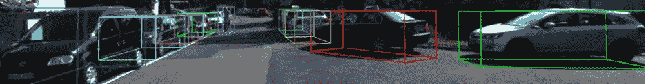

3D 目标检测的示例图像 [3]（图片来自 [`www.cvlibs.net/datasets/kitti/eval_object.php?obj_benchmark=3d`](https://www.cvlibs.net/datasets/kitti/eval_object.php?obj_benchmark=3d)）

在这篇博文中，我们将使用 Velodyne 激光雷达点云进行障碍物检测。在这个背景下，利用无监督机器学习算法进行点云的读取、可视化和分割将是主要内容。除了这些，我们还会讨论很多关于相机标定及其内外部参数、用于车辆路径检测的 RANSAC 算法，以及在执行这些步骤时我们需要的评估指标。

> 同时，在这一系列文章中，我将使用 Python 语言，但不用担心，我会与大家分享我使用的虚拟环境信息。这样你就可以快速搭建自己的环境。请查看 Github 仓库以获取**requirements.txt**文件。

## **问题定义**

这篇博文的主要目标是使用无监督学习方法，通过对 KITTI 数据集中由 Velodyne 激光雷达获取的点云，检测环境中的障碍物。

在这个范围内，我将分享一个示例的激光雷达点云图像，以便可视化问题。如果我们分析下面的示例点云，我们可以很容易地识别出左下角的一些汽车或路上的其他物体。

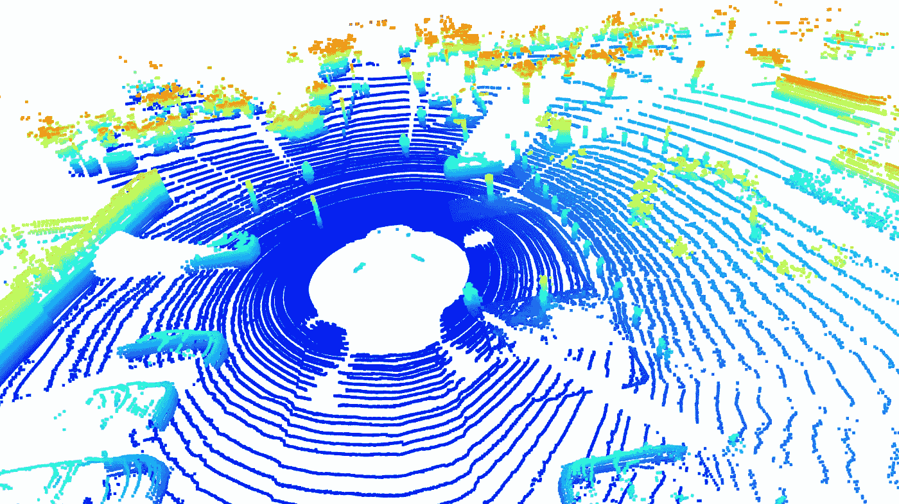

一个示例的激光雷达点云 [3]（来自 KITTI 数据集）

为了使其更加清晰，我将在图像中画一些箭头和框来表示它们。在下图中，红色箭头表示汽车，橙色箭头表示行人，红色框表示路灯。

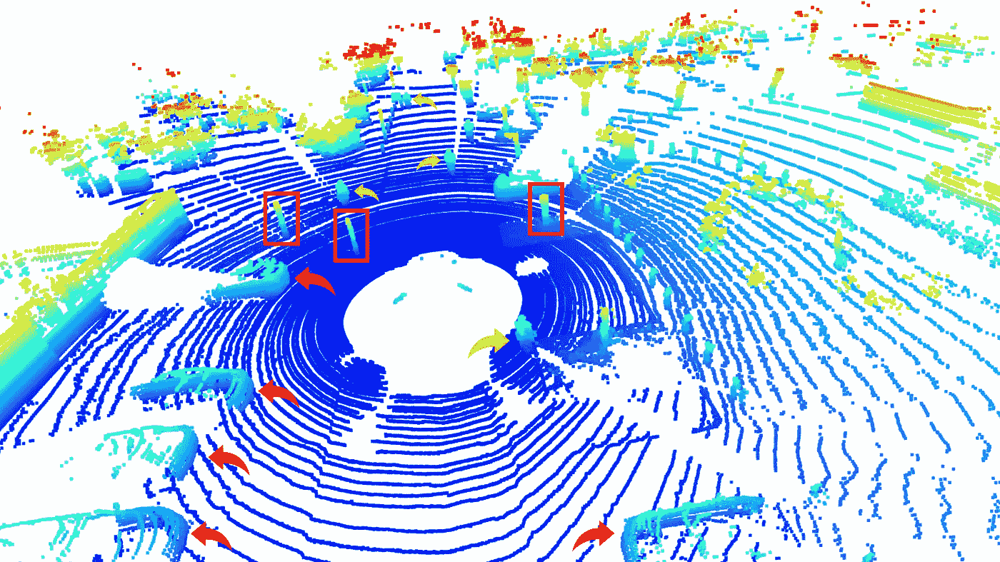

一个示例的激光雷达点云 [3]（来自 KITTI 数据集）

然后，你可能会好奇并问这个问题 ***“我们是不是也可以说周围还有其他物体，可能是墙壁或者树木？”*** 答案是肯定的！我的答案的证明可以从与这个点云对应的彩色图像中得到。从下面的图像中可以看到，现场有行人、汽车、路灯和树木。

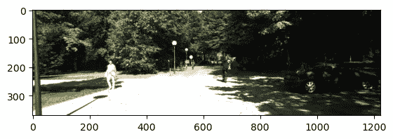

一个示例的彩色图像 [3]（来自 KITTI 数据集）

在这一视觉分析之后，我们来到了一个细心读者会立刻注意到的问题。虽然激光雷达点云提供了场景的 360 度视角，彩色图像却只能提供有限的场景宽度感知。接下来的博客将只考虑使用这一彩色图像进行目标检测，最后一篇将尝试融合激光雷达点云和彩色图像传感器来解决这个问题***(我希望它们很快就能使用！)***

## 传感器设置

接下来我们来讨论传感器及其安装等问题。KITTI 3D 目标检测数据集是通过专门改装的大众帕萨特 B6 收集的。数据记录由一台八核 i7 计算机处理，该计算机配备 RAID 系统，运行 Ubuntu Linux，并配有实时数据库以便高效的数据管理。

以下传感器用于数据采集：

+   **惯性导航系统（GPS/IMU）：** OXTS RT 3003

+   **激光雷达传感器：** Velodyne HDL-64E

+   **灰度相机：** 两台 Point Grey Flea 2（FL2–14S3M-C），每台 1.4 百万像素

+   **彩色相机：** 两台 Point Grey Flea 2（FL2–14S3C-C），每台 1.4 百万像素

+   **可变焦镜头：** 四个 Edmund Optics NT59–917（4–8 毫米）

上述设置的可视化展示在下图中。

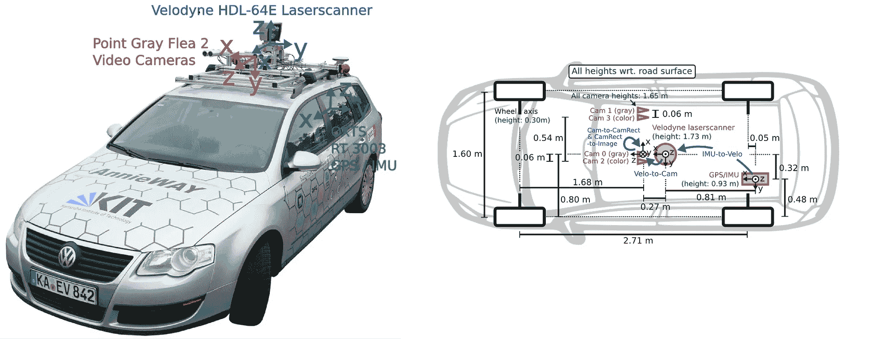

KITTI 数据集设置可视化 [3]（图片来源：KITTI）

Velodyne 激光雷达传感器和彩色相机安装在汽车的顶部，但它们距离地面的高度和坐标不同。别担心！如承诺所示，我们将一步一步来。这意味着，在进入本博客文章的核心算法之前，我们需要先回顾一下相机标定的主题！

## 相机标定

相机或更广义上的传感器，以不同的方式提供了周围环境的感知输出。在这个概念中，我们以 RGB 相机为例，它可能是你的网络摄像头，也可能是专业的数码紧凑型相机。它使用两组参数：内参和外参，将世界中的 3D 点投影到二维图像平面上。

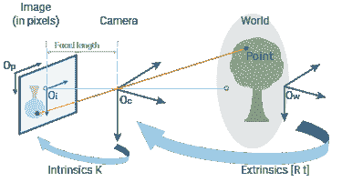

将世界中的 3D 点投影到 2D 图像平面上（图片来源：[`de.mathworks.com/help/vision/ug/camera-calibration.html`](https://de.mathworks.com/help/vision/ug/camera-calibration.html)）

外参参数描述了相机在世界坐标系中的位置和方向，而内参参数则将相机坐标映射到图像坐标系中的像素坐标。

在这个概念中，相机的外参可以表示为一个矩阵，形式为 T = [R | t]，其中 R 是旋转矩阵（3x3），t 是平移向量（3x1）。因此，T 矩阵是一个 3x4 矩阵，它将世界中的一个点映射到“相机坐标”域。

另一方面，相机的内参可以表示为一个 3x3 矩阵。对应的矩阵 K 可以表示如下。这里，fx 和 fy 表示相机的焦距，cx 和 cy 表示主点，s 表示像素的偏斜度。

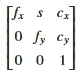

相机的内参

因此，任何 3D 点都可以通过以下完整相机矩阵投影到 2D 图像平面。

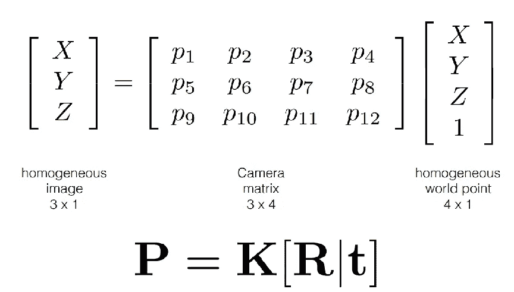

将 3D 世界点投影到图像平面所需的完整相机矩阵

我知道相机标定看起来有点复杂，特别是当你第一次接触时。但是我已经为你找到了一些非常好的参考资料。另外，我将在接下来的章节中讲解我们问题中应用的相机标定操作。

相机标定主题的参考文献：

*— 卡内基梅隆大学，* [*https://www.cs.cmu.edu/~16385/s17/Slides/11.1_Camera_matrix.pdf*](https://www.cs.cmu.edu/~16385/s17/Slides/11.1_Camera_matrix.pdf)

*— 哥伦比亚大学，* [*https://www.youtube.com/watch?v=GUbWsXU1mac*](https://www.youtube.com/watch?v=GUbWsXU1mac)

*— 相机标定中篇文章，* [*https://yagmurcigdemaktas.medium.com/visual-perception-camera-calibration-9108f8be789*](https://yagmurcigdemaktas.medium.com/visual-perception-camera-calibration-9108f8be789)

## 数据集理解

经过一些术语和所需的基础理论后，现在我们可以进入问题的核心了。

首先，我强烈建议你从这里下载数据集[2]，用于接下来的操作；

+   左侧彩色图像（大小为 12GB）

+   Velodyne 点云（大小为 29GB）

+   对象数据集的相机标定矩阵（大小可以忽略不计）

+   训练标签（大小可以忽略不计）

我们将要分析的数据是地面实况（G.T.）标签文件。G.T. 文件以 '.txt' 格式呈现，每个物体都用 15 个不同的字段进行标注。别担心，我已经为你准备了一个详细的 G.T. 文件读取函数，存放在我的 Github 仓库中，具体如下。

```py
def parse_label_file(label_file_path):
    """
    KITTI 3D Object Detection Label Fields:

    Each line in the label file corresponds to one object in the scene and contains 15 fields:

    1\. Type (string):
    - The type of object (e.g., Car, Van, Truck, Pedestrian, Cyclist, etc.).
    - "DontCare" indicates regions to ignore during training.

    2\. Truncated (float):
    - Value between 0 and 1 indicating how truncated the object is.
    - 0: Fully visible, 1: Completely truncated (partially outside the image).

    3\. Occluded (integer):
    - Level of occlusion:
        0: Fully visible.
        1: Partly occluded.
        2: Largely occluded.
        3: Fully occluded (annotated based on prior knowledge).

    4\. Alpha (float):
    - Observation angle of the object in the image plane, ranging from [-π, π].
    - Encodes the orientation of the object relative to the camera plane.

    5\. Bounding Box (4 floats):
    - (xmin, ymin, xmax, ymax) in pixels.
    - Defines the 2D bounding box in the image plane.

    6\. Dimensions (3 floats):
    - (height, width, length) in meters.
    - Dimensions of the object in the 3D world.

    7\. Location (3 floats):
    - (x, y, z) in meters.
    - 3D coordinates of the object center in the camera coordinate system:
        - x: Right, y: Down, z: Forward.

    8\. Rotation_y (float):
    - Rotation around the Y-axis in camera coordinates, ranging from [-π, π].
    - Defines the orientation of the object in 3D space.

    9\. Score (float) [optional]:
    - Confidence score for detections (used for results, not training).

    Example Line:
    Car 0.00 0 -1.82 587.00 156.40 615.00 189.50 1.48 1.60 3.69 1.84 1.47 8.41 -1.56

Notes:
    - "DontCare" objects: Regions ignored during training and evaluation. Their bounding boxes can overlap with actual objects.
    - Camera coordinates: All 3D values are given relative to the camera coordinate system, with the camera at the origin.
    """ 
```

彩色图像以文件形式呈现于文件夹中，且可以轻松读取，无需进一步操作。通过此操作，得到的结果是***训练和测试图像的数量：7481 / 7518***

接下来我们要考虑的数据是每个场景的标定文件。像之前一样，我为你准备了另一个函数，用于解析标定文件，具体如下。

```py
def parse_calib_file(calib_file_path):
    """
        Parses a calibration file to extract and organize key transformation matrices.

        The calibration file contains the following data:
        - P0, P1, P2, P3: 3x4 projection matrices for the respective cameras.
        - R0: 3x3 rectification matrix for aligning data points across sensors.
        - Tr_velo_to_cam: 3x4 transformation matrix from the LiDAR frame to the camera frame.
        - Tr_imu_to_velo: 3x4 transformation matrix from the IMU frame to the LiDAR frame.

        Parameters:
        calib_file_path (str): Path to the calibration file.

        Returns:
        dict: A dictionary where each key corresponds to a calibration parameter 
            (e.g., 'P0', 'R0') and its value is the associated 3x4 NumPy matrix.

        Process:
        1\. Reads the calibration file line by line.
        2\. Maps each line to its corresponding key ('P0', 'P1', etc.).
        3\. Extracts numerical elements, converts them to a NumPy 3x4 matrix, 
        and stores them in a dictionary.

        Example:
        Input file line for 'P0':
        P0: 1.0 0.0 0.0 0.0  0.0 1.0 0.0 0.0  0.0 0.0 1.0 0.0
        Output dictionary:
        {
            'P0': [[1.0, 0.0, 0.0, 0.0],
                [0.0, 1.0, 0.0, 0.0],
                [0.0, 0.0, 1.0, 0.0]]
        }
    """
```

最终数据是 Velodyne 点云，格式为 '.bin'。在此格式中，每一行点云包含 x、y、z 的位置以及反射率分数。与之前一样，相应的解析函数如下所示。

```py
def read_velodyne_bin(file_path):
    """
    Reads a KITTI Velodyne .bin file and returns the point cloud data as a numpy array.

    :param file_path: Path to the .bin file
    :return: Numpy array of shape (N, 4) where N is the number of points,
             and each point has (x, y, z, reflectivity)

    ### For KITTI's Velodyne LiDAR point cloud, the coordinate system used is forward-right-up (FRU).
    KITTI Coordinate System (FRU):
        X-axis (Forward): Points in the positive X direction move forward from the sensor.
        Y-axis (Right): Points in the positive Y direction move to the right of the sensor.
        Z-axis (Up): Points in the positive Z direction move upward from the sensor.

    ### Units: All coordinates are in meters (m). A point (10, 5, 2) means:

        It is 10 meters forward.
        5 meters to the right.
        2 meters above the sensor origin.
        Reflectivity: The fourth value in KITTI’s .bin files represents the reflectivity or intensity of the LiDAR laser at that point. It is unrelated to the coordinate system but adds extra context for certain tasks like segmentation or object detection.

        Velodyne Sensor Placement:

        The LiDAR sensor is mounted on a vehicle at a specific height and offset relative to the car's reference frame.
        The point cloud captures objects relative to the sensor’s position.

    """
```

在本节结束时，所有必需的文件将被加载并准备好使用。

对于在本篇文章“问题定义”部分顶部展示的示例场景，点云中有 122794 个点。

但是，由于这些信息对某些系统（特别是 CPU 或 GPU 性能较低的系统）来说可能较难处理，我们可能希望减少点云中的点数。为了实现这一点，我们可以使用“体素下采样”操作，这与深度神经网络中的“池化”操作类似。大致来说，它将完整的点云划分为一个等大小的体素网格，并从每个体素中选择一个点。

```py
print(f"Points before downsampling: {len(sample_point_cloud.points)} ")
sample_point_cloud = sample_point_cloud.voxel_down_sample(voxel_size=0.2)
print(f"Points after downsampling: {len(sample_point_cloud.points)}")
```

此下采样的输出结果如下：

下采样前的点数：122794

下采样后的点数：33122

但是，不应忽视的是，减少点数可能会导致一些信息的丢失，这是可以预见的。此外，体素网格的大小是一个超参数，选择它也非常关键。较小的体素大小会返回更多的点，反之亦然。

但是，在进行 RANSAC 道路分割之前，让我们快速回顾一下体素下采样操作。

## 体素下采样

体素下采样是一种创建下采样点云的技术。它有助于减少噪声和不必要的点。同时，它通过选择的体素网格大小超参数减少了所需的计算能力。此操作的可视化可以如下展示。

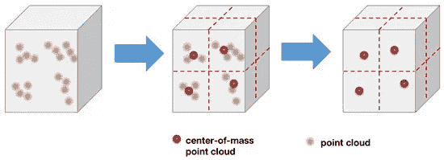

体素下采样的示意图（图片来源：[`www.mdpi.com/2076-3417/14/8/3160`](https://www.mdpi.com/2076-3417/14/8/3160)）

除此之外，该算法的步骤可以如下展示。

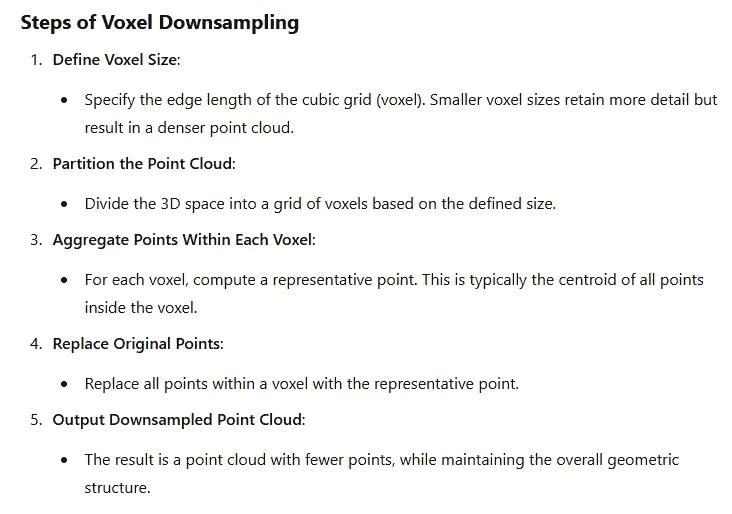

为了应用此功能，我们将使用“open3d”库，代码只需一行；

```py
sample_point_cloud = sample_point_cloud.voxel_down_sample(voxel_size=0.2)
```

在上述单行代码中，可以观察到体素大小被设置为 0.2

## RANSAC

下一步将是分割最大的平面，即我们的道路问题。RANSAC（随机采样一致性）是一种迭代算法，它通过随机采样数据点的子集来假设一个模型，并评估其与整个数据集的拟合度。其目标是找到能够最好地解释内点的模型，同时忽略离群值。

尽管该算法对极端离群值具有很强的鲁棒性，但在开始时需要采样*n*个点（二维线条时 n=2，三维平面时 n=3）。然后评估该数学方程在此点集下的表现。也就是说；

— 起始时选择的点非常关键

— 查找最佳值的迭代次数至关重要

— 它可能需要一定的计算能力，特别是对于大型数据集

但它已成为多种不同情况的事实标准操作。所以，首先让我们可视化 RANSAC 来寻找一个二维线条，然后再介绍该算法的关键步骤。

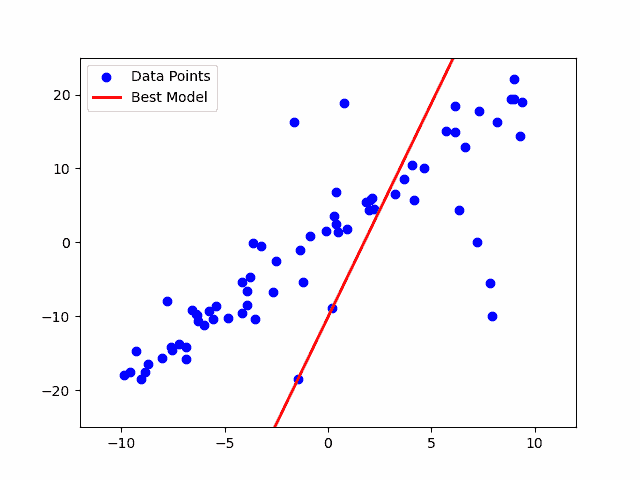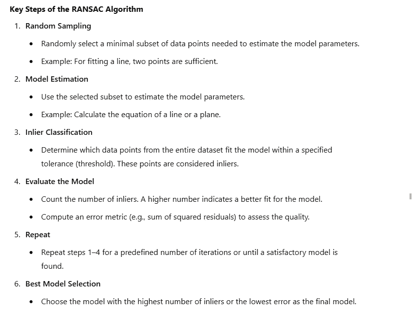

RANSAC 算法的关键步骤和工作流程

在回顾了 RANSAC 的概念之后，现在是时候将算法应用于点云，以确定最大平面，这就是我们问题中的道路。

```py
# 3\. RANSAC Segmentation to identify the largest plane
plane_model, inliers = sample_point_cloud.segment_plane(distance_threshold=0.3, ransac_n=3, num_iterations=150)

## Identify inlier points -> road
inlier_cloud = sample_point_cloud.select_by_index(inliers)
inlier_cloud.paint_uniform_color([0, 1, 1]) # R, G, B format

## Identify outlier points -> objects on the road
outlier_cloud = sample_point_cloud.select_by_index(inliers, invert=True)
outlier_cloud.paint_uniform_color([1, 0, 0]) # R, G, B format
```

这个过程的输出将显示道路外部为红色，且道路将被涂成绿色和蓝色的混合色。

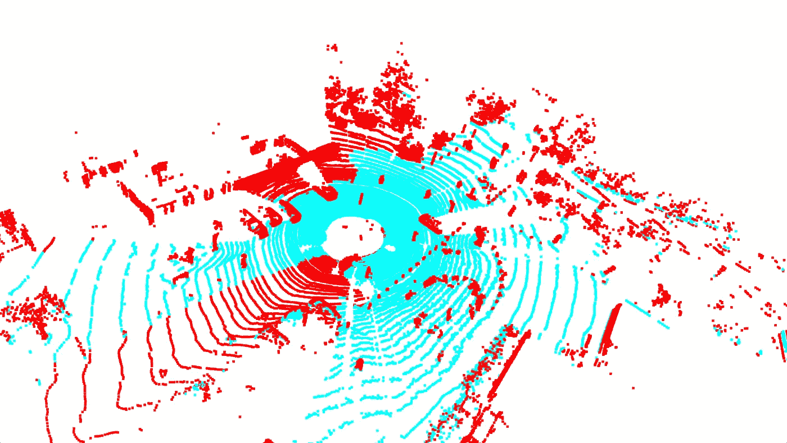

RANSAC 算法的输出（图片来自 KITTI 数据集[3]）

## DBSCAN — 一种基于密度的无参数聚类算法

在这一阶段，将使用 RANSAC 对分割后的道路版本进行物体检测，从而检测道路外的物体。

在这种情况下，我们将使用无监督学习算法。然而，可能会有一个问题浮现在脑海中：**“难道不能使用监督学习算法进行检测吗？”** 答案既简短又明确：可以！然而，由于我们希望通过这篇博客快速介绍问题并得到结果，因此我们将继续使用 DBSCAN，这是一种无监督学习领域的分割算法。如果你希望看到基于监督学习的点云物体检测算法的结果，请在评论中注明。

不管怎样，让我们尝试回答这三个问题：什么是 DBSCAN，它是如何工作的？需要考虑哪些超参数？我们如何将其应用于这个问题？

DBSCAN，也被称为基于密度的无参数聚类算法，是一种无监督的聚类算法。尽管还有其他一些无监督聚类算法，例如 K-Means，但 DBSCAN 能够对形状任意的物体进行聚类，而 K-Means 假设物体的形状是球形的。此外，DBSCAN 最重要的特性之一是，它不需要像 K-Means 算法那样预先定义或估算聚类的数量。如果你想查看一些针对特定问题（如“2Moons”）的优秀可视化结果，可以访问这里：[*https://www.kaggle.com/code/ahmedmohameddawoud/dbscan-vs-k-means-visualizing-the-difference*](https://www.kaggle.com/code/ahmedmohameddawoud/dbscan-vs-k-means-visualizing-the-difference)

DBSCAN 的工作原理类似于我们的眼睛。这意味着它根据数据中不同组的密度做出聚类决策。它有两个不同的超参数：“Epsilon”和“MinimumPoints”。最初，DBSCAN 会识别*核心点*，即在指定半径内至少有最小数量邻居（*minPts*）的点。然后，从这些核心点扩展，形成聚类，连接所有满足密度标准的可达点。无法与任何聚类连接的点被分类为噪声。要深入了解这个算法中的“核心点”、“边界点”和“噪声点”，请访问：*Josh Starmer,* [*https://www.youtube.com/watch?v=RDZUdRSDOok&t=61s*](https://www.youtube.com/watch?v=RDZUdRSDOok&t=61s)

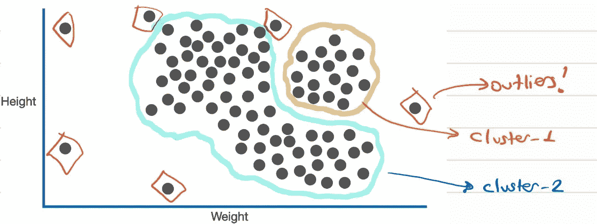

DBSCAN 算法的一个示例聚类结果

对于我们的任务，虽然我们可以使用 SKLearn 库中的 DBSCAN，但让我们使用 open3d，代码如下。

```py
# 4\. Clustering using DBSCAN -> To further segment objects on the road
with o3d.utility.VerbosityContextManager(o3d.utility.VerbosityLevel.Debug) as cm:
    labels = np.array(outlier_cloud.cluster_dbscan(eps=0.45, min_points=10, print_progress=True))
```

如我们所见，‘epsilon’ 被选择为 0.45，‘MinPts’ 被选择为 10。简单评论一下这些。由于它们是超参数，实际上没有最佳的“数值”。不幸的是，这需要通过尝试和测量成功来进行调整。但别担心！在阅读了本博客文章的最后一章《评估指标》后，你将能够全面衡量你的算法表现。那时，你就可以应用 GridSearch *(参考：* [*https://www.analyticsvidhya.com/blog/2021/06/tune-hyperparameters-with-gridsearchcv/*](https://www.analyticsvidhya.com/blog/2021/06/tune-hyperparameters-with-gridsearchcv/)*)* 来找到最佳的超参数组合！

是的，然后让我可视化 DBCAN 对我们点云的输出，然后我们继续下一步！

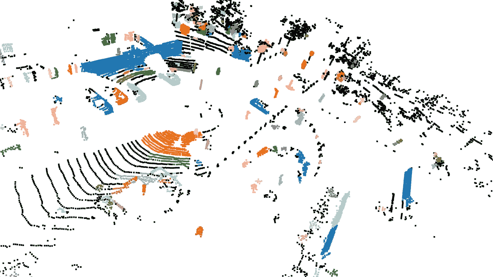

DBSCAN 聚类算法的输出（图像来自 KITTI 数据集 [3]）

回顾一下，我们可以看到一些我最初展示并手动标记的物体在这里是分开的，并且显示为不同的颜色！这表明这些物体属于不同的聚类（这正是应该的）。

## G.T. 标签及其标定过程

现在是分析 KITTI 3D 目标检测基准的 G.T. 标签和标定文件的时候了。在前一部分中，我分享了一些关于它们的小贴士，比如如何读取、如何解析等。

但现在我想提一下 G.T. 物体与标定矩阵之间的关系。首先，让我并排展示 G.T. 文件和标定文件的图示。

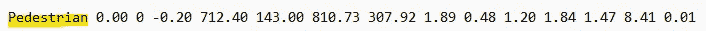

一个 .txt 格式的示例训练标签文件

如我们之前讨论的，训练标签的最后一个元素表示物体围绕 y 轴的旋转。旋转元素之前的三个数字（1.84、1.47 和 8.41）代表物体质心在相机坐标系中的三维位置。

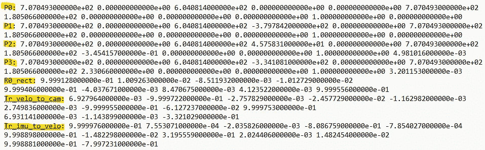

一个 .txt 格式的示例标定文件

在标定文件方面；*P0, P1, P2* 和 *P3* 是对应相机的投影矩阵。在本文中，正如我们之前所指出的，我们使用的是‘左侧彩色图像’，即 *P2*。此外，*R0_rect* 是用于对齐立体图像的矩阵。从它们的名称可以理解，*Tr_velo_to_cam* 和 *Tr_imu_to_velo* 是转换矩阵，用于在不同坐标系之间进行转换。例如，*Tr_velo_to_cam* 是一个转换矩阵，用于将 Velodyne 坐标转换为未校正的相机坐标系。

在这个解释之后，我真的很注意哪个矩阵或哪个标签在哪个坐标系中，现在我们可以轻松地提到从 G.T.物体坐标到 Velodyne 坐标系的变换。这是一个很好的点，可以帮助我们理解坐标系之间矩阵的使用，并评估我们预测的边界框和 G.T.物体边界框。

我们要做的第一件事是计算 G.T.物体的 3D 边界框。为此，您可以访问以下代码库中的函数。

```py
def compute_box_3d(obj, Tr_cam_to_velo):
    """
    Compute the 8 corners of a 3D bounding box in Velodyne coordinates.
    Args:
        obj (dict): Object parameters (dimensions, location, rotation_y).
        Tr_cam_to_velo (np.ndarray): Camera to Velodyne transformation matrix.
    Returns:
        np.ndarray: Array of shape (8, 3) with the 3D box corners.
    """
```

给定一个物体在相机坐标系中的尺寸（`height`、`width`、`length`）和位置（`x, y, z`），该函数首先根据物体的朝向（`rotation_y`）旋转边界框，然后计算出 3D 空间中边界框的角点。

这个计算是基于一种变换，它使用一个能够将任何点从相机坐标系统转换到 Velodyne 坐标系统的矩阵。但是，等一下？我们没有相机到 Velodyne 的矩阵，对吧？是的，我们需要首先通过取*Tr_velo_to_cam*矩阵的逆矩阵来计算它，这个矩阵在标定文件中给出。

别担心，所有这些工作流都由这些函数呈现。

```py
def transform_points(points, transformation):
    """
    Apply a transformation matrix to 3D points.
    Args:
        points (np.ndarray): Nx3 array of 3D points.
        transformation (np.ndarray): 4x4 transformation matrix.
    Returns:
        np.ndarray: Transformed Nx3 points.
    """
```

```py
def inverse_rigid_trans(Tr):
    """
    Inverse a rigid body transform matrix (3x4 as [R|t]) to [R'|-R't; 0|1].
    Args:
        Tr (np.ndarray): 4x4 transformation matrix.
    Returns:
        np.ndarray: Inverted 4x4 transformation matrix.
    """
```

最后，我们可以轻松地看到 G.T.物体并将它们投影到 Velodyne 点云坐标系中。现在让我们可视化输出结果，然后进入评估部分！

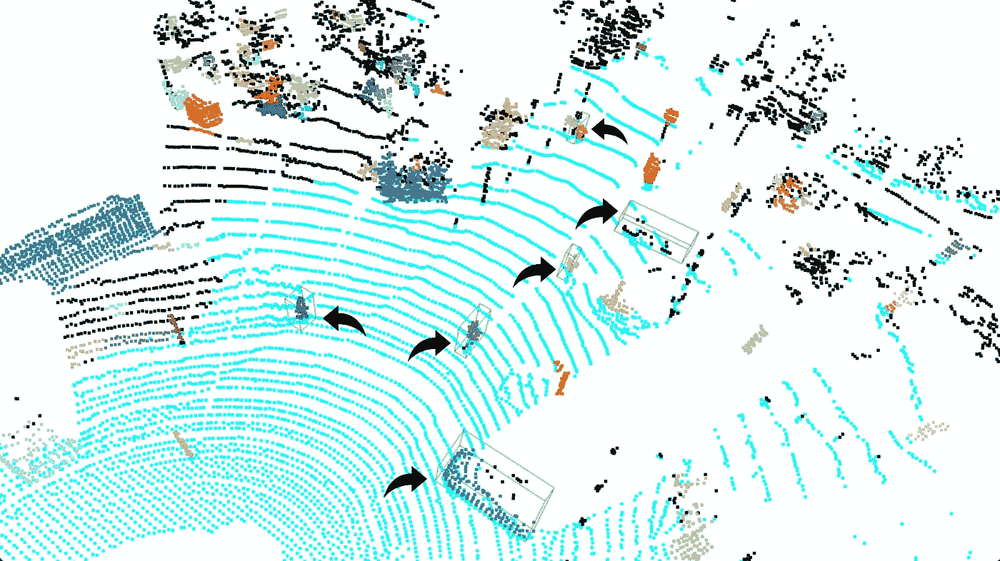

投影后的 G.T.物体边界框（图片来自 KITTI 数据集[3]）

（我知道绿色边框可能有点难以看清，所以我在它们旁边加上了黑色的箭头。）

## 评估指标

现在我们有了通过我们的管道预测的边界框和 G.T.物体框！接下来，我们来计算一些指标，评估我们的管道。为了执行我们之前讨论的超参数优化，我们必须能够持续监控每个参数组的性能。

但在进入评估指标之前，我需要提到两件事。首先，KITTI 对不同物体有不同的评估标准。例如，对于行人，标签与 G.T.之间 50%的匹配度就足够了，而对于车辆则是 70%。另一个问题是，尽管我们创建的管道在 360 度环境中执行物体检测，但 KITTI 的 G.T.标签仅包括在彩色相机视角内的物体标签值。因此，我们可以检测到比 G.T.标签文件中呈现的更多边界框。那么该怎么办呢？基于我在这里要讲的概念，您可以通过仔细分析 KITTI 的评估标准来得出最终结果。但现在，我不会在这一部分做更详细的分析，而是会在这篇 Medium 博客系列的后续文章中进行。

为了评估预测的边界框和 G.T.边界框，我们将使用 TP、FP 和 FN 指标。

TP 代表与真实边界框匹配的预测框，FP 代表与任何真实边界框都不匹配的预测框，FN 则表示没有与真实边界框对应的预测边界框的情况。

在这种情况下，我们当然需要找到一个工具来衡量预测的边界框与真实边界框的匹配度。我们工具的名称是 IOU，即交并比。

你可以通过以下方式轻松访问 IOU 和评估功能。

```py
def compute_iou(box1, box2):
    """
    Calculate the Intersection over Union (IoU) between two bounding boxes.
    :param box1: open3d.cpu.pybind.geometry.AxisAlignedBoundingBox object for the first box
    :param box2: open3d.cpu.pybind.geometry.AxisAlignedBoundingBox object for the second box
    :return: IoU value (float)
    """
```

```py
# Function to evaluate metrics (TP, FP, FN)
def evaluate_metrics(ground_truth_boxes, predicted_boxes, iou_threshold=0.5):
    """
    Evaluate True Positives (TP), False Positives (FP), and False Negatives (FN).
    :param ground_truth_boxes: List of AxisAlignedBoundingBox objects for ground truth
    :param predicted_boxes: List of AxisAlignedBoundingBox objects for predictions
    :param iou_threshold: IoU threshold for a match
    :return: TP, FP, FN counts
    """ 
```

让我通过在点云上给出预测的边界框（红色）和真实边界框（绿色）来总结这一部分内容。

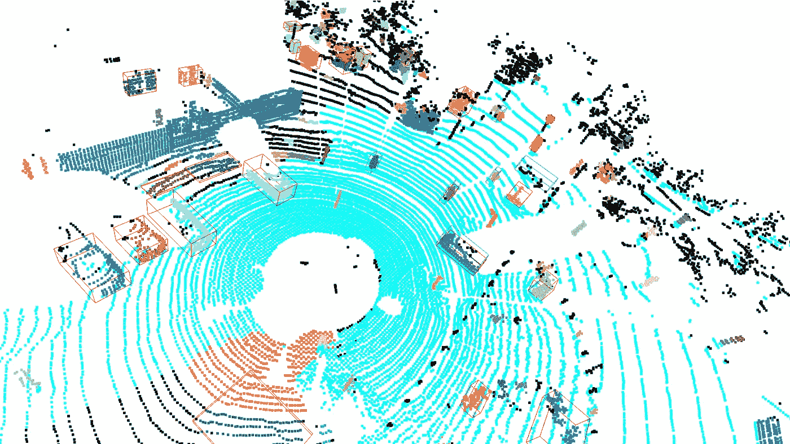

预测的边界框和真实边界框一起显示在点云上（图像来源于 KITTI 数据集[3]）

## 结论

是的，虽然有点长，但我们快要完成了。首先，我们已经学到了关于 KITTI 3D 目标检测基准的一些知识以及一些与不同主题相关的术语，如相机坐标系统和无监督学习等。

现在，有兴趣的读者可以通过添加网格搜索来扩展本研究，以找到最佳的超参数元素。例如，分割中的最小点数，或者可能是 RANSAC 的迭代次数，或者体素下采样操作中的体素网格大小，所有这些都是潜在的改进点。

## 接下来是什么？

下一部分将研究仅在左侧彩色相机帧上的目标检测。这是本系列的另一个基础步骤，因为我们将在本博客系列的最后部分融合激光雷达点云和彩色相机帧。然后我们将能够得出结论并回答这个问题：*“传感器融合是否减少了不确定性并提高了 KITTI 3D 目标检测基准的性能？”*

> **欢迎任何评论、错误修复或改进！**
> 
> ***感谢大家，祝你们健康！***

********************************************************************************************************************************************************

***Github 链接***: [`github.com/ErolCitak/KITTI-Sensor-Fusion/tree/main/lidar_based_obstacle_detection`](https://github.com/ErolCitak/KITTI-Sensor-Fusion/tree/main)

**参考文献**

[1] — [`www.cvlibs.net/datasets/kitti/`](https://www.cvlibs.net/datasets/kitti/)

[2] — [`www.cvlibs.net/datasets/kitti/eval_object.php?obj_benchmark=3d`](https://www.cvlibs.net/datasets/kitti/eval_object.php?obj_benchmark=3d)

[3] — Geiger, Andreas, 等. “Vision meets robotics: The kitti dataset.” *国际机器人研究杂志* 32.11 (2013): 1231–1237.

## 免责声明

本系列博客中使用的图像来自 KITTI 数据集，旨在用于教育和研究。如果你希望将其用于类似的目的，必须访问相关网站，批准在那里规定的用途，并按照基准创建者定义的引用格式使用。

对于**立体视觉 2012**，**光流 2012**，**里程计**，**物体检测**，或**跟踪基准**，请引用：

@inproceedings{[Geiger2012CVPR](https://www.cvlibs.net/publications/Geiger2012CVPR.pdf),

author = {[Andreas Geiger](https://www.cvlibs.net/) 和 [Philip Lenz](http://www.mrt.kit.edu/mitarbeiter_lenz.php) 和 [Raquel Urtasun](http://ttic.uchicago.edu/~rurtasun)},

title = {我们准备好迎接自动驾驶了吗？KITTI 视觉基准套件},

booktitle = {计算机视觉与模式识别会议（CVPR）},

year = {2012}

}

对于**原始数据集**，请引用：

@article{[Geiger2013IJRR](https://www.cvlibs.net/publications/Geiger2013IJRR.pdf),

author = {[Andreas Geiger](https://www.cvlibs.net/) 和 [Philip Lenz](http://www.mrt.kit.edu/mitarbeiter_lenz.php) 和 [Christoph Stiller](http://www.mrt.kit.edu/mitarbeiter_stiller.php) 和 [Raquel Urtasun](http://ttic.uchicago.edu/~rurtasun)},

title = {视觉与机器人学相遇：KITTI 数据集},

journal = {国际机器人研究杂志（IJRR）},

year = {2013}

}

对于**道路基准**，请引用：

@inproceedings{[Fritsch2013ITSC](https://www.cvlibs.net/publications/Fritsch2013ITSC.pdf),

author = {Jannik Fritsch 和 Tobias Kuehnl 和 [Andreas Geiger](https://www.cvlibs.net/)},

title = {一种新的性能度量和道路检测算法评估基准},

booktitle = {国际智能交通系统会议（ITSC）},

year = {2013}

}

对于**立体视觉 2015**，**光流 2015**，和**场景流 2015 基准**，请引用：

@inproceedings{[Menze2015CVPR](https://www.cvlibs.net/publications/Menze2015CVPR.pdf),

author = {[Moritz Menze](http://www.ipi.uni-hannover.de/tmm.html) 和 [Andreas Geiger](https://www.cvlibs.net/)},

title = {自动驾驶车辆的物体场景流},

booktitle = {计算机视觉与模式识别会议（CVPR）},

year = {2015}

}
