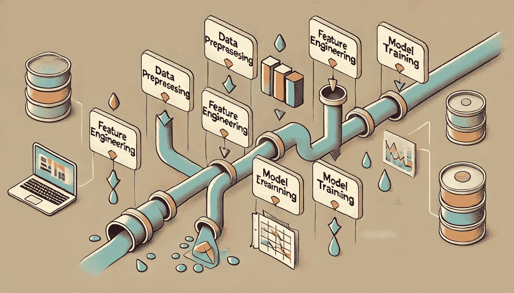

# 机器学习中数据泄漏的七个常见原因

> 原文：[`towardsdatascience.com/seven-common-causes-of-data-leakage-in-machine-learning-75f8a6243ea5?source=collection_archive---------4-----------------------#2024-09-14`](https://towardsdatascience.com/seven-common-causes-of-data-leakage-in-machine-learning-75f8a6243ea5?source=collection_archive---------4-----------------------#2024-09-14)

## **数据预处理、特征工程和训练-测试集划分中防止数据泄漏的关键步骤**

 [Yu Dong](https://ydong029.medium.com/?source=post_page---byline--75f8a6243ea5--------------------------------)

·发表于 [Towards Data Science](https://towardsdatascience.com/?source=post_page---byline--75f8a6243ea5--------------------------------) ·阅读时长 7 分钟·2024 年 9 月 14 日

--

当我在评估像 ChatGPT、Claude 和 Gemini 这样的 AI 工具用于机器学习应用场景时，我遇到了一个严重的陷阱：机器学习中的数据泄漏。在我的[上一篇文章](https://medium.com/towards-data-science/chatgpt-vs-claude-vs-gemini-for-data-analysis-part-3-best-ai-assistant-for-machine-learning-a2078793e4fa)中，这些 AI 模型在将数据集划分为训练集和测试集*之前*，就使用整个数据集来创建新特征——这是数据泄漏的常见原因。然而，这不仅是 AI 的错误；人类也经常犯这个错误。

在机器学习中，数据泄漏发生在训练数据集之外的信息渗入到模型构建过程中。这导致了性能指标的虚高，且模型无法很好地推广到未见过的数据。在本文中，我将介绍七个常见的数据泄漏原因，帮助你避免像人工智能那样犯同样的错误 :)

图像来源：DALL·E

# 问题设置

为了更好地解释数据泄漏，让我们考虑一个假设的机器学习应用场景：

假设你是美国运通等大型信用卡公司的数据科学家。每天，数百万笔交易会被处理，其中不可避免地会有一些是欺诈交易。你的任务是构建一个能够实时检测欺诈的模型…
