# 共享最近邻：一种更强大的距离度量

> 原文：[`towardsdatascience.com/shared-nearest-neighbors-a-more-robust-distance-metric-064d7f99ffb7?source=collection_archive---------0-----------------------#2024-09-19`](https://towardsdatascience.com/shared-nearest-neighbors-a-more-robust-distance-metric-064d7f99ffb7?source=collection_archive---------0-----------------------#2024-09-19)

## 一种能够在具有多维度和不同密度的数据集中改善预测、聚类和异常值检测的距离度量

[](https://medium.com/@wkennedy934?source=post_page---byline--064d7f99ffb7--------------------------------)[](https://towardsdatascience.com/?source=post_page---byline--064d7f99ffb7--------------------------------) [W Brett Kennedy](https://medium.com/@wkennedy934?source=post_page---byline--064d7f99ffb7--------------------------------)

·发表于 [Towards Data Science](https://towardsdatascience.com/?source=post_page---byline--064d7f99ffb7--------------------------------) ·28 分钟阅读·2024 年 9 月 19 日

--

在这篇文章中，我将介绍一种称为共享最近邻（Shared Nearest Neighbors，简称 SNN）的距离度量，并描述它在异常值检测中的应用。我还会简要介绍它在预测和聚类中的应用，但重点将放在异常值检测上，特别是 SNN 在 k 最近邻异常值检测算法中的应用（尽管我也会更一般地介绍 SNN 在异常值检测中的应用）。

本文是关于异常值检测系列文章的一部分，包括关于[频繁模式异常值因子](https://medium.com/towards-data-science/interpretable-outlier-detection-frequent-patterns-outlier-factor-fpof-0d9cbf51b17a)、[计数异常值检测器](https://medium.com/towards-data-science/counts-outlier-detector-interpretable-outlier-detection-ead0d469557a)、[掺假](https://medium.com/towards-data-science/doping-a-technique-to-test-outlier-detectors-3f6b847ab8d4)和[距离度量学习](https://medium.com/towards-data-science/distance-metric-learning-for-outlier-detection-5b4840d01246)的文章。它还包含了我书中另一篇节选：[Python 中的异常值检测](https://www.manning.com/books/outlier-detection-in-python)。

在数据科学中，处理表格数据时，衡量行之间的距离是一个非常常见的任务。例如，这在一些预测模型中很常见，如 kNN：在使用 kNN 预测实例的目标值时，我们首先从训练数据中识别出最相似的记录（这需要一种衡量行之间相似性的方式）。然后，我们查看这些相似行的目标值，假设测试记录最有可能与大多数最相似记录的目标值相同（用于分类），或者与最相似记录的目标值的平均值相同（用于回归）。

一些其他预测模型也使用距离度量，例如基于半径的方法，如[RadiusNeighborsClassifier](https://scikit-learn.org/stable/modules/generated/sklearn.neighbors.RadiusNeighborsClassifier.html)。然而，距离度量最常被使用的地方是聚类。事实上，距离计算几乎在所有聚类算法中都是普遍的：据我所知，所有聚类算法都以某种方式依赖于计算记录对之间的距离。

距离计算被许多异常值检测算法使用，包括许多最流行的算法（如 k 最近邻、局部离群因子（LOF）、半径、局部离群概率（LoOP）以及许多其他算法）。并非所有异常值检测算法都如此：许多算法以不同的方式识别异常值（例如[孤立森林](https://scikit-learn.org/stable/modules/generated/sklearn.ensemble.IsolationForest.html)、[频繁模式异常因子](https://medium.com/towards-data-science/interpretable-outlier-detection-frequent-patterns-outlier-factor-fpof-0d9cbf51b17a)、[计数异常检测器](https://medium.com/towards-data-science/counts-outlier-detector-interpretable-outlier-detection-ead0d469557a)、[ECOD](https://pyod.readthedocs.io/en/latest/pyod.models.html#pyod.models.ecod.ECOD)、[HBOS](https://pyod.readthedocs.io/en/latest/pyod.models.html#pyod.models.hbos.HBOS))，但许多检测器确实以某种方式利用行之间的距离计算。

聚类和异常值检测算法（那些使用距离的算法）通常从计算成对距离开始，即数据中每一对行之间的距离。至少从理论上讲是这样的：为了提高效率，某些行对之间的距离计算可能会被跳过或近似，但理论上我们通常从计算一个 n x n 的距离矩阵开始，其中 n 是数据中的行数。

这就要求我们有一种方式来衡量任何两个记录之间的距离。但是，正如在相关的[距离度量学习](https://medium.com/towards-data-science/distance-metric-learning-for-outlier-detection-5b4840d01246)（DML）文章中所讨论的那样，确定一种有效的方法来识别两行的相似性或不相似性可能是困难的。

最常见的方法，至少对于数值数据来说，是欧几里得距离。这种方法可以很好地工作，并且具有很强的直观吸引力，特别是在从几何角度查看数据时：即将数据视为空间中的点，如下方的散点图所示。在二维图中，其中每个数据记录都表示为一个点，查看记录之间的相似性自然就变成了基于欧几里得距离。

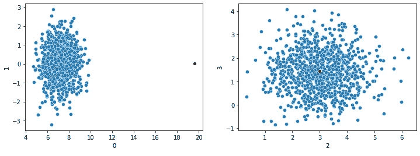

然而，现实世界中的表格数据通常具有非常多的特征，而处理这类数据时的关键难题之一就是所谓的*维度灾难*。这一问题表现为多种形式，其中最棘手的一种是，当维度足够高时，记录之间的距离开始变得毫无意义。

在这里展示的图中，我们有一个点（红色标示），在维度 0（显示在左侧窗格的 x 轴上）中是异常的，但在维度 1、2 和 3 中是正常的。假设这个数据集只有这四个维度，计算每对记录之间的欧几里得距离时，我们会发现红点与其他所有点之间的距离异常大。因此，它可能会被可靠地标记为离群点。

然而，如果有数百个维度，并且红点在除了维度 0 之外的所有维度中都比较典型，它可能无法被可靠地标记为离群点：在维度 0 中到其他点的大距离将与所有其他维度的距离一起被平均，最终变得不再相关。

这是一个巨大的问题，尤其对于依赖距离度量的预测、聚类和离群点检测方法而言。

有时使用 SNN（共享最近邻）来缓解这一效应。然而，正如我在下面的实验中所展示的，SNN 最有效的地方（至少在我下面使用的 k 近邻离群点检测器中）并不一定是在维度很多的地方（尽管这也很相关），而是在数据的密度从一个区域到另一个区域变化的地方。我将在下面解释这意味着什么，以及它如何影响一些离群点检测器。

SNN 用于定义两个记录之间的距离，类似于欧几里得距离、曼哈顿距离、堪培拉距离、余弦相似度以及其他多种距离度量方法。顾名思义，计算出来的具体距离与任意两条记录共享的邻居数目有关。

这样一来，SNN 与其他距离度量方法有所不同，尽管它仍然比[距离度量学习](https://medium.com/towards-data-science/distance-metric-learning-for-outlier-detection-5b4840d01246)更接近欧几里得距离和其他标准度量方法。DML（距离度量学习）旨在寻找记录之间的逻辑距离，而不依赖于行中数值的具体大小。

另一方面，SNN 实际上是通过使用标准距离度量计算行之间的原始距离来开始的。如果第一步使用欧几里得距离，那么 SNN 距离与欧几里得距离相关；如果使用余弦距离计算原始距离，那么 SNN 距离与余弦距离相关；依此类推。

然而，在我们深入细节或展示它如何应用于离群点检测之前，我们先快速了解一下 SNN 聚类，因为 SNN 最初就是在聚类研究中提出的。那里的描述过程正是用于计算 SNN 距离的过程，其他上下文中，包括离群点检测，也会使用相同的方法。

# SNN 聚类

术语可能会稍显混淆，但还有一种聚类方法通常被称为 SNN，它使用 SNN 距离，并且与 DBSCAN 聚类非常相似。实际上，它可以被视为对 DBSCAN 的增强。

描述这一内容的主要论文可以在这里查看：[`www-users.cse.umn.edu/~kumar001/papers/siam_hd_snn_cluster.pdf`](https://epubs.siam.org/doi/epdf/10.1137/1.9781611972733.5)。不过，增强 DBSCAN 以使用 SNN 的想法可以追溯到 1973 年 Jarvis-Patrick 写的一篇论文。这里链接的论文采用了类似但改进的方法。

DBSCAN 是一个强大的聚类算法，仍然被广泛使用。它能够很好地处理不同大小和形状的聚类（甚至是非常任意的形状）。不过，它在处理密度不同的聚类时可能会遇到困难（它实际上假设所有聚类的密度相似）。大多数聚类算法都有类似的局限性。例如，K-means 聚类实际上假设所有聚类的大小相似，而高斯混合模型聚类则假设所有聚类大致呈高斯形状。

我不会在这里描述完整的 DBSCAN 算法，但简要概述一下：它通过识别所谓的*核心点*来工作，这些点位于密集区域，可以安全地视为内点。然后，它会识别与这些核心点接近的其他点，在每个核心点周围创建聚类。算法会经过一系列步骤，每次都扩展并合并到目前为止发现的聚类（当聚类重叠时进行合并）。那些接近现有聚类的点（即使它们并不接近原始的核心点，而是接近已经加入某个聚类的点）也会被添加到该聚类中。最终，每个点要么属于某个聚类，要么没有被分配到任何聚类中（这些点相对孤立）。

与异常值检测类似，聚类也可能在高维数据集上遇到困难，原因同样是维度诅咒，尤其是在标准距离度量失效的情况下。在每一步中，DBSCAN 基于尚未聚类的点与已聚类的点之间的距离进行工作，而这些距离计算不可靠时，聚类结果也就不可靠。在高维空间中，核心点可能与其他任何点都难以区分，即便是那些实际上不属于任何聚类的噪声点。

如前所述，DBSCAN 在数据的不同区域具有不同密度时也会遇到困难。问题在于，DBSCAN 使用的是全局的点之间接近度标准，但不同区域可能合理地具有不同的密度。

以金融交易数据为例。这可能包括销售、费用、工资单以及其他类型的交易，每种交易的密度不同。交易可能在不同的时间以不同的速率创建，具有不同的美元金额、数量和数值范围。例如，销售交易可能远多于费用交易。而且，美元金额的范围可能大不相同：例如，最大的销售额可能只是最小销售额的 10 倍，而最大的费用可能是最小费用的 1000 倍。因此，销售交易和费用交易之间的密度差异可能很大。

假设不同类型的交易位于空间的不同区域（如果再次将数据视为高维空间中的点，每个维度代表数据表中的一个特征，每条记录作为一个点），我们可能得到如下图所示的图表，销售交易位于左下角，费用交易位于右上角。

许多聚类算法（以及许多预测和异常值检测算法）可能由于密度差异而无法很好地处理这些数据。如果 DBSCAN 根据点之间距离的整体平均值进行聚类（如果数据中的销售交易数量远多于费用交易），它可能会将右上角的所有点都排除在聚类之外。

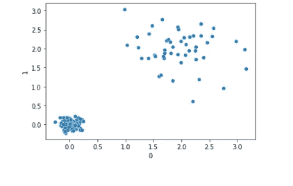

SNN 的目标是创造一个更可靠的距离度量，以应对高维度和变化的密度。

SNN 的核心思想是：如果点 p1 与 p2 根据标准距离度量接近，我们可以说它们可能真的接近，但这并不可靠。然而，如果 p1 和 p2 还具有许多相同的最近邻居，我们可以更有信心地认为它们确实接近。它们的共享邻居可以说是*确认了相似性*。

使用共享邻居时，在上述图表中，右上角的点将被正确地识别为一个聚类，因为它们通常与彼此共享许多相同的最近邻居。

Jarvis-Patrick 用图的方式解释了这一点，这是一种观察数据的有用方法。我们可以将每个记录视为空间中的一个点（如上面的散点图所示），每一对记录之间的边表示它们的相似度。为此，我们可以简单地计算每对记录之间的欧几里得距离（或其他类似的度量）。

由于图通常表示为邻接矩阵（n x n 矩阵，其中 n 是行数，给出每对行之间的距离），我们也可以从邻接矩阵的角度来看这个过程。

考虑上面的散点图，我们可能有一个 n x n 的矩阵，如下所示：

```py
 Point 1   Point 2   Point 3   ...   Point n
Point 1    0.0      3.3        2.9    ...     1.9
Point 2    3.3      0.0        1.8    ...     4.0
Point 3    2.9      1.8        0.0    ...     2.7
...        ...      ...        ...    ...     ...
Point n    1.9      4.0        2.7    ...     0.0
```

该矩阵在主对角线对称（即从点 1 到点 2 的距离与从点 2 到点 1 的距离相同），且点到自身的距离为 0.0（因此主对角线完全是零）。

SNN 算法是一个两步过程，首先计算这些原始的成对距离（通常使用欧几里得距离）。然后，它创建第二个矩阵，其中包含共享最近邻的距离。

计算这一点时，首先使用一种称为*稀疏化*的过程。对于每一对记录 p 和 q，只有当 p 和 q 都在对方的 k 个最近邻列表中时，它们之间才会有一条连接（即距离非零）。这一点很容易确定：对于 p，我们可以得到到所有其他点的距离。对于某个 k（指定为参数，这里假设为 10），我们找到距离 p 最近的 10 个点。这些点中可能包括 q，也可能不包括。同样地，对于 q：我们找到它的 k 个最近邻并查看 p 是否在其中。

我们现在得到了一个类似上面的矩阵，但许多单元格现在包含了零。

然后，我们考虑共享最近邻。对于指定的 k，p 有一个 k 个最近邻的集合（我们称之为 S1），q 也有一个 k 个最近邻的集合（我们称之为 S2）。我们可以根据 S1 和 S2 的重叠大小来确定 p 和 q 的相似度（在 SNN 的意义上）。

在一种更复杂的形式中，我们还可以考虑 S1 和 S2 中邻居的顺序。如果 p 和 q 不仅有大致相同的最近邻集（例如，它们都靠近点 p243、p873、p3321 和 p773），我们可以确信 p 和 q 是接近的。但如果进一步地，它们首先最接近 p243，然后是 p873，再然后是 p3321，最后是 p773（或者至少它们的最近邻顺序相似），我们可以更加确信 p 和 q 是相似的。然而，在本文中，我们将简单地计算 p 和 q 的共享最近邻数量（在它们各自的 k 个最近邻集合中）。

所以，我们确实需要一个标准的距离度量来开始，但一旦创建了这个度量，我们就使用点之间距离的排名顺序，而不是实际的大小，这样往往更为稳定。

对于 SNN 聚类，我们首先以这种方式计算 SNN 距离，然后继续使用标准的 DBSCAN 算法，识别核心点，找到足够接近的其他点并将其归为同一簇，然后不断扩展并迭代合并这些簇。

在 github 上至少有两种 SNN 聚类的实现：[`github.com/albert-espin/snn-clustering`](https://github.com/albert-espin/snn-clustering) 和 [`github.com/felipeangelimvieira/SharedNearestNeighbors`](https://github.com/felipeangelimvieira/SharedNearestNeighbors)。

尽管 SNN 最初来源于聚类（并且在聚类中仍然很重要），正如上面所示，SNN 作为一种距离度量方法，实际上也与机器学习的其他领域相关，包括异常值检测，接下来我们将回到这个话题。

# SNN 距离度量的实现

在描述 SNN 距离度量的 Python 实现之前，我将简要展示一个 KNN 异常值检测器的简单实现：

```py
import pandas as pd
from sklearn.neighbors import BallTree
import statistics

class KNN:
    def __init__(self, metric='euclidian'):
        self.metric = metric

    def fit_predict(self, data, k):
        data = pd.DataFrame(data)
        balltree = BallTree(data, metric=self.metric)

        # Get the distances to the k nearest neighbors for each record
        knn = balltree.query(data, k=k)[0]

        # Get the mean distance to the k nearest neighbors for each record
        scores = [statistics.mean(x[:k]) for x in knn]
        return scores
```

给定一个二维数据表和指定的 k，fit_predict()方法会为每条记录提供一个异常值分数。这个分数是到 k 个最近邻的平均距离。这一变体中，使用的是到 k 个最近邻的*最大*距离（而不是平均距离），有时被称为 kth 最近邻，而这个变体通常被称为 k 最近邻，尽管术语有所不同。

这里的大部分工作实际上是由 scikit-learn 的 BallTree 类完成的，它计算并存储传入数据框架的成对距离。其 query()方法返回，对于传入数据参数中的每个元素，两个内容：

+   到 k 个最近点的距离。

+   k 个最近点的索引。

对于这个检测器，我们只需要距离，因此取返回结构中的元素[0]。

fit_predict()随后返回每条记录到 k 个最近邻的平均距离，这也是其异常值度量：一条记录距离其最近邻越远，就越可能被认为是异常值（尽管如上所述，在不同区域具有不同密度的情况下表现较差，也就是说，平均距离与邻居之间的距离差异较大）。

这不是一个生产环境下可以使用的实现，但它提供了基本思路。KNN 异常值检测的完整实现可以在[PyOD](https://pyod.readthedocs.io/en/latest/pyod.models.html#module-pyod.models.knn)中找到。

使用 SNN 距离度量，简单的异常值检测器实现如下：

```py
class SNN:
    def __init__(self, metric='euclidian'):
        self.metric = metric

    def get_pairwise_distances(self, data, k):
        data = pd.DataFrame(data)
        balltree = BallTree(data, metric=self.metric)  
        knn = balltree.query(data, k=k+1)[1]
        pairwise_distances = np.zeros((len(data), len(data)))
        for i in range(len(data)):
            for j in range(i+1, len(data)):
                if (j in knn[i]) and (i in knn[j]):
                    weight = len(set(knn[i]).intersection(set(knn[j])))
                    pairwise_distances[i][j] = weight
                    pairwise_distances[j][i] = weight
        return pairwise_distances

    def fit_predict(self, data, k):
        data = pd.DataFrame(data)
        pairwise_distances = self.get_pairwise_distances(data, k)
        scores = [statistics.mean(sorted(x, reverse=True)[:k]) for x in pairwise_distances]
        min_score = min(scores)
        max_score = max(scores)
        scores = [min_score + (max_score - x) for x in scores]
        return scores
```

这里的 SNN 检测器实际上也可以被看作是一个 KNN 异常值检测器，只是使用了 SNN 距离。为了简便起见，我们将这两种异常值检测器分别称为 KNN 和 SNN，并假设 KNN 检测器使用标准的距离度量方法，如曼哈顿距离或欧几里得距离，而 SNN 检测器则使用 SNN 距离度量方法。

与 KNN 检测器一样，SNN 检测器会为传递给`fit_predict()`的每条记录返回一个得分，这里是到 k 个最近邻的平均 SNN 距离，而不是使用标准距离度量的平均距离。

该类还提供了`get_pairwise_distances()`方法，该方法由`fit_predict()`调用，但在计算成对的 SNN 距离时也可以直接调用（稍后我们会看到一个使用 DBSCAN 进行离群点检测的例子）。

在`get_pairwise_distances()`中，我们获取 BallTree 的`query()`方法返回结果的第[1]项，因为我们关心的是最近邻，而不是它们的具体距离。

如前所述，除非两个记录在彼此的 k 个最近邻中，否则我们将所有距离设为零。然后我们计算具体的 SNN 距离，即每对点在 k 个最近邻集合中共享的邻居数量。

可以使用如 Jaccard 或 Dice 等度量来量化每一对点最近邻的重叠情况，但由于两者的大小相同（k），我们可以简单地计算每一对的重叠大小。

在另一种提供的方法`fit_predict()`中，我们首先获取成对的距离。这些实际上是常态的度量，而不是离群点度量，因此在返回得分之前，这些值会被反转。

最终得分是每条记录与 k 个最近邻的平均重叠度。

所以，k 在这里实际上有两个不同的用途：它首先用于识别 k 个最近邻（在此步骤中，我们计算 KNN 距离，使用欧几里得或其他类似的度量），然后在第二步中再次使用（在此步骤中，我们计算 SNN 距离，使用平均重叠度）。也可以使用两个不同的参数来实现这些功能，一些实现确实这样做，有时将第二个参数称为*eps*（这来源于 DBSCAN 的历史，其中 eps 用于定义两个点之间的最大距离，以便认为它们属于同一邻域）。

再次强调，这不一定是生产就绪的代码，且远未优化。有一些技术可以提高速度，这也是一个活跃的研究领域，特别是第一步，计算原始的成对距离。在数据量非常大的情况下，可能需要考虑使用 BallTree 的替代方法，如[faiss](https://ai.meta.com/tools/faiss/)，或者以其他方式加速处理。但对于中等大小的数据集，像这里的代码通常是足够的。

# 离群点检测测试

我已经以多种方式测试了上述的 KNN 和 SNN 离群点检测器，使用了合成数据和真实数据。我多年来也在多个离群点检测项目中使用了 SNN 距离。

总的来说，我实际上没有发现 SNN 在高维情况下比 KNN 更优，尽管在某些时候 SNN 是更可取的。

然而，在我看到的情况中，当数据具有不同的密度时，SNN 相对于标准 KNN 确实有明显的优势。

更准确地说，SNN 在高维度和不同密度的结合下，通常能明显优于其他距离度量方法和 KNN 类型的检测器，比仅有高维度或仅有不同密度的情况要更为显著。

这可以通过以下测试代码来观察。它使用了（相对）简单的合成数据，以便更清楚地呈现这一点。

```py
def test_variable_blobs(nrows=1000, ncols=500, nclusters=60, outlier_multiplier=2.0, k=30, metric='manhattan'):
    np.random.seed(1)

    # ########################################################
    # Create the test data

    # Set the size of each cluster
    n_samples_arr = []
    remaining_count = nrows
    for i in range(nclusters-1):
        cluster_size = np.random.randint(1, remaining_count // (nclusters - i))
        n_samples_arr.append(cluster_size)
        remaining_count -= cluster_size
    n_samples_arr.append(remaining_count)

    # Set the density of each cluster
    cluster_std_arr = []
    for i in range(nclusters):
        cluster_std_arr.append(np.random.uniform(low=0.1, high=2.0))

    # Set the center location of each cluster
    cluster_centers_arr = []
    for i in range(nclusters):
        cluster_centers_arr.append(np.random.uniform(low=0.0, high=10.0, size=ncols))

    # Create the sample data using the specified cluster sizes, densities, and locations
    x, y = make_blobs(n_samples=n_samples_arr,
                      cluster_std=cluster_std_arr,
                      centers=cluster_centers_arr,
                      n_features=ncols,
                      random_state=0)
    df = pd.DataFrame(x)

    # Add a single known outlier to the data
    avg_row = [x[:, i].mean() for i in range(ncols)]
    outlier_row = avg_row.copy()
    outlier_row[0] = x[:, 0].max() * outlier_multiplier
    df = pd.concat([df, pd.DataFrame([outlier_row])])
    df = df.reset_index(drop=True)

    # ########################################################
    # Compare standard distance metrics to SNN

    # Calculate the outlier scores using standard KNN
    scored_df = df.copy()
    knn = KNN(metric=metric)
    scored_df['knn_scores'] = knn.fit_predict(df, k=k)

    # Calculate the outlier scores using SNN    
    snn = SNN(metric=metric)
    scored_df['snn_scores'] = snn.fit_predict(df, k=k)

    # Plot the distribution of scores for both detectors and show
    # the score for the known outlier (in context of the range of 
    # scores assigned to the full dataset)
    fig, ax = plt.subplots(nrows=1, ncols=2, figsize=(12, 4))
    sns.histplot(scored_df['knn_scores'], ax=ax[0])
    ax[0].axvline(scored_df.loc[nrows, 'knn_scores'], color='red')
    sns.histplot(scored_df['snn_scores'], ax=ax[1])
    ax[1].axvline(scored_df.loc[nrows, 'snn_scores'], color='red')
    plt.suptitle(f"Number of columns: {ncols}")
    plt.tight_layout()
    plt.show()
```

在这种方法中，我们生成测试数据，向数据集中添加一个已知的离群点，获取 KNN 离群点分数，获取 SNN 离群点分数，并绘制结果。

测试数据是通过 scikit-learn 的 make_blobs()函数生成的，该函数创建了一组高维度的簇。生成的一个离群点将位于这些簇之外（并且默认情况下，列 0 中会有一个极端值）。

代码中大部分的复杂性都在于生成测试数据。在这里，我们不仅仅是调用 make_blobs()函数并使用默认参数，而是指定每个簇的大小和密度，以确保它们之间有所不同。密度是通过一组标准差来指定的（标准差描述了每个簇的分散程度）。

这会生成如下的数据：

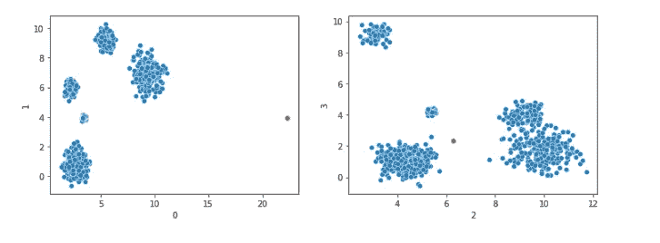

这只展示了四个维度，但通常我们会调用此方法来创建具有多个维度的数据。已知的离群点用红色标出。在维度 0 中，它具有一个极端值，在大多数其他维度中，它趋向于落在簇之外，因此是一个强烈的离群点。

测试可以通过以下方式进行：

```py
test_variable_blobs(nrows=1000, ncols=20, nclusters=1, k=30, metric='euclidean')
test_variable_blobs(nrows=1000, ncols=100, nclusters=5, k=30, metric='euclidean')
test_variable_blobs(nrows=1000, ncols=250, nclusters=10, k=30, metric='euclidean')
test_variable_blobs(nrows=1000, ncols=400, nclusters=15, k=30, metric='euclidean')
test_variable_blobs(nrows=1000, ncols=450, nclusters=20, k=30, metric='euclidean')
test_variable_blobs(nrows=1000, ncols=500, nclusters=20, k=30, metric='euclidean')
test_variable_blobs(nrows=1000, ncols=750, nclusters=20, k=30, metric='euclidean')
test_variable_blobs(nrows=1000, ncols=1000, nclusters=20, k=30, metric='euclidean')
test_variable_blobs(nrows=1000, ncols=2000, nclusters=20, k=30, metric='euclidean')
test_variable_blobs(nrows=1000, ncols=3000, nclusters=20, k=30, metric='euclidean')

test_variable_blobs(nrows=1000, ncols=20, nclusters=1, k=30)
test_variable_blobs(nrows=1000, ncols=100, nclusters=5, k=30)
test_variable_blobs(nrows=1000, ncols=250, nclusters=10, k=30)
test_variable_blobs(nrows=1000, ncols=400, nclusters=15, k=30)
test_variable_blobs(nrows=1000, ncols=450, nclusters=20, k=30)
test_variable_blobs(nrows=1000, ncols=500, nclusters=20, k=30)
test_variable_blobs(nrows=1000, ncols=750, nclusters=20, k=30)
test_variable_blobs(nrows=1000, ncols=1000, nclusters=20, k=30)
test_variable_blobs(nrows=1000, ncols=2000, nclusters=20, k=30)
test_variable_blobs(nrows=1000, ncols=3000, nclusters=20, k=30)
```

首先执行一系列使用欧几里得距离的测试（该距离被 KNN 检测器和 SNN 检测器的第一步使用），然后执行一系列使用曼哈顿距离的测试（这是 test_variable_blobs()方法的默认距离）——对于 KNN 检测器和 SNN 检测器的第一步都使用曼哈顿距离。

对于每种情况，我们使用不同数量的列进行测试（列数从 20 到 3000 不等）。

从欧几里得距离开始，使用仅 20 个特征时，KNN 和 SNN 都能良好工作，因为它们都为已知的离群点分配了较高的离群分数。在这里，我们可以看到每个检测器生成的离群分数分布（KNN 检测器显示在左侧窗格，SNN 检测器显示在右侧窗格），并有一条红色的垂直线，表示每个检测器为已知的离群点所分配的离群分数。在这两种情况下，已知的离群点得到了明显高于其他记录的分数：两个检测器都表现良好。

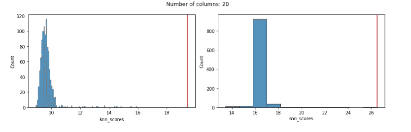

但是，使用欧几里得距离随着特征的增加往往会迅速退化，即使只有 100 个特征时，它的效果也相当差。这一点对于 KNN 和 SNN 检测器都适用。在这两种情况下，已知的离群点得到了一个相当正常的分数，没有显示出任何离群的迹象，如下所示：

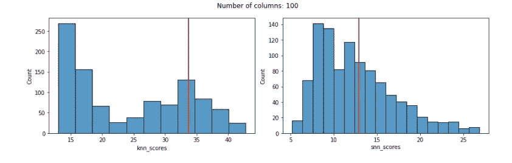

重复使用曼哈顿距离，我们可以看到 KNN 在较少特征时表现良好，但随着特征数量的增加，其表现逐渐变差。然而，一旦特征数量超过大约 50 个，KNN 在曼哈顿距离下的表现远好于欧几里得距离（在特征较少时，几乎任何距离度量方法都能合理地工作）。

在下面所有的案例中（使用曼哈顿距离和 SNN 距离），我们在左侧窗格中展示了 KNN 离群分数的分布（以及 KNN 检测器为已知离群点分配的离群分数），在右侧窗格中展示了 SNN 分数的分布（以及 SNN 检测器为已知离群点分配的离群分数）。

使用 20 个特征时，两者表现都很好：

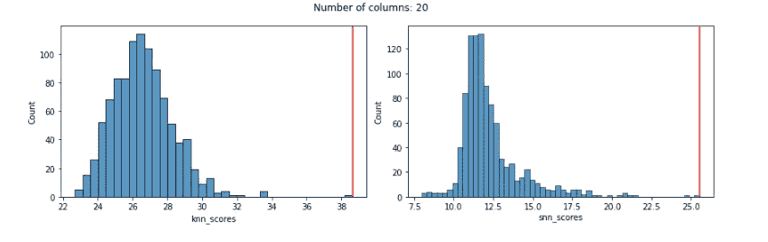

使用 100 个特征时，KNN 仍然给已知离群点分配了较高的分数，但并不算非常高。SNN 依然表现非常好（在下面所有案例中也是如此）：

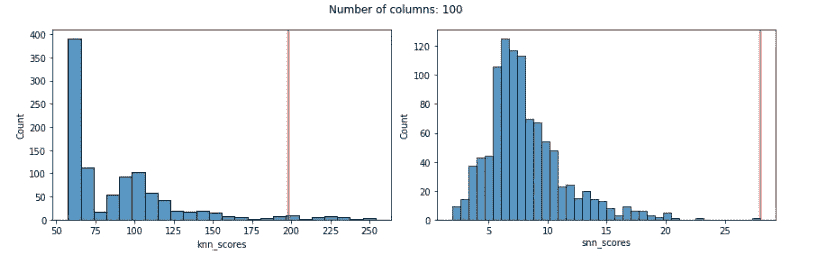

使用 250 个特征时，KNN 为已知离群点分配的分数相当低，且分数的分布很奇怪：

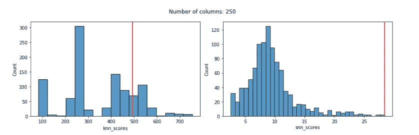

使用 500 个特征：

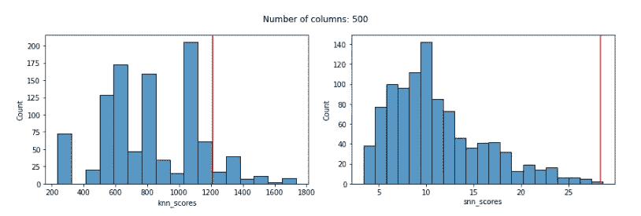

使用 1000 个特征：

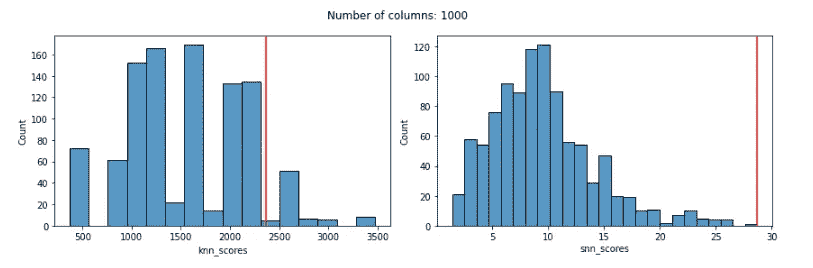

使用 2000 个特征：

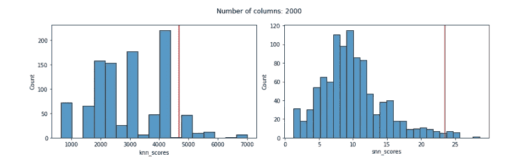

使用 3000 个特征：

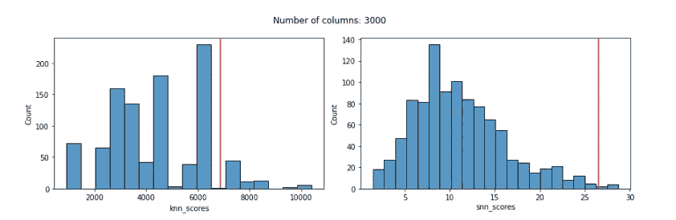

使用 KNN 检测器，即使使用曼哈顿距离，我们可以看到在 100 个特征时，分数的分布已经非常奇怪，更重要的是，在 100 个特征时，KNN 给已知离群点分配的分数很低，无法反映其离群性质。

另一方面，SNN 分数的分布即使在 3000 个特征时仍然是合理的，而已知离群点的 SNN 分数直到接近 2000 个特征时才开始显著降低（对于 2000 和 3000 个特征，其分数仍然很高，但不是最高分）。

SNN 检测器（本质上是使用 SNN 距离的 KNN 离群检测算法）比使用曼哈顿距离的 KNN 更加可靠。

这里的一个关键点（除非考虑 SNN 距离）是，在特征数量较多时，曼哈顿距离比欧几里得距离在离群检测上更加可靠。尽管维度灾难仍然存在（所有距离度量最终都会失败），但在几十个或几百个特征下，曼哈顿距离比欧几里得距离受到的影响要小得多。

事实上，尽管欧几里得距离在低维情况下非常适用，但即使在特征数适中的情况下，欧几里得距离也会出现失效（有时仅在 30 或 40 个特征时就会失效）。在这些情况下，曼哈顿距离可以作为一个更公平的对比，这正是这里所做的。

一般来说，我们应当谨慎对待将距离度量与欧几里得距离进行比较的评估，因为这些评估可能具有误导性。虽然在进行距离计算时通常假设欧几里得距离，但这一点值得我们质疑。

在此识别的情况下（即数据仅仅是聚类，但聚类的大小和密度各不相同），SNN 确实显著优于 KNN（并且令人印象深刻的是，即便接近 2000 个特征时，仍然保持可靠）。考虑到我们是基于曼哈顿距离而非欧几里得距离与 KNN 进行比较，这一发现更具意义。

然而，在许多其他情况下，特别是当数据只有一个聚类，或聚类之间的密度相似时，KNN 可以与 SNN 一样有效，甚至更优。

这并不是说 SNN 应该总是优于其他距离度量，而是说在某些场景下，它的表现可能显著更好。

在其他情况下，其他距离度量也可能更合适，包括余弦距离、Canberra 距离、马氏距离、切比雪夫距离等。在进行异常值检测时，尝试这些方法通常是非常值得的。

# 全局异常值检测器

KNN 在此失效的原因与使用 DBSCAN 进行聚类时类似，即当不同区域（在这种情况下，不同聚类）具有不同密度时。

KNN 是一种被称为*全局异常值检测器*的检测器示例。如果你熟悉局部和全局异常值的概念，那么这个概念是相关的，但有所不同。在这种情况下，“全局”指的是有一个全局的正常感知。这与上面提到的 DBSCAN 聚类的局限性相同（即在记录之间存在一个全局的正常距离感知）。数据中的每一条记录都会与这个正常标准进行比较。在 KNN 异常值检测器的情况下，存在一个全局的正常平均距离感知，指的是与 k 个最近邻的距离。

然而，当数据在不同区域的密度不同时，这种全局标准就没有意义。下图中（从上面重复的图），有两个聚类，其中左下角的聚类密度明显高于右上角的聚类。

在识别异常值时，相关的是一个点与其邻居的距离相对于该区域的正常水平，而不是相对于其他聚类（或整个数据集）的正常水平。


这是另一个重要的异常值检测器——局部异常因子（LOF）被创建来解决的问题（原始 LOF 论文实际上描述了一个非常类似的情境）。与全局异常值检测器不同，LOF 是一种 *局部* 异常值检测器：它通过将点与局部区域内的其他点进行比较，而不是与整个数据集进行比较，从而对每个点进行局部的“正常”判断。对于 LOF 来说，它通过比较每个点与附近点的平均距离来做出判断。

局部异常值检测器也提供了一种有价值的方法，用于识别数据空间中密度变化的异常值，我在 [Python 中的异常值检测](https://www.manning.com/books/outlier-detection-in-python)中讨论了这一点，并将在未来的文章中继续探讨。

SNN 还为这个不同密度的问题提供了一个重要的解决方案。使用 SNN 距离时，密度的变化不再是问题。每一条记录与其最邻近点的共享邻居平均数量的全球标准进行比较。这是一种相当稳健的计算方法，能够在数据被聚类或者某些区域的数据密度更高时良好地工作。

# DBSCAN 用于异常值检测

在本文中，我们主要探讨了用于异常值检测的 KNN 算法，但 SNN 可以与任何基于行间距离的异常值检测器一起使用。这包括半径、局部异常因子（LOF）以及其他许多方法。它还包括任何基于聚类的异常值检测算法。

使用聚类识别异常值有多种方法（例如，识别非常小的聚类中的点、离聚类中心较远的点，等等）。不过，在这里，我们将看一种非常简单的异常值检测方法：对数据进行聚类，然后识别那些未被归类到任何聚类中的点。

DBSCAN 是用于这类异常值检测的最常用的聚类算法之一，因为它具有一个方便的特性（并非所有聚类算法都具备）：它允许某些点不被归类到任何聚类中。

DBSCAN（至少是 scikit-learn 的实现）还允许我们轻松处理 SNN 距离。

因此，DBSCAN 除了是一个有用的聚类算法外，还广泛用于异常值检测，我们将在这里作为另一个使用 SNN 距离进行异常值检测的示例。

不过，在查看使用 SNN 距离之前，我们将展示一个使用 DBSCAN 的例子，因为它更常用于识别数据中的异常值（这里使用默认的欧几里得距离）。这使用的是上面创建的相同数据集，其中最后一行是唯一已知的异常值。

```py
clustering = DBSCAN(eps=20, min_samples=2).fit(df.values)
print(clustering.labels_)
print(pd.Series(clustering.labels_).value_counts())
```

DBSCAN 的参数设置可能需要一定的实验调整。在这个例子中，我调整了参数，直到算法识别出一个异常值，我通过打印 labels_ 属性确认它是最后一行。标签如下：

```py
[ 0  1  1 ...  1  0 -1]
```

-1 表示未分配给任何聚类的记录。而且，value_counts()显示只有一条记录被分配给了聚类 -1。所以，DBSCAN 在这个例子中工作得很好。这意味着我们不能通过使用 SNN 来改进它，但这确实提供了一个清晰的使用 DBSCAN 进行异常值检测的例子，并确保数据集可以通过基于聚类的异常值检测解决。

为了使用 SNN 距离，必须首先计算成对的 SNN 距离（DBSCAN 本身无法计算这些）。一旦这些距离被创建，它们可以以 n x n 矩阵的形式传递给 DBSCAN。

在这里我们计算 SNN 的成对距离：

```py
snn = SNN(metric='manhattan')
pairwise_dists = snn.get_pairwise_distances(df, k=100)
print(pairwise_dists)
```

成对距离如下所示：

```py
array([[ 0.,  0.,  0., ...,  0., 57.,  0.],
       [ 0.,  0.,  0., ...,  0.,  0.,  0.],
       [ 0.,  0.,  0., ...,  0.,  0.,  0.],
       ...,
       [ 0.,  0.,  0., ...,  0.,  0.,  0.],
       [57.,  0.,  0., ...,  0.,  0.,  0.],
       [ 0.,  0.,  0., ...,  0.,  0.,  0.]])
```

作为一种快速简便的方法来反转这些距离（以便更适合 DBSCAN），我们调用：

```py
d = pd.DataFrame(pairwise_dists).apply(lambda x: 1000-x)
```

在这里，1000 只是一个大于实际数据中任何值的数字。然后我们调用 DBSCAN，使用‘预计算’作为度量，并将成对距离传递给 fit()。

```py
clustering = DBSCAN(eps=975, min_samples=2, metric='precomputed').fit(d.values)
print(clustering.labels_)
display(pd.Series(clustering.labels_).value_counts())
```

再次强调，这只识别出了一个异常值（只有一个记录被赋予了聚类 ID -1，并且这就是最后一行）。一般来说，DBSCAN 和其他接受“预计算”作为度量的工具可以与 SNN 距离一起使用，并可能产生更稳健的结果。

在 DBSCAN 的情况下，使用 SNN 距离可以很好地工作，因为异常值（在 DBSCAN 中称为*噪声点*）和内点通常几乎所有的链接都被打破，因此异常值最终不会被分配到任何聚类。一些异常值（尽管这些异常值不那么极端）会与其他记录有一些链接，但通常与这些记录几乎没有或只有很少的共享邻居，因此会得到很高的异常值分数（尽管不如那些没有链接的异常值高，这样的处理是合适的）。

这可能需要一些实验，在某些情况下，k 的值以及 DBSCAN 的参数需要进行调整，尽管这在异常值检测中并不算是异常——通常情况下，需要进行一些调优。

# 子空间异常值检测（SOD）

SNN 在异常值检测中的使用并不像理想的那样广泛，但有一个著名的检测器使用了它：SOD，它包含在[PyOD](https://pyod.readthedocs.io/en/latest/pyod.models.html#module-pyod.models.sod)库中。

SOD 是一种异常值检测器，专注于找到有用的子空间（特征的子集）来进行异常值检测，但在过程中确实使用 SNN，它在介绍 SOD 的论文中提出，SNN 提供了更可靠的距离计算。

SOD 的工作原理（类似于 KNN 和 LOF），是为每个点识别 k 个邻居的邻域，这些邻居在 SOD 中被称为*参考集*。参考集是通过 SNN 来找到的。因此，邻域的识别不是通过使用具有最小欧几里得距离的点，而是通过那些具有最多共享邻居的点。

作者们发现，这种方法不仅在高维度情况下具有鲁棒性，而且在有许多无关特征的情况下也能保持稳定：邻居的排名顺序通常仍然具有意义，因此即使在某些特定距离不可靠的情况下，最近邻的集合也能可靠地找到。

一旦我们为一个点获取了参考集，SOD 就会利用这个参考集来确定子空间，即解释参考集最大方差的特征集合。而一旦 SOD 识别出这些子空间，它会检查每个点到数据中心的距离，从而提供一个异常分数。

# 嵌入

SNN 的一个显著应用是嵌入（例如图像、视频、音频、文本、网络或其他模态数据的向量表示），这些数据往往具有非常高的维度。我们在《[Python 中的异常检测](https://www.manning.com/books/outlier-detection-in-python)》一书中对这个问题进行了更深入的讨论，但在此简要指出：针对数字表格数据（如隔离森林、本地异常因子、k 近邻等）的标准异常检测方法，实际上在嵌入数据上表现较差。主要原因似乎是维度过高，以及嵌入数据中存在许多与异常检测无关的维度。

还有其他一些成熟的嵌入式异常检测技术，例如基于自动编码器、变分自动编码器、生成对抗网络等方法的技术。除此之外，还可以将降维技术应用于嵌入式数据，以提高异常检测的效果。这些内容也会在本书中介绍，并且希望在未来的 Medium 文章中进一步探讨。同时，我目前正在研究使用欧几里得距离、余弦距离等标准度量之外的其他距离度量，包括 SNN。是否有用，目前还在研究中。

# 结论

类似于[距离度量学习](https://medium.com/towards-data-science/distance-metric-learning-for-outlier-detection-5b4840d01246)，共享最近邻在计算上会比标准的距离度量（如曼哈顿距离和欧几里得距离）更为昂贵，但在特征数量较多、密度变化较大以及（正如 SOD 作者所发现的）存在无关特征时，可以表现得更为鲁棒。

因此，在某些情况下，SNN 可以作为一种更优的距离度量，替代更标准的距离度量，并可能更适合用于异常检测。我们已经看到它可以作为 k 近邻异常检测和 DBSCAN 异常检测的距离度量（以及仅在使用 DBSCAN 进行聚类时的情况）。

事实上，SNN 可以与任何基于记录之间距离的异常检测方法结合使用。也就是说，它可以与任何基于距离、基于密度或基于聚类的异常检测器一起使用。

我们还指出，SNN 并不总是与其他距离度量相比表现优越。当考虑到分类数据、日期数据和文本列（以及我们在表格数据中可能遇到的其他类型特征）时，问题会变得更加复杂。但即使严格考虑数字数据，也完全可能有一些数据集，即使特征数量很大，简单的曼哈顿距离也比 SNN 更有效，而在其他情况下，SNN 则更为优越。行数、特征数量、特征的相关性、特征的分布、特征之间的关联、数据的聚类情况等等都是相关因素，通常很难提前预测出什么方法最有效。

SNN 只是解决高维度、变化密度和无关特征等问题的一种方法，但它是一个有用的工具，足够简单可以实现，并且通常值得进行实验。

这篇文章只是对 SNN 的一个介绍，未来的文章可能会进一步探讨 SNN，但一般来说，在确定用于异常值检测的距离度量（以及其他建模决策）时，最好的方法是使用一种叫做掺杂的技术（[本文中有描述](https://medium.com/towards-data-science/doping-a-technique-to-test-outlier-detectors-3f6b847ab8d4)），我们通过创建与真实数据相似的数据，但对其进行修改，使其包含强烈但现实的异常值。通过这样做，我们可以尝试估算哪种方法在检测你可能遇到的异常值时最有效。

在这里，我们使用了一个合成数据的示例，这有助于描述在某些情况下，一种异常值检测方法比另一种方法更有效，并且这一过程非常有价值（例如，在这里我们发现，当调整密度并增加特征数量时，SNN 优于曼哈顿距离，但在密度一致且特征数量较少的情况下，两者表现都很好）。然而，使用合成数据，尽管它很重要，但只是理解不同方法在类似数据上效果更好的一个步骤。掺杂方法通常在此过程中会更有效，或者至少是这个过程的一部分。

此外，通常在异常值检测中有一个共识，那就是没有任何一个检测器能够可靠地识别你感兴趣的所有异常值。每个检测器都会检测到一种相对特定类型的异常值，而我们通常希望检测各种各样的异常值（事实上，我们经常只是希望识别出任何在统计上显著不同于正常值的情况——尤其是在首次检查数据集时）。

考虑到这一点，通常会使用多个检测器进行离群点检测，并将它们的结果组合成一个集成模型。一种增加集成模型多样性的方法是使用多种距离度量。例如，如果曼哈顿距离、欧几里得距离、SNN，甚至其他度量（如堪培拉距离、余弦相似度或其他度量）都能有效工作（它们产生不同但合理的结果），那么使用所有这些度量可能是值得的。然而，通常我们会发现，只有一两种距离度量在给定的数据集和我们关注的离群点类型下能产生有意义的结果。尽管不是唯一的，SNN 是一种有用的距离度量，尤其是在其他距离度量的检测器效果不佳时，值得尝试。

所有图片均由作者提供。
