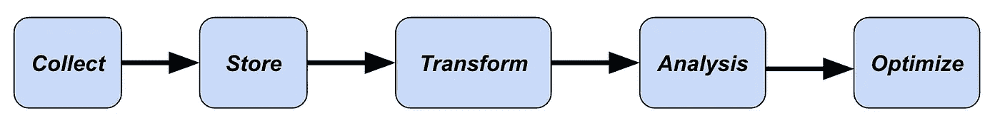

# 你应该成为数据科学家、数据分析师还是数据工程师？

> 原文：[`towardsdatascience.com/should-you-become-a-data-scientist-data-analyst-or-data-engineer-a9cd5c529650?source=collection_archive---------2-----------------------#2024-03-29`](https://towardsdatascience.com/should-you-become-a-data-scientist-data-analyst-or-data-engineer-a9cd5c529650?source=collection_archive---------2-----------------------#2024-03-29)

## 解释不同数据角色之间的区别和要求

 [Egor Howell](https://medium.com/@egorhowell?source=post_page---byline--a9cd5c529650--------------------------------)

·发布于 [Towards Data Science](https://towardsdatascience.com/?source=post_page---byline--a9cd5c529650--------------------------------) ·阅读时间 7 分钟·2024 年 3 月 29 日

--

图片由 [Anthony Tori](https://unsplash.com/@anthonytori?utm_source=medium&utm_medium=referral) 提供，来自 [Unsplash](https://unsplash.com/?utm_source=medium&utm_medium=referral)

许多技术行业内外的人对不同的数据角色以及它们的职能感到困惑。这可能使得想要进入该领域的人很难判断哪种工作适合他们的技能，并与他们的兴趣相符。因此，在本文中，我将详细解释数据科学家、数据分析师和数据工程师之间的区别。

# 一般数据流

下面的图表展示了公司内部的基本数据流。

> 这并不是普遍适用的，可能在不同的组织之间有所不同。

公司内部的数据流。图表由作者提供。

让我们来分析这些步骤：

+   **收集** — 这是关于从你可能需要的来源收集数据。为了获取数据，你需要进行日志记录和 API 调用……
