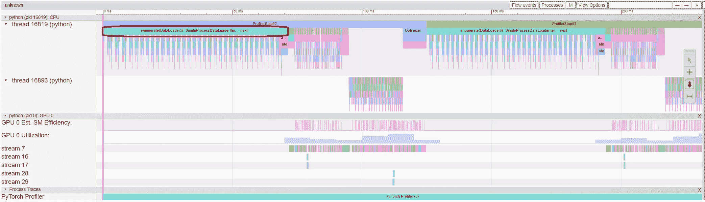
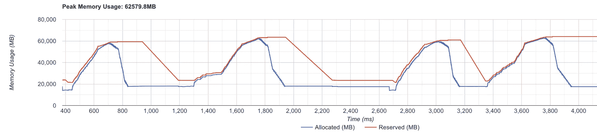
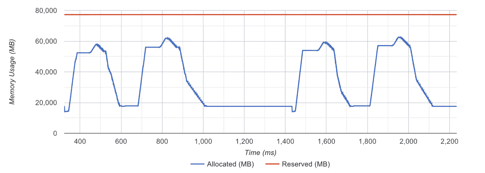
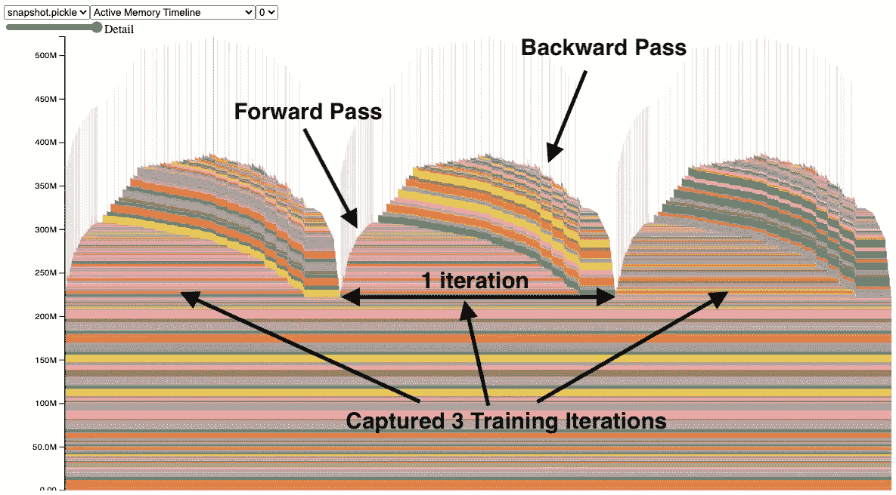
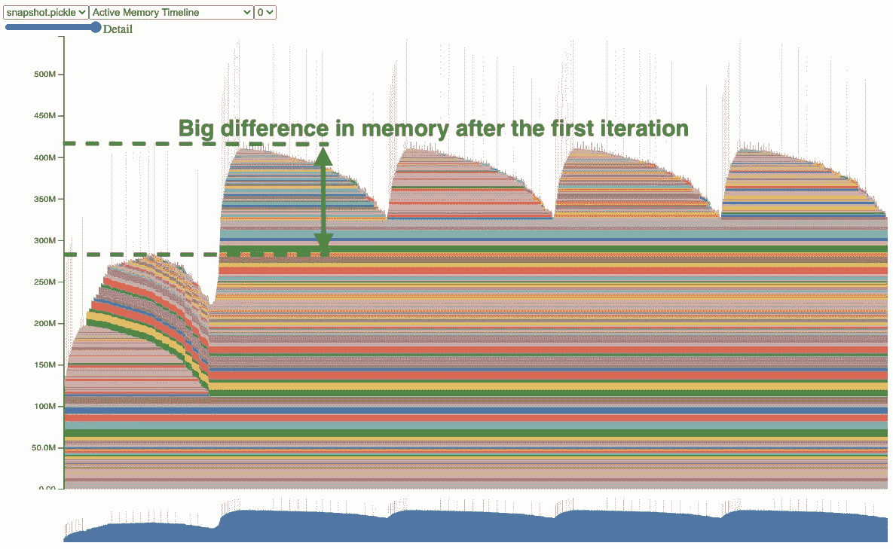
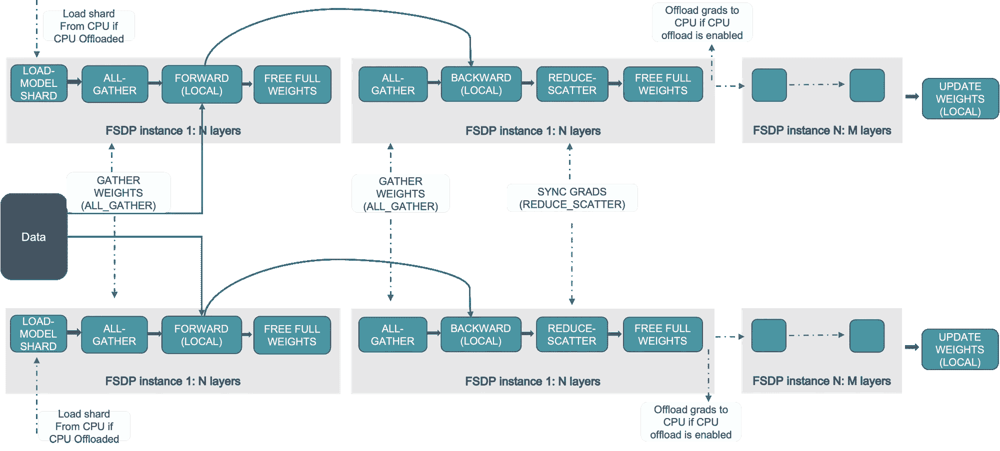

# 加速你的 PyTorch 模型训练的简单方法

> 原文：[`towardsdatascience.com/simple-ways-to-speed-up-your-pytorch-model-training-9c9d4899313d?source=collection_archive---------3-----------------------#2024-05-28`](https://towardsdatascience.com/simple-ways-to-speed-up-your-pytorch-model-training-9c9d4899313d?source=collection_archive---------3-----------------------#2024-05-28)

## 如果所有机器学习工程师都希望得到一个东西，那就是 **更快的模型训练** —— 也许在获得良好的测试指标之后。 

[](https://alexdremov.medium.com/?source=post_page---byline--9c9d4899313d--------------------------------)[](https://towardsdatascience.com/?source=post_page---byline--9c9d4899313d--------------------------------) [Alex Dremov](https://alexdremov.medium.com/?source=post_page---byline--9c9d4899313d--------------------------------)

·发布于 [Towards Data Science](https://towardsdatascience.com/?source=post_page---byline--9c9d4899313d--------------------------------) ·11 分钟阅读 ·2024 年 5 月 28 日

--


图片来源：[Julian Hochgesang](https://unsplash.com/@julianhochgesang?utm_source=ghost&utm_medium=referral&utm_campaign=api-credit) / [Unsplash](https://unsplash.com/?utm_source=ghost&utm_medium=referral&utm_campaign=api-credit)

这个话题甚至需要介绍吗？

加速机器学习模型训练是所有机器学习工程师的目标。更快的训练意味着更快的实验，也意味着更快的产品迭代。此外，这还意味着一次模型训练将需要更少的资源。所以，直接进入正题

# 容器化

是的，单靠这个不会加速你的训练。但它针对的是另一个重要方面——可重现性。有时候，使用固定库版本的 virtualenv 就足够了，但我鼓励你更进一步，为你的模型训练构建一个一体化的 Docker 容器。

这确保了在调试、分析和最终训练过程中，环境的一致性。你最不希望的事情就是优化一个部分代码，而这个部分由于 Python12 提升了速度，已经不再是瓶颈了。例如，甚至有一个错误在不同的 CUDA 版本下无法重现。

作为起点，你可以使用 NVIDIA 提供的预构建镜像。这些镜像已经安装了 CUDA、PyTorch 和其他流行的库：

[## PyTorch | NVIDIA NGC

### PyTorch 是一个 GPU 加速的张量计算框架。功能可以通过常见的 Python 库进行扩展……

catalog.ngc.nvidia.com](https://catalog.ngc.nvidia.com/orgs/nvidia/containers/pytorch?ref=alexdremov.me&source=post_page-----9c9d4899313d--------------------------------)

> 💡 Docker 容器是解决此类问题的终极方案
> 
> “嘿，它在我的机器上可以工作，我不知道为什么在你的机器上不行。”

# 熟悉 PyTorch 分析器

在优化任何东西之前，你必须了解你的一些代码部分运行了多久。PyTorch 分析器几乎是一个功能齐全的训练分析工具。它能够记录：

+   CPU 操作的时间

+   CUDA 内核的时间

+   内存消耗历史

这就是你所需要的一切。而且它很容易启用！

要记录事件，你只需要像这样将训练嵌入分析器上下文中：

```py
import torch.autograd.profiler as profiler

with profiler.profile(
  activities=[ProfilerActivity.CPU, ProfilerActivity.CUDA],
  on_trace_ready=torch.profiler.tensorboard_trace_handler('./logs'),
) as prof:
  train(args)
```

之后，你可以启动 tensorboard 并查看分析轨迹。别忘了安装 [torch-tb-profiler](https://pypi.org/project/torch-tb-profiler/?ref=alexdremov.me)。

[](https://pytorch.org/tutorials/intermediate/tensorboard_profiler_tutorial.html?ref=alexdremov.me&source=post_page-----9c9d4899313d--------------------------------) [## PyTorch Profiler 与 TensorBoard - PyTorch 教程 2.3.0+cu121 文档]

### 准备数据和模型 使用分析器记录执行事件 运行分析器 使用 TensorBoard 查看结果并…

pytorch.org](https://pytorch.org/tutorials/intermediate/tensorboard_profiler_tutorial.html?ref=alexdremov.me&source=post_page-----9c9d4899313d--------------------------------)

分析器有许多不同的选项，但最重要的是 `activities` 和 `profile_memory`。你可以尝试其他选项，但请记住一个简单的规则：**你启用的选项越少，开销就越小**。

所以，如果你想分析 CUDA 内核执行的时间，最好关闭 CPU 分析和其他所有功能。在这种模式下，分析将尽可能接近真实执行。

为了让轨迹更容易理解，考虑添加描述你代码核心部分的分析上下文。如果没有启用分析，这些上下文将无效。

```py
with profiler.record_function("forward_pass"):
  result = model(**batch)

with profiler.record_function("train_step"):
  step(**result)
```

这样，你使用的标签将在轨迹中可见。这样，识别代码块会更加容易。甚至在模式的 forward 中进行更细粒度的分析：

```py
with profiler.record_function("transformer_layer:self_attention"):
  data = self.self_attention(**data)

...

with profiler.record_function("transformer_layer:encoder_attention"):
  data = self.encoder_attention(**data, **encoder_data)
```

# 理解 PyTorch 轨迹

收集轨迹后，在 tensorboard 中打开它们。这就是 CPU + CUDA 分析的样子：



© 版权 2024，PyTorch | [`pytorch.org/tutorials/intermediate/tensorboard_profiler_tutorial.html`](https://pytorch.org/tutorials/intermediate/tensorboard_profiler_tutorial.html?ref=alexdremov.me)

立刻找到任何训练的核心部分：

+   数据加载

+   前向传播

+   反向传播

反向传播由 PyTorch 在单独的线程中处理（如上图中的线程 16893），所以很容易识别。

# 数据加载

对于数据加载，我们希望接近零的时间。

没有妥协。

这是因为在数据加载期间 GPU 不做任何事情，这会导致可用资源的低效利用。然而，数据处理可以与 GPU 计算重叠，因为它们是独立的部分。

你可以轻松地识别 GPU 闲置的区域——只需查看分析器跟踪中的 *GPU 估算 SM 效率* 和 *GPU 利用率* 数值。没有活动的区域就是我们的“患者”。这就是 GPU 什么也不做的地方。

一个简单的解决方案是：

+   在后台进程中处理数据（没有 GIL）

+   在并行进程中处理数据增强和变换

如果你使用 PyTorch 的 DataLoader，那么可以通过指定 `num_workers` 来轻松实现这一点。如果你使用 `IterableDataset`，情况会更复杂，因为数据将会重复。但这个问题仍然可以通过使用 [get_worker_info()](https://pytorch.org/docs/stable/data.html?ref=alexdremov.me#torch.utils.data.IterableDataset) 来解决——你需要调整迭代方式，以确保每个工作进程接收不同且不重叠的行。

对于更可配置的处理，你可以考虑使用 `multiprocessing` 自行实现多进程变换

> 💡 如果你从未检查过代码的数据处理速度，那么这个小小的修改可能会带来 **剧烈的加速**。

# 与内存分配器成为朋友

你希望与 PyTorch 的 CUDA 缓存分配器成为朋友。

当你在 CUDA 设备上使用 PyTorch 分配张量时，PyTorch 会使用一个缓存分配器。这是因为 `cudaMalloc`/ `cudaFree` 是昂贵的操作，我们希望避免调用它们，因此 PyTorch 有自己的分配器，它会尝试重用通过 `cudaMalloc` 分配的块。也就是说，如果 PyTorch 的分配器有合适的块可用，它会直接提供，而不需要调用 `cudaMalloc`。这样，`cudaMalloc` 只会在一开始调用。

然而，如果你处理的是长度可变的数据，不同的前向传递将需要不同大小的中间张量。因此，PyTorch 的分配器可能没有合适的数据块可用。在这种情况下，分配器会崩溃并通过调用 `cudaFree` 释放之前分配的块，以为新的分配腾出空间。

之后，分配器开始重新构建它的缓存，进行大量的 `cudaMalloc`，这是一项昂贵的操作。你可以通过查看张量板分析器视图的内存分析部分来发现这个问题。

> 💡 你也可以在跟踪记录中发现这个问题。它将以对 `cudaMalloc` 和 `cudaFree` 的调用形式显示出来



PyTorch 分配器崩溃 | 图片来自作者

如你所见，与分配器保留的内存对应的红线不断变化。这意味着 PyTorch 的分配器无法有效地处理分配请求。

当分配操作不再让分配器崩溃时，红线完全是直的



PyTorch 分配器按预期工作 | 图片来自作者

如我所说，这通常是由于张量的形状不固定。如何修复这个问题？

## **可扩展的段**

第一件值得尝试的事情是设置 PyTorch 相对较新的分配器模式：

```py
PYTORCH_CUDA_ALLOC_CONF="expandable_segments:True"
```

> *如果设置为* `*True*`*，此设置指示分配器创建可以在以后扩展的 CUDA 分配，以更好地处理工作负载频繁更改分配大小的情况，例如批量大小变化的情况。*

所以，这告诉 PyTorch 分配器分配将来可能会扩展的块，这正是我们的情况。尽管如此，如果大小变化过大，仍然可能无法解决问题。在这种情况下，转到下一个选项。

## **使分配的变化更少**

另一种可能的解决方案是使数据形状保持一致。这样，分配器将更容易找到一个适合重用的数据块。

为了实现这一点，你可以将数据填充到相同的大小。或者你可以通过运行一个具有最大输入大小的模型来预热分配器。

你可以在以下文章中了解更多关于 PyTorch 分配器修改的信息。

[## CUDA 语义 - PyTorch 2.3 文档

### torch.cuda 的指南，PyTorch 模块用于执行 CUDA 操作

pytorch.org](https://pytorch.org/docs/stable/notes/cuda.html?ref=alexdremov.me&source=post_page-----9c9d4899313d--------------------------------)

# 整理分配历史

我们希望使用所有可用的 GPU 内存——这使我们能够运行更大的批次并更快地处理数据。然而，在某个时刻，当增加批量大小时，你将遇到*CUDA 内存不足*错误。是什么导致了这个错误？

为了调试这个问题，我们可以查看分配器的内存历史。它可以通过 PyTorch 记录，然后在[`pytorch.org/memory_viz`](https://pytorch.org/memory_viz?ref=alexdremov.me)上进行可视化。

+   **开始：** `torch.cuda.memory._record_memory_history(max_entries=100000)`

+   **保存：** `torch.cuda.memory._dump_snapshot(file_name)`

+   **停止：** `torch.cuda.memory._record_memory_history(enabled=None)`

可视化将显示如下内容：



© 版权 2024, PyTorch | [`pytorch.org/blog/understanding-gpu-memory-1/`](https://pytorch.org/blog/understanding-gpu-memory-1/?ref=alexdremov.me)

x 轴表示时间，y 轴表示总使用内存，彩色块表示张量。因此，它显示了张量何时被分配以及何时被释放。

你可能会注意到窄尖峰——这些是占用大量空间的短暂张量。通过点击张量，你可以获得该张量分配的位置。我们希望尽量减少这些尖峰，因为它们限制了内存的高效使用。检查一下是什么导致了这个尖峰，并考虑其他计算方式。

除了尖峰外，检测内存泄漏也很容易：



© 版权 2024, PyTorch | [`pytorch.org/blog/understanding-gpu-memory-1/`](https://pytorch.org/blog/understanding-gpu-memory-1/?ref=alexdremov.me)

正如你所看到的，第一次前向传播后一些数据并没有被清除。通过点击这些模块，你可以大致了解这些张量来自何处。图中显示的是训练步骤后梯度未被清除的情况，这导致它们在前向传播过程中仍然存在，限制了增加批量大小以适应更多数据的能力。

[](https://pytorch.org/blog/understanding-gpu-memory-1/?ref=alexdremov.me&source=post_page-----9c9d4899313d--------------------------------) [## 理解 GPU 内存 1：可视化所有分配随时间变化

### 在你使用 PyTorch 进行 GPU 计算的过程中，你可能已经熟悉这个常见的错误信息：

[pytorch.org](https://pytorch.org/blog/understanding-gpu-memory-1/?ref=alexdremov.me&source=post_page-----9c9d4899313d--------------------------------)

# 加速模型并减少内存使用

有什么比这更好的呢？我们可以通过使用**FlashAttention**内核来计算点积注意力，从而实现这一目标。

[](https://github.com/Dao-AILab/flash-attention?ref=alexdremov.me&source=post_page-----9c9d4899313d--------------------------------) [## GitHub - Dao-AILab/flash-attention：快速且内存高效的精确注意力

### 快速且内存高效的精确注意力。通过创建一个账户，为 Dao-AILab/flash-attention 的开发做出贡献…

[github.com](https://github.com/Dao-AILab/flash-attention?ref=alexdremov.me&source=post_page-----9c9d4899313d--------------------------------)

如果你还没有听说过，它是一种计算精确点积注意力的方法，无需显式构造注意力矩阵。它优化了 GPU 的输入输出操作，从而提高了速度，并且**大幅度**减少了内存消耗。简直没有理由不使用它。

> 😡 不幸的是，有一个理由不能使用它——硬件。
> 
> Flash attention 仅在兼容硬件上使用`fp16`和`bf16`精度。这包括 NVIDIA Ampere、Hooper 等架构。

其他库在底层使用了 flash attention，因此你可以考虑使用其他更适合你代码库的变种。

## **XFormers**

[](https://github.com/facebookresearch/xformers?ref=alexdremov.me&source=post_page-----9c9d4899313d--------------------------------) [## GitHub - facebookresearch/xformers：可操作且优化过的 Transformer 构建模块，支持…

### 可操作且优化过的 Transformer 构建模块，支持可组合构建。 - facebookresearch/xformers

[github.com](https://github.com/facebookresearch/xformers?ref=alexdremov.me&source=post_page-----9c9d4899313d--------------------------------)

## **Transformer Engine**

[](https://github.com/NVIDIA/TransformerEngine?ref=alexdremov.me&source=post_page-----9c9d4899313d--------------------------------) [## GitHub - NVIDIA/TransformerEngine：一个加速 Transformer 模型在 NVIDIA GPU 上的运行的库…

### 一个加速 Transformer 模型在 NVIDIA GPU 上运行的库，包括使用 8 位浮点（FP8）精度…

[github.com](https://github.com/NVIDIA/TransformerEngine?ref=alexdremov.me&source=post_page-----9c9d4899313d--------------------------------)

## **PyTorch 本身！**

这是事实，PyTorch 的新版本可能会在适用的情况下使用闪电注意力（flash attention）。要激活此模式，你需要在上下文管理器中执行注意力块，指定使用哪种注意力策略：

[## torch.nn.functional.scaled_dot_product_attention - PyTorch 2.3 文档](https://pytorch.org/docs/stable/generated/torch.nn.functional.scaled_dot_product_attention.html?ref=alexdremov.me&source=post_page-----9c9d4899313d--------------------------------#torch-nn-functional-scaled-dot-product-attention)

### 阅读 PyTorch Domains 文档，了解更多关于特定领域的库

[pytorch.org](https://pytorch.org/docs/stable/generated/torch.nn.functional.scaled_dot_product_attention.html?ref=alexdremov.me&source=post_page-----9c9d4899313d--------------------------------#torch-nn-functional-scaled-dot-product-attention)

# 优化多 GPU 数据冗余 — FSDP

如果你使用多个 GPU 进行训练，基本的解决方案是使用 `DistributedDataParallel` 类。这样，多个相同的进程将被启动，并且在反向传播步骤中会聚合梯度。

然而，这并不是最优的！

问题在于，当我们启动相同的进程时，每个 GPU 上都有相同的模型和优化器状态，这造成了冗余。解决方案是将数据分片。我们可以使用完全分片数据并行的 PyTorch 封装来实现这一点。



© 版权 2024，PyTorch | https://pytorch.org/tutorials/intermediate/FSDP_tutorial.html

它是如何工作的？

正如我所说，当在多个 GPU 上训练时，使用 DDP 时每个进程都有相同数据的副本。我们可以通过实现几个增强功能来优化这一过程：

## 分片优化器状态（ZeRO 1）

在使用 DDP 训练时，每个进程持有优化器状态的完整副本。而使用 ZeRO1 时，我们将这些优化器状态在所有的 rank 之间进行分片，使得每个 rank 只持有优化器状态的一部分。在反向传播过程中，每个 rank 只需要收集与其参数相关的优化器状态来进行优化步骤。这种减少冗余的方式有助于节省内存。

> 💡 在 Adam 中，由于其参数大约是模型大小的两倍，将优化器状态分片到 8 个 rank 中意味着每个 rank **仅存储总状态大小的四分之一（2/8）。**

## 分片梯度（ZeRO 2）

我们对优化器状态进行分片。现在，我们将修改优化器步骤，以便也对梯度进行分片。如果一个 rank 拥有部分参数的优化器状态，那么我们将：

+   聚合与该 rank 持有状态相关的所有梯度

+   计算优化步骤

+   将部分参数的优化步骤发送到所有其他 rank

正如你所注意到的，现在每个 rank 不再需要持有完整的梯度副本。我们可以在梯度可用时立即将其发送到相关的 rank。因此，我们可以进一步减少峰值内存消耗。

## 分片模型参数（ZeRO 3）

这将是史诗级的。

为什么我们需要在每个 rank 上存储模型的完整副本？让我们在所有 rank 之间分片模型参数。然后，我们将在前向和反向传播过程中按需即时获取所需的参数。

> 💡 对于大模型，这些优化可以显著减少内存消耗。

## 如何使用 FSDP？

其实非常简单。我们只需要用 FSDP 包装模型：

```py
import torch
import torch.nn as nn
import torch.optim as optim
from torch.distributed.fsdp import FullyShardedDataParallel as FSDP

model = FSDP(model)

# it's critical to get parameters from the wrapped model
# as only a portion of them returned (sharded part)
optimizer = optim.Adam(model.parameters())

# consuct training as usual
train(model, optimizer)
```

你还可以指定 FSDP 的分片策略。例如，我们可以选择`SHARD_GRAD_OP`策略，以实现类似 ZeRO2 的行为。你可以在这里了解其他策略：

[## FullyShardedDataParallel - PyTorch 2.3 文档](https://pytorch.org/docs/stable/fsdp.html?ref=alexdremov.me&source=post_page-----9c9d4899313d--------------------------------)

### 用于在数据并行工作者之间分配分片模块参数的包装器。这个灵感来自于 Xu 等人以及……

[pytorch.org](https://pytorch.org/docs/stable/fsdp.html?ref=alexdremov.me&source=post_page-----9c9d4899313d--------------------------------#torch.distributed.fsdp.ShardingStrategy)

此外，你还可以使用 FSDP 包装子模块。在上面的示例中，只使用了一个 FSDP 模块，这样会降低计算效率和内存效率。它的工作原理是，假设你的模型包含 100 个 Linear 层。如果你执行 FSDP(model)，那么将只有一个 FSDP 单元包装整个模型。在这种情况下，allgather 会收集所有 100 个 Linear 层的完整参数，因此不会为参数分片节省 CUDA 内存。

你可以显式地包装子模块或定义自动包装策略。要了解更多关于 FSDP 的信息，请阅读 PyTorch 指南：

[](https://pytorch.org/tutorials/intermediate/FSDP_tutorial.html?ref=alexdremov.me&source=post_page-----9c9d4899313d--------------------------------) [## 入门：完全分片数据并行(FSDP) - PyTorch 教程 2.3.0+cu121…

### 注意：在 GitHub 上查看和编辑本教程。大规模训练 AI 模型是一项具有挑战性的任务，要求……

[pytorch.org](https://pytorch.org/tutorials/intermediate/FSDP_tutorial.html?ref=alexdremov.me&source=post_page-----9c9d4899313d--------------------------------)

# 使用`torch.compile`的神奇加速

也就是说，torch compile 只需启用它，就可以让你的代码加速几个百分点。

Torch 会跟踪你的执行图，并尝试将其编译为高效的格式，以便模型几乎可以在没有 Python 调用的情况下执行。

基本使用方法是将模型与 compile 一起包装：

```py
import torch

model = torch.compile(model)
```

这几乎会立即执行。实际的跟踪只会在第一次前向传播时发生。

它还具有许多值得尝试的选项：

[## torch.compile - PyTorch 2.3 文档](https://pytorch.org/docs/stable/generated/torch.compile.html?ref=alexdremov.me&source=post_page-----9c9d4899313d--------------------------------#torch.compile)

### 使用 TorchDynamo 和指定的后端优化给定的模型/函数。具体来说，对于在……

[pytorch.org](https://pytorch.org/docs/stable/generated/torch.compile.html?ref=alexdremov.me&source=post_page-----9c9d4899313d--------------------------------#torch.compile)

> 💡 Torch 编译器是一个重要特性，将在后续的帖子中讲解！
> 
> 敬请期待

在这里了解更多关于 torch compile 的信息：

[## Introduction to torch.compile - PyTorch Tutorials 2.3.0+cu121 documentation

### `torch.compile` 已包含在最新的 PyTorch 版本中。在 GPU 上运行 TorchInductor 需要 Triton，而 Triton 已包含在…

pytorch.org](https://pytorch.org/tutorials/intermediate/torch_compile_tutorial.html?ref=alexdremov.me&source=post_page-----9c9d4899313d--------------------------------)

# 结论

本文并非包含所有解释，而是提供了值得立即尝试的加速方法清单。希望对你有所帮助，欢迎留言评论！

考虑订阅

*原文发表于* [*https://alexdremov.me*](https://alexdremov.me/simple-ways-to-speedup-your-pytorch-model-training/) *于 2024 年 5 月 28 日。*

*图片来源于 PyTorch 博客，这是 Linux 基金会的一个项目，受 Linux 基金会的* [*政策*](https://www.linuxfoundation.org/legal/terms)*约束。所以，所有图片均可按照* [*创意共享 3.0 许可协议*](http://creativecommons.org/licenses/by/3.0/) 使用。*
