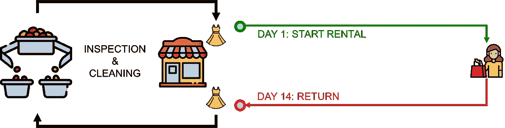
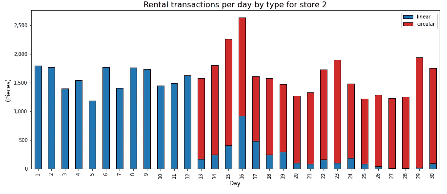

# 模拟时尚零售中的循环经济挑战

> 原文：[`towardsdatascience.com/simulate-the-challenges-of-a-circular-economy-for-fashion-retail-5c7e269f0706?source=collection_archive---------14-----------------------#2024-09-26`](https://towardsdatascience.com/simulate-the-challenges-of-a-circular-economy-for-fashion-retail-5c7e269f0706?source=collection_archive---------14-----------------------#2024-09-26)

## 使用数据分析模拟时尚零售的循环租赁模型，理解门店操作和物流挑战。

[](https://s-saci95.medium.com/?source=post_page---byline--5c7e269f0706--------------------------------)[](https://towardsdatascience.com/?source=post_page---byline--5c7e269f0706--------------------------------) [Samir Saci](https://s-saci95.medium.com/?source=post_page---byline--5c7e269f0706--------------------------------)

·发表于 [Towards Data Science](https://towardsdatascience.com/?source=post_page---byline--5c7e269f0706--------------------------------) ·15 分钟阅读·2024 年 9 月 26 日

--


时尚零售的租赁模型 — （图像来源：作者）

循环经济的概念包括旨在减少废物和提高资源效率的模型。


模拟循环经济 — （图像来源：作者）

一些时尚零售商已经实施了**订阅模型**，让客户支付定期费用来租赁产品，**在特定的时间段内**。

> 你有没有考虑过租赁你的衣物？

在上一篇文章中，我使用数据分析模拟了这个租赁模型，以一个拥有十家门店的时尚零售商为例。



循环租赁模型以减少环境足迹 — （图像来源：作者）

目标是估算**环境表现**，即减少二氧化碳排放和水资源使用。

然而，**物流操作将面临额外的挑战**，需要收集和处理租赁物品，以支持这一过渡。

> 作为一名数据科学家，你能评估实施这一模型的操作挑战吗？

本文将使用**数据分析来评估这些挑战**，并理解哪些指标对于重新设计物流网络至关重要。

目标是帮助可持续发展和物流团队建立一个可靠的商业案例（包括投资回报率和风险评估），以获得高层管理层的批准，从而推动向循环经济的过渡。

```py
Summary
**I. Implement a Circular Model for Fashion Retail**
  1\. **Problem Statement: Sustainability Roadmap of a Fashion Retailer**
  A fashion retailer would like to implement a rental model in 10 stores
  2\. **Introduction of the Rental Model**
  Simulation of the impact of this model on CO2 emission and water usage
  3\. **How do we implement these processes?**
  Use analytics to derive the metrics needed to design logistics solutions
**II. Data Analytics to Monitor a Rental Circular Model**
*Focus on each leg of the distribution network to collect KPIs*
  1\. **Focus on the store operations**
  Manage daily transactions per type (linear, circular)
  2\. **Focus on warehouse operations**
  Impact on the upstream and downstream flows
  3\. **Focus on transportation management**
  Organisation routing for returned items collection
**III. Support the transition to a circular model with data analytics**
  1\. **Business Intelligence for operational monitoring**
  Collect, process and harmonize data from multiple systems
  2\. **Advanced Workforce Planning for Store Operations with Python**
  Optimize the number of staff recruited at stores
  3\. **Return Flow Optimization with Python**
  Allocation of the collection centers for returns
  4\. **Measure Scope 3 Emissions of your Distribution Network**
  Measure the CO2 emissions impact of your collection routes
**IV. Conclusion**
```

# 为时尚零售实现循环模型

## 问题陈述：一家时尚零售商的可持续发展路线图

你是国际**时尚零售集团**供应链部门的**数据科学经理**。

去年，你的首席执行官公开宣布公司承诺支持[联合国可持续发展目标（SDGs）](https://s-saci95.medium.com/what-are-the-sustainable-development-goals-sdgs-988a1eb2b62b)。


面向地球的目标 — （图像由作者提供）

作为这项承诺的一部分，公司旨在减少整个价值链的环境足迹。

> 作为数据科学家，你如何支持这一转型？

你专注于协助可持续发展和物流团队评估和设计解决方案，以实施循环租赁模型。

该项目始于 a 项涉及十家商店的研究，共涉及 400 个独特的物品。


初步研究的范围 — （图像由作者提供）

> 结论是什么？

结果表明，**较短的租赁周期最大化了循环模型的效率**。

然而，本研究**仅关注环境效益**，并未考虑商店和物流团队所面临的运营挑战。

> 对物流预算有何影响？

团队必须证明投资回报率（ROI），并在获得高层管理批准之前估算预算。

因此，**我们将把注意力转向运营方面**，并利用数据分析估算分销网络各个阶段的额外工作量。

> 让我先简要介绍租赁模型。

## 租赁模型介绍

为了减少供应链的环境影响，公司在**10 家商店**进行了循环租赁模型的试验。


模拟的物流参数 — （图像由作者提供）

这些地点将向客户提供**租赁订阅模式**，涵盖**400 个物品的有限范围**。

在实施该服务之前，物流和可持续发展团队**要求支持模拟这些额外流程的处理过程**。

作为输入数据，我们使用了实际的销售交易数据，如下所示。


商店 1 的‘服装 1001’的销售交易 — （图像由作者提供）

模拟涵盖了**十家商店**，持续时间为**365 天**。

我们假设这些“销售交易”是“租赁交易”，意味着顾客去商店**租赁某个特定物品，租期为 n 天**。


14 天租赁过程的示例 — （图像由作者提供）

租赁期结束后，顾客将物品退还至商店。

+   收集这些**物品**从**商店**需要**两天**时间。

+   它们经过**仓库**的**检查和清洁**，持续**一天**。

+   需要**额外一天**的时间才能将清洁后的物品送到商店。

> 我们如何管理租赁物品的流动？

我们应用**先进先出（FIFO）原则**来管理这些流动。

+   在退货和分类后，物品将在仓库中可用

+   第一个下单的商店将通过首先返回的物品进行补货。


FIFO 原则在循环物品中的应用 — （图片来源：作者）

当客户请求特定物品时，我们有两种情况：

+   **循环交易**：如果库存充足，商店将租赁退货的衣物。

+   **线性交易**：如果没有可用的退货物品，商店将租赁新物品。

> 对于特定商店，情况如何？

在下图中，您可以看到每天租赁物品的数量，并且区分了线性（新物品）和循环（退货物品）交易。



商店 2 每日循环物品的百分比 — （图片来源：作者）

如您所见，循环模式在第 13 天开始，当第一批租赁物品被退还（并清洁）后。

> 我们想要估算哪个指标？

重点是**通过不同租期（2 天、7 天、14 天和 28 天）的多个场景来衡量模型的环境表现**。


每种情况的 CO2 排放减少量 — （图片来源：作者）

对于每种情况，我们计算循环交易的百分比（重复使用的物品）以及对 CO2 排放减少的影响。

> *可持续发展团队：通过短期租赁，我们可以实现最大的碳足迹减少。*

欲了解更多详细信息，请阅读这篇文章。

[](/data-science-for-sustainability-simulate-a-circular-economy-b6a13d4b0451?source=post_page-----5c7e269f0706--------------------------------) ## 可持续发展数据科学 — 模拟循环经济

### 使用数据科学模拟循环模式对快速时尚的 CO2 排放和水使用的影响…

towardsdatascience.com

**从可持续性的角度来看，这是一个非常有洞察力的研究。**

然而，它没有涵盖对分销链的影响。

> 操作上的挑战是什么？

作为供应链专业人员，我想了解如何将此操作纳入当前的分销模型中。

+   实施短期租赁意味着高频率的物品轮换。

+   我们能否使用同一车队来组织收集并配送到商店？

+   仓库在分类和清洁方面的额外工作量如何？

> 让我们使用数据分析来回答这些问题。

## 我们如何实施这些流程？

作为前**供应链解决方案设计师，** 我的工作方法从收集设计这些逆向流动的运输和仓储解决方案所需的指标开始。


实施此解决方案前需要回答的问题示例——（图片由作者提供）

这些解决方案应覆盖

+   **使用电动卡车收集店铺退货物品。问题：** 每天需要多少辆卡车来收集物品？

+   **接收并处理仓库中的物品。**

    **问题：** 需要多少操作员来接收并处理仓库中的物品？

+   **将清洁（退还的）物品送回店铺。**

    **问题：** 需要多少辆卡车来处理这些配送？

在接下来的部分中，**我们将涵盖评估配送网络额外工作量所需的主要指标**。

# 数据分析用于监控租赁循环模式的物流网络

现在，让我们从物流角度探索仿真模型，重点关注货物流动。

我们假设租赁期为**七天。**


循环经济的供应链网络——（图片由作者提供）

首先，我们可以监控门店的租赁交易以及退货物品的影响。

> 店铺发生了什么？

## 关注店铺运营：按类型的每日交易量

循环模式从第 1 天开始

+   租出的 100%物品是全新的；

+   这些物品将在第 8 天退还，以启动收集、处理和配送的过程，直至第 13 天结束；


租赁物品的循环处理——（图片由作者提供）

从第 13 天开始，店铺将收到退货物品，并准备开始第二个租赁周期。

> 店铺团队的影响是什么？
> 
> ***💡 指标 1：*** *每日退货物品数量*


每日售出和退还的物品数量——（图片由作者提供）

从第 8 天开始，店铺团队将需要管理退货物品

+   客户将在专门的区域排队进行租赁交易

+   销售代理将接收这些物品

**他们将遵循这一标准流程**

1.  他们应当**检查退货物品是否有损坏**

1.  **在系统中记录退货**并提供收据给客户

1.  将物品转移到**暂存区**等待收集

> 我们能否评估额外的工作量？

我们进行粗略估算，假设整个过程**平均需要 6 分钟**，并且每次退货交易有**1.25 件物品**。


管理店铺 4 退货的 FTE 数量——（图片由作者提供）

从第一天的回收日（第 8 天）开始，我们需要**店铺 4 平均需要 5.13 个 FTE**。

> 店铺中的 FTE 成本是多少？

这些信息对需要管理销售地点损益的门店运营团队至关重要。

> ***💡 指标 2：*** *租赁物品的重复使用比例*


启动循环时，每种类型的每日交易 — （作者提供的图片）

**从第 13 天开始**，圆形租赁的比例如预期般激增。

循环从租赁物品的库存开始，这些物品可用于避免使用新物品。


循环启动后的每日交易 — （作者提供的图片）

从第二个月开始，**不到 12%的新物品** *(线性交易)* 被用于**租赁交易**。

## 专注于仓库运营：上下游流动

> 从物流角度来看，这意味着什么？

+   **来自工厂的新物品库存应该减少，这将减少在** **仓库**的存储空间需求。

+   **减少来自工厂的补货量：**分配给上游流程的卡车减少。


2 个上游流程（线性：来自工厂 / 圆形：来自门店）—（作者提供的图片）

不幸的是，逆向流程中的额外工作量可能不会通过上游流程中的减少而得到补偿。

> 那么，退货物品的收集量如何呢？
> 
> ***💡 指标 3：*** *每天收集的储物箱数量*

收集的物品存放在**塑料储物箱中（每个储物箱 10 个）**，尺寸固定。


每日退还的储物箱数量 — （作者提供的图片）

我们平均每天收集 56 个储物箱，第 25 天的最高峰为**105 个储物箱**。

🏪 这对门店运营有什么影响？

+   **我们需要为最多 210 个储物箱分配存储位置。**

    💡 我们是否有额外的空间来存放这些储物箱？

+   **这些 56 个储物箱的管理工作量是有关系的。** 💡我们是否有足够的工作人员来管理这部分内部物流？

既然我们已经将物品放入储物箱中，接下来让我们专注于收集过程。


收集过程 — （作者提供的图片）

> 我们手头有哪些参数可以用来设计收集路线？

## 专注于运输管理。

我们需要分析每个门店每天需要收集的量，以规划收集路线。

运输团队将使用最大容量为托盘的卡车，这些卡车可以从不同的门店收集。

> ***💡 指标 4：*** *每家门店装载的托盘数量*

储物箱被装载在托盘上，每个托盘的最大容量为**25 个储物箱**。

门店分布在三个区域：**A 区**有四家门店，**B 区和 C 区**每区有三家门店。


A 区每家门店退还的托盘数量 — （作者提供的图片）

每个区域的门店可以共享同一辆卡车来收集退货物品的托盘。

> 让我们把这些体积转换为整车装载量。
> 
> ***💡 指标 5：*** *每个门店所需的满载卡车数量*

运输团队分配了每辆车可承载 14 个托盘的卡车。

> 我们每个门店需要多少辆卡车？


AREA-B 的每天卡车数量 — （图片来源：作者）

如你所见，单凭收集 B 区的单一门店，无法填满一辆卡车。

+   运输规划员必须安排多个收集点的路线，以最大化卡车的使用。

+   基于过去的租赁交易，它们可以预测退货量，以制定最优路线。


五个指标的总结 — （图片来源：作者）

这五个指标帮助供应链工程师预见未来的挑战并估算额外成本。

> 我们能否利用数据分析来限制对性能和成本效率的影响？

# 利用数据分析支持向循环经济模式的转型。

假设高层管理人员已经验证了这个提案。

他们同意实施为期一年的试点阶段，范围与研究相同（10 家门店，400 个商品）。

> 作为一名数据分析专家，你如何帮助运营和可持续发展团队克服之前列出的挑战？

我们将首先集中精力实施描述性分析解决方案，为门店、仓库和运输团队提供可视化。

## 用于运营监控的商业智能

多个系统用于管理流程和库存，或更新租赁物品在价值链中的状态。


时尚商品的价值链 — （图片来源：作者）

这些系统生成的交易数据可以用来监控流程并收集之前提到的指标。

+   运输管理系统（TMS）将追踪门店交付和退货物品的提货。

+   仓库管理系统可以提供来自工厂的进货流、库存以及门店交付或退货的可视化。

+   销售点（POS）和企业资源规划（ERP）系统将存储销售交易数据及线性和循环商品的库存。

作为一名分析专家，你的角色是实施自动化管道，构建一个可信赖的统一数据源。


数据统一示例，用于追踪从创建到交付的订单 — （图片来源：作者）

如果你需要类似解决方案的示例，请查看这篇文章

[](/what-is-business-intelligence-bf1de730319c?source=post_page-----5c7e269f0706--------------------------------) ## 什么是商业智能？

### 探索应用于供应链优化的数据驱动决策工具。

towardsdatascience.com

这些清洗后的数据集可以用于报告目的，并作为更先进的预测分析解决方案的来源。

## 使用 Python 进行店铺运营的高级员工规划

正如**指标 1**和**指标 4**所示，店铺运营面临的第一个挑战是由于退货产生的额外工作负担。


每日退货量 — （作者提供的图片）

由于您实施的分析解决方案，您可以查看过去每一天的工作负载。

> 我们需要招募多少额外的员工来吸收工作负荷？

您希望在遵守某些约束条件的情况下，最小化招募员工的数量以节省成本。

+   退货需要及时处理；

+   尊重当地关于最大工作时间的规定；

+   提供最低工作时间以吸引候选人；


工作时间约束示例 — （作者提供的图片）

幸运的是，我曾通过使用 Python 的线性规划解决过类似的仓库进货操作问题。


进货操作的工作负载分布 — （作者提供的图片）

这个想法是使用 Python 库 PuLP 来构建您的模型，目标函数是（最小化员工数），并设置不同的约束条件。

在输入算法时提供销量预测后，您可以自动生成每天需要招募的最优员工数量。


进货示例的解决方案示例 — （作者提供的图片）

欲了解更多详情，请查看本文中详细的示例。

[](/optimize-workforce-planning-using-linear-programming-with-python-47a0b5f89a6f?source=post_page-----5c7e269f0706--------------------------------) ## 使用线性规划与 Python 优化劳动力规划

### 您需要雇佣的临时工最少数量是多少，以便在确保…的同时应对每周的工作负荷？

towardsdatascience.com

然而，我们仍然需要处理运输操作以收集这些货物。

我们必须实施一个最优解决方案，因为这将代表最高的成本和环境影响。

## 使用 Python 进行退货流量优化

物流部门团队请求您在有效管理店铺取货时提供支持。


店铺和分拣中心网络 — （作者提供的图片）

考虑到分拣中心的位置和容量，他们希望有一个自动化工具来为每个商店分配合适的分拣中心。

+   最小化收集的运输成本和排放

+   尊重交货时间和分拣能力


供应规划问题 — （图片由作者提供）

我提出一个类似的问题来找到合适的解决方法。

**供应规划问题**：多个工厂为配送中心补充货物，配送中心再将货物配送到商店。我们可以使用线性规划来解决这个问题

+   管理从工厂到仓库的上游流动

+   从正确的配送中心向每个商店配送

> 如何调整分拣中心分配问题的解决方案？

这个解决方案可以在**稍作调整后**使用

1.  预测从分拣中心到仓库的货物量

1.  定义每个分拣中心的容量

1.  计算每个商店到所有配送中心的距离

如果你需要示例，随时可以查看这篇文章

[](/supply-planning-using-linear-programming-with-python-bff2401bf270?source=post_page-----5c7e269f0706--------------------------------) ## 使用 Python 进行线性规划的供应规划

### 你需要将库存分配到哪里，以满足客户需求并降低运输成本？

towardsdatascience.com

这可以显著降低你的成本，但可能会带来额外的 CO2 排放。

> 我们能否衡量由于从商店收集所产生的额外 CO2 排放？

## 测量你配送网络的范围 3 排放

原始目标是减少你公司对环境的影响。

因此，最坏的情况是由于逆向流动管理不当，CO2 排放会大幅增加。

我的第一个可持续发展项目是测量一家快速消费品公司配送网络的范围 3 排放。

> 如何用 Python 衡量范围 3CO2 排放？

我们可以遵循[法国环境署 Ademe](https://www.ademe.fr/en/frontpage/)的协议。

使用排放因子估算运输 CO2 排放的公式是：


使用排放因子的公式 — （图片由作者提供）

+   E_CO2：二氧化碳当量的排放量（kgCO2eq）

+   W_goods：货物的重量（吨）

+   D：从仓库到最终目的地的距离（公里）

+   F_mode：每种运输方式的排放因子（kgCO2eq/t.km）

希望这些参数能够通过商业智能解决方案，从系统的主数据和交易数据中收集。


CO2 排放计算数据处理示例 — （图片来源：作者）

目标是通过高级可视化监控逆向物流操作的排放情况。


使用 PowerBI 生成的可视化示例 — （图片来源：作者）

如需更多信息，请查看这篇文章。

[](/supply-chain-sustainability-reporting-with-python-161c1f63f267?source=post_page-----5c7e269f0706--------------------------------) ## 使用 Python 进行供应链可持续性报告

### 使用 Python 构建一个专注于您分销网络 CO2 排放的可持续性报告。

towardsdatascience.com

现在，您已经拥有了一套解决方案，可以开始支持物流操作和可持续发展部门实施这一租赁模型。

# 结论

这一简单的方法可以应用于任何零售商的业务案例，用于过渡到循环经济。

这可以从模拟循环交易开始，

1.  使用特定时期的实际销售交易；

1.  实施考虑租赁期限和逆向流动过程的库存管理规则；

1.  估算减少足迹的影响以及物品再利用的百分比；


改进模型的整体模拟工作流程 — （图片来源：作者）

然后，通过添加特定的指标来改进模型，以估算商店操作和运输的额外工作量。

1.  从供应链解决方案设计师的角度出发，使用体积和物流比例来设计流程；

1.  利用洞察力做出决策，以确保高效顺畅的运营

本文中介绍的方法**提供了数据**，这是我（*作为一家物流公司的供应链解决方案设计师*）会要求零售商在设计此类解决方案时提供的。

> 接下来做什么？

实施循环模型并不是减少供应链足迹的唯一举措。

您可以通过更高效地生产和交付产品来改进线性模型。


供应链可持续性分析 — （图片来源：作者）

如果您需要更多实际操作案例的灵感，请查看这篇文章。

[](/data-analytics-for-supply-chain-sustainability-c6066de41609?source=post_page-----5c7e269f0706--------------------------------) ## 供应链可持续性数据分析

### 发现数据分析如何通过实际案例和实用技巧提高供应链的可持续性。

[towardsdatascience.com

# 关于我

让我们在[LinkedIn](https://www.linkedin.com/in/samir-saci)和[Twitter](https://x.com/Samir_Saci_)上建立联系。我是一名供应链工程师，利用数据分析改善物流运营并降低成本。

如果你需要关于供应链转型的咨询或建议，请通过[Logigreen Consulting](https://www.logi-green.com/)与我联系。

如果你对数据分析和供应链感兴趣，请访问我的网站。

[](https://samirsaci.com/?source=post_page-----5c7e269f0706--------------------------------) [## Samir Saci | 数据科学与生产力]

### 一个专注于数据科学、个人生产力、自动化、运筹学和可持续发展的技术博客…

[samirsaci.com](https://samirsaci.com/?source=post_page-----5c7e269f0706--------------------------------)
