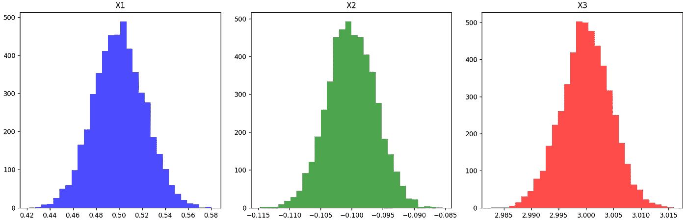

# 模拟数据，真实学习：第一部分

> 原文：[`towardsdatascience.com/simulated-data-real-learnings-part-1-dccb52667e32?source=collection_archive---------4-----------------------#2024-03-12`](https://towardsdatascience.com/simulated-data-real-learnings-part-1-dccb52667e32?source=collection_archive---------4-----------------------#2024-03-12)

## 使用模拟测试机器学习方法

 [Jarom Hulet](https://medium.com/@jarom.hulet?source=post_page---byline--dccb52667e32--------------------------------)

·发表于[Towards Data Science](https://towardsdatascience.com/?source=post_page---byline--dccb52667e32--------------------------------) ·16 分钟阅读·2024 年 3 月 12 日

--

模型估计系数在模拟数据上的分布——作者提供的图片

模拟是数据科学工具箱中的一项强大工具。这是一个多部分系列的第一部分，讨论模拟在数据科学和机器学习中的各种应用方式。在本文中，我们将介绍如何使用模拟来测试机器学习方法。

具体来说，我们将介绍模拟可以在以下三种方式中使用：

1.  测试机器学习方法

1.  比较不同机器学习模型的性能

1.  在各种情况下评估模型行为

在深入探讨数据模拟的具体应用之前，我们先来定义一下什么是模拟。

**什么是数据模拟？**

数据模拟的定义非常简单——它是创建虚构数据，模拟现实世界数据的特性。

我们什么时候需要模拟数据？

+   当我们需要得到那些在现实世界中无法观察到的‘答案’时——也就是说，使用现实世界的数据，我们只能推断 X 与 y 之间的关系；但通过模拟数据，我们可以*创建*X 与 y 之间的关系——有了这个‘答案’，我们就可以测试我们的……
