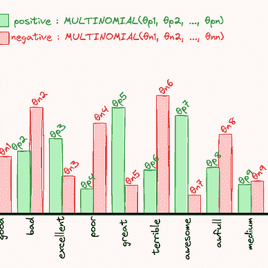

# Sklearn 教程：模块 5

> 原文：[`towardsdatascience.com/sklean-tutorial-module-5-b30e08a4c746?source=collection_archive---------16-----------------------#2024-01-10`](https://towardsdatascience.com/sklean-tutorial-module-5-b30e08a4c746?source=collection_archive---------16-----------------------#2024-01-10)

## 决策树其实很简单

 [Yoann Mocquin](https://mocquin.medium.com/?source=post_page---byline--b30e08a4c746--------------------------------)

·发表于[Towards Data Science](https://towardsdatascience.com/?source=post_page---byline--b30e08a4c746--------------------------------) ·阅读时间：14 分钟·2024 年 1 月 10 日

--

这是我 scikit-learn 教程系列中的第五篇文章。如果你还没读过前几篇，我强烈推荐你阅读前四篇；这样跟着教程走会容易得多。

[Yoann Mocquin](https://mocquin.medium.com/?source=post_page-----b30e08a4c746--------------------------------)

## Sklearn 教程

[查看列表](https://mocquin.medium.com/list/sklearn-tutorial-2e46a0e06b39?source=post_page-----b30e08a4c746--------------------------------)9 个故事

本模块介绍了**决策树**。正如我们将看到的，决策树是一种监督学习算法，它通过基于阈值/特征对递归地划分数据，创建一个像树一样的嵌套结构。树的叶子代表模型的预测结果。

***个人免责声明***：当我第一次开始学习 scikit-learn 教程时，我从未接触过决策树。最多我曾在某些地方听说过这个术语，但完全不知道它意味着什么。所以我对决策树感到好奇，并且担心它比我已知的其他模型，如线性回归模型和支持向量机，更复杂、更难理解。***但结果证明，决策树其实简单得多，易于理解！而且它们非常强大！***

图片来源：[胡晨](https://unsplash.com/@huchenme?utm_source=medium&utm_medium=referral)于[Unsplash](https://unsplash.com/?utm_source=medium&utm_medium=referral)
