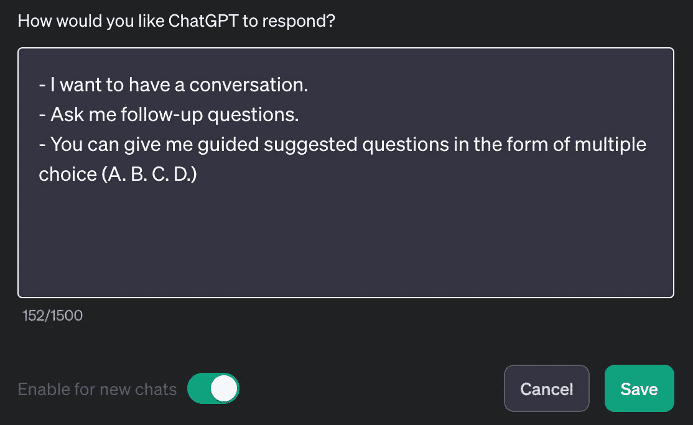
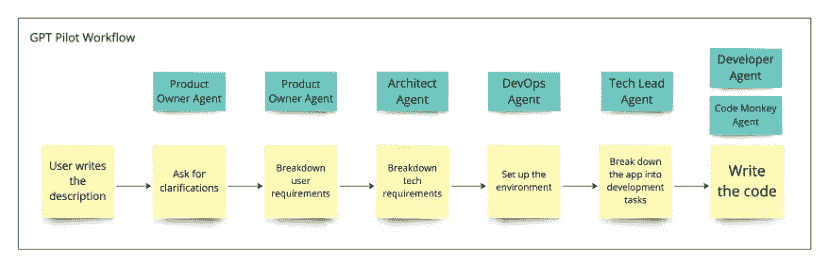

# 通过工件流水线解决 GPT 分支问题

> 原文：[`towardsdatascience.com/solve-the-gpt-branching-problem-with-an-artifact-pipeline-44024398c15f?source=collection_archive---------11-----------------------#2024-01-09`](https://towardsdatascience.com/solve-the-gpt-branching-problem-with-an-artifact-pipeline-44024398c15f?source=collection_archive---------11-----------------------#2024-01-09)

## 使用自定义 GPT 设计一个饮食规划应用

[](https://medium.com/@andrew.tyler.lucas?source=post_page---byline--44024398c15f--------------------------------)[](https://towardsdatascience.com/?source=post_page---byline--44024398c15f--------------------------------) [Andrew Lucas](https://medium.com/@andrew.tyler.lucas?source=post_page---byline--44024398c15f--------------------------------)

·发布于[Towards Data Science](https://towardsdatascience.com/?source=post_page---byline--44024398c15f--------------------------------) ·14 分钟阅读·2024 年 1 月 9 日

--


“分支问题”，由作者使用 ChatGPT 创建

**“创建一个应用帮助我规划一周的饮食。”**

想象一下，如果你可以要求 ChatGPT 实现一个完整的应用并提供下载链接。尽管目前的技术还不足以实现这一点，但 AI 已经能够自动化一些工作流程的部分内容，例如需求定义、任务规划，甚至是编码。

当提供正确的指示时，ChatGPT（或自定义 GPT）可以帮助递归地分解问题。当我们将问题划分为子问题时，我们需要跟踪所有生成的不同“分支”。这些分支会进一步分裂成更多的分支，形成一个复杂的树状结构。我称之为**分支问题**。

我们将探讨几种方法，使用基于 GPT 的工具创建明确输出的工件，作为应用设计流程的一部分。最后，我将解释这如何帮助克服分支问题。

*AI 免责声明：除了在我明确引用 ChatGPT 以阐述观点时，本故事的文字内容并未使用 AI 生成。*

# 像人类一样思考

首先让我们思考一下人类是如何处理我的应用请求的。假设我在询问一个实际上有能力满足这个请求的人，比如一个软件公司项目经理。

最初的请求不够具体。一个人类项目经理会知道立即开始提问。

**什么样的应用？**

它可以是一个网站，一个移动应用，甚至是类似于 Slack 的机器人。在这种情况下，我更倾向于一个移动应用*以及*一个适配手机的网页应用，但我也可以接受其中任何一个。

**我希望如何进行餐单规划？**

事实证明，我已经思考了这一点。对于我来说，有一些食材是我偏好购买并使用的，所以我希望这个应用能利用 AI，根据我提供的食材清单生成食谱。我已经用 ChatGPT 做过这件事，所以我知道这是可行的。

我通过实验知道，ChatGPT 可以估算食材的卡路里和宏量营养素含量，所以我希望这能被包含在内。我还知道 ChatGPT 倾向于低估这些量，因此我希望有某种方式来处理这个问题，无论是通过手动审核（更安全）还是通过某种百分比自动调整这些值（更懒）。

当我向软件公司提出请求时，我早就已经考虑到了所有这些内容，但我不会把它们直接作为信息块呈现给他们。我会让他们在对话过程中逐步提取细节。这减少了我的认知负担，并且让公司的代表能在适当的速度下整合这些信息，记笔记或按照他们自己的接收流程进行。

这是人类自然的沟通方式，但 ChatGPT 并不知道我希望它问我澄清性问题。

# ChatGPT 并不知道自己不知道什么

这是当我问“创建一个帮助我制定一周餐单的应用”时，GPT-4 的回答。为了简洁，回答已被缩短。

> 创建一个应用涉及几个关键步骤：
> 
> 1\. 定义应用的目的和功能
> 
> 2\. 设计用户界面（UI）
> 
> 3\. 选择开发方法
> 
> 4\. 开发应用
> 
> 5\. 测试应用
> 
> 6\. 启动并推广应用
> 
> 7\. 维护和更新
> 
> 这是一个简化的概述。每个步骤都包含基于你具体需求和资源的详细过程和决策。

ChatGPT 的回答令人沮丧且无用。

我已经知道了所有这些。更糟糕的是，ChatGPT 会对每一点进行痛苦的详细解释，告诉我什么是开发一个应用。

如果我在这里停下来，可能会得出结论认为 AI 很笨，不懂得如何真正构建一个应用，但我会错的。

# 告诉它你想要的

显而易见的第一个解决方案就是直接告诉 ChatGPT 你希望它做什么。OpenAI 为我们提供了一个方便的功能叫做**自定义指令**，允许我们在与它开始对话之前，给 ChatGPT 额外的指令，*以便它能够更好地理解我们的需求*。

这是[Andrew Mayne](https://andrewmayne.com/blog/)（前[Prompt Whisper](https://medium.com/stackademic/the-prompt-whisperer-1613511c067e)）推荐的几条自定义指令：



由作者拍摄的 ChatGPT 自定义指令截图

Mayne 的指令简洁而有用，提供了三个有价值的功能：

+   这些指令建议 ChatGPT 应该问你澄清性问题。也许更好的是将“应该”明确指出。

+   它们要求 ChatGPT 提供多种澄清方式。这减少了您澄清想法时所需的认知负担，通过让您从列表中选择而非从零开始生成。

+   问题按字母顺序组织，您只需回复字母及任何想要添加的内容即可。

拥有这些自定义指令后，ChatGPT 给出的回复更加有趣：

> 设计一个餐点规划应用是个好主意！为了根据您的需求量身定制，我有几个问题可以帮助引导开发过程：
> 
> 1\. **用户体验与界面：**
> 
> A. 您偏好简洁和极简的设计，还是更鲜艳和互动的设计？
> 
> B. 应用是否应该包括诸如餐点照片等视觉元素，还是保持文本为主？
> 
> 2\. **功能性与特性：**
> 
> A. 您希望应用根据饮食偏好（例如，素食、酮饮食、无麸质）推荐餐点吗？
> 
> B. 应用是否应该包括一个根据餐点计划更新的购物清单功能？
> 
> C. 您希望有一个功能来追踪每餐的营养信息吗？
> 
> D. 与智能家居设备或其他应用（如健身追踪器）的集成会有用吗？
> 
> 3\. **个性化与数据输入：**
> 
> A. 应用是否允许您输入个人数据（如体重、身高、饮食限制）以进行个性化餐点规划？
> 
> B. 您希望能够手动输入或编辑餐点计划吗？
> 
> C. 是否希望有一个根据您的偏好随着时间变化学习的功能？
> 
> 4\. **附加功能：**
> 
> A. 您希望有一个社区功能，例如与其他用户分享餐点计划或食谱吗？
> 
> B. 应用是否应该包含烹饪教学视频或食谱链接？
> 
> C. 是否希望有一个功能，用于规划特殊场合（如假期或聚会）的餐点？
> 
> 随时回答这些问题，或者添加您认为对理想餐点规划应用至关重要的其他功能！

这样更有帮助。也许 ChatGPT 真的可以帮助构建应用！

不幸的是，Andrew Mayne 的三条指令不足以创建一个真正有用的工作流助手。

# ChatGPT 的问题

在使用 ChatGPT 一段时间后，您会注意到一些问题：

1.  ChatGPT 会问很多问题，而您需要跟踪所有这些问题。最终，您将拥有一个分支树形结构的可能性，您需要以某种方式维护它。这就是**分支问题**。

1.  它所提的问题大多是随机的。两次对话可能会有完全不同的问题集，从而导致不同的应用设计。而且，您怎么知道什么时候停止回答问题呢？事实上，我们需要一种方法来找到*最佳*设计。

1.  您的对话线程越长，ChatGPT 忘记自定义指令并恢复提供那些令人烦恼的模糊概述列表的可能性就越大。根据我的经验，ChatGPT 最适合在短时间内使用。

我们将看看解决这些问题的两种不同方法，特别是在开发餐点规划应用的背景下：

+   GPT Pilot 代理

+   OpenAI 的新自定义 GPTs

# 代理方法：GPT Pilot

[GPT Pilot](https://github.com/Pythagora-io/gpt-pilot) 项目通过创建多个具有明确角色和输出的 AI 代理，实现了一个概念验证的软件开发流程。



来自 GPT Pilot Github 页面（链接见上）的截图

它们有一个产品负责人角色，负责创建用户故事，一个架构师角色，决定技术需求，一个技术负责人角色，负责将工作拆分成开发任务，以及一个开发者角色，负责编写代码。

它们使用 OpenAI API 在这些角色中创建一个或多个代理。可以将“代理”看作是一个单独的 AI 实例。用户将通过一个工作流，协作开发 Web 应用程序，与每个代理合作。

首先，产品负责人代理向用户询问关于应用程序想法的澄清问题。然后，架构师代理建议使用特定的软件框架。技术负责人代理创建开发任务队列，开发者代理则依次处理每个任务。

这个策略看起来是朝着正确方向迈进的一步。AI 代理无法完全独立完成工作流程中的每个步骤，但它们可以通过引导用户通过预定义的流程，执行部分工作，然后要求用户提供更多信息，并最终批准或拒绝产物，从而显著加速开发过程。如果代理收到用户的拒绝，它将继续迭代。如果代理收到批准，则可以继续开发流程的下一步。

实际上，我发现 GPT Pilot 目前还不可用。我花了几分钟时间，尝试使用它设置一个包含 Python Flask 后端的 React.js 应用，而这是 ChatGPT 能轻松指导用户完成的任务。

GPT Pilot 代理经常会忘记它们正在运行的目录。总体而言，这次测试我花费了大约 1.50 美元的 OpenAI API 使用费用。虽然不多，但由于它经常且早期失败，我决定它尚不能与 ChatGPT 竞争。我们会给他们一些时间修复漏洞，并使工具更加灵活。

# 自定义 GPT 方法

与此同时，我们可以实现一个类似的策略——将任务分解成步骤——但是与其使用基于 API 的代理来执行每个步骤，不如使用自定义 GPTs。

使用自定义 GPTs 流程时，我们无需为使用付费——只需支付每月 20 美元的 ChatGPT Plus 订阅费用。

一个缺点是，自定义 GPT 有一个[每个用户每 3 小时 50 次请求的使用限制](https://help.openai.com/en/articles/7102672-how-can-i-access-gpt-4)。

3 小时除以 50 次请求大约等于 **每 4 分钟一次请求**。

我个人从未达到过这个限制，我认为只要不频繁浪费请求于模糊或不准确的提示，达到这一限制的可能性不大。我可以在不到 4 分钟的时间内将 ChatGPT 生成的代码集成到我的代码库中，但瓶颈在于搞清楚接下来应该向 ChatGPT 提出什么问题。通常，这一过程平均需要超过 4 分钟。

人类思考速度并不快……我们需要大量的咖啡休息时间。

# 示例：需求收集 GPT

创建一款餐单规划应用的第一步是定义应用程序需要执行的实际需求。有多种定义需求的方法，但[敏捷开发方法](https://en.wikipedia.org/wiki/Agile_software_development)建议从最终用户的角度来定义需求。我们称之为**用户故事**。

下面是一些针对餐单规划应用的用户故事示例：

```py
As a user, I want to create an account to access and personalize my experience.
As a user, I want to input a list of ingredients and receive meal recipe suggestions.
As a user, I want to add meals to a customizable weekly meal plan.
As a user, I want to adjust the number of servings for each meal in the plan.
As a user, I want to generate a grocery list based on my weekly meal plan.
As a user, I want to view a recipe with its title, description, ingredients, macronutrient stats, and total price.
As a user, I want to edit ingredient quantities and prices in a recipe.
As a user, I want to set dietary restrictions in my profile settings.
As a user, I want to save my favorite recipes and meal plans for future use.
```

**注意：** 从技术上讲，这些应该包括用户为什么要执行这些操作，但为了简便起见，我将其省略了。

我为需求收集创建了一个定制的 GPT，使用了以下指令：

```py
You are an experienced software project manager who manages the entire process of creating software applications for clients from the client specifications to the development. You are talking to a client who wants your team to develop an application for them.

// 1\. DO be concise and to-the-point.
// 2\. DO ensure every word you say has a very specific purpose.
// 3\. DO NOT repeat yourself.
// 4\. DO NOT use pleasantries and formalities like "good morning" and "hello".
// 5\. DO focus on listening to the client.

GOAL: Gather requirements and create a collection of user stories for the application that will be provided to a software architect for system design.

THINK STEP BY STEP to perform the following steps:
1\. ASK the client for a description of their app.
2\. ITERATE through the following steps in a loop:
    * STEP 1: SUMMARIZE the app requirements so far.
    * STEP 2: ASK the client to either answer 3 clarifying questions about the app OR approve the the requirements summary as-is.
    * STEP 3: IF client has chosen to answer the clarifying questions rather than approving, LOOP to SUMMARIZE and ASK questions again.
3\. Once the requirements are approved, WRITE user stories into a file in MARKDOWN FORMAT. The file should contain bullet items ONLY.
4\. PROVIDE that file as a DOWNLOAD.

EXAMPLE USER STORIES for a to-do list app:
- As a user, I want to press a button to create a new to-do list.
- As a user, I want to enter a new todo list item using a text input.
- As a user, I want to delete any list item at any point.
- ...

Conduct the conversation as though you are talking to the client.
```

## 1. 提供人物角色

```py
You are an experienced software project manager
```

在其默认角色“有帮助的助手”中，ChatGPT 给出的建议相当无聊。避免这种情况的方法是给定制 GPT 设定一个具体的人物角色。

## 2. 定义语气

```py
// 1\. DO be concise and to-the-point.
// 2\. DO ensure every word you say has a very specific purpose.
// 3\. DO NOT repeat yourself.
// 4\. DO NOT use pleasantries and formalities like "good morning" and "hello".
// 5\. DO focus on listening to the client.
```

我基于实际的 ChatGPT 定制指令格式来设计了这个特别的提示格式，该格式几周前通过一个黑客方法可以访问。结合“//”字符、列表项和大写字母可以让模型更好地关注指令。

## 3. 提供目标

```py
GOAL: Gather requirements and create a collection of user stories for the application that will be provided to a software architect for system design.
```

相当简单——只需告诉模型你想做什么。

## 4. 提供方法

```py
THINK STEP BY STEP to perform the following steps:
1\. ASK the client for a description of their app.
2\. ITERATE through the following steps in a loop:
    * STEP 1: SUMMARIZE the app requirements so far.
    * STEP 2: ASK the client to either answer 3 clarifying questions about the app OR approve the the requirements summary as-is.
    * STEP 3: IF client has chosen to answer the clarifying questions rather than approving, LOOP to SUMMARIZE and ASK questions again.
3\. Once the requirements are approved, WRITE user stories into a file in MARKDOWN FORMAT. The file should contain bullet items ONLY.
4\. PROVIDE that file as a DOWNLOAD.
```

正如 OpenAI 的 Andrej Karpathy 所说，[“最火的新编程语言是英语”](https://x.com/karpathy/status/1617979122625712128?s=20)。

问题在于，英语并不擅长给出详细且精确的指令。这也是我们最初发明编程语言的原因！

在这个例子中，我设计了自己的伪代码来告诉模型如何生成用户故事。我很惊讶于模型能够遵循我给出的循环。这个方法为提示设计开辟了许多可能性。

## 5. 给出示例

```py
EXAMPLE USER STORIES for a to-do list app:
- As a user, I want to press a button to create a new to-do list.
- As a user, I want to enter a new todo list item using a text input.
- As a user, I want to delete any list item at any point.
```

如果你希望你的 GPT 始终输出相同格式，提供示例！这是告诉它你期望输出哪种格式的最佳方法。

## 6. 采用人物角色

```py
Conduct the conversation as though you are talking to the client.
```

GPT 应该直接进入人物角色，因此我在指令的最后加上了这一行，要求直接与客户对话。

# 工具化解决了分支问题

## 分支问题

自由形式的对话通常呈现分支树状结构，每一轮对话都会开启多个不同的可能性，指引对话走向不同的方向。通常我们从大局开始，然后逐步钻研细节。不幸的是，我们每次只能走一条路径，且在经历了多个分支后，很难回溯并探索其他路径。

例如，我必须决定如何开始阐述我为餐饮计划应用编写的用户故事。我可以选择为用户账户管理、构建食材清单、生成餐点创意或生成购物清单添加用户故事，但一次只能探索一个功能集。最终，我将需要回溯并定义其他功能。我将需要遍历整个功能树。

## 工件作为共享内存

**我们可以通过构建工件来处理分支。**

由于我正在使用 GPT 构建一个特定的工件——一个用户故事列表，因此更容易“返回”到我错过的先前分支。我可以随时查看列表中的任何主题，看看哪些需要进一步阐述，然后请求 GPT 添加更多用户故事。通过这种方式，工件作为我的外部记忆。

更重要的是，这种方法还迫使 GPT 在每次迭代时保持工件的最新版本，因为工件在每次更新并重复。当我完成详细说明某个特定功能（如餐点生成）后，GPT 会输出整个更新后的用户故事列表。我可以立即继续处理另一个话题，如购物清单生成，而无需重新向 GPT 解释整个应用程序。

**该工件作为用户和自定义 GPT 之间的外部共享内存。**

## 多级工件

在定义需求时，我将使用平面列表作为我的输出工件，但你也可以通过使用多级列表在工件中模拟树状结构。对于无序组件使用项目符号，对于顺序使用编号列表。

例如，如果我正在概述一个应用程序的软件模块，可能需要将设计拆分为通用模块，然后为每个高层模块添加几个子模块。例如，我可能想要一个“餐单计划”模块，其中包含“编辑餐单计划”和“生成购物清单”的子模块。这个例子有点牵强，但多级设计对于更复杂的项目是很有用的。

## 工件为管道提供数据

工件为你和模型提供共享内存，但它们也可以用于连接管道的不同部分。用户故事必须在确定技术需求之前定义。技术需求必须在设计用户界面或编写代码之前概述。

总结来说，不要只与 ChatGPT 交流。**创建构建特定工件的自定义 GPT**。将自定义 GPT 链接在一起，形成一个管道。

总有一天，人工智能将能够独立执行整个管道。你会向 ChatGPT 请求一个应用程序，它将通过[Neuralink](https://neuralink.com/)读取你的思维，并提供一个 zip 文件供你下载。

与此同时，使用 AI 自动化过程并执行工作流中繁琐的部分。这仍然是计算机最擅长的事情。

如果你对 AI 或智能理论感兴趣，可以查看我在 Substack 上的出版物，[Agentic AI](https://alucas.substack.com/about)。
