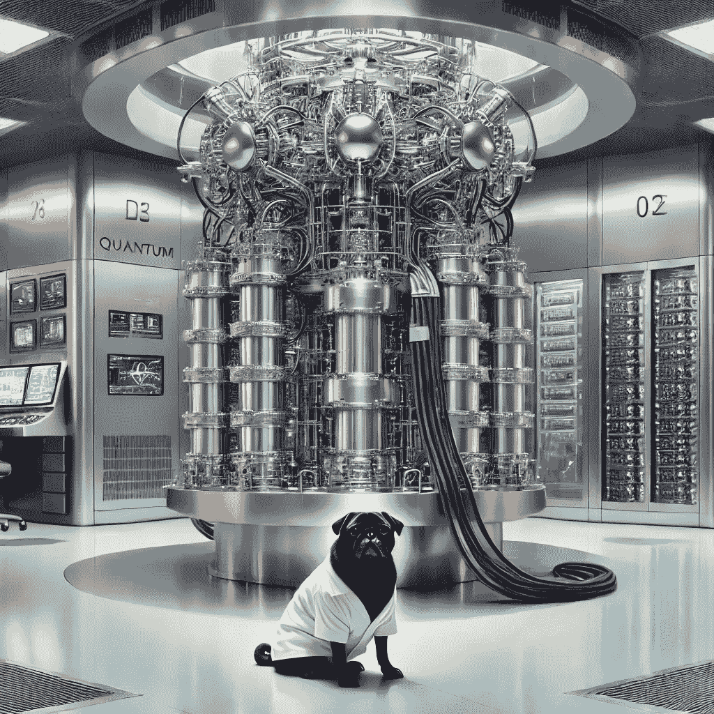

# 用量子退火解决受限项目调度问题

> 原文：[`towardsdatascience.com/solving-a-constrained-project-scheduling-problem-with-quantum-annealing-d0640e657a3b?source=collection_archive---------10-----------------------#2024-08-20`](https://towardsdatascience.com/solving-a-constrained-project-scheduling-problem-with-quantum-annealing-d0640e657a3b?source=collection_archive---------10-----------------------#2024-08-20)

## 用 D-Wave 的混合受限二次模型（CQM）解决资源受限项目调度问题（RCPSP）

 [Luis Fernando PÉREZ ARMAS 博士](https://medium.com/@luisfernandopa1212?source=post_page---byline--d0640e657a3b--------------------------------)

·发表于[Towards Data Science](https://towardsdatascience.com/?source=post_page---byline--d0640e657a3b--------------------------------) ·23 分钟阅读·2024 年 8 月 20 日

--

为什么那只狗没能通过量子力学课程？因为它无法理解“超爪重叠”（super-paws-ition）的概念。量子叠加是指一个量子系统可以同时处于多个状态，直到被测量为止，这时它会坍缩为其中一个可能的状态。（图片由 DALLE-3 生成）

我非常激动与您分享这篇文章，因为它与我当前的研究密切相关：利用量子计算优化项目调度。我对这个话题的热情源于我作为项目经理的背景以及我对量子计算如何帮助解决复杂优化问题的持续研究。在我的博士研究期间，我特别关注了今天的量子技术如何被用来解决项目管理领域特有的复杂调度问题。

我们正生活在一个令人难以置信的时代，量子计算机不再只是一个概念——它们已经真实存在并开始被使用。想象一下理查德·费曼会如何看待它们！然而，这些机器还未完全准备好。它们通常被称为 NISQ（噪声中等规模量子）设备，这一术语由量子计算先锋约翰·普雷斯基尔提出。这些机器仍然被视为我们未来期望看到的更先进量子计算机的早期版本。

目前，它们很小，只能使用少量量子位（qubits，量子信息位）。作为对比…
