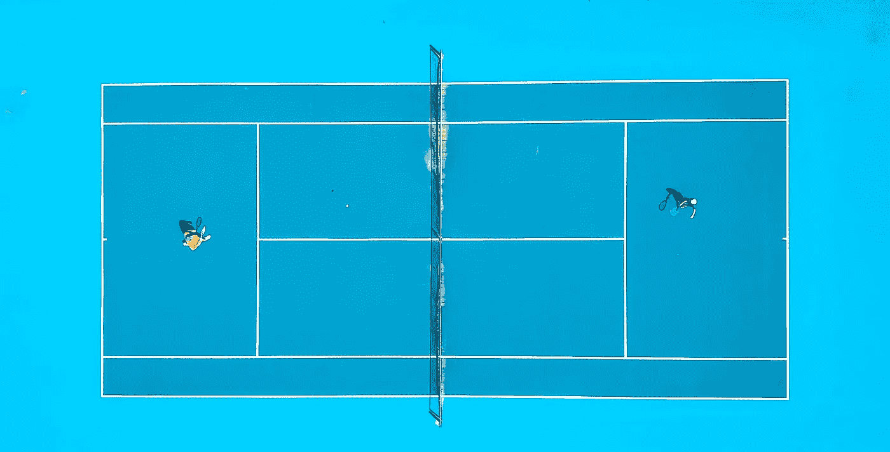

# 使用 SOLID 在 Python 中解决网球重构挑战

> 原文：[`towardsdatascience.com/solving-a-tennis-refactoring-challenge-in-python-using-solid-f1282f85e7e0?source=collection_archive---------9-----------------------#2024-02-05`](https://towardsdatascience.com/solving-a-tennis-refactoring-challenge-in-python-using-solid-f1282f85e7e0?source=collection_archive---------9-----------------------#2024-02-05)

## 逐步展示如何使用 SOLID 原则解决重构挑战

 [Tomer Gabay](https://medium.com/@tomergabay?source=post_page---byline--f1282f85e7e0--------------------------------)

·发表于 [Towards Data Science](https://towardsdatascience.com/?source=post_page---byline--f1282f85e7e0--------------------------------) ·阅读时间 9 分钟 ·2024 年 2 月 5 日

--

图片来源：[Lucas Davies](https://unsplash.com/@lucas_davies?utm_source=medium&utm_medium=referral) 于 [Unsplash](https://unsplash.com/?utm_source=medium&utm_medium=referral)

## 介绍

代码重构挑战在软件工程师中广为人知，但数据科学家对其了解较少，尽管数据科学家也能从练习这些挑战中获得很大收益。通过练习这些挑战，特别是在应用 SOLID 原则时，你能学到如何编写更好的代码；代码不仅模块化、质量高，而且面向对象。作为数据科学家，掌握 SOLID 原则能显著提升数据科学项目的质量和可管理性。这在团队中尤为重要，尤其是在那些大多数数据科学家起源于统计学家和数学家的团队，他们可能不像软件工程师那样熟悉编程基础。  

网络上有许多重构挑战。也许最著名的是 [Gilded Rose Kata](https://github.com/emilybache/GildedRose-Refactoring-Kata)。另一个有趣的重构挑战是 [Tennis Refactoring Kata](https://github.com/emilybache/Tennis-Refactoring-Kata)，我们将在本文中讨论它。

> 通常这些挑战被称为 kata。在“重构 kata”这一概念中，kata 一词借鉴自武术，指的是一种结构化的练习程序。在武术中，kata 是一系列动作和技巧的组合……
