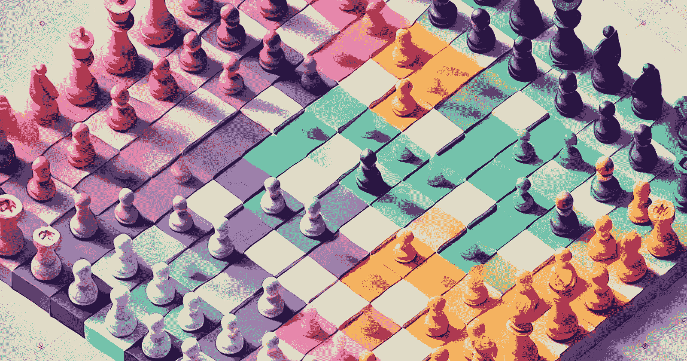

# 我是如何通过回溯法解决 LinkedIn Queens 游戏的

> 原文：[`towardsdatascience.com/solving-linkedin-queens-game-cfeea7a26e86?source=collection_archive---------8-----------------------#2024-09-07`](https://towardsdatascience.com/solving-linkedin-queens-game-cfeea7a26e86?source=collection_archive---------8-----------------------#2024-09-07)

## 使用 OpenCV 自动检测拼图并重新绘制最终答案

 [Shanmukha Ranganath](https://memsranga.com/?source=post_page---byline--cfeea7a26e86--------------------------------)

·发布于 [Towards Data Science](https://towardsdatascience.com/?source=post_page---byline--cfeea7a26e86--------------------------------) ·10 分钟阅读·2024 年 9 月 7 日

--

LinkedIn 最近推出了一个游戏功能，鼓励忙碌的专业人士抽出片刻时间，做一些既能激发思维又完全放松的事情。这些游戏提供了一个从工作中快速休息的机会，帮助你重新调整思维，以更专注的状态回到任务中。通过这些游戏，LinkedIn 旨在培养创造力，提升解决问题的能力，并重新点燃职场关系。

他们自己这样说：

> 游戏？在 LinkedIn 上？
> 
> 是的，没错。
> 
> 每年，我们都会研究世界上最好的工作场所。事实证明，深化和重新点燃职场关系的最佳方式之一，简单来说，就是一起玩乐。
> 
> 所以，我们很高兴推出三款思维导向的游戏——Pinpoint、Queens 和 Crossclimb——它们能帮助你实现这一目标。
> 
> 与你的联系建立竞争，激发对话，打破沉默。游戏促进关系，而关系是我们所做一切的核心。

这个功能最初引起了不同的反响，有人表示它偏离了 LinkedIn 的核心目标和初衷，然而后来的评价都变得非常积极。近期的...
