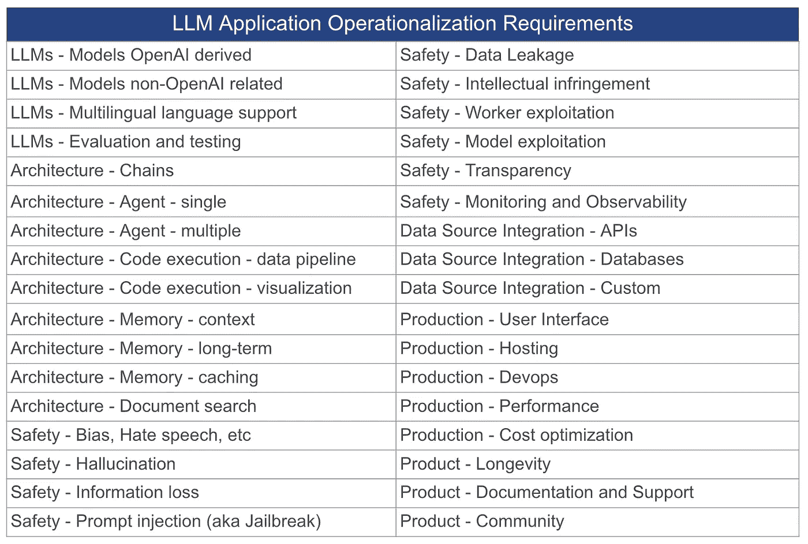
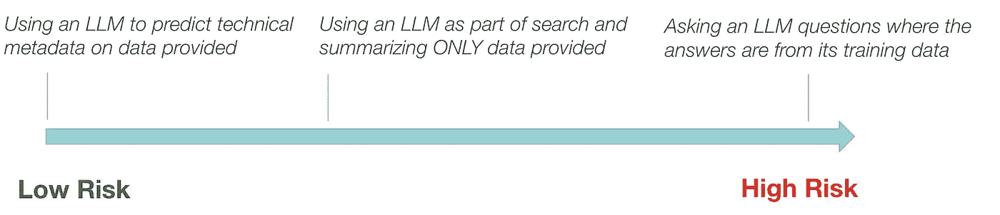
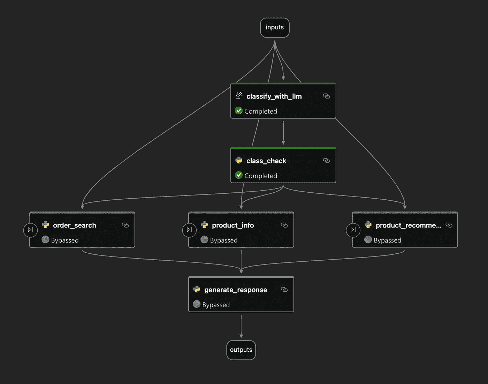
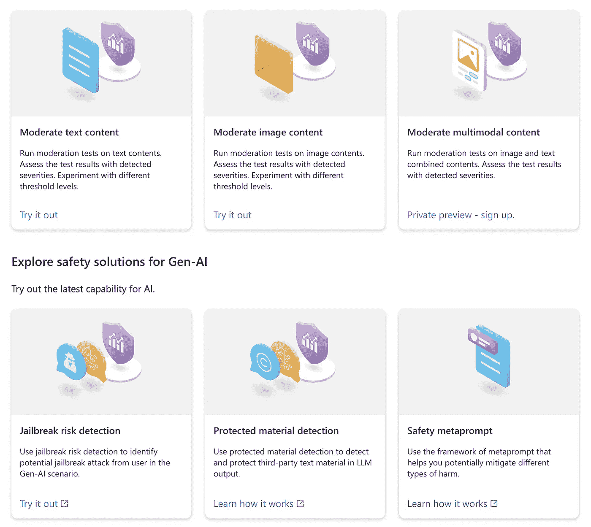

# 关于将大型语言模型（LLM）应用落地的一些思考

> 原文：[`towardsdatascience.com/some-thoughts-on-operationalizing-llm-applications-aae3530821a8?source=collection_archive---------5-----------------------#2024-01-27`](https://towardsdatascience.com/some-thoughts-on-operationalizing-llm-applications-aae3530821a8?source=collection_archive---------5-----------------------#2024-01-27)

## 从开发 LLM 应用程序中获得的一些个人经验教训

 [Matthew Harris](https://medium.com/@astrobagel?source=post_page---byline--aae3530821a8--------------------------------)

·发表于 [Towards Data Science](https://towardsdatascience.com/?source=post_page---byline--aae3530821a8--------------------------------) ·阅读时间 10 分钟·2024 年 1 月 27 日

--

来源：DALL·E 3 提示语为“Operationalizing LLMs, watercolor”

发布关于新型大型语言模型（LLM）技术和库的文章一直很有趣，但大多数时间我都在幕后为 LLM 解决方案的落地做工作。许多组织现在都在进行这方面的工作，所以我想分享一些我至今为止的经验和思考。

# 原型很容易……但生产环境，嗯，确实很难

为了展示大型语言模型（LLM）的一些惊人能力，快速做一个简单的演示看似很容易，但任何被要求将其展示给用户，并希望能产生明显影响的人很快就会意识到，需要做大量的工作来驯服这些模型。以下是大多数组织可能需要考虑的一些关键领域。

在推出使用大型语言模型（LLM）的应用程序之前，应该考虑的一些关键领域。

这个列表并不全面（另见 [Kadour et al 2023](https://arxiv.org/pdf/2307.10169.pdf)），哪些方面适用于你的应用程序当然会有所不同，但即便只是解决安全性、性能和成本问题，都是一项艰巨的任务。

那么我们能为此做些什么呢？

# 不是所有的 LLM 应用都同样令人恐惧

目前有很多关于 LLM 安全使用的担忧，而且这也是完全合理的。由于 LLM 是基于人类产出的数据进行训练的，因此它们受到了许多人类状况的负面影响，而其回应方式的高度可信度又引发了新的安全问题。然而，风险并非在所有情况下都是相同的，有些应用比其他应用更为安全。例如，让 LLM 直接从其训练数据中提供答案，比起低级别技术使用 LLM 预测元数据，更容易产生幻觉和偏见。这是一个明显的区别，但对于那些准备构建 LLM 解决方案的人来说，值得考虑——从低风险的应用开始是显而易见的第一步，并且能减少启动所需的工作量。

LLM 的使用方式会影响它的风险性

# 未来保障，对抗炒作

我们生活在一个极为激动人心的时代，每周都有许多快速发展的 AI 技术问世，但这确实让制定路线图变得困难！在过去的一年里，几次发布了新的供应商功能、开源模型或 Python 包，这些都显著改变了技术格局。弄清楚使用哪些技术、框架和模型，以确保 LLM 应用能随着时间的推移保持价值，是一个挑战。如果在未来 6 个月内，它的功能会以原生免费或非常低的成本得到支持，那就没有意义去打造一个非常棒的应用。

另一个关键的考虑因素是要问 LLM 是否真的是解决问题的最佳工具。随着去年各种激动人心的消息，容易让人被冲动带走，什么都想用“LLM 来搞定”。和任何新技术一样，仅仅为了使用而使用通常是一个大错误，而随着 LLM 的热潮逐渐冷却，可能会发现我们炫酷的应用在实际使用中变得过时。

尽管如此，毫无疑问，LLM 可以提供一些令人难以置信的能力，因此，如果继续前进，以下是一些可能有用的建议……

# 采用“廉价 LLM 优先”策略

在网页设计中有一个概念叫做[移动优先](https://medium.com/@Vincentxia77/what-is-mobile-first-design-why-its-important-how-to-make-it-7d3cf2e29d00)，即首先开发在功能较弱的手机和平板上能运行的网页应用，*然后*再考虑如何在更灵活的桌面浏览器上优化。这样做有时比反过来做更容易。类似的想法可以应用于 LLM 应用——在可能的情况下，尽量从一开始就使其与更便宜、更快速、成本更低的模型兼容，例如 GPT-3.5-turbo，而不是 GPT-4。这些模型的成本仅为前者的一小部分，而且通常会迫使设计过程朝向更加优雅的解决方案，将问题分解成更简单的部分，减少对昂贵且缓慢的模型的依赖。

当然，这并非总是可行的，而那些先进的 LLM 存在是有原因的，但许多关键功能可以通过较不强大的 LLM 来支持——如简单的意图分类、规划和记忆操作。也有可能，通过精心设计工作流，可以开辟不同的流，其中一些使用较不强大的 LLM，另一些则使用更强大的 LLM（我会在之后的博客文章中讨论这个话题）。

在未来，当那些更先进的 LLM 变得更便宜、更快速时，你可以将更基础的 LLM 替换掉，而你的应用程序可能会在几乎不需要额外努力的情况下奇迹般地改善！

# **避免使用本地 API，而应使用通用接口**

使用通用接口是一种良好的软件工程方法。在 LLM 的情况下，这意味着使用一个服务或 Python 模块，它提供一个固定接口，可以与多个 LLM 提供商进行交互。一个很好的例子是[langchain](https://www.langchain.com/)，它提供与[多种 LLM 的集成](https://python.langchain.com/docs/integrations/llms/)。通过从一开始就使用 Langchain 与 LLM 进行通信，而不是使用本地 LLM API，我们可以在未来以最小的努力更换不同的模型。

另一个例子是使用[autogen](https://microsoft.github.io/autogen/)为代理提供支持，即使是使用[OpenAI 助手](https://microsoft.github.io/autogen/blog/2023/11/13/OAI-assistants/)也是如此。通过这种方式，当其他本地代理可用时，你的应用程序可以比围绕 OpenAI 的本地实现构建整个流程更容易进行调整。

# **代理还是链条？你可以同时使用两者！**

LLM 开发中的一个常见模式是将工作流拆分为一系列条件步骤，使用诸如[promptflow](https://github.com/microsoft/promptflow)之类的框架。这些链条被明确定义，因此我们大致知道在我们的应用程序中会发生什么。它们是一个很好的起点，具有较高的透明度和可复现性。然而，它们不太适合处理边缘情况，这时自主 LLM 代理的组合可以很好地工作，因为它们能够迭代地朝着解决方案前进，并且从错误中恢复（*大多数*情况下）。这些代理的问题在于——至少目前——由于其迭代性质，它们可能会有点慢，因 LLM 令牌的使用而变得昂贵，而且有时会有点失控并且壮观地失败。不过，它们很可能是[LLM 应用程序的未来](https://www.ted.com/talks/harrison_chase_the_magical_ai_assistants_of_the_future_and_the_engineering_behind_them)，因此即使现在没有在应用程序中使用它们，做好准备也是一个好主意。通过将工作流构建为模块化链条，你实际上是在做这件事！工作流中的各个节点可以稍后替换为代理，在需要时提供两全其美的解决方案。

需要注意的是，这种方法存在一些局限性，LLM 响应的流式传输变得更加复杂，但根据你的用例，收益可能会超过这些挑战。

使用[Promtpflow](https://microsoft.github.io/promptflow/)将 LLM 工作流中的各个步骤连接起来。这有几个优点，其中之一是未来可以用更先进的技术替换这些步骤。

# 你真的想让你的应用程序动态生成代码吗？

看到自动生成代理和 Open AI 助手生成代码并自动调试解决任务，真的让人惊叹，我觉得这就像是未来一样。这也开启了像“LLM 作为工具制造者”（LATM，[Cai et al 2023](https://arxiv.org/abs/2305.17126)）这样的惊人机会，在这种情况下，你的应用程序可以生成自己的工具。话虽如此，根据我个人的经验，到目前为止，代码生成还是有点“狂野”。是的，可以优化提示并实现验证框架，但即使生成的代码完美运行，当解决新任务时，它是否是*正确的*？我遇到过许多不正确的情况，而且通常很难发现——图表的刻度、在数组中加总错误的元素，或者从 API 中检索到略微错误的数据。我认为随着 LLM 和框架的进步，这种情况会有所改变，但目前来说，我会对让 LLM 在生产环境中动态生成代码非常谨慎，至少现在还是倾向于选择一些人工审核的环节。

# 从 LLM 增强型应用程序开始，而不是 LLM 优先的应用程序

当然，有很多用例绝对需要 LLM。但是为了更好地适应，选择那些 LLM 为过程增加价值，而不是*成为*过程的应用程序可能更为合理。想象一下，一个已经对用户有用的网页应用，呈现数据。这款应用可以通过实现 LLM 改进来提升其数据查找和总结的功能。通过稍微减少对 LLM 的依赖，应用程序也就能更少暴露于 LLM 性能带来的问题。显而易见，但在深入探索生成性 AI 之前，很容易忽视从小处着手。

# 别忘了……呃……对了，内存！

向 LLM 发送提示会产生费用，并可能导致用户在等待响应时体验较差。在许多情况下，提示与之前的请求相似或相同，因此能够记住过去的活动以供重用，而不必重新调用 LLM 是很有用的。一些很棒的工具包，如[memgpt](https://memgpt.ai/)和[GPTCache](https://github.com/zilliztech/GPTCache)，使用文档嵌入的[向量存储](https://python.langchain.com/docs/modules/data_connection/vectorstores/)来持久化“记忆”。这与常见的[RAG 文档检索](https://python.langchain.com/docs/use_cases/question_answering/)技术相同，记忆实际上是分块的文档。稍微不同的是，像 memgpt 这样的框架做了一些巧妙的事情，利用 LLM 来*自我管理*记忆。

然而，你可能会发现，由于特定的使用场景，你需要某种形式的自定义记忆管理。在这种情况下，有时能够查看和操作记忆记录，而无需编写代码，是很有用的。一款强大的工具是[pgvector](https://github.com/pgvector/pgvector)，它将向量存储能力与 Postgres 关系型数据库结合起来，以便进行查询，使得理解与记忆相关的元数据变得容易。

# 测试，测试，再测试

最终，无论你的应用是否使用 LLM，它仍然是一个软件应用，因此可以从标准的工程技术中受益。一种显而易见的方法是采用[测试驱动开发](https://en.wikipedia.org/wiki/Test-driven_development#:~:text=Test%20Driven%20Development%20(TDD)%20is,leading%20to%20more%20robust%20software.)。这对于由供应商提供的 LLM 尤为重要，因为你需要控制这些 LLM 的性能可能随着时间的推移而变化，这是任何生产应用都需要量化的内容。现有几种验证框架，promptflow 提供了一些简单的验证工具，并且在[Microsoft AI Studio 中原生支持](https://learn.microsoft.com/en-us/azure/ai-studio/how-to/prompt-flow)。还有其他测试框架，关键是从一开始就使用某种框架，为验证打下坚实的基础。

尽管如此，需要注意的是，LLM 并不是确定性的，根据使用场景，每次提供的结果可能会有所不同。这对测试产生了有趣的影响，因为预期结果并非一成不变。例如，测试摘要任务是否按要求工作可能是一个挑战，因为每次的摘要可能略有不同。在这些情况下，通常有用的是使用另一个 LLM 来评估应用 LLM 的输出。可以应用一些度量标准，如 Groundedness、Relevance、Coherence、Fluency、GPT Similarity、ADA Similarity，具体见例如[Azure AI studio 的实现](https://learn.microsoft.com/en-us/azure/ai-studio/how-to/evaluate-generative-ai-app?pivots=ai-studio#select-metrics)。

一旦你拥有了一套出色的测试，能够确认应用程序按预期工作，你可以将它们整合进 DevOps 管道，例如，在应用程序部署前通过 GitHub Actions 运行这些测试。

# 使用第三方工具，省去一些工作

当然，并没有一种方案适用于所有情况，但对于实施大型语言模型应用的小型组织来说，开发每个解决方案的各个方面可能是一项挑战。将精力集中在业务逻辑上，并与用户密切合作，同时使用企业工具来处理像大型语言模型安全性这样的领域，而不是自行开发这些工具，可能更为明智。例如，Azure AI Studio 提供了一些很棒的功能，可以一键执行大型语言模型的安全检查，并轻松部署到 API 端点，同时集成监控和安全功能。其他供应商，如[谷歌也有类似的产品](https://blog.google/technology/safety-security/introducing-googles-secure-ai-framework/)。

当然，像这样的功能是有成本的，但考虑到开发它们是一项重大的工作，它可能非常值得。

[Azure AI 内容安全工作室](https://learn.microsoft.com/en-us/azure/ai-services/content-safety/studio-quickstart)是云供应商解决方案的一个很好的示例，可以确保你的大型语言模型应用安全，而无需任何开发工作。

# 人类参与，始终如此

即使是最强大的大型语言模型，也远未完美，因此任何使用它们的应用程序都必须有人类参与，以确保一切按预期工作。为了实现这一点，所有与大型语言模型应用的互动都必须被记录，并且要有监控工具。这个要求与任何良好管理的生产应用程序并无不同，唯一的区别是需要新的监控方式来捕获性能和安全问题。

人类可以扮演的另一个关键角色是，当大型语言模型应用出错时进行修正和改进。如上所述，查看应用的内存可以提供帮助，尤其是当人类可以调整内存时，与大型语言模型协作，向最终用户提供最佳体验。将这些修改后的数据反馈到提示调优和大型语言模型微调中，可以成为改进应用程序的强大工具。

# 结论

上述想法并不是操作大型语言模型的详尽指南，可能并不适用于每个场景，但我希望它们对一些人有帮助。我们现在正处于一段令人兴奋的旅程中！

# 参考文献

大型语言模型的挑战与应用，[Kaddour 等，2023](https://arxiv.org/pdf/2307.10169.pdf)

大型语言模型作为工具制造者，[Cai 等，2023](https://arxiv.org/abs/2305.17126).

除非另有说明，所有图片均由作者提供

*如果你喜欢这篇文章，请点赞，我会很高兴如果你关注我！你可以在这里找到更多文章* [*这里*](https://medium.com/@astrobagel)*.*
