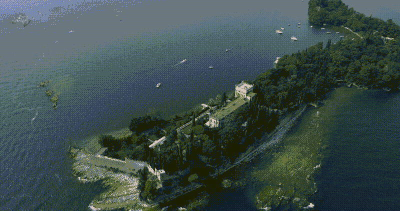

# Sora — 直观且详尽的解释

> 原文：[`towardsdatascience.com/sora-intuitively-and-exhaustively-explained-a54f83ea9c21?source=collection_archive---------4-----------------------#2024-03-22`](https://towardsdatascience.com/sora-intuitively-and-exhaustively-explained-a54f83ea9c21?source=collection_archive---------4-----------------------#2024-03-22)

## 视频生成 | 多模态建模 | OpenAI

## 新时代的前沿视频生成

 [Daniel Warfield](https://medium.com/@danielwarfield1?source=post_page---byline--a54f83ea9c21--------------------------------)

·发布于 [Towards Data Science](https://towardsdatascience.com/?source=post_page---byline--a54f83ea9c21--------------------------------) ·阅读时间 18 分钟·2024 年 3 月 22 日

--

“Patchmaster” 由 Daniel Warfield 使用 MidJourney 创建。所有图片均为作者提供，除非另有说明。

在这篇文章中，我们将讨论 Sora，OpenAI 最新的前沿视频生成模型。我们将从描述 Sora 所依赖的基本机器学习技术开始，然后讨论关于 Sora 本身的信息，包括 OpenAI 的技术报告和相关的推测。阅读完这篇文章后，你将对 Sora（可能）是如何工作的有一个扎实的理解。

Sora 能够生成的视频质量示例。不幸的是，由于版权问题，我不能在这里包括实际的 Sora 生成视频。同时，由于 Medium 的文件大小限制，我也不能上传高质量的视频。因此，我将提供链接到 OpenAI 网站上的视频。此视频来自 [这里](https://www.pexels.com/video/drone-footage-of-isola-del-garda-8441006/)，而实际的 Sora 视频可以在 [这里](https://openai.com/sora?video=amalfi-coast) 找到。

**这对谁有用？** 任何对生成式 AI 感兴趣的人。

**这篇文章有多复杂？** 这篇文章并不复杂，但有很多概念，可能会让经验较少的数据科学家感到有些吃力。

**前提条件：** 无需任何前提，但一些机器学习经验可能会有所帮助。如果你感到困惑，可以参考文中提到的相关文章，或文章末尾的推荐阅读。

# 定义 Sora
