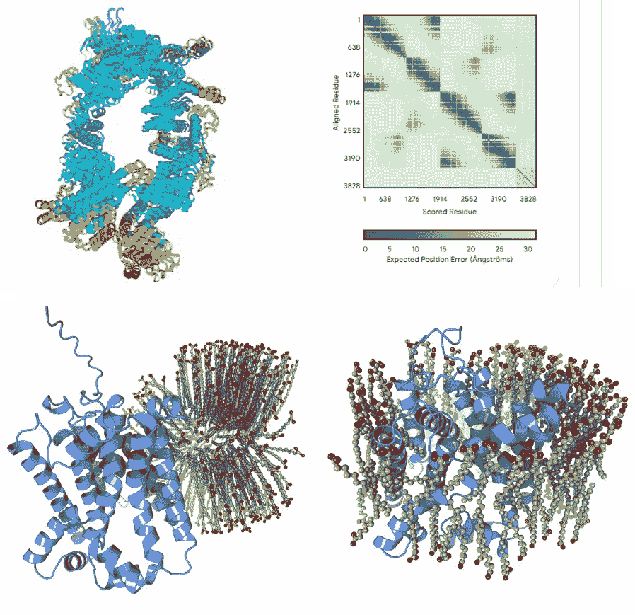

# “化学直觉的火花”——以及 AlphaFold 3 中的重大局限！

> 原文：[`towardsdatascience.com/sparks-of-chemical-intuition-and-gross-limitations-in-alphafold-3-8487ba4dfb53?source=collection_archive---------6-----------------------#2024-06-05`](https://towardsdatascience.com/sparks-of-chemical-intuition-and-gross-limitations-in-alphafold-3-8487ba4dfb53?source=collection_archive---------6-----------------------#2024-06-05)

## 在 DeepMind 发布其迄今为止最先进的生物分子结构预测模型的三周后，进行的观察。

 [LucianoSphere (Luciano Abriata, PhD)](https://lucianosphere.medium.com/?source=post_page---byline--8487ba4dfb53--------------------------------)

·发表于[Towards Data Science](https://towardsdatascience.com/?source=post_page---byline--8487ba4dfb53--------------------------------) ·阅读时间：16 分钟·2024 年 6 月 5 日

--

图由作者绘制。

## 索引

**- 介绍**

- **AlphaFold 3 是什么，它与之前版本的区别** *超越蛋白质*

*社区黑客合作

-* **蛋白质存在的问题，包括 AlphaFold 2 没有遭遇的一些问题**

- AlphaFold 3（不了解的）脂质物理化学

- 膜中的蛋白质

- 蛋白质-核酸复合物

- 蛋白质中的离子和金属位点** *蛋白质中的金属离子* **- 讨论与结论** *对于结构生物学家*

*对人工智能和数据科学爱好者的意义*

# 介绍

就在三周前，AlphaFold 3 作为 DeepMind（以及与 Google 相关的另一家公司 Isomorphic Lab）最新的工具诞生，应用人工智能解决在原子级别理解生物学的问题。正如我在专门的文章中详细介绍的……
