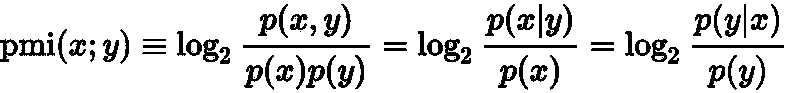
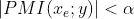
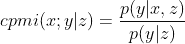

# 使用目标信息稀疏化知识图谱

> 原文：[`towardsdatascience.com/sparsifying-knowledge-graph-using-target-information-8fb1014cbb0f?source=collection_archive---------4-----------------------#2024-05-05`](https://towardsdatascience.com/sparsifying-knowledge-graph-using-target-information-8fb1014cbb0f?source=collection_archive---------4-----------------------#2024-05-05)

## 为监督任务稀疏化知识图谱，使用 PMI 去除无关的边；并通过医学数据的具体示例来说明

 [Sria Louis](https://medium.com/@sria.louis?source=post_page---byline--8fb1014cbb0f--------------------------------)

·发表于 [Towards Data Science](https://towardsdatascience.com/?source=post_page---byline--8fb1014cbb0f--------------------------------) ·阅读时间：9 分钟·2024 年 5 月 5 日

--

“医学知识图谱” — 由 deepai.org 生成

以下是我在微软研究院工作时，在 Elad Yom-Tov 教授指导下进行的一项研究项目的简化片段。

**前提要求**：熟悉监督学习和对知识图谱有基本了解，包括其在特征工程中的应用。

# TL;DR

你有一个监督学习任务，从高维二进制特征空间中预测目标变量*y*，并且你想利用一个知识图谱，其中每个节点代表一个特征。

问题在于知识图谱很密集。具体来说，有许多无关的边（插曲：[维基百科过度链接危机](https://en.wikipedia.org/wiki/Wikipedia:Overlink_crisis)）。

**窍门**：通过测量每条边的出现与目标变量之间的点互信息（PMI），评估每条边的相关性。去除相关性较低的边。完成！

现在，让我们进入具体细节。

首先，在第一章中，我们将探讨图稀疏化的需求。在第二章中，我们将通过医学领域的一个例子来具体说明。然后，在最后一章中，我们将深入讨论核心主题：使用 PMI 进行图稀疏化。祝阅读愉快！

# 第一章：需求

图和特别是知识图谱（KG）无处不在。随着图数据库基础设施的发展以及理论机器学习工具（如节点嵌入）的进步，这项技术正在成熟。

在现实世界中处理知识图谱时的一个关键挑战是——在我看来，这个挑战永远都存在——[**密度**](https://en.wikipedia.org/wiki/Dense_graph)**。** 即使是具有多项式复杂度的算法，也可能在密集图上失败。展望未来，如果硬件进步——未来的知识图谱将会在节点数量和边的数量上都有所增加。[此外，我预测并希望，在这场军备竞赛中，我们将逐步看到层次化的超图和其他怪异结构加入其中。]

知识图谱的**优势**在于它们能够在广泛的知识领域中持有复杂的连接，例如，所有医学知识或所有已知的天文物体，因此你可以利用它们来丰富更简单的特征，例如，如果你的特征非常稀疏，例如非常罕见的医学病症，它们可以通过图谱中的“邻接”信息进行丰富。

这种庞大规模带来了一个缺点：知识图谱通常过于庞大。除了计算复杂性外，这里还有另一个核心问题。知识图谱覆盖了领域中的一切，因此大部分信息与你的特定目标无关。换句话说，它们具有过度敏感性（即覆盖率/召回率）——因此特异性较低（即精确度）。你可能会说这是机器学习中的常见权衡；那么，图谱中的特殊性是什么呢？答案是，在典型的真实世界知识网络中，度分布是重尾的，存在巨大的“枢纽”，即具有极高度的节点，也就是拥有许多边的节点。你可能熟悉这种枢纽在[社交网络和物理学](https://en.wikipedia.org/wiki/Six_degrees_of_separation)中的效果（“六度分隔”）以及图论视角下的效果（随机图的直径）——在我们的上下文中，这意味着少数几个枢纽会显著减少图中大多数节点之间的距离，从而将图中的任何信号迅速扩散到整个图谱，抑制了任何可能与特定目标相关的更微妙的信息。

为了具体化，在下一章中，我们将描述我们处理的一个用例，然后，在第三章中，我们将描述一种通过删除无关边来克服密度问题的监督任务方法。可以直接跳到第三章。

# 第二章：具体示例

让我们考虑以下的监督任务。我们已简化细节，以专注于有趣的部分——PMI。

## 研究假设

我们可以根据一个人的医学维基百科浏览历史预测潜在的医学病症。例如，如果一个人浏览过有关头痛、吸烟、咳嗽和牙齿变色的文章，他们可能面临某种肺病的较高风险。再一次，这是一个简化的研究场景和一个假设性情境。

## 数据

+   自变量以表格数据的形式给出，存储在设计矩阵 X 中。每个条目都有二进制值，0/1。

+   每一行代表一个患者——即一个患者的维基百科阅读历史，作为二元变量——每个医学维基百科文章对应一个变量（这类似于 NLP 中的词袋编码）。

+   每一列代表维基百科中的一个医学术语。

+   例如，对于患者*p*和维基百科文章*f*（例如肺炎），*X[i, f] = 1*表示患者*p*曾访问过文章*f*。也就是说，“患者阅读了关于肺炎的文章”。显然，患者并不会查看与他们病情相关的具体维基百科文章，但我们从以往的研究中了解到，在某些情况下，他们会在线搜索与真实病情相关的症状。而这正是知识图谱变得非常有用的地方：“此人阅读了与图谱中某个与特定医学病症相关的邻域的症状信息”。

+   我们将分别用*m*和*n*表示行数（患者数）和列数（二元特征数）。

+   目标（因变量）*y*是未来某医学病症的存在，例如严重的 COVID-19。

+   此外，我们还拥有一个知识图谱（KG），即完整的医学维基百科，其中节点是医学术语的维基百科文章，边是超链接。请注意，这是一张有向图。

+   为了简化起见，假设每个特征（列）在图谱中都表示为一个单一的节点。

使用知识图谱来丰富特征是一个广泛的话题，因此我们在这里不会详细讨论。然而，有一种值得注意的方法是节点嵌入，其中二元特征被转化为一个连续的、低维的向量空间。

现在我们可以利用这个医学示例场景来更好地理解**稀疏化**的需求：

1.  还记得我们之前提到的中心节点吗？虽然一些中心节点对我们的目标可能有意义，但许多节点由与目标无关的高阶节点组成，比如“[医学专业列表](https://en.wikipedia.org/wiki/Medical_specialty)”或“[医学症状列表](https://en.wikipedia.org/wiki/List_of_medical_symptoms)”，这样的节点会在图谱中放大噪声，从而抑制关于某些特定稀有症状的重要信息。那么我们如何有效地识别这些中心节点，并找出它们的哪些边是无关的、可以安全移除的呢？

1.  此外，可能需要利用相同的数据库来预测两个不同的目标变量，例如女性乳腺癌和男性前列腺癌，它们表现出不同的行为。在这种情况下，使用整个知识图谱可能并不具有优势，因为某些边与我们特定的目标标签可能无关。因此，可能需要排除与异性相关的边。那么我们如何系统地移除与特定目标变量无关的边呢？

# 第三章：PMI 技巧

我们的目标很明确：我们希望从知识图谱中去除那些与目标变量无关的边。虽然有多种数学定义可以描述相关性，但我们选择使用点互信息（PMI），因为它既简单又直观。

PMI 是信息论中的一个基本工具，接下来我们来讨论它：PMI 到底是什么？我们将首先概述其定义，然后力求建立更好的直观理解。

> PMI 被描述为“自然语言处理（NLP）中最重要的概念之一”[[参见 6.6](https://web.stanford.edu/~jurafsky/slp3/6.pdf)]

## **PMI：点互信息**

PMI 作为两个离散随机变量之间著名的互信息的点估计。给定两个随机变量*X*和*Y*的观察结果 x 和 y，我们定义：

点互信息（来自维基百科）

等式是贝叶斯定理的直接结果，为我们提供了关于 PMI 的不同视角，并且理想情况下，可以帮助我们建立直观理解：

如果 X 和 Y 是独立的，那么 p(x,y)=p(x)p(y)。因此，第一个项可以理解为以下两者之间的比率：

+   *p(x, y)* = 实际联合分布的点估计，带有依赖性，

+   *p(x)p(y)* = 假设两个变量独立时的联合分布。

看看最后一项，你可能会意识到 PMI 是在量化“在知道 y 的情况下，x 的概率如何变化”，反之亦然。

让我们做一个小练习，以便更好地理解 PMI：

+   假设 1%的患者患有重症新冠，p(covid) = .01

+   在曾经患有肺炎的患者中，有 4%的人患上了重症新冠。p(covid|pneumonia) = .04

+   那么，给定肺炎的情况下，新冠的概率高于没有肺炎信息的情况，因此 PMI 很高。PMI(covid;pneumonia) = log(.04/.01) = 2。非常直观，对吧？

PMI 在其简单性中非常优美，但关于其特性、变化和应用还有许多可以探索的内容。一个值得注意的变体是归一化 PMI，它的范围在-1 到 1 之间。这个特性使得可以在多个随机变量对之间进行比较和筛选。请记住这一点——它稍后会变得非常有价值。

## 回到我们的任务

我们有一个大型稠密图，表示我们的二元特征之间的链接，并且我们有一个目标变量。我们如何智能地稀疏化这个图？

对于两个特征 v1 和 v2 之间的边 e，我们定义一个指示随机变量 x_e，当且仅当两个特征的值都是 1（True）时，x_e 的值为 1，表示这两个医学术语在患者中同时出现。现在，观察这条边和目标变量 y。我们提出了一个简单的问题：这条边与 y 相关吗？现在我们可以简单地通过 PMI 来回答！如果 PMI[x_e,y]接近零，则这条边与我们的目标无关，否则**这条边包含一些相关信息**。

所以，最后总结，我们移除所有带有：

其中 alpha 是一个超参数，通过调节它，你可以控制图的稀疏性（与泛化误差之间的权衡，也就是过拟合的风险）。

## **三个警告 — 以及潜在的改进**

**警告 1)** 特征空间通常表现出稀疏性，导致 PMI 的分子和分母都为零，因此我们最好不要删除这些边，因为我们对它们没有任何信息。

你可能会问：如果我们通常不删除边，难道我们真的在“稀疏化”图吗？答案在于枢纽节点。记得那些枢纽节点吗？它们实际上通常不会是零，因为它们是枢纽节点。

**警告 2)** 另一个值得思考的问题是：为什么要将边变量定义为“两个特征的值都是 1”？或者，我们也可以检查任一特征是否具有值为 1。因此，代替 y = x1 和 x2，我们可以考虑 y = x1 或 x2。这是一个有效的观点。这些不同的实现方式传达了你对领域理解的略微不同的叙述，并且可能适用于不同的数据集。我建议根据你的具体使用场景探索不同的版本。

**警告 3)** 即使概率不为零，在医学领域它们通常是非常非常小的，因此为了增加稳定性，我们可以定义条件 PMI：

条件 PMI

用通俗的语言说：我们在一个概率子空间中计算 PMI，其中第三个事件发生。

具体而言，在知识图谱中，请记住图是有向的。我们将使用 cPMI 来检查两个特征之间的边 e=(v1,v2) 是否相关，**前提**是第一个特征为正。

换句话说，如果 v1 从未出现，我们可以声明我们没有足够的信息来删除这条边，即使是为了删除它。

# 结论

现在，当我们知道什么是 PMI 时，我们就明白了，为了在知识图谱中删除不相关的边，我们可以检查每条边和目标变量之间的逐点互信息，并删除所有不相关的边。砰！🎤
