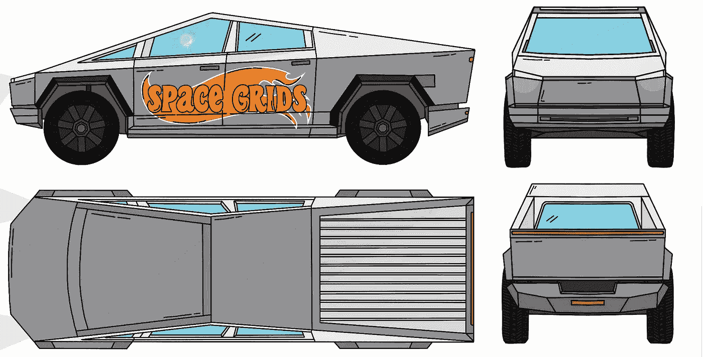
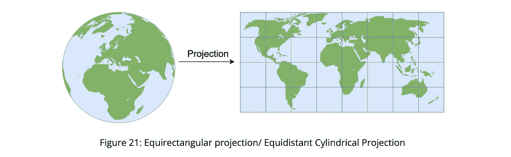

# 空间索引：网格系统

> 原文：[`towardsdatascience.com/spatial-index-grid-systems-f02880fb147a?source=collection_archive---------9-----------------------#2024-06-12`](https://towardsdatascience.com/spatial-index-grid-systems-f02880fb147a?source=collection_archive---------9-----------------------#2024-06-12)

## 空间索引中的网格系统，使用 GeoHash 和 Google S2

 [Adesh Nalpet Adimurthy](https://pyblog.medium.com/?source=post_page---byline--f02880fb147a--------------------------------)

·发表于[Towards Data Science](https://towardsdatascience.com/?source=post_page---byline--f02880fb147a--------------------------------) ·12 分钟阅读·2024 年 6 月 12 日

--

本文是[Stomping Grounds: 空间索引](https://medium.com/towards-data-science/spatial-index-space-filling-curves-e67baec2186a)的续集，但如果你错过了第一部分也没关系——你依然能在这里找到很多新的见解。

# 3\. Geohash

[Geohash](https://en.wikipedia.org/wiki/Geohash)：由 Gustavo Niemeyer 于 2008 年发明，它将地理位置编码为一个短字符串，由字母和数字组成。它是一个分层的空间数据结构，通过使用 Z-order 曲线（[第二部分](https://medium.com/towards-data-science/spatial-index-space-filling-curves-e67baec2186a)）将空间划分为网格形状的桶。

## 3.1\. Geohash — 直觉

地球是圆的，或者更准确地说是椭球体。地图投影是一组将地球表示为平面的变换。在地图投影中，来自地球表面的地点的坐标（纬度和经度）被转换为平面上的坐标。而 GeoHash 使用[等距矩形投影](https://en.wikipedia.org/wiki/Equirectangular_projection)

GeoHash 的核心就是巧妙地使用了 Z-order 曲线。将地图投影（矩形）分割成 2 个相等的矩形，每个矩形都由唯一的比特串标识。
