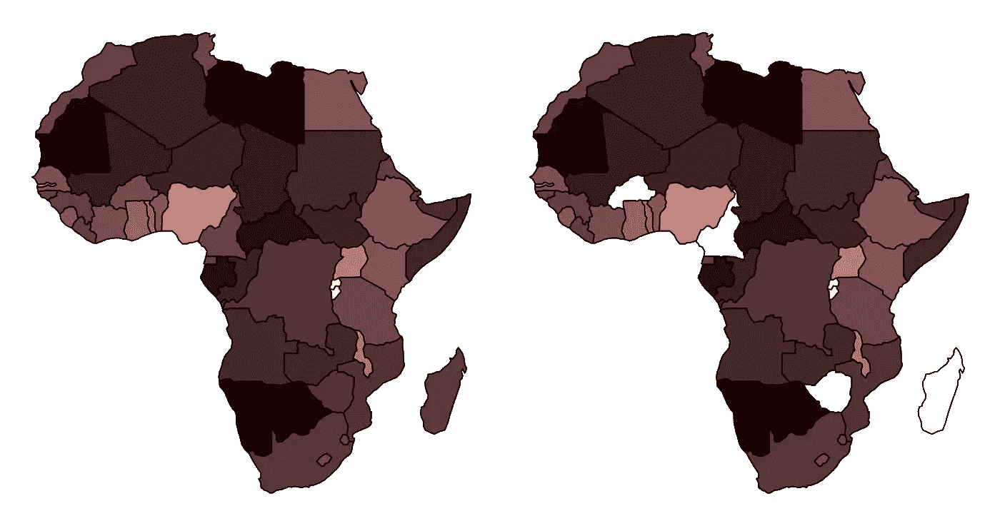

# Python 中的空间插值

> 原文：[`towardsdatascience.com/spatial-interpolation-in-python-0864abca6d48?source=collection_archive---------4-----------------------#2024-08-08`](https://towardsdatascience.com/spatial-interpolation-in-python-0864abca6d48?source=collection_archive---------4-----------------------#2024-08-08)

## 使用反距离加权法推断缺失的空间数据

 [米兰·贾诺索夫](https://medium.com/@janosovm?source=post_page---byline--0864abca6d48--------------------------------)

·发表于[Towards Data Science](https://towardsdatascience.com/?source=post_page---byline--0864abca6d48--------------------------------) ·阅读时间：5 分钟·2024 年 8 月 8 日

--

反距离加权法（IDW）是一种地统计学方法，用于根据周围已知值来推断特定位置的空间变量的未知值。IDW 的基本思想遵循托布勒的地理第一定律，内容为“所有事物相互关联，但近的事物比远的事物更相关”。也就是说，一个已知值的空间单元离一个未知值的空间单元越近，它对插值结果的影响就越大。

在这篇文章中，我们测试 IDW 方法，通过以非洲为例推断缺失的国家级人口密度水平。为此，我使用一张由 Natural Earth 提供的、经过人口估算并精心整理的世界地图（关于该数据的公共可用性请参考[此处](https://www.naturalearthdata.com/about/terms-of-use/)），然后人为删除若干数据点，这些数据点将通过 IDW 方法进行推断。最后，我将比较原始值与推断后的删除人口密度值。

*所有图片均由作者创建。*

# 数据准备

在这里，我将依赖 GeoPandas 的内置地图数据集“naturalearth_lowres”。这是由 Natural Earth 提供的全球地图，并由国家级别的...
