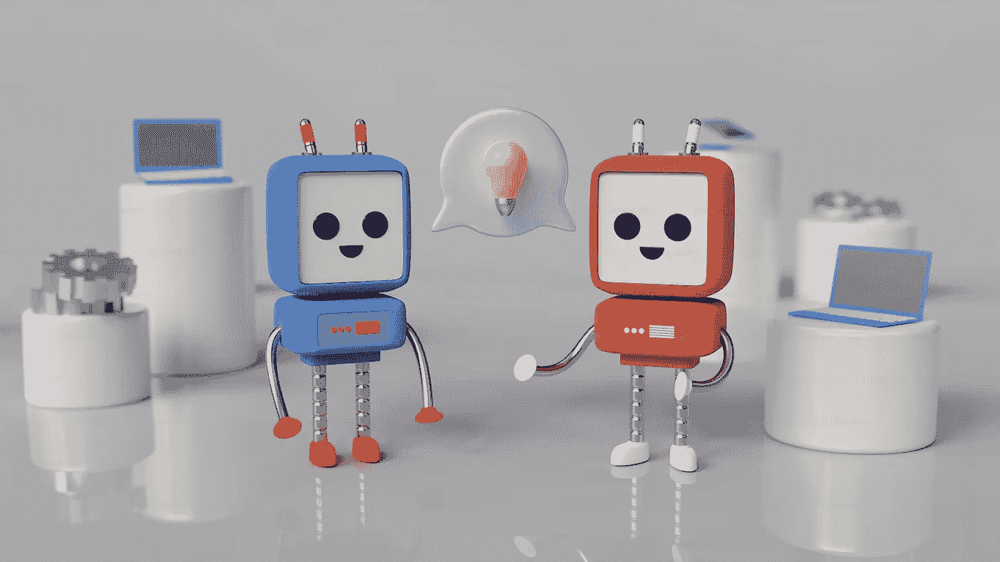

# 使用 Python 和 AI 的语音转文本再转语音 — 一份如何实现的指南

> 原文：[`towardsdatascience.com/speech-to-text-to-speech-with-ai-using-python-a-how-to-guide-ee9b0b0ef082?source=collection_archive---------1-----------------------#2024-02-11`](https://towardsdatascience.com/speech-to-text-to-speech-with-ai-using-python-a-how-to-guide-ee9b0b0ef082?source=collection_archive---------1-----------------------#2024-02-11)

## 如何创建一个语音转文本再转语音程序

[](https://naomikriger.medium.com/?source=post_page---byline--ee9b0b0ef082--------------------------------)[](https://towardsdatascience.com/?source=post_page---byline--ee9b0b0ef082--------------------------------) [Naomi Kriger](https://naomikriger.medium.com/?source=post_page---byline--ee9b0b0ef082--------------------------------)

·发表于 [Towards Data Science](https://towardsdatascience.com/?source=post_page---byline--ee9b0b0ef082--------------------------------) ·阅读时长 8 分钟·2024 年 2 月 11 日

--



[图片](https://unsplash.com/photos/aaujbh59zqI) 由 [Mariia Shalabaieva](https://unsplash.com/@maria_shalabaieva) 提供，来源于 [unsplash](http://unsplash.com)

自从我开始参加 GeekCon（是的，一个极客会议 🙂）已经整整十年了——这是一个为期一周末的黑客马拉松式活动，所有项目必须是无用的、纯粹为了好玩，今年有一个激动人心的变化：所有项目都必须包含某种形式的 AI。

我们小组的项目是一个语音转文本再转语音的游戏，工作原理如下：用户选择一个角色进行对话，然后通过语音表达他们想对角色说的任何话。这段语音输入被转录后发送给 ChatGPT，ChatGPT 会像角色一样进行回应。然后，使用语音合成技术将回应读出来。

现在游戏已经上线，带来了许多欢笑与乐趣，我编写了这份指南，帮助你自己创建一个类似的游戏。在整篇文章中，我们还将探索我们在黑客马拉松中所做的各种考虑和决策。

想查看完整代码吗？[点击这里查看](https://github.com/NaomiKriger/speech_to_speech_magician)!

# 程序的流程

一旦服务器运行，用户将听到应用程序“讲话”，提示他们选择想要交谈的人物并开始与所选角色对话。每次想要大声说话时 —— 他们应按住键盘上的某个键并进行讲话。当他们讲话结束（并松开按键）时，录音将通过 `[Whisper](https://platform.openai.com/docs/guides/speech-to-text/quickstart)`（`OpenAI` 的语音转文本模型）进行转录，转录结果将发送给 `[ChatGPT](https://platform.openai.com/docs/guides/gpt/chat-completions-api)` 以获取回复。回复将通过文本转语音库大声朗读，用户将听到回复内容。

# 实现

## 免责声明

注意：该项目是在 Windows 操作系统上开发的，并且包含了 `pyttsx3` 库，该库与 M1/M2 芯片不兼容。由于 `pyttsx3` 在 Mac 上不受支持，因此建议用户探索与 macOS 环境兼容的其他文本转语音库。

## OpenAI 集成

我使用了两个 `OpenAI` 模型：`Whisper` 用于语音转文本转录，`ChatGPT` API 用于根据用户对所选人物的输入生成回复。尽管这样做会产生费用，但定价模型非常便宜，就我个人而言，我的账单至今还不到 $1。为了开始使用，我进行了 $5 的初始存款，到目前为止，我还没有用完这笔存款，而且这笔初始存款将持续到一年后才会过期。

我写这篇文章并未从 `OpenAI` 获得任何报酬或利益。

一旦你获得了 `OpenAI` API 密钥 —— 请将其设置为环境变量，在进行 API 调用时使用。确保不要将密钥推送到代码库或任何公共位置，也不要不安全地共享它。

## 语音转文本 —— 创建转录

语音转文本功能的实现是通过 `Whisper` 完成的，这是一种 `OpenAI` 模型。

以下是负责转录的函数代码片段：

```py
async def get_transcript(audio_file_path: str, 
                         text_to_draw_while_waiting: str) -> Optional[str]:
    openai.api_key = os.environ.get("OPENAI_API_KEY")
    audio_file = open(audio_file_path, "rb")
    transcript = None

    async def transcribe_audio() -> None:
        nonlocal transcript
        try:
            response = openai.Audio.transcribe(
                model="whisper-1", file=audio_file, language="en")
            transcript = response.get("text")
        except Exception as e:
            print(e)

    draw_thread = Thread(target=print_text_while_waiting_for_transcription(
        text_to_draw_while_waiting))
    draw_thread.start()

    transcription_task = asyncio.create_task(transcribe_audio())
    await transcription_task

    if transcript is None:
        print("Transcription not available within the specified timeout.")

    return transcript
```

该函数被标记为异步（async），因为 API 调用可能需要一些时间才能返回响应，我们使用 `await` 等待它，以确保程序在收到响应之前不会继续执行。

正如你所看到的，`get_transcript` 函数还调用了 `print_text_while_waiting_for_transcription` 函数。为什么？因为获取转录是一个耗时的任务，我们希望让用户知道程序正在积极处理他们的请求，而不是卡住或无响应。因此，在用户等待下一步操作时，这段文字会逐渐打印出来。

## 使用 FuzzyWuzzy 进行文本比较的字符串匹配

将语音转录为文本后，我们要么直接使用它，要么尝试将其与现有字符串进行比较。

比较的使用案例包括：从预定义的选项列表中选择一个角色，决定是否继续游戏，以及在选择继续时——决定是选择新角色还是继续当前角色。

在这种情况下，我们希望将用户的语音输入转录与我们列表中的选项进行比较，因此我们决定使用`FuzzyWuzzy`库进行字符串匹配。

这使得我们可以从列表中选择最接近的选项，只要匹配分数超过预定的阈值。

这是我们功能的一段代码：

```py
def detect_chosen_option_from_transcript(
        transcript: str, options: List[str]) -> str:
    best_match_score = 0
    best_match = ""

    for option in options:
        score = fuzz.token_set_ratio(transcript.lower(), option.lower())
        if score > best_match_score:
            best_match_score = score
            best_match = option

    if best_match_score >= 70:
        return best_match
    else:
        return ""
```

如果你想了解更多关于`FuzzyWuzzy`库及其功能的信息，可以阅读我写的这篇文章这里。

## 获取 ChatGPT 响应

一旦我们得到了转录内容，就可以将其发送给`ChatGPT`以获取回复。

对于每个`ChatGPT`请求，我们都会添加一个提示，要求它给出简短而有趣的回应。我们还告诉`ChatGPT`应该假装成哪个角色。

所以我们的功能如下所示：

```py
def get_gpt_response(transcript: str, chosen_figure: str) -> str:
    system_instructions = get_system_instructions(chosen_figure)
    try:
        return make_openai_request(
            system_instructions=system_instructions, 
            user_question=transcript).choices[0].message["content"]
    except Exception as e:
        logging.error(f"could not get ChatGPT response. error: {str(e)}")
        raise e
```

系统指令如下所示：

```py
def get_system_instructions(figure: str) -> str:
    return f"You provide funny and short answers. You are: {figure}"
```

## 文本转语音

对于文本转语音部分，我们选择了一个名为`pyttsx3`的 Python 库。这个选择不仅实现起来直接，而且还提供了若干额外的优势。它是免费的，提供两种语音选项——男性和女性——并允许你选择语速（每分钟单词数）。

当用户开始游戏时，他们从预定义的选项列表中选择一个角色。如果我们在列表中找不到匹配的内容，就会从“备选角色”列表中随机选择一个角色。在这两个列表中，每个角色都与一个性别关联，因此我们的文本转语音功能也会收到对应所选性别的语音 ID。

这是我们文本转语音功能的样子：

```py
def text_to_speech(text: str, gender: str = Gender.FEMALE.value) -> None:
    engine = pyttsx3.init()

    engine.setProperty("rate", WORDS_PER_MINUTE_RATE)
    voices = engine.getProperty("voices")
    voice_id = voices[0].id if gender == "male" else voices[1].id
    engine.setProperty("voice", voice_id)

    engine.say(text)
    engine.runAndWait()
```

## 主要流程

现在我们已经大致完成了应用程序的所有部分，是时候深入了解游戏玩法了！主要流程如下所示。你可能会注意到一些我们尚未深入探讨的功能（例如`choose_figure`、`play_round`），但你可以通过[查看仓库](https://github.com/NaomiKriger/speech_to_speech_magician)来探索完整代码。最终，大部分这些更高层次的功能都与我们上面提到的内部功能相联系。

这是主游戏流程的一段代码：

```py
import asyncio

from src.handle_transcript import text_to_speech
from src.main_flow_helpers import choose_figure, start, play_round, \
    is_another_round

def farewell() -> None:
    farewell_message = "It was great having you here, " \
                       "hope to see you again soon!"
    print(f"\n{farewell_message}")
    text_to_speech(farewell_message)

async def get_round_settings(figure: str) -> dict:
    new_round_choice = await is_another_round()
    if new_round_choice == "new figure":
        return {"figure": "", "another_round": True}
    elif new_round_choice == "no":
        return {"figure": "", "another_round": False}
    elif new_round_choice == "yes":
        return {"figure": figure, "another_round": True}

async def main():
    start()
    another_round = True
    figure = ""

    while True:
        if not figure:
            figure = await choose_figure()

        while another_round:
            await play_round(chosen_figure=figure)
            user_choices = await get_round_settings(figure)
            figure, another_round = \
                user_choices.get("figure"), user_choices.get("another_round")
            if not figure:
                break

        if another_round is False:
            farewell()
            break

if __name__ == "__main__":
    asyncio.run(main())
```

# 未走的道路

我们有几个想法，在黑客松期间没有实现。这是因为在那个周末我们没有找到一个令我们满意的 API，或者由于时间限制无法开发某些功能。这些就是我们未选择的路径：

## 匹配响应语音与所选角色的“实际”语音

想象一下，如果用户选择与史瑞克、特朗普或奥普拉·温弗瑞对话。我们希望我们的文本到语音库或 API 能够用与所选人物匹配的声音来表达回应。然而，在黑客松期间，我们没有找到一个价格合理的库或 API 提供这个功能。如果你有建议，我们依然欢迎哦 =)

## 让用户与“自己”对话

另一个有趣的想法是提示用户提供他们自己的语音样本。我们将使用这个样本训练一个模型，然后让 ChatGPT 生成的所有回应用用户自己的声音朗读。在这种情况下，用户可以选择回应的语气（肯定和支持、讽刺、愤怒等），但声音会尽可能像用户自己的声音。然而，在黑客松的限制下，我们没能找到支持这种功能的 API。

## 为我们的应用添加前端

我们最初的计划是在应用程序中包含一个前端组件。然而，由于组内参与者人数的临时变动，我们决定优先开发后端。因此，当前应用程序仅在命令行界面（CLI）上运行，没有前端部分。

# 我们考虑的其他改进

当前最困扰我的是延迟。

流程中有几个相对较高延迟的组件，在我看来稍微影响了用户体验。例如：从提供音频输入到收到转录文本之间的时间，以及从用户按下按钮到系统实际开始录音之间的时间。所以，如果用户在按下按钮后立即开始讲话——由于这种延迟，至少会有一秒钟的音频没有被录制。

# 仓库链接与致谢

想看看整个项目吗？[就在这里](https://github.com/NaomiKriger/speech_to_speech_magician)!

此外，温暖的致谢送给我的黑客松伙伴[利奥尔·雅尔德尼](https://www.linkedin.com/in/lioryardeni)，是他和我一起创造了这个游戏。

# 总结

在这篇文章中，我们学习了如何使用 Python 创建一个语音到文本再到语音的游戏，并将其与 AI 结合。我们使用了`OpenAI`的`Whisper`模型进行语音识别，玩弄了`FuzzyWuzzy`库进行文本匹配，利用`ChatGPT`的对话魔力通过开发者 API 实现，并通过`pyttsx3`将其转换为语音。虽然`OpenAI`的服务（`Whisper`和`ChatGPT`开发者版）确实有一定的费用，但它还是很实惠的。

我们希望这篇指南对你有所启发，并激励你开始你的项目。

为编程和乐趣干杯！🚀
