# 使用 BatchNorm 加速视觉变换器

> 原文：[`towardsdatascience.com/speeding-up-the-vision-transformer-with-batch-normalization-d37f13f20ae7?source=collection_archive---------7-----------------------#2024-08-06`](https://towardsdatascience.com/speeding-up-the-vision-transformer-with-batch-normalization-d37f13f20ae7?source=collection_archive---------7-----------------------#2024-08-06)

## 介绍了如何在仅包含编码器的变换器架构中集成批量归一化，从而减少训练时间和推理时间。

 [Anindya Dey 博士](https://medium.com/@anindya.hepth?source=post_page---byline--d37f13f20ae7--------------------------------)

·发布于[数据科学前沿](https://towardsdatascience.com/?source=post_page---byline--d37f13f20ae7--------------------------------)·阅读时间 23 分钟·2024 年 8 月 6 日

--

图片来源：Jr Korpa，来自[Unsplash](https://unsplash.com/)

## 引言

基于变换器架构的引入，源自[视觉变换器](https://arxiv.org/abs/2010.11929)（ViT）的发现，已经在计算机视觉领域掀起了一场革命。对于广泛的应用，ViT 及其各种变种有效地挑战了卷积神经网络（CNN）作为最先进架构的地位（有关详细的比较研究，请参见[这篇](https://arxiv.org/abs/2108.05305)论文）。然而，尽管取得了这一成功，ViT 被认为需要显著更长的训练时间，并且在较小到中等输入数据规模下推理速度较慢。因此，研究可能导致更快训练和推理速度的视觉变换器修改方法是一个重要课题。

**在一系列文章的第一篇中**，我详细探讨了 ViT 的一种修改，这种修改将涉及用 Batch Normalization（BatchNorm）替换 Layer Normalization（LayerNorm）——即 transformers 默认的归一化技术。更具体地说，我将讨论这种模型的两个版本。正如我稍后将回顾的，ViT 是一个仅包含编码器的架构，其中 transformer 编码器由两个不同的模块组成——多头自注意力（MHSA）和前馈网络（FFN）。第一个模型将仅在前馈网络中实现 BatchNorm 层——这将被称为 **ViTBNFFN**（带有前馈网络中 BatchNorm 的视觉 Transformer）。第二个模型将用 BatchNorm 替换视觉 Transformer 中的 LayerNorm *所有*地方——我将此模型称为 **ViTBN**（带有 BatchNorm 的视觉 Transformer）。因此，模型 ViTBNFFN 将同时涉及 LayerNorm（在 MHSA 中）和 BatchNorm（在 FFN 中），而 ViTBN 仅涉及 BatchNorm。

我将比较三个模型的性能——ViTBNFFN、ViTBN 和标准 ViT——在手写数字的 MNIST 数据集上的表现。更具体地说，我将比较以下指标——每个 epoch 的训练时间、每个 epoch 的测试/推理时间、训练损失和两个不同实验设置下模型的测试准确度。在第一个设置中，模型在固定的学习率和批量大小下进行比较。然后，在保持批量大小不变的情况下，使用不同的学习率值重复该实验。在第二个设置中，首先为每个模型找到最大化准确度的最佳学习率和批量大小，使用 **贝叶斯优化** 过程。然后，比较这些优化后的模型在上述指标上的表现。对于我们在下面详细介绍的合理架构选择，ViTBNFFN 和 ViTBN 模型在每个 epoch 的平均训练时间和平均推理时间上都提高了超过 60%，同时提供了与标准 ViT 相当（或更好的）准确度。此外，BatchNorm 模型相比 ViT 允许使用更大的学习率，而不会妥协模型的稳定性。这个发现与原论文中提到的 CNN 中使用 BatchNorm 的直觉一致，正如 [Ioffe 和 Szegedy](https://arxiv.org/abs/1502.03167) 所指出的。

你可以在 github 上的 [repo](https://github.com/anindyahepth/BatchNorm_in_Transformers_CV) 中获取这些文章中使用的代码，并进行尝试。告诉我你的想法！

## 目录

我从对 BatchNorm 及其 PyTorch 实现的简单介绍开始，然后简要回顾了 Vision Transformer。熟悉这些主题的读者可以跳到下一节，在那里我们描述了如何使用 PyTorch 实现 ViTBNFFN 和 ViTBN 模型。接下来，我使用 **MLFlow** 的跟踪功能设置简单的数值实验，训练并测试这些模型在 MNIST 数据集上的表现（没有任何图像增强），并将结果与标准 ViT 模型进行比较。贝叶斯优化是通过 [**Ax**](https://ax.dev/) **平台** 上的 BoTorch 优化引擎执行的。最后，我简要总结了结果并给出了一些结语。

## 批量归一化：定义与 PyTorch 实现

让我们简要回顾一下深度神经网络中 BatchNorm 的基本概念。这个想法最早在 [Ioffe 和 Szegedy](https://arxiv.org/abs/1502.03167) 的论文中提出，作为一种加速卷积神经网络训练的方法。假设 zᵃᵢ 表示深度神经网络中某一层的输入，其中 a 是批量索引，范围为 a=1,…, Nₛ，i 是特征索引，范围为 i=1,…, C。这里，Nₛ 是批量中的样本数量，C 是生成 zᵃᵢ 的层的维度。BatchNorm 操作通常包括以下步骤：

1.  对于给定的特征 i，计算批量大小为 Nₛ 的均值和方差，即：

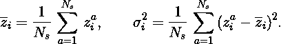

2\. 对于给定的特征 i，使用上述计算的均值和方差对输入进行标准化，即定义（对于一个固定的小正数 ϵ）：

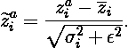

3\. 最后，对于每个特征 i，偏移并重新缩放标准化后的输入：

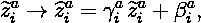

其中没有对索引 a 或 i 进行求和，并且参数（γᵃᵢ, βᵃᵢ）是可训练的。

另一方面，层归一化（LayerNorm）涉及对固定批量索引 a 计算特征索引的均值和方差，然后进行类似的标准化和缩放操作。

PyTorch 内置了一个 BatchNorm1d 类，用于对 2d 或 3d 输入执行批量归一化，具有以下规格：

代码块 1\. PyTorch 中的 BatchNorm1d 类。

在一般的图像处理任务中，图像通常被分割成若干个较小的图块。输入 z 随后会有一个索引α（除了 a 和 i 的索引外），该索引标记序列中构成图像的特定图块。BatchNorm1d 类将输入的第一个索引视为批次索引，第二个索引作为特征索引，其中 num_features = C。因此，输入必须是一个形状为 Nₛ × C × N 的三维张量，其中 N 为图块数量。输出张量与输入的形状相同。PyTorch 还提供了一个 BatchNorm2d 类，可以处理四维输入。对于我们的任务，使用 BatchNorm1d 类就足够了。

PyTorch 中的 BatchNorm1d 类有一个额外的特性，我们需要讨论。如果设置 track_running_stats = True（这是默认设置），BatchNorm 层会在训练过程中保持其计算的均值和方差的运行估计（更多细节请见[这里](https://pytorch.org/docs/stable/generated/torch.nn.BatchNorm1d.html)），这些估算值将在测试时用于归一化。如果设置 track_running_stats = False，则 BatchNorm 层不会保持运行估算值，而是使用批次统计量在测试时进行归一化。对于一般数据集，默认设置可能导致训练和测试的准确率显著不同，至少在前几个 epoch 内是这样的。然而，对于我使用的数据集，可以明确检查发现并非如此。因此，在使用 BatchNorm1d 类时，我保持默认设置。

## 标准 Vision Transformer：简要回顾

Vision Transformer（**ViT**）在论文[***一张图胜过 16 × 16 个词***](https://arxiv.org/abs/2010.11929)中被提出，主要用于图像分类任务。让我们从模型的简要回顾开始（有关 PyTorch 实现的详细信息，请见[这里](https://github.com/lucidrains/vit-pytorch)）。该编码器-仅 Transformer 模型的架构细节如图 1 所示，主要由三部分组成：**嵌入层**、**Transformer 编码器**和**MLP 头部**。

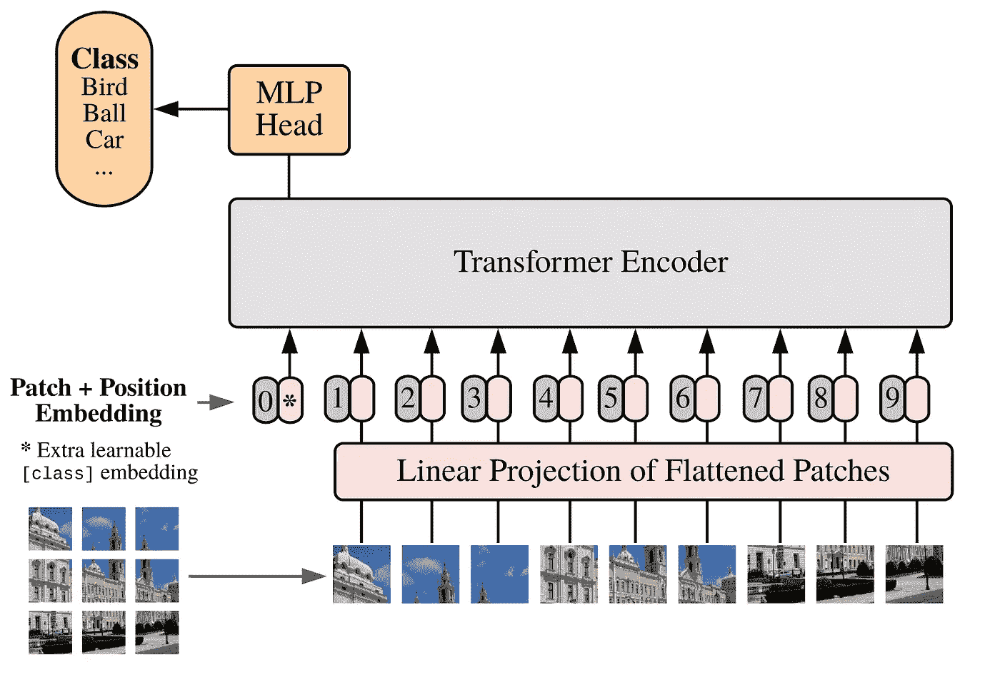

图 1\. Vision Transformer 架构。图片来源：一张图胜过 16×16 个词。

嵌入层将图像分解成多个 patch，并将每个 patch 映射为一个向量。嵌入层的组织方式如下。可以将 2d 图像看作一个实际的 3d 张量，形状为 H × W × c，其中 H、W 和 c 分别是图像的高度、宽度（单位为像素）和颜色通道数。在第一步中，图像被重新形状为一个形状为 N × dₚ的 2d 张量，使用大小为 p 的 patch，其中 N = (H/p) × (W/p)是 patch 的数量，dₚ = p² × c 是 patch 的维度。举一个具体的例子，考虑一个 28 × 28 的灰度图像。在这种情况下，H = W = 28，c = 1。如果选择 patch 大小 p = 7，则图像将被划分为 N = 4 × 4 = 16 个 patch，patch 维度为 dₚ = 49。

在下一步中，一个线性层将形状为 N × dₚ的张量映射到形状为 N × dₑ的张量，其中 dₑ被称为嵌入维度。然后，形状为 N × dₑ的张量通过在前面加上一个可学习的 dₑ维向量**y₀**，被提升为形状为(N+1) × dₑ的张量**y**。向量**y₀**表示**CLS tokens**在图像分类中的嵌入，下面我们将详细解释。接着，另一个形状为(N+1) × dₑ的张量**yₑ**被加到张量**y**中——该张量编码了图像的**位置嵌入**信息。可以选择使用一个可学习的**yₑ**，或者使用固定的 1d 正弦表示（更多细节请参见[论文](https://arxiv.org/abs/2010.11929)）。然后，形状为(N+1) × dₑ的张量**z** = **y** + **yₑ**被送入 Transformer 编码器。一般而言，图像还会被标记为一个批次索引。因此，嵌入层的输出是一个形状为 Nₛ × (N+1) × dₑ的 3d 张量。

如下图 2 所示，Transformer 编码器将形状为 Nₛ × (N+1) × dₑ的 3d 张量**zᵢ**作为输入，并输出一个相同形状的张量**zₒ**。然后，这个张量**zₒ**被送入 MLP 头进行最终的分类处理。令**z⁰ₒ**为形状为 Nₛ × dₑ的张量，对应于**zₒ**在第二维度上的第一个组件。这个张量是可学习张量**y₀**的“最终状态”，它在之前的步骤中将输入张量加到编码器之前。如果选择使用 CLS tokens 进行分类，MLP 头会从 Transformer 编码器的输出**zₒ**中提取**z⁰ₒ**，并将其映射到一个形状为 Nₛ × n 的张量，其中 n 是问题中的类别数。或者，也可以选择进行全局池化，通过计算给定特征的输出张量**zₒ**在(N+1)个 patch 上的平均值，从而得到一个形状为 Nₛ × dₑ的张量**zᵐₒ**。然后，MLP 头会将**zᵐₒ**映射到一个形状为 Nₛ × n 的 2d 张量。

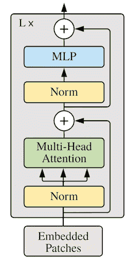

图 2. Vision Transformer 中 Transformer 编码器的结构。图片来源：An Image is Worth 16x16 words。

现在让我们更详细地讨论变换器编码器的组成部分。如图 2 所示，它由 L 个变换器块组成，其中 L 通常被称为模型的 *深度*。每个变换器块又由一个多头自注意力（MHSA）模块和一个带有残差连接的 MLP 模块（也称为前馈网络）组成，如图所示。MLP 模块由两个隐藏层和一个位于中间的 GELU 激活层组成。第一个隐藏层前也有一个 LayerNorm 操作。

我们现在准备讨论模型 ViTBNFFN 和 ViTBN。

## 带有批量归一化的视觉变换器：ViTBNFFN 和 ViTBN

为了在 ViT 架构中实现批量归一化，我首先介绍一个专门针对我们任务的新 BatchNorm 类：

代码块 2\. 实现批量归一化操作的 Batch_Norm 类，适用于 ViTBNFFN 和 ViTBN。

这个新类 *Batch_Norm* 使用了我之前讲解过的 BatchNorm1d（第 10 行）类。重要的修改出现在第 13-15 行。回想一下，输入到变换器编码器的张量形状是 Nₛ × (N+1) × dₑ。在编码器的某一层，输入是形状为 Nₛ × (N+1) × D 的 3D 张量，其中 D 是该层的特征数量。为了使用 BatchNorm1d 类，必须将这个张量重塑为 Nₛ × D × (N+1)，正如我们之前所解释的那样。实现批量归一化后，需要将张量重新塑形回 Nₛ × (N+1) × D 的形状，以便其余架构保持不变。所有的重塑操作都是通过 *einops* 包中的 *rearrange* 函数来完成的。

现在可以以以下方式描述带有批量归一化的模型。首先，可以通过去除先前的 LayerNorm 操作并引入一个批量归一化层来修改 ViT 的变换器编码器中的前馈网络。我选择将批量归一化层插入到第一个隐藏层和 GELU 激活层之间。这就得到了模型 **ViTBNFFN**。新前馈网络的 PyTorch 实现如下所示：

代码块 3\. 带有批量归一化的变换器编码器的 FeedForward（MLP）模块。

FeedForward 类的构造函数，代码在第 7-11 行，显而易见。批量归一化层由第 8 行中的 Batch_Norm 类实现。输入到前馈网络的张量形状为 Nₛ × (N+1) × dₑ。第一个线性层将其转换为形状为 Nₛ × (N+1) × D 的张量，其中 D= *hidden_dim*（代码中也称为 *mlp_dimension*）。因此，Batch_Norm 类的适当特征维度为 D。

接下来，可以将模型**ViTBNFFN**中的所有 LayerNorm 操作替换为由 Batch_Norm 类实现的 BatchNorm 操作。这就得到了**ViTBN**模型。与标准的 ViT 相比，我们在 ViTBNFFN/ViTBN 中进行了一些额外的调整。首先，我们通过引入一个额外的模型参数，加入了可学习的位置编码或固定的正弦位置编码的选项。类似于标准的 ViT，用户可以选择使用 CLS token 或全局池化的方式来进行最终分类。此外，我们将 MLP 头部替换为一个更简单的线性头部。通过这些更改，ViTBN 类的形式如下（ViTBNFFN 类也具有类似的形式）：

代码块 4\. ViTBN 类。

上述大部分代码不言自明，并且与标准的 ViT 类非常相似。首先，注意在第 23 到 28 行，我们已经在嵌入层中将 LayerNorm 替换为 BatchNorm。在*Transformer*类（表示 ViTBN 使用的 transformer 编码器）内部也进行了类似的替换（见第 44 行）。接下来，我们添加了一个新的超参数“pos_emb”，其取值为字符串‘pe1d’或‘learn’。在第一个情况下，使用固定的 1D 正弦位置嵌入，而在第二个情况下，使用可学习的位置嵌入。在前向传播函数中，第一个选项在第 62 到 66 行实现，而第二个选项在第 68 到 72 行实现。超参数“pool”的取值为字符串‘cls’或‘mean’，分别对应于最终分类时使用 CLS token 或全局池化。ViTBNFFN 类可以以类似的方式写出。

模型 ViTBN（类似地，ViTBNFFN）可以按如下方式使用：

代码块 5\. 使用 ViTBN 处理 28 × 28 图像。

在这个特定的情况下，输入维度*image_size* = 28，这意味着 H = W = 28。*patch_size* = p = 7，意味着补丁的数量为 N = 16。由于颜色通道数量为 1，补丁的维度是 dₚ = p² = 49。分类问题中的类别数由*num_classes*给出。模型中的参数*dim* = 64 表示嵌入维度 dₑ。编码器中 transformer 块的数量由*depth* = L = 6 给出。参数*heads*和*dim_head*分别对应自注意力头的数量以及编码器中 MHSA 模块中每个头的（共同）维度。参数*mlp_dim*是 MLP 或前馈模块的隐藏维度。参数*dropout*是 transformer 编码器的单个丢弃参数，出现在 MHSA 和 MLP 模块中，而*emb_dropout*是与嵌入层相关的丢弃参数。

## 实验 1：在固定超参数下比较模型

在介绍了包含 BatchNorm 的模型之后，我将开始第一个数值实验。众所周知，BatchNorm 能够加速深度神经网络的收敛，从而加速训练和推理过程。它还允许使用相对较大的学习率训练卷积神经网络，而不会引入不稳定性。此外，BatchNorm 预计能够作为正则化器，从而消除使用 dropout 的需求。本实验的主要动机是了解这些说法如何转化为具有 BatchNorm 的视觉变换器（Vision Transformer）。

对于本实验，我将使用 Code Block 5 中给出的 ViT 超参数，特别是选择 6 层的 transformer 编码器，即*‘depth =6’*。我们将使用 CLS 标记进行分类，这对应于设置*pool = ‘cls’*，并使用可学习的位置信息嵌入，这对应于设置*pos_emb = ‘learn’*。对于 ViTBNFFN 和 ViTBN，我将使用单层 transformer，因此我们有*‘depth =1’*，同时所有其他超参数保持与 ViT 相同。

实验涉及以下步骤：

1.  对于给定的学习率，我将在 MNIST 手写图像数据集上训练 ViT、ViTBNFFN 和 ViTBN 模型，共进行 30 个周期。在这个阶段，我不会使用任何图像增强。每经过一个训练周期后，我将在验证数据上测试一次模型。

1.  对于给定的模型和学习率，我将在每个周期中测量以下几个量：训练时间、训练损失、测试时间和测试准确度。对于固定的学习率，这将生成四个图表，每个图表绘制了这些量随周期变化的曲线，比较了三种模型的表现。这些图表可以用来比较模型的性能。特别地，我想比较标准 ViT 模型与包含 BatchNorm 的模型的训练和测试时间，以检查是否在某些情况下有显著的加速。

1.  我将对三个代表性的学习率 l = 0.0005、0.005 和 0.01 执行步骤 1 和步骤 2 的操作，保持所有其他超参数不变。

在整个分析过程中，我将使用**CrossEntropyLoss()**作为损失函数，使用**Adam**优化器，并且在所有训练周期中，训练和测试的批量大小分别固定为 100 和 5000。我将把所有 dropout 参数设置为零，以进行本实验。为了简化问题，我也不考虑学习率衰减。

本实验已经通过**MLFlow**的跟踪功能进行。所有实验中的运行，我都使用了**Google Colab**上的**NVIDIA L4 Tensor Core GPU**。

让我们首先讨论执行给定实验运行时使用的 MLFlow 模块的重要组成部分。第一个组成部分是*train_model*函数，用于根据给定的超参数选择进行模型的训练和测试：

代码块 6：数值实验的训练和测试模块。

函数*train_model*返回每个 epoch 的四个量——训练损失(*cost_list*)，测试准确率(*accuracy_list*)，训练时间（秒）(*dur_list_train*)和测试时间（秒）(*dur_list_val*)。第 19 到 32 行给出了该函数的训练模块，第 35 到 45 行给出了测试模块。请注意，该函数允许在每个训练 epoch 后进行一次模型测试。在我们代码的 Git 版本中，你还可以找到按类别划分的准确率，但为了简洁起见，这里我将跳过这一部分。

接下来，需要定义一个函数来下载 MNIST 数据集，将其拆分为训练集和验证集，并将图像转换为 torch 张量（不进行任何增强）：

代码块 7：获取 MNIST 数据集。

现在我们准备编写 MLFlow 模块，模块的形式如下：

代码块 8：要执行的 MLFlow 实验模块。

让我们解释一些代码中的重要部分。

1.  第 11 到 13 行分别指定了学习率、epoch 数量和损失函数。

1.  第 16 到 33 行指定了训练和测试的各种细节。代码块 7 中的*get_datesets()*函数下载了 MNIST 数字的训练集和验证集，而在代码块 5 中定义的*get_model()*函数指定了模型。对于后者，我们设置了*pool = ‘cls’*和*pos_emb = ‘learn’*。在第 20 行，定义了优化器，我们在第 21 到 24 行指定了训练和验证数据加载器以及各自的批大小。第 25 到 26 行指定了函数*train_model*的输出，我们在代码块 6 中定义了该函数——四个列表，每个列表包含*n_epoch*个条目。第 16 到 24 行指定了函数*train_model*的各种参数。

1.  在第 37 到 40 行，指定了对于给定实验运行将记录的参数，在我们的实验中是学习参数和 epoch 数量。

1.  第 44 到 52 行构成了代码中最重要的部分，在这里指定了需要记录的指标，也就是上面提到的四个列表。事实证明，默认情况下，函数*mlflow.log_metrics()*不会记录一个列表。换句话说，如果我们直接使用*mlflow.log_metrics({generic_list})*，那么实验将只记录最后一个 epoch 的输出。作为解决方法，我们使用 for 循环多次调用该函数，如下所示。

现在让我们深入分析实验结果，这些结果本质上总结在下面图 3 到图 5 的三组图表中。每个图表展示了一个包含四个图的集合，分别对应于每个时期的训练时间（左上角）、测试时间（右上角）、训练损失（左下角）和测试准确度（右下角），对于三种模型而言，这些图表都是在固定学习率下得到的。图 3、图 4 和图 5 分别对应于学习率 l=0.0005、l=0.005 和 l=0.01。为方便起见，我们定义一对比率：

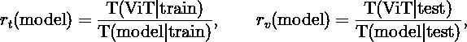

其中 T(model|train) 和 T(model|test) 是我们实验中给定模型每个时期的平均训练时间和测试时间。这些比率为我们提供了一个粗略的度量，衡量了在集成 BatchNorm 后，Vision Transformer 加速的效果。我们将始终训练和测试模型相同的时期数——因此，可以分别通过上述比率定义每个时期的平均训练时间和测试时间的百分比提升：

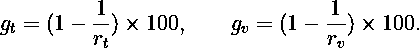

我们从最小的学习率 l=0.0005 开始，该学习率对应于图 3。此时，标准 ViT 在较少的时期内就会收敛，相比其他模型，训练损失较低，准确度略高（~98.2%），见右下角图表，优于 ViTBNFFN (~97.8%) 和 ViTBN (~97.1%)。然而，ViT 的训练时间和测试时间相比 ViTBNFFN/ViTBN 高出超过 2 倍。从图表中可以读取出比率 rₜ 和 rᵥ：rₜ (ViTBNFFN) = 2.7, rᵥ (ViTBNFFN) = 2.6, rₜ (ViTBNFFN) = 2.5, rᵥ (ViTBN) = 2.5，其中 rₜ 和 rᵥ 如上所定义。因此，对于给定的学习率，BatchNorm 带来的速度提升在训练和推理中都非常显著——大约是 60%的提升。精确的百分比提升列在表 1 中。

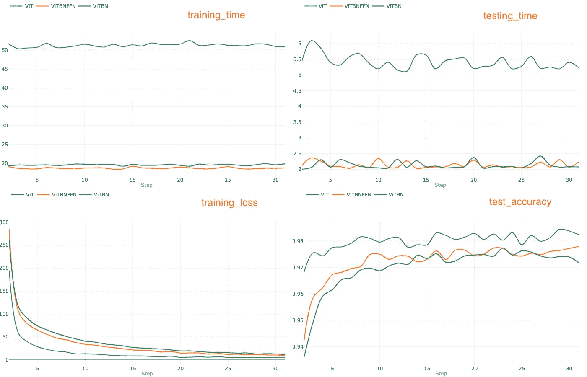

图 3\. 学习率 l = 0.0005 的图表。

在下一步中，我们将学习率增加到 l=0.005 并重复实验，得到图 4 中的一组图表。

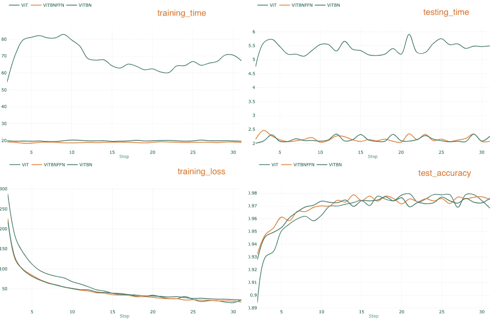

图 4\. 学习率 l=0.005 的图表。

对于学习率 l=0.005，标准 ViT 在更快收敛方面似乎没有任何优势。然而，与 ViTBNFFN/ViTBN 相比，ViT 的训练时间和测试时间再次较长。从图 3 和图 4 左上方的图形可视化比较来看，ViT 的训练时间显著增加，而 ViTBNFFN 和 ViTBN 的训练时间基本保持不变。这表明，在这种情况下训练时间的提升更为显著。另一方面，从图 3 和图 4 右上方的图形进行比较，可以看到测试速度的提升大致相同。rₜ和 rᵥ的比值可以从图 4 顶部的图形中读取：rₜ（ViTBNFFN）= 3.6，rᵥ（ViTBNFFN）=2.5，rₜ（ViTBN）= 3.5，rᵥ（ViTBN）= 2.5。显然，与较小学习率的情况相比，这里的 rₜ比值更大，而 rᵥ比值保持基本不变。这导致训练时间的提升百分比更高（约 70%），而推理时间的提升（约 60%）保持大致不变。

最后，让我们将学习率进一步提高到 l=0.01，并重复实验，得到图 5 中的一组图形。

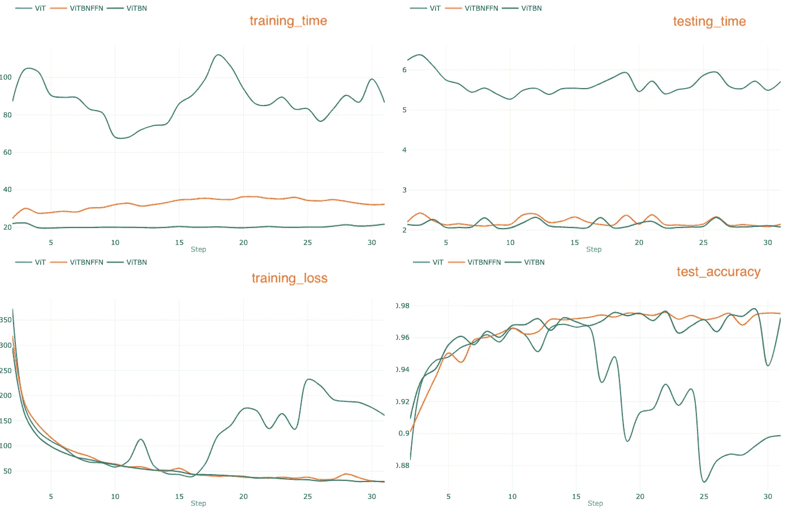

图 5。学习率 l=0.01 的图形。

在这种情况下，ViT 在经过几个 epoch 后变得不稳定，正如图 5 中的训练损失图所示，训练损失从第 15 个 epoch 附近开始出现不收敛的行为。这一点也可以从测试精度图中得到验证，ViT 的精度在第 15 个 epoch 左右急剧下降。然而，ViTBNFFN 和 ViTBN 模型保持稳定，并且在 30 个 epoch 的训练结束时精度超过 97%。在这种情况下，ViT 的训练时间甚至更高，并且波动剧烈。对于 ViTBNFFN，训练时间有明显的增加，而对于 ViTBN，训练时间大致保持不变——请参见左上图。在训练比率 rₜ方面，我们得到 rₜ（ViTBNFFN）= 2.7 和 rₜ（ViTBN）= 4.3。第一个比率低于我们在之前的情况下得到的结果，这是由于 ViTBNFFN 的训练时间较长，抵消了 ViT 的训练时间增加。第二个比率显著更高，因为 ViTBN 的训练时间几乎没有变化。在这种情况下，测试比率 rᵥ——rᵥ（ViTBNFFN）= 2.6 和 rᵥ（ViTBN）= 2.7——显示出微小的增加。

训练时间和推理时间的提升——gₜ和 gᵥ在不同学习率下的总结见表 1。

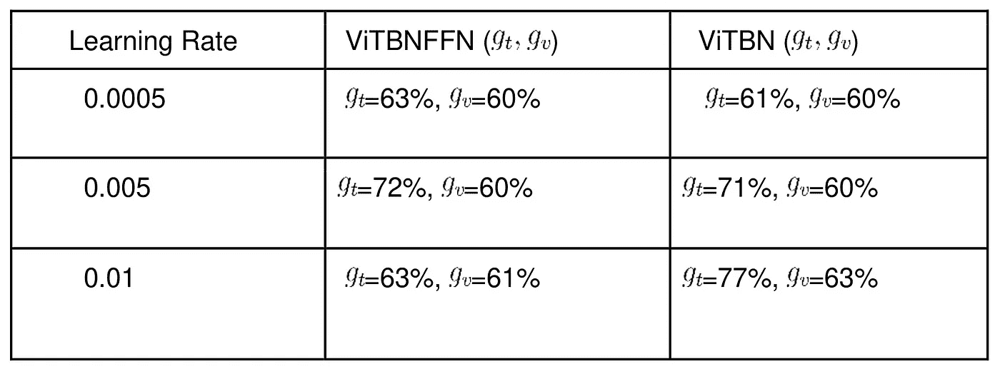

表 1。ViTBNFFN 和 ViTBN 相对于 ViT 在每个 epoch 的训练和测试时间的百分比提升。

另外，直观地展示每个模型的训练时间如何随学习率变化也是很有趣的。这在图 6 中的三张图中得以展示，分别表示 ViT、ViTBNFFN 和 ViTBN。模型 _i 中的下标 i=1,2,3 分别对应给定模型的三种学习率 l= 0.0005、0.005 和 0.01。

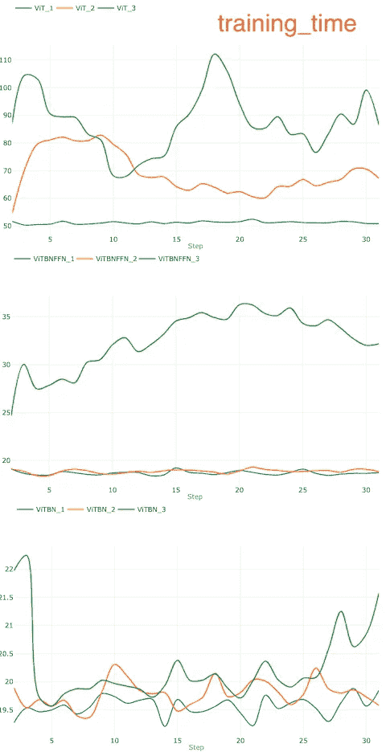

图 6\. 显示给定模型的每个周期训练时间如何随学习率变化的图形。下标 1、2、3 分别对应 l=0.0005、0.005 和 0.01。

显然，训练时间随学习率变化的差异对 ViT（上图）最为显著。另一方面，对于 ViTBN，在改变学习率时，训练时间大致保持不变（下图）。对于 ViTBNFFN，只有当学习率达到较大的值（~0.01）时，训练时间的变化才变得显著（中图）。

## **实验 2：比较优化后的模型**

现在让我们设置一个实验，比较优化后的模型的性能。该过程将包括以下步骤：

1.  首先执行贝叶斯优化，以确定每个模型的最佳超参数——学习率和批量大小。

1.  给定三个优化模型，训练并测试每个模型 30 个周期，并使用 MLFlow 进行指标比较，如前所述——特别是每个周期的训练和测试/推理时间。

让我们从第一步开始。我们使用[**Ax**](https://ax.dev/)平台上可用的 BoTorch 优化引擎。有关使用 BoTorch 进行优化程序的详细信息，请参阅[此](https://ax.dev/docs/bayesopt.html)Ax 文档。我们使用准确度作为优化指标，并将优化过程限制为 20 次迭代。我们还需要指定每种情况中进行搜索的超参数范围。我们之前的实验为我们提供了一些关于适当范围的见解。ViT 的学习率范围为[1e-5, 1e-3]，而 ViTBNFFN 和 ViTBN 的学习率范围为[1e-5, 1e-2]。对于所有三个模型，批量大小范围为[20, 120]。模型的深度与实验 1 中的设置相同。优化过程的完整代码可以在 GitHub 仓库的*optimization*文件夹中的模块*hypopt_train.py*中找到。

该过程的结果是每个模型的一组优化超参数。我们在表 2 中总结了它们。

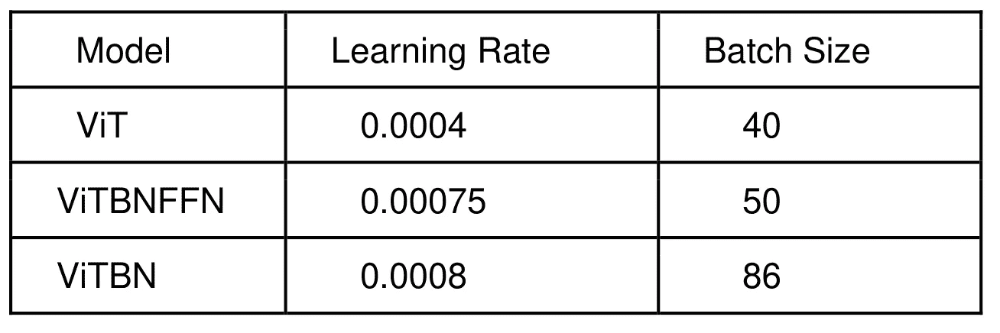

表 2\. 使用 BoTorch 进行贝叶斯优化得到的每个模型的优化超参数。

对于每个模型，可以绘制准确率如何随迭代次数变化的图形。作为说明示例，我们在图 7 中展示了 ViTBNFFN 的收敛图。

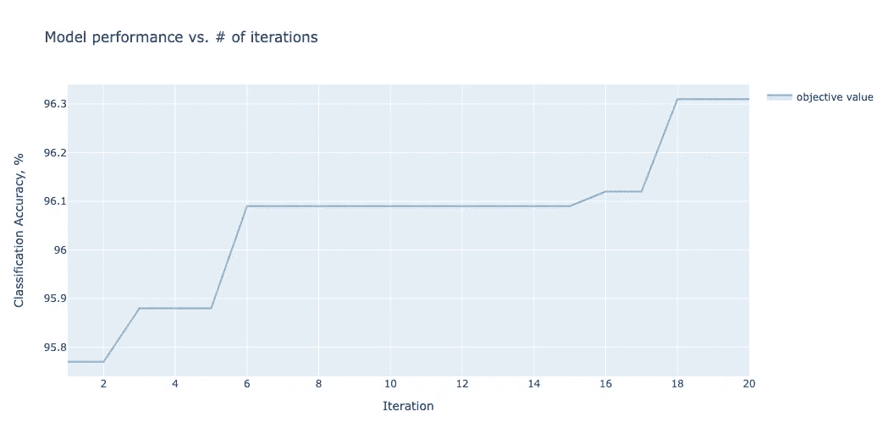

图 7\. ViTBNFFN 的收敛图。

现在可以进入步骤 2——我们使用优化的超参数训练和测试每个模型 30 个 epoch。30 个 epoch 的训练和测试指标比较总结在图 8 的四个图表中。

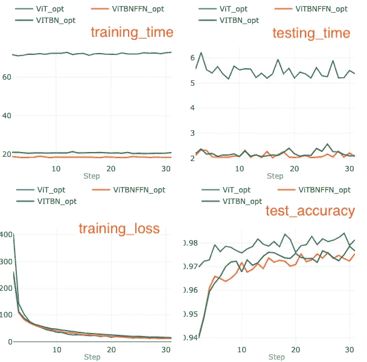

图 8。比较优化模型在 MNIST 数据集上训练和测试 30 个 epoch 的指标。

在 30 个 epoch 结束时，模型——ViT、ViTBNFFN 和 ViTBN——分别达到了 98.1%、97.6%和 97.8%的准确率。与 ViTBNFFN 和 ViTBN 相比，ViT 的收敛所需的 epoch 数较少。

从图 8 顶部的两幅图中可以明显看出，带有 BatchNorm 的模型在每个 epoch 的训练和推理速度上都有显著提升。对于 ViTBNFFN，rₜ和 rᵥ的比值可以从上述数据中计算得出：rₜ（ViTBNFFN）= 3.9，rᵥ（ViTBNFFN）= 2.6，而对于 ViTBN，则是 rₜ（ViTBN）= 3.5，rᵥ（ViTBN）= 2.5。表 3 总结了每个 epoch 的平均训练时间增益（gₜ）和平均推理时间增益（gᵥ）。

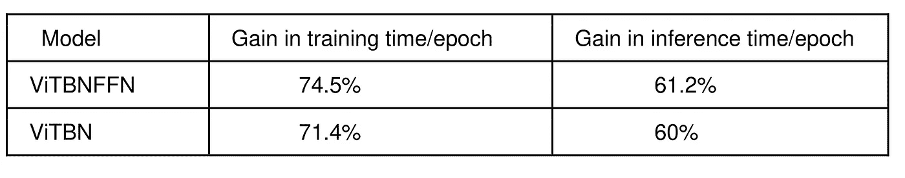

表 3。ViTBNFFN 和 ViTBN 相对于标准 ViT 在每个 epoch 的训练时间和推理时间的增益。

## 结果简要总结

现在让我们简要总结一下我们的研究：

1.  **在固定学习率下的训练和测试速度提升：** 相较于 ViT，ViTBNFFN 和 ViTBN 的每个 epoch 的平均训练时间显著加快。无论在什么学习率范围内，增益 gₜ都大于~60%，但根据学习率和模型的不同，这一增益可能会有显著差异，具体请见表 1。对于每个 epoch 的平均测试时间，也有显著的提升（~60%），但对于这两个模型而言，随着学习率的变化，这一提升大致保持不变。

1.  **优化模型的训练和测试速度提升：** 对于 ViTBNFFN 和 ViTBN 来说，每个 epoch 的平均训练时间的增益都超过 70%，而推理时间的增益则略高于 60%——gₜ和 gᵥ的具体值已总结在表 3 中。优化后的 ViT 模型比带有 BatchNorm 的模型收敛更快。

1.  **BatchNorm 与较高学习率：** 对于较小的学习率（~ 0.0005），所有三个模型都表现稳定，且 ViT 的收敛速度相比于 ViTBNFFN/ViTBN 更快。对于中等的学习率（~ 0.005），三个模型的收敛速度非常相似。对于较高的学习率（~ 0.01），ViT 变得不稳定，而 ViTBNFFN/ViTBN 模型保持稳定，并且其准确性与中等学习率的情况相当。因此，我们的研究结果验证了这样一个普遍预期：将 BatchNorm 集成到架构中，可以使用更高的学习率。

1.  **训练时间与学习率的变化：** 对于 ViT，当增加学习率时，每个周期的平均训练时间会大幅增加，而对于 ViTBNFFN，这一增加要小得多。另一方面，对于 ViTBN，训练时间变化最小。换句话说，ViTBN 对学习率变化的训练时间最为稳定。

## 结语

在本文中，我介绍了两种在 ViT 类型架构中集成 BatchNorm 的模型——其中一个在前馈网络中部署 BatchNorm（ViTBNFFN），而另一个则在各处用 BatchNorm 替代 LayerNorm（ViTBN）。从上述数值实验中，我们得出了两个主要结论。首先，使用 BatchNorm 的模型可以在使用较少的变换器层的情况下，达到与标准 ViT 相同（或更高）的准确性。这反过来加快了训练时间和推理时间。对于 MNIST 数据集，在我考虑的学习率范围内，每个周期的训练和测试时间至少加快了 60%。其次，使用 BatchNorm 的模型允许在训练过程中使用更大的学习率，而不会使模型不稳定。

此外，在本文中，我专注于标准的 ViT 架构。然而，显然可以将讨论扩展到其他基于变换器的计算机视觉架构。Yao 等人已经研究了在 DeiT（数据高效图像变换器）和 Swin Transformer 中集成 BatchNorm。我建议读者参考[这篇](https://openaccess.thecvf.com/content/ICCV2021W/NeurArch/papers/Yao_Leveraging_Batch_Normalization_for_Vision_Transformers_ICCVW_2021_paper.pdf)论文以获取更多细节。

感谢阅读！如果你已读完本文，请不要忘记留下评论！除非另有说明，本文中使用的所有图片和图表均由作者生成。
