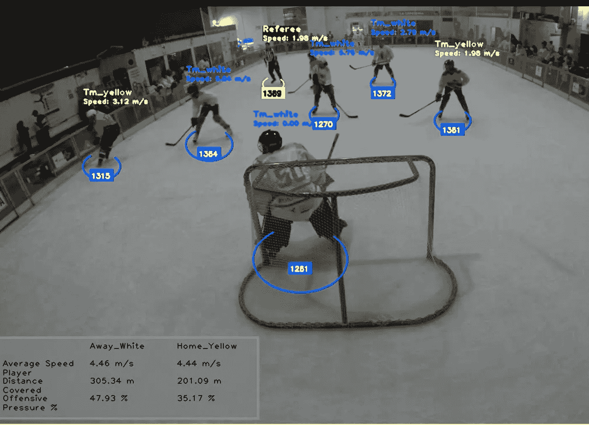
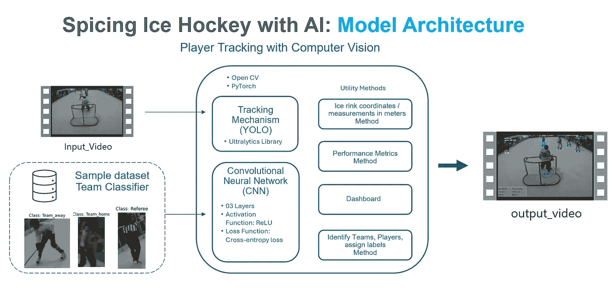
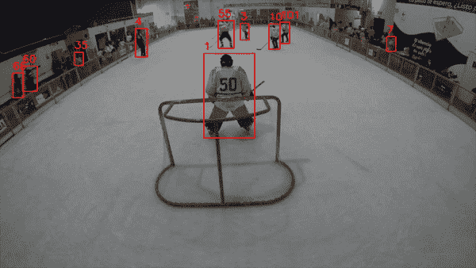
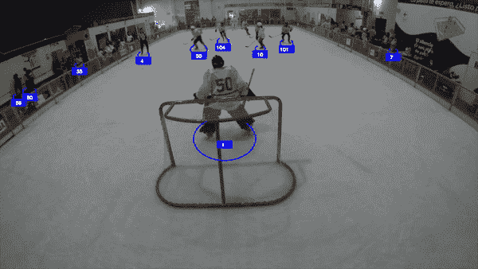
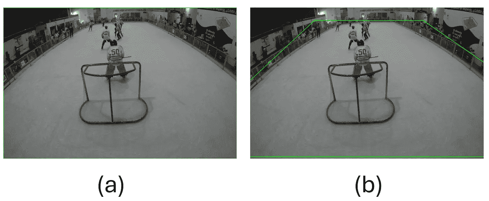
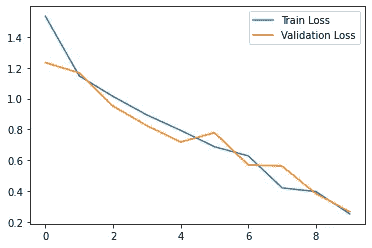
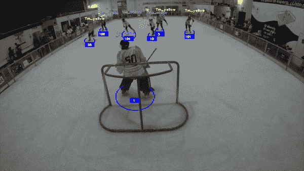
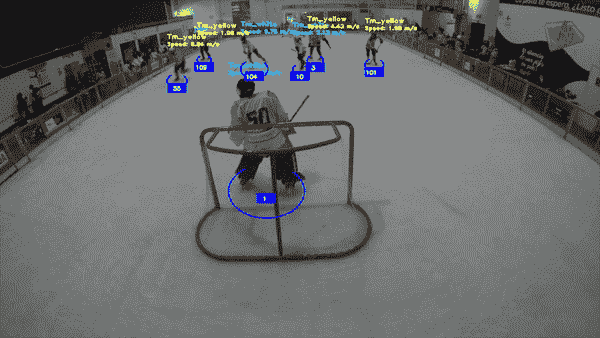
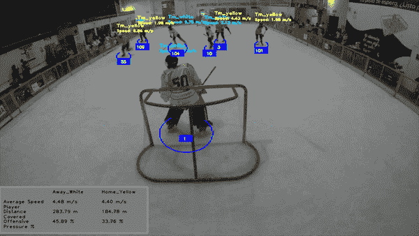

# 用 AI 为冰球增添趣味：利用计算机视觉进行球员追踪

> 原文：[`towardsdatascience.com/spicing-up-ice-hockey-with-ai-player-tracking-with-computer-vision-ce9ceec9122a?source=collection_archive---------0-----------------------#2024-07-09`](https://towardsdatascience.com/spicing-up-ice-hockey-with-ai-player-tracking-with-computer-vision-ce9ceec9122a?source=collection_archive---------0-----------------------#2024-07-09)



## 使用 PyTorch、计算机视觉技术和卷积神经网络（CNN），我开发了一个模型，可以追踪球员、球队以及基本的表现统计数据

[](https://medium.com/@raul.vizcarrach?source=post_page---byline--ce9ceec9122a--------------------------------)[](https://towardsdatascience.com/?source=post_page---byline--ce9ceec9122a--------------------------------) [Raul Vizcarra Chirinos](https://medium.com/@raul.vizcarrach?source=post_page---byline--ce9ceec9122a--------------------------------)

·发布于[Towards Data Science](https://towardsdatascience.com/?source=post_page---byline--ce9ceec9122a--------------------------------) ·30 分钟阅读·2024 年 7 月 9 日

--

现在，我不像以前那样频繁地打冰球了，但从小冰球就是我生活的一部分。最近，我有机会在利马举办的首届冰球锦标赛（3 对 3）中，协助裁判台并记录一些统计数据。此次活动得到了秘鲁滑冰曲棍球协会（APHL）的巨大支持，并且[友谊联盟](https://friendshipleague.org/)也亲切地参与其中。为了加入一些 AI 元素，我使用了**PyTorch**、**计算机视觉**技术和**卷积神经网络（CNN）**来构建一个模型，追踪球员和球队，并收集一些基本的表现数据。

本文旨在成为设计和部署该模型的**快速指南**。尽管模型仍需进行一些微调，但我希望它能帮助任何人入门计算机视觉在体育中的应用。我还要特别感谢并感谢[秘鲁滑冰曲棍球协会（APHL）](https://www.instagram.com/aphl.pe/?igsh=MThvZWxhNThwdXpibA%3D%3D)允许我使用比赛的 40 秒视频样本进行此项目（*你可以在*[*项目的 GitHub 仓库*](https://github.com/rvizcarra15/IceHockey_ComputerVision_PyTorch)*找到视频输入样本*）。

# 架构

在继续进行项目之前，我做了一些快速研究，找到一个可以作为基准的方向，以避免“重新发明轮子”。我发现，在使用计算机视觉追踪球员方面，有很多有趣的研究成果，尤其是在足球领域（*这并不令人惊讶，足球是世界上最受欢迎的团队运动*）。然而，我并没有找到很多冰球方面的资源。[Roboflow](https://universe.roboflow.com/search?q=hockey) 提供了一些有趣的预训练模型和数据集，用于训练自己的模型，但使用托管模型时出现了一些延迟问题，稍后我会进一步解释。最终，我借用了足球相关的资料来读取视频帧并获得单独的跟踪 ID，遵循了[这个教程](https://youtu.be/neBZ6huolkg?feature=shared)中解释的基本原理和跟踪方法（*如果你有兴趣更好地理解一些基本的计算机视觉技术，我建议至少观看前一个半小时的教程*）。

在覆盖了跟踪 ID 后，我开始构建自己的路径。在本文的过程中，我们将看到这个项目是如何从一个简单的物体检测任务发展成一个能够全面检测球员、球队并提供一些基本表现指标的模型的（*示例剪辑从 01 到 08，作者自创*）。



模型架构。作者自创

# 跟踪机制

跟踪机制是模型的核心。它确保视频中的每个检测到的物体都能被识别并分配一个唯一的标识符，保持该身份在每一帧中的一致性。跟踪机制的主要组成部分包括：

1.  **YOLO（You Only Look Once）：** 它是一种强大的实时物体检测算法，最初在 2015 年的论文“[You Only Look Once: Unified, Real-Time Object Detection](https://arxiv.org/abs/1506.02640)”中提出。它以速度和在大约 80 个预训练类别中的通用性为特点（*值得注意的是，它还可以在自定义数据集上进行训练，以检测特定物体*）。对于我们的使用案例，我们将依赖 YOLOv8x，这是一种由 Ultralytics 基于之前版本的 YOLO 构建的计算机视觉模型。你可以在[这里](https://github.com/ultralytics/ultralytics)下载它。

1.  **ByteTrack 跟踪器：** 要理解 ByteTrack，我们必须先了解多目标跟踪（MOT，Multiple Object Tracking），它涉及在视频序列中追踪多个物体的运动，并将当前帧中检测到的物体与前一帧中的相应物体进行关联。为了实现这一目标，我们将使用 ByteTrack（*2021 年在论文“[*ByteTrack: Multi-Object Tracking by Associating Every Detection Box*](https://arxiv.org/abs/2110.06864)”中提出*）。为了实现 ByteTrack 跟踪器并为检测到的物体分配轨迹 ID，我们将依赖 Python 的 supervision 库。

1.  **OpenCV：** 是一个广泛应用于各种计算机视觉任务的 Python 库。对于我们的用例，我们将依赖[OpenCV](https://opencv.org/)来可视化并标注视频帧中的边界框和每个检测物体的文本信息。

为了构建我们的追踪机制，我们将从以下两步开始：

+   使用 ByteTrack 部署 YOLO 模型来检测物体（在我们的例子中是球员）并分配唯一的追踪 ID。

+   初始化一个字典，将物体追踪信息存储在一个 pickle（pkl）文件中。这将极大地帮助我们避免每次运行代码时都需要逐帧执行视频物体检测过程，节省大量时间。

对于接下来的步骤，我们需要以下 Python 包：

```py
pip install ultralytics
pip install supervision
pip install opencv-python
```

接下来，我们将指定我们的库和样本视频文件以及 pickle 文件的路径（如果存在；如果没有，代码会创建一个并将其保存在相同路径下）：

```py
#**********************************LIBRARIES*********************************#
from ultralytics import YOLO
import supervision as sv
import pickle
import os
import cv2

# INPUT-video file
video_path = 'D:/PYTHON/video_input.mp4'
# OUTPUT-Video File
output_video_path = 'D:/PYTHON/output_video.mp4'
# PICKLE FILE (IF AVAILABLE LOADS IT IF NOT, SAVES IT IN THIS PATH)
pickle_path = 'D:/PYTHON/stubs/track_stubs.pkl'
```

现在让我们继续定义我们的追踪机制*（你可以在[*项目的 GitHub 仓库*](https://github.com/rvizcarra15/IceHockey_ComputerVision_PyTorch)中找到视频输入示例）*：

```py
#*********************************TRACKING MECHANISM**************************#
class HockeyAnalyzer:
    def __init__(self, model_path):
        self.model = YOLO(model_path) 
        self.tracker = sv.ByteTrack()

    def detect_frames(self, frames):
        batch_size = 20 
        detections = [] 
        for i in range(0, len(frames), batch_size):
            detections_batch = self.model.predict(frames[i:i+batch_size], conf=0.1)
            detections += detections_batch
        return detections

#********LOAD TRACKS FROM FILE OR DETECT OBJECTS-SAVES PICKLE FILE************#

    def get_object_tracks(self, frames, read_from_stub=False, stub_path=None):
        if read_from_stub and stub_path is not None and os.path.exists(stub_path):
            with open(stub_path, 'rb') as f:
                tracks = pickle.load(f)
            return tracks

        detections = self.detect_frames(frames)

        tracks = {"person": []}

        for frame_num, detection in enumerate(detections):
            cls_names = detection.names
            cls_names_inv = {v: k for k, v in cls_names.items()}

            # Tracking Mechanism
            detection_supervision = sv.Detections.from_ultralytics(detection)
            detection_with_tracks = self.tracker.update_with_detections(detection_supervision)
            tracks["person"].append({})

            for frame_detection in detection_with_tracks:
                bbox = frame_detection[0].tolist()
                cls_id = frame_detection[3]
                track_id = frame_detection[4]

                if cls_id == cls_names_inv.get('person', None):
                    tracks["person"][frame_num][track_id] = {"bbox": bbox}

            for frame_detection in detection_supervision:
                bbox = frame_detection[0].tolist()
                cls_id = frame_detection[3]

        if stub_path is not None:
            with open(stub_path, 'wb') as f:
                pickle.dump(tracks, f)

        return tracks

#***********************BOUNDING BOXES AND TRACK-IDs**************************#

    def draw_annotations(self, video_frames, tracks):
        output_video_frames = []
        for frame_num, frame in enumerate(video_frames):
            frame = frame.copy() 
            player_dict = tracks["person"][frame_num]

            # Draw Players
            for track_id, player in player_dict.items():
                color = player.get("team_color", (0, 0, 255))  
                bbox = player["bbox"]
                x1, y1, x2, y2 = map(int, bbox)         
            # Bounding boxes
                cv2.rectangle(frame, (x1, y1), (x2, y2), color, 2)
            # Track_id 
                cv2.putText(frame, str(track_id), (x1, y1 - 10), cv2.FONT_HERSHEY_SIMPLEX, 0.9, color, 2)

            output_video_frames.append(frame)

        return output_video_frames
```

该方法首先初始化 YOLO 模型和 ByteTrack 追踪器。接下来，每一帧以 20 帧为一批进行处理，使用 YOLO 模型检测并收集每批中的物体。如果 pickle 文件存在于路径中，它会从文件中预计算出追踪信息。如果 pickle 文件不存在*（你是第一次运行代码或者删除了之前的 pickle 文件）*，**get_object_tracks** 将每个检测转换为 ByteTrack 所需的格式，用这些检测更新追踪器，并将追踪信息保存在指定路径的一个新 pickle 文件中。最后，代码会迭代每一帧，为每个检测到的物体绘制边界框和追踪 ID。

要执行追踪器并保存带有边界框和追踪 ID 的新输出视频，你可以使用以下代码：

```py
#*************** EXECUTES TRACKING MECHANISM AND OUTPUT VIDEO****************#

# Read the video frames
video_frames = []
cap = cv2.VideoCapture(video_path)
while cap.isOpened():
    ret, frame = cap.read()
    if not ret:
        break
    video_frames.append(frame)
cap.release()

#********************* EXECUTE TRACKING METHOD WITH YOLO**********************#
tracker = HockeyAnalyzer('D:/PYTHON/yolov8x.pt')
tracks = tracker.get_object_tracks(video_frames, read_from_stub=True, stub_path=pickle_path)
annotated_frames = tracker.draw_annotations(video_frames, tracks)

#*********************** SAVES VIDEO FILE ************************************#
fourcc = cv2.VideoWriter_fourcc(*'mp4v')
height, width, _ = annotated_frames[0].shape
out = cv2.VideoWriter(output_video_path, fourcc, 30, (width, height))

for frame in annotated_frames:
    out.write(frame)
out.release()
```

如果你的代码一切正常，你应该会得到一个类似于**示例剪辑 01**的视频输出。



示例剪辑 01：基础追踪机制（物体与追踪 ID）

> **提示 #01：** 不要低估你的计算能力！第一次运行代码时，预计帧处理可能会花费一些时间，这取决于你的计算能力。对我来说，使用 CPU 配置处理大约需要 45 到 50 分钟（可以考虑使用 CUDA 作为选项）。尽管 YOLOv8x 追踪机制非常强大，但它需要相当大的计算资源（有时我的内存占用率达到了 99%，希望它没有崩溃！🙄）。如果你遇到 YOLO 的此版本问题，可以访问[Ultralytics’ GitHub](https://github.com/ultralytics/ultralytics)，那里有更轻量的模型来平衡准确性和计算能力。

# 冰球场

正如你从第一步中看到的，我们遇到了一些挑战。首先，正如预期的那样，模型捕捉到所有移动物体，包括球员、裁判，甚至冰场外的物体。其次，这些红色边界框会让跟踪球员变得有些不清晰，也不太适合展示。在这一部分中，我们将专注于将检测范围缩小到仅冰场内的物体。同时，我们会将底部的边界框替换为椭圆，以确保更清晰的可视性。

让我们先从使用矩形框切换到使用椭圆。为了实现这一点，我们只需在现有代码中的标签和边界框方法上方添加一个新的方法：

```py
#************ Design of Ellipse for tracking players instead of Bounding boxes**************#

    def draw_ellipse(self, frame, bbox, color, track_id=None, team=None):
        y2 = int(bbox[3])
        x_center = (int(bbox[0]) + int(bbox[2])) // 2
        width = int(bbox[2]) - int(bbox[0])
        color = (255, 0, 0)
        text_color = (255, 255, 255)

        cv2.ellipse(
            frame,
            center=(x_center, y2),
            axes=(int(width) // 2, int(0.35 * width)),
            angle=0.0,
            startAngle=-45,
            endAngle=235,
            color=color,
            thickness=2,
            lineType=cv2.LINE_4
        )

        if track_id is not None:
            rectangle_width = 40
            rectangle_height = 20
            x1_rect = x_center - rectangle_width // 2
            x2_rect = x_center + rectangle_width // 2
            y1_rect = (y2 - rectangle_height // 2) + 15
            y2_rect = (y2 + rectangle_height // 2) + 15

            cv2.rectangle(frame,
                          (int(x1_rect), int(y1_rect)),
                          (int(x2_rect), int(y2_rect)),
                          color,
                          cv2.FILLED)

            x1_text = x1_rect + 12
            if track_id > 99:
                x1_text -= 10
            font_scale = 0.4
            cv2.putText(
                frame,
                f"{track_id}",
                (int(x1_text), int(y1_rect + 15)),
                cv2.FONT_HERSHEY_SIMPLEX,
                font_scale,
                text_color,
                thickness=2
            )

        return frame
```

我们还需要更新注释步骤，通过调用椭圆方法来替换边界框和 ID：

```py
#***********************BOUNDING BOXES AND TRACK-IDs**************************#

    def draw_annotations(self, video_frames, tracks):
        output_video_frames = []
        for frame_num, frame in enumerate(video_frames):
            frame = frame.copy() 
            player_dict = tracks["person"][frame_num]

            # Draw Players
            for track_id, player in player_dict.items():
                bbox = player["bbox"]

            # Draw ellipse and tracking IDs
                self.draw_ellipse(frame, bbox, (0, 255, 0), track_id)

                x1, y1, x2, y2 = map(int, bbox)

            output_video_frames.append(frame)

        return output_video_frames
```

通过这些修改，你的视频输出应该看起来更整洁，如**示例剪辑 02**所示。



示例剪辑 02：用椭圆替代边界框

现在，为了处理冰场边界，我们需要对计算机视觉中的分辨率有一些基本了解。在我们的使用场景中，我们使用的是 720p（1280x720 像素）格式，这意味着我们处理的每一帧图像的尺寸为 1280 像素（宽度）乘 720 像素（高度）。

***使用 720p（1280x720 像素）格式意味着什么？*** 这意味着图像由 1280 个水平像素和 720 个垂直像素组成。在这种格式下，坐标从图像的左上角（0, 0）开始，x 坐标随着向右移动而增加，y 坐标随着向下移动而增加。这些坐标用于标记图像中的特定区域，比如使用（x1, y1）表示左上角，使用（x2, y2）表示矩形框的右下角。理解这一点有助于我们测量距离和速度，并决定在视频中关注的分析区域。

也就是说，我们将使用以下代码开始标记帧边框为绿色线条：

```py
#********************* Border Definition for Frame***********************
import cv2

video_path = 'D:/PYTHON/video_input.mp4'
cap = cv2.VideoCapture(video_path)

#**************Read, Define and Draw corners of the frame****************
ret, frame = cap.read()

bottom_left = (0, 720)
bottom_right = (1280, 720)
upper_left = (0, 0)
upper_right = (1280, 0)

cv2.line(frame, bottom_left, bottom_right, (0, 255, 0), 2)
cv2.line(frame, bottom_left, upper_left, (0, 255, 0), 2)
cv2.line(frame, bottom_right, upper_right, (0, 255, 0), 2)
cv2.line(frame, upper_left, upper_right, (0, 255, 0), 2)

#*******************Save the frame with marked corners*********************
output_image_path = 'rink_area_marked_VALIDATION.png'
cv2.imwrite(output_image_path, frame)
print("Rink area saved:", output_image_path)
```

结果应该是一个绿色矩形，如**示例剪辑 03**中（a）所示。但为了只追踪冰场内的移动物体，我们需要一个更像（b）中的边界。



图 03：冰场边界定义（作者自创）

得到（b）的正确边界就像一个反复试验的过程，你需要测试不同的坐标，直到找到最适合你模型的边界。最初，我的目标是完全匹配冰场边界。然而，跟踪系统在边缘附近存在困难。为了提高准确性，我稍微扩大了边界，以确保所有冰场内的跟踪物体都被捕捉到，同时排除场外的物体。最终的结果，如（b）所示，是我能得到的最好的结果*(你仍然可以尝试更好的情况)*，由这些坐标定义：

+   左下角： (-450, 710)

+   右下角： (2030, 710)

+   左上角： (352, 61)

+   右上角： (948, 61)

最后，我们将定义两个额外的区域：白队和黄队的**进攻区**（*每个队伍的目标区域*）。这将使我们能够收集每个队伍在其对手区域内的一些基本位置统计数据和压力指标。


图 04：进攻区（作者自创）

```py
#**************YELLOW TEAM OFFENSIVE ZONE****************
Bottom Left Corner: (-450, 710)
Bottom Right Corner: (2030, 710)
Upper Left Corner: (200, 150)
Upper Right Corner: (1160, 150)

#**************WHITE TEAM OFFENSIVE ZONE****************
Bottom Left Corner: (180, 150)
Bottom Right Corner: (1100, 150)
Upper Left Corner: (352, 61)
Upper Right Corner: (900, 61)
```

我们现在先暂时搁置这些坐标，并在下一步中解释我们将如何对每个团队进行分类。然后，我们将把所有内容汇总到我们最初的跟踪方法中。

# 使用深度学习进行团队预测

自从 1943 年 Warren McCulloch 和 Walter Pitts 发表了《*[*神经活动中固有思想的逻辑演算*](https://www.cs.cmu.edu/~./epxing/Class/10715/reading/McCulloch.and.Pitts.pdf)*》一文以来，已经过去了 80 多年。这篇论文为早期的神经网络研究奠定了坚实的基础。后来，在 1957 年，一个简化的神经元数学模型（*接收输入、对这些输入应用权重、对其求和并输出二进制结果*）启发了[Frank Rosenblatt 构建了 Mark I](https://news.cornell.edu/stories/2019/09/professors-perceptron-paved-way-ai-60-years-too-soon)。这是第一个硬件实现，旨在展示[感知机](https://www.ling.upenn.edu/courses/cogs501/Rosenblatt1958.pdf)的概念，这是一种能够从数据中学习并进行二分类的神经网络模型。从那时起，让计算机像我们一样思考的追求就没有停歇。如果这是你第一次深入学习神经网络，或者你想要刷新并巩固你的知识，我推荐阅读[Shreya Rao 的这系列文章](https://medium.com/@shreya.rao/list/deep-learning-illustrated-ae6c27de1640)，作为深度学习的一个很好的起点。此外，你还可以访问我收集的[这系列故事（不同的贡献者）](https://medium.com/@raul.vizcarrach/list/neural-networks-098e9b594f19)，你可能会发现它们有用。

***为什么选择卷积神经网络（CNN）？*** 说实话，这并不是我最初的选择。最初，我尝试使用[LandingAI](https://landing.ai/)，一个适合云部署的用户友好平台，并且支持通过[Python API 连接](https://landing.ai/blog/build-your-custom-computer-vision-app-with-python-library)。然而，出现了延迟问题（*需要处理超过 1,000 帧的数据*）。即便是在[Roboflow](https://universe.roboflow.com/)的预训练模型中，尽管它们提供了高质量的数据集和模型，仍然遇到了类似的延迟问题。意识到必须在本地运行后，我尝试了基于均方误差（MSE）的方法来分类队伍和裁判的球衣颜色。尽管这种方法看似是最终解决方案，但其准确性较低。经过几天的反复试验，我最终转向了 CNN。在众多深度学习方法中，CNN 非常适合进行物体检测，而 LSTM 或 RNN 更适用于像语言转录或翻译等序列数据。

在深入研究代码之前，让我们先了解一些关于其架构的基本概念：

+   **学习的样本数据集：** 数据集已被分为三类：**裁判**、**客队**（白色球衣的球员）和**主队**（黄色球衣的球员）。每一类的样本被分为两个子集：训练数据和验证数据。训练数据将在每次迭代（Epoch）中被 CNN 使用，用以“学习”多个层次中的模式。验证数据将在每次迭代结束时用来评估模型的表现，并衡量模型对新数据的泛化能力。创建样本数据集并不困难；我大约花了 30 到 40 分钟的时间，从视频中裁剪出每一类的样本图像并将它们整理到子目录中。我成功创建了一个约 90 张图像的样本数据集，你可以在[项目的 GitHub 仓库](https://github.com/rvizcarra15/IceHockey_ComputerVision_PyTorch)中找到。

+   **模型是如何学习的？** 输入数据会通过神经网络的每一层，每一层可以是一个或多个相互连接的层，用来进行预测。每一层都使用激活函数来处理数据，从而进行预测或对数据进行更改。这些层之间的每个连接都有一个权重，决定了一个层的输出对下一个层的影响程度。目标是找到这些权重的正确组合，以最小化预测结果的错误。通过一个叫做反向传播的过程和损失函数，模型会调整这些权重，以减少误差并提高准确性。这个过程会在所谓的**Epoch（前向传播 + 反向传播）**中重复进行，随着每个周期模型从错误中学习，它在预测上的表现也会逐渐变好。

+   **激活函数:** 如前所述，激活函数在模型学习过程中扮演着重要角色。我选择了**ReLU（修正线性单元）**，因为它在计算上非常高效，并能缓解所谓的消失梯度问题*（即多层网络可能无法有效学习）*。虽然 ReLU 工作得很好，[其他函数](https://www.v7labs.com/blog/neural-networks-activation-functions)如**sigmoid**、**tanh**或**swish**也有其应用，具体取决于网络的复杂性。

+   **训练轮数（Epochs）:** 设置合适的训练轮数需要实验。你应该考虑数据集的复杂性、CNN 模型的架构和计算资源等因素。在大多数情况下，最好在每次迭代中监控模型的表现，并在改进变得微乎其微时停止训练，以避免过拟合。考虑到我小的训练数据集，**我决定以 10 轮为基准**开始。然而，在其他情况下，根据指标表现和验证结果，可能需要做出调整。

+   **Adam（自适应矩估计）:** 最终目标是减少预测输出与真实输出之间的误差。如前所述，反向传播在此过程中起着关键作用，通过调整和更新神经网络权重来随着时间的推移改进预测。反向传播基于损失函数的梯度处理权重更新，而 Adam 算法通过动态调整学习率来进一步优化这一过程，从而逐步减少误差或损失函数。换句话说，它微调了模型学习的速度。

也就是说，为了运行我们的 CNN 模型，我们需要以下 Python 包：

```py
pip install torch torchvision 
pip install matplotlib 
pip install scikit-learn
```

> **提示-02:** 确保 PyTorch 正确安装。我所有的工具都在 Anaconda 环境中设置，当我安装 PyTorch 时，一开始看起来它似乎正确安装了。然而，在运行一些库时出现了一些问题。最初，我以为是代码的问题，但经过多次修改仍然没有成功，我只好重新安装 Anaconda，并在干净的环境中重新安装 PyTorch，问题就这样解决了！

接下来，我们将指定我们的库和样本数据集的路径：

```py
# ************CONVOLUTIONAL NEURAL NETWORK-THREE CLASSES DETECTION**************************
# REFEREE
# WHITE TEAM (Team_away)
# YELLOW TEAM (Team_home)

import os
import torch
import torch.nn as nn
import torch.optim as optim
import torch.nn.functional as F
import torchvision.transforms as transforms
import torchvision.datasets as datasets
from torch.utils.data import DataLoader
from sklearn.metrics import accuracy_score, precision_score, recall_score, f1_score
import matplotlib.pyplot as plt

#Training and Validation Datasets
#Download the teams_sample_dataset file from the project's GitHub repository
data_dir = 'D:/PYTHON/teams_sample_dataset' 
```

首先，我们将确保每张图片的大小一致（调整为 150x150 像素），然后将其转换为代码能够理解的格式（在 PyTorch 中，输入数据通常表示为 Tensor 对象）。最后，我们将调整颜色，以便模型更容易处理（归一化），并设置加载图片的程序。这些步骤共同帮助准备图片，并将它们整理好，使模型能够有效地从中学习，避免因数据格式导致的偏差。

```py
#******************************Data transformation***********************************
transform = transforms.Compose([
    transforms.Resize((150, 150)),
    transforms.ToTensor(),
    transforms.Normalize(mean=[0.5, 0.5, 0.5], std=[0.5, 0.5, 0.5])
])

# Load dataset
train_dataset = datasets.ImageFolder(os.path.join(data_dir, 'train'), transform=transform)
val_dataset = datasets.ImageFolder(os.path.join(data_dir, 'val'), transform=transform)

train_loader = DataLoader(train_dataset, batch_size=32, shuffle=True)
val_loader = DataLoader(val_dataset, batch_size=32, shuffle=False)
```

接下来，我们将定义 CNN 的架构：

```py
#********************************CNN Model Architecture**************************************
class CNNModel(nn.Module):
    def __init__(self):
        super(CNNModel, self).__init__()
        self.conv1 = nn.Conv2d(3, 32, kernel_size=3, padding=1)
        self.pool = nn.MaxPool2d(kernel_size=2, stride=2, padding=0)
        self.conv2 = nn.Conv2d(32, 64, kernel_size=3, padding=1)
        self.conv3 = nn.Conv2d(64, 128, kernel_size=3, padding=1)
        self.fc1 = nn.Linear(128 * 18 * 18, 512)
        self.dropout = nn.Dropout(0.5)
        self.fc2 = nn.Linear(512, 3)  #Three Classes (Referee, Team_away,Team_home)

    def forward(self, x):
        x = self.pool(F.relu(self.conv1(x)))
        x = self.pool(F.relu(self.conv2(x)))
        x = self.pool(F.relu(self.conv3(x)))
        x = x.view(-1, 128 * 18 * 18)
        x = F.relu(self.fc1(x))
        x = self.dropout(x)
        x = self.fc2(x)  
        return x
```

你会注意到我们的 CNN 模型有三层（conv1，conv2，conv3）。数据首先进入卷积层（conv），在这里应用了激活函数（ReLU）。该函数使得网络能够学习数据中的复杂模式和关系。接着，池化层被激活。***什么是最大池化？***它是一种减少图像大小的技术，同时保留重要特征，有助于高效训练并优化内存资源。这个过程在 conv1 到 conv3 之间重复进行。最后，数据通过全连接层（fc1，fc2）进行最终分类（或决策）。

下一步，我们初始化模型，配置类别交叉熵为损失函数*(通常用于分类任务)*，并将 Adam 作为优化器。如前所述，我们将在 10 个周期内执行模型。

```py
#********************************CNN TRAINING**********************************************

# Model-loss function-optimizer
model = CNNModel()
criterion = nn.CrossEntropyLoss()
optimizer = optim.Adam(model.parameters(), lr=0.001)

#*********************************Training*************************************************
num_epochs = 10
train_losses, val_losses = [], []

for epoch in range(num_epochs):
    model.train()
    running_loss = 0.0
    for inputs, labels in train_loader:
        optimizer.zero_grad()
        outputs = model(inputs)
        labels = labels.type(torch.LongTensor)  
        loss = criterion(outputs, labels)
        loss.backward()
        optimizer.step()
        running_loss += loss.item()

    train_losses.append(running_loss / len(train_loader))

    model.eval()
    val_loss = 0.0
    all_labels = []
    all_preds = []
    with torch.no_grad():
        for inputs, labels in val_loader:
            outputs = model(inputs)
            labels = labels.type(torch.LongTensor)  
            loss = criterion(outputs, labels)
            val_loss += loss.item()
            _, preds = torch.max(outputs, 1)  
            all_labels.extend(labels.tolist())
            all_preds.extend(preds.tolist())
```

为了跟踪性能，我们将添加一些代码来跟踪训练进度，打印验证指标并绘制图表。最后，我们将模型保存为**hockey_team_classifier.pth**，保存在你选择的指定路径中。

```py
#********************************METRICS & PERFORMANCE************************************

    val_losses.append(val_loss / len(val_loader))
    val_accuracy = accuracy_score(all_labels, all_preds)
    val_precision = precision_score(all_labels, all_preds, average='macro', zero_division=1)
    val_recall = recall_score(all_labels, all_preds, average='macro', zero_division=1)
    val_f1 = f1_score(all_labels, all_preds, average='macro', zero_division=1)

    print(f"Epoch [{epoch + 1}/{num_epochs}], "
          f"Loss: {train_losses[-1]:.4f}, "
          f"Val Loss: {val_losses[-1]:.4f}, "
          f"Val Acc: {val_accuracy:.2%}, "
          f"Val Precision: {val_precision:.4f}, "
          f"Val Recall: {val_recall:.4f}, "
          f"Val F1 Score: {val_f1:.4f}")

#*******************************SHOW METRICS & PERFORMANCE**********************************
plt.plot(train_losses, label='Train Loss')
plt.plot(val_losses, label='Validation Loss')
plt.legend()
plt.show()

# SAVE THE MODEL FOR THE GH_CV_track_teams CODE
torch.save(model.state_dict(), 'D:/PYTHON/hockey_team_classifier.pth')
```

此外，除了你的“pth”文件，在完成上述所有步骤后*(你可以在[*项目的 GitHub 仓库*](https://github.com/rvizcarra15/IceHockey_ComputerVision_PyTorch)中找到完整代码)*，你应该能看到如下输出（指标可能略有不同）：



图 05：CNN 模型性能指标

```py
#**************CNN PERFORMANCE ACROSS TRAINING EPOCHS************************

Epoch [1/10], Loss: 1.5346, Val Loss: 1.2339, Val Acc: 47.37%, Val Precision: 0.7172, Val Recall: 0.5641, Val F1 Score: 0.4167
Epoch [2/10], Loss: 1.1473, Val Loss: 1.1664, Val Acc: 55.26%, Val Precision: 0.6965, Val Recall: 0.6296, Val F1 Score: 0.4600
Epoch [3/10], Loss: 1.0139, Val Loss: 0.9512, Val Acc: 57.89%, Val Precision: 0.6054, Val Recall: 0.6054, Val F1 Score: 0.5909
Epoch [4/10], Loss: 0.8937, Val Loss: 0.8242, Val Acc: 60.53%, Val Precision: 0.7222, Val Recall: 0.5645, Val F1 Score: 0.5538
Epoch [5/10], Loss: 0.7936, Val Loss: 0.7177, Val Acc: 63.16%, Val Precision: 0.6667, Val Recall: 0.6309, Val F1 Score: 0.6419
Epoch [6/10], Loss: 0.6871, Val Loss: 0.7782, Val Acc: 68.42%, Val Precision: 0.6936, Val Recall: 0.7128, Val F1 Score: 0.6781
Epoch [7/10], Loss: 0.6276, Val Loss: 0.5684, Val Acc: 78.95%, Val Precision: 0.8449, Val Recall: 0.7523, Val F1 Score: 0.7589
Epoch [8/10], Loss: 0.4198, Val Loss: 0.5613, Val Acc: 86.84%, Val Precision: 0.8736, Val Recall: 0.8958, Val F1 Score: 0.8653
Epoch [9/10], Loss: 0.3959, Val Loss: 0.3824, Val Acc: 92.11%, Val Precision: 0.9333, Val Recall: 0.9213, Val F1 Score: 0.9243
Epoch [10/10], Loss: 0.2509, Val Loss: 0.2651, Val Acc: 97.37%, Val Precision: 0.9762, Val Recall: 0.9792, Val F1 Score: 0.9769 
```

完成 10 个训练周期后，CNN 模型的性能指标有所改善。最初，在第 1 个周期时，模型的训练损失为 1.5346，验证准确率为 47.37%。***我们应如何理解这个初始点？***

**准确率**是评估分类性能最常见的指标之一。在我们的案例中，它表示正确预测的类别占总类别的比例。**然而，单靠高准确率并不能保证整体模型的表现**；你仍然可能在某些类别上做出不好的预测（正如我在早期实验中所经历的那样）。关于**训练损失**，它衡量模型将输入数据映射到正确标签的效果。由于我们使用的是分类函数，**交叉熵损失**量化了预测的类别概率与实际标签之间的差异。像 1.5346 这样的初始值表示预测类别与实际类别之间存在显著差异；理想情况下，随着训练的进行，这个值应该趋近于 0。随着训练周期的进行，我们观察到训练损失显著下降，验证准确率提高。到最后一个训练周期时，训练损失和验证损失分别降到 0.2509 和 0.2651 的最低点。

为了测试我们的 CNN 模型，我们可以选择一部分球员图像并评估其预测能力。为了测试，你可以运行以下代码并使用 [项目的 GitHub 仓库](https://github.com/rvizcarra15/IceHockey_ComputerVision_PyTorch)中的**validation_dataset 文件夹**。

```py
# *************TEST CNN MODEL WITH SAMPLE DATASET***************************

import os
import torch
import torch.nn as nn
import torch.nn.functional as F
import torchvision.transforms as transforms
from PIL import Image

# SAMPLE DATASET FOR VALIDATION
test_dir = 'D:/PYTHON/validation_dataset'

# CNN MODEL FOR TEAM PREDICTIONS
class CNNModel(nn.Module):
    def __init__(self):
        super(CNNModel, self).__init__()
        self.conv1 = nn.Conv2d(3, 32, kernel_size=3, padding=1)
        self.pool = nn.MaxPool2d(kernel_size=2, stride=2, padding=0)
        self.conv2 = nn.Conv2d(32, 64, kernel_size=3, padding=1)
        self.conv3 = nn.Conv2d(64, 128, kernel_size=3, padding=1)
        self.fc1 = nn.Linear(128 * 18 * 18, 512)
        self.dropout = nn.Dropout(0.5)
        self.fc2 = nn.Linear(512, 3) 

    def forward(self, x):
        x = self.pool(F.relu(self.conv1(x)))
        x = self.pool(F.relu(self.conv2(x)))
        x = self.pool(F.relu(self.conv3(x)))
        x = x.view(-1, 128 * 18 * 18)
        x = F.relu(self.fc1(x))
        x = self.dropout(x)
        x = self.fc2(x)  
        return x

# CNN MODEL PREVIOUSLY SAVED
model = CNNModel()
model.load_state_dict(torch.load('D:/PYTHON/hockey_team_classifier.pth'))
model.eval()

transform = transforms.Compose([
    transforms.Resize((150, 150)),
    transforms.ToTensor(),
    transforms.Normalize(mean=[0.5, 0.5, 0.5], std=[0.5, 0.5, 0.5])
])

#******************ITERATION ON SAMPLE IMAGES-ACCURACY TEST*****************************

class_names = ['team_referee', 'team_away', 'team_home']

def predict_image(image_path, model, transform):
# LOADS DATASET
    image = Image.open(image_path)
    image = transform(image).unsqueeze(0)  

# MAKES PREDICTIONS
    with torch.no_grad():
        output = model(image)
        _, predicted = torch.max(output, 1)  
        team = class_names[predicted.item()]
    return team

for image_name in os.listdir(test_dir):
    image_path = os.path.join(test_dir, image_name)
    if os.path.isfile(image_path):  
        predicted_team = predict_image(image_path, model, transform)
        print(f'Image {image_name}: The player belongs to {predicted_team}')
```

输出应如下所示：

```py
 # *************CNN MODEL TEST - OUTPUT ***********************************#

Image Away_image04.jpg: The player belongs to team_away
Image Away_image12.jpg: The player belongs to team_away
Image Away_image14.jpg: The player belongs to team_away
Image Home_image07.jpg: The player belongs to team_home
Image Home_image13.jpg: The player belongs to team_home
Image Home_image16.jpg: The player belongs to team_home
Image Referee_image04.jpg: The player belongs to team_referee
Image Referee_image09.jpg: The player belongs to team_referee
Image Referee_image10.jpg: The player belongs to team_referee
Image Referee_image11.jpg: The player belongs to team_referee
```

如你所见，模型在识别队伍并排除裁判作为队员方面表现得相当不错。

> **小贴士 #03：** 在 CNN 设计过程中我学到的一点是，增加复杂性并不总能提升性能。一开始，我尝试了更深的模型（更多的卷积层）和基于颜色的增强来提高球员球衣的识别率。然而，在我的小数据集上，我遇到了过拟合，而不是学习到可以泛化的特征（所有图像都被预测为白队球员或裁判）。正则化技术，如 dropout 和批量归一化也很重要；它们有助于在训练过程中施加约束，确保模型能够很好地泛化到新数据。少即是多，结果有时会更好😁。

# **将一切整合在一起**

将所有内容整合在一起需要对我们之前描述的跟踪机制进行一些调整。下面是更新后的代码逐步解析。

首先，我们将设置所需的库和路径。请注意，现在已经指定了 pickle 文件和 CNN 模型的路径。**这次，如果找不到路径中的 pickle 文件，代码将抛出一个错误**。如果需要，使用之前的代码生成 pickle 文件，并使用此更新版本来执行视频分析：

```py
 import cv2
import numpy as np
from ultralytics import YOLO
import pickle
import torch
import torch.nn as nn
import torch.nn.functional as F
import torchvision.transforms as transforms
from PIL import Image

# MODEL INPUTS
model_path = 'D:/PYTHON/yolov8x.pt'
video_path = 'D:/PYTHON/video_input.mp4'
output_path = 'D:/PYTHON/output_video.mp4'
tracks_path = 'D:/PYTHON/stubs/track_stubs.pkl'
classifier_path = 'D:/PYTHON/hockey_team_classifier.pth'
```

接下来，我们将加载模型，指定冰场坐标，并启动每帧图像的批量检测过程，每次批量为 20 帧，和之前一样。请注意，目前我们只会使用冰场边界来聚焦分析范围。文章的最后几步中，当我们包含性能统计时，我们将使用进攻区坐标。

```py
 #*************************** Loads models and rink coordinates********************#
class_names = ['Referee', 'Tm_white', 'Tm_yellow']

class HockeyAnalyzer:
    def __init__(self, model_path, classifier_path):
        self.model = YOLO(model_path)
        self.classifier = self.load_classifier(classifier_path)
        self.transform = transforms.Compose([
            transforms.Resize((150, 150)),
            transforms.ToTensor(),
            transforms.Normalize(mean=[0.5, 0.5, 0.5], std=[0.5, 0.5, 0.5])
        ])
        self.rink_coordinates = np.array([[-450, 710], [2030, 710], [948, 61], [352, 61]])
        self.zone_white = [(180, 150), (1100, 150), (900, 61), (352, 61)]
        self.zone_yellow = [(-450, 710), (2030, 710), (1160, 150), (200, 150)]

#******************** Detect objects in each frame **********************************#
    def detect_frames(self, frames):
        batch_size = 20 
        detections = [] 
        for i in range(0, len(frames), batch_size):
            detections_batch = self.model.predict(frames[i:i+batch_size], conf=0.1)
            detections += detections_batch
        return detections
```

接下来，我们将添加预测每个球员队伍的过程：

```py
#*********************** Loads CNN Model**********************************************#

    def load_classifier(self, classifier_path):
        model = CNNModel()
        model.load_state_dict(torch.load(classifier_path, map_location=torch.device('cpu')))
        model.eval()
        return model

    def predict_team(self, image):
        with torch.no_grad():
            output = self.classifier(image)
            _, predicted = torch.max(output, 1)
            predicted_index = predicted.item()
            team = class_names[predicted_index]
        return team
```

作为下一步，我们将添加之前描述的方法，从边界框转换为椭圆形：

```py
#************ Ellipse for tracking players instead of Bounding boxes*******************#
    def draw_ellipse(self, frame, bbox, color, track_id=None, team=None):
        y2 = int(bbox[3])
        x_center = (int(bbox[0]) + int(bbox[2])) // 2
        width = int(bbox[2]) - int(bbox[0])

        if team == 'Referee':
            color = (0, 255, 255)
            text_color = (0, 0, 0)
        else:
            color = (255, 0, 0)
            text_color = (255, 255, 255)

        cv2.ellipse(
            frame,
            center=(x_center, y2),
            axes=(int(width) // 2, int(0.35 * width)),
            angle=0.0,
            startAngle=-45,
            endAngle=235,
            color=color,
            thickness=2,
            lineType=cv2.LINE_4
        )

        if track_id is not None:
            rectangle_width = 40
            rectangle_height = 20
            x1_rect = x_center - rectangle_width // 2
            x2_rect = x_center + rectangle_width // 2
            y1_rect = (y2 - rectangle_height // 2) + 15
            y2_rect = (y2 + rectangle_height // 2) + 15

            cv2.rectangle(frame,
                          (int(x1_rect), int(y1_rect)),
                          (int(x2_rect), int(y2_rect)),
                          color,
                          cv2.FILLED)

            x1_text = x1_rect + 12
            if track_id > 99:
                x1_text -= 10
            font_scale = 0.4
            cv2.putText(
                frame,
                f"{track_id}",
                (int(x1_text), int(y1_rect + 15)),
                cv2.FONT_HERSHEY_SIMPLEX,
                font_scale,
                text_color,
                thickness=2
            )

        return frame
```

现在，是时候添加分析器了，它包括读取 pickle 文件、将分析范围缩小到我们之前定义的冰场边界，并调用 CNN 模型以识别每个球员的队伍并添加标签。请注意，我们包括了一个特性，用不同的颜色标记裁判，并且改变他们椭圆形的颜色。代码的最后会将处理过的帧写入输出视频。

```py
#******************* Loads Tracked Data (pickle file )**********************************#

    def analyze_video(self, video_path, output_path, tracks_path):
          with open(tracks_path, 'rb') as f:
              tracks = pickle.load(f)

          cap = cv2.VideoCapture(video_path)
          if not cap.isOpened():
              print("Error: Could not open video.")
              return

          fps = cap.get(cv2.CAP_PROP_FPS)
          frame_width = int(cap.get(cv2.CAP_PROP_FRAME_WIDTH))
          frame_height = int(cap.get(cv2.CAP_PROP_FRAME_HEIGHT))

          fourcc = cv2.VideoWriter_fourcc(*'XVID')
          out = cv2.VideoWriter(output_path, fourcc, fps, (frame_width, frame_height))

          frame_num = 0
          while cap.isOpened():
              ret, frame = cap.read()
              if not ret:
                  break

#***********Checks if the player falls within the rink area**********************************#
              mask = np.zeros(frame.shape[:2], dtype=np.uint8)
              cv2.fillConvexPoly(mask, self.rink_coordinates, 1)
              mask = mask.astype(bool)
              # Draw rink area
              #cv2.polylines(frame, [self.rink_coordinates], isClosed=True, color=(0, 255, 0), thickness=2)

              # Get tracks from frame
              player_dict = tracks["person"][frame_num]
              for track_id, player in player_dict.items():
                  bbox = player["bbox"]

              # Check if the player is within the Rink Area
                  x_center = int((bbox[0] + bbox[2]) / 2)
                  y_center = int((bbox[1] + bbox[3]) / 2)

                  if not mask[y_center, x_center]:
                      continue  

#**********************************Team Prediction********************************************#
                  x1, y1, x2, y2 = map(int, bbox)
                  cropped_image = frame[y1:y2, x1:x2]
                  cropped_pil_image = Image.fromarray(cv2.cvtColor(cropped_image, cv2.COLOR_BGR2RGB))
                  transformed_image = self.transform(cropped_pil_image).unsqueeze(0)
                  team = self.predict_team(transformed_image)

#************ Ellipse for tracked players and labels******************************************#
                  self.draw_ellipse(frame, bbox, (0, 255, 0), track_id, team)

                  font_scale = 1  
                  text_offset = -20  

                  if team == 'Referee':
                      rectangle_width = 60
                      rectangle_height = 25
                      x1_rect = x1
                      x2_rect = x1 + rectangle_width
                      y1_rect = y1 - 30
                      y2_rect = y1 - 5
                      # Different setup for Referee
                      cv2.rectangle(frame,
                                    (int(x1_rect), int(y1_rect)),
                                    (int(x2_rect), int(y2_rect)),
                                    (0, 0, 0),  
                                    cv2.FILLED)
                      text_color = (255, 255, 255)  
                  else:
                      if team == 'Tm_white':
                          text_color = (255, 215, 0)  # White Team: Blue labels
                      else:
                          text_color = (0, 255, 255)  # Yellow Team: Yellow labels

              # Draw Team labels
                  cv2.putText(
                      frame,
                      team,
                      (int(x1), int(y1) + text_offset), 
                      cv2.FONT_HERSHEY_PLAIN,            
                      font_scale,
                      text_color,
                      thickness=2
                  )

              # Write output video
              out.write(frame)
              frame_num += 1

          cap.release()
          out.release()
```

最后，我们添加 CNN 的架构（在 CNN 设计过程中定义）并执行冰球分析器：

```py
 #**********************CNN Model Architecture ******************************#
class CNNModel(nn.Module):
    def __init__(self):
        super(CNNModel, self).__init__()
        self.conv1 = nn.Conv2d(3, 32, kernel_size=3, padding=1)
        self.pool = nn.MaxPool2d(kernel_size=2, stride=2, padding=0)
        self.conv2 = nn.Conv2d(32, 64, kernel_size=3, padding=1)
        self.conv3 = nn.Conv2d(64, 128, kernel_size=3, padding=1)
        self.fc1 = nn.Linear(128 * 18 * 18, 512)
        self.dropout = nn.Dropout(0.5)
        self.fc2 = nn.Linear(512, len(class_names))  

    def forward(self, x):
        x = self.pool(F.relu(self.conv1(x)))
        x = self.pool(F.relu(self.conv2(x)))
        x = self.pool(F.relu(self.conv3(x)))
        x = x.view(-1, 128 * 18 * 18)
        x = F.relu(self.fc1(x))
        x = self.dropout(x)
        x = self.fc2(x)
        return x

#*********Execute HockeyAnalyzer/classifier and Save Output************#
analyzer = HockeyAnalyzer(model_path, classifier_path)
analyzer.analyze_video(video_path, output_path, tracks_path)
```

运行所有步骤后，你的视频输出应该如下所示：



示例片段 06：跟踪球员和队伍

请注意，在这次更新中，物体检测仅限于冰球场内，且队伍和裁判已被区分开来。虽然 CNN 模型仍需微调，并且偶尔在一些球员身上会失去稳定性，但在整个视频中，它仍然大部分时间是可靠且准确的。

# **速度、距离和进攻压力**

跟踪队伍和球员的能力为衡量表现开辟了令人兴奋的可能性，例如生成热图、分析速度和覆盖的距离、跟踪如区域进入或退出等动作，以及深入研究球员的详细指标。为了让我们能感受这一点，我们将添加三项表现指标：**每个球员的平均速度**、每支队伍滑行的**距离**，以及**进攻压力**（*以每支队伍在对方区域内所花费的距离占总距离的百分比来衡量*）。我将把更详细的统计数据留给你们！

我们开始将冰场的坐标从基于像素的度量转换为近似米数。这一调整使我们能够以米为单位读取数据，而非像素。视频中看到的冰场的实际尺寸大约为 15mx30m（宽度为 15 米，高度为 30 米）。为了方便这一转换，我们引入了一种将像素坐标转换为米的方式。通过定义冰场的实际尺寸，并使用其角落的像素坐标（从左到右，从上到下），我们获得了转换因子。这些因子将支持我们估算米数和每秒米数速度的过程。*（另一个有趣的技术是透视变换，你可以探索并应用它）*

```py
#*********************Loads models and rink coordinates*****************#
class_names = ['Referee', 'Tm_white', 'Tm_yellow']

class HockeyAnalyzer:
    def __init__(self, model_path, classifier_path):
        *
        *
        *
        *
        *
        *
        self.pixel_to_meter_conversion() #<------ Add this utility method

#***********Pixel-based measurements to meters***************************#
    def pixel_to_meter_conversion(self):
        #Rink real dimensions in meters
        rink_width_m = 15
        rink_height_m = 30

        #Pixel coordinates for rink dimensions
        left_pixel, right_pixel = self.rink_coordinates[0][0], self.rink_coordinates[1][0]
        top_pixel, bottom_pixel = self.rink_coordinates[2][1], self.rink_coordinates[0][1]

        #Conversion factors
        self.pixels_per_meter_x = (right_pixel - left_pixel) / rink_width_m
        self.pixels_per_meter_y = (bottom_pixel - top_pixel) / rink_height_m

    def convert_pixels_to_meters(self, distance_pixels):
        #Convert pixels to meters
        return distance_pixels / self.pixels_per_meter_x, distance_pixels / self.pixels_per_meter_y
```

我们现在准备好**以每秒米数为单位添加每个球员的速度**。为了做到这一点，我们需要进行三处修改。首先，在**HockeyAnalyzer 类**中初始化一个名为**previous_positions**的空字典，以帮助我们比较球员的当前和前一个位置。同样，我们还将创建一个**team_stats**结构来存储每支队伍的统计数据，以便进一步可视化。

接下来，我们将添加一个**速度方法**来估算球员的速度（以每秒像素数为单位），然后使用前面解释的转换因子将其转换为每秒米数。最后，在**analyze_video 方法**中，我们将调用新的速度方法，并将速度添加到每个追踪的对象（球员和裁判）中。这就是这些更改的效果：

```py
#*********************Loads models and rink coordinates*****************#
class_names = ['Referee', 'Tm_white', 'Tm_yellow']

class HockeyAnalyzer:
    def __init__(self, model_path, classifier_path):
        *
        *
        *
        *
        *
        *
        *
        self.pixel_to_meter_conversion() 
        self.previous_positions = {} #<------ Add this.Initializes empty dictionary 
        self.team_stats = {
                    'Tm_white': {'distance': 0, 'speed': [], 'count': 0, 'offensive_pressure': 0},
                    'Tm_yellow': {'distance': 0, 'speed': [], 'count': 0, 'offensive_pressure': 0}
                } #<------ Add this.Initializes empty dictionary

#**************** Speed: meters per second********************************#
    def calculate_speed(self, track_id, x_center, y_center, fps):
        current_position = (x_center, y_center)
        if track_id in self.previous_positions:
            prev_position = self.previous_positions[track_id]
            distance_pixels = np.linalg.norm(np.array(current_position) - np.array(prev_position))
            distance_meters_x, distance_meters_y = self.convert_pixels_to_meters(distance_pixels)
            speed_meters_per_second = (distance_meters_x**2 + distance_meters_y**2)**0.5 * fps
        else:
            speed_meters_per_second = 0
        self.previous_positions[track_id] = current_position
        return speed_meters_per_second

#******************* Loads Tracked Data (pickle file )**********************************#

    def analyze_video(self, video_path, output_path, tracks_path):
          with open(tracks_path, 'rb') as f:
              tracks = pickle.load(f)

        *
        *
        *
        *
        *
        *
        *
        *
              # Draw Team label
                  cv2.putText(
                      frame,
                      team,
                      (int(x1), int(y1) + text_offset), 
                      cv2.FONT_HERSHEY_PLAIN,            
                      font_scale,
                      text_color,
                      thickness=2
                  )

#**************Add these lines of code --->:

                  speed = self.calculate_speed(track_id, x_center, y_center, fps)
                  # Speed label 
                  speed_font_scale = 0.8  
                  speed_y_position = int(y1) + 20
                  if speed_y_position > int(y1) - 5:
                      speed_y_position = int(y1) - 5

                  cv2.putText(
                      frame,
                      f"Speed: {speed:.2f} m/s",  
                      (int(x1), speed_y_position),  
                      cv2.FONT_HERSHEY_PLAIN,       
                      speed_font_scale,
                      text_color,
                      thickness=2
                  )

              # Write output video
              out.write(frame)
              frame_num += 1

          cap.release()
          out.release()
```

如果你在添加这些新代码时遇到问题，你可以随时访问[项目的 GitHub 仓库](https://github.com/rvizcarra15/IceHockey_ComputerVision_PyTorch)，在这里你可以找到完整的集成代码。此时，你的视频输出应该如下所示（*注意速度已添加到每个球员的标签上*）：



示例片段 07：跟踪球员和速度

最后，让我们添加一个统计板，跟踪每支队伍每个球员的平均速度，并显示其他数据，例如行进的距离和在对方区域内的进攻压力。

我们已经定义了进攻区域并将其集成到我们的代码中。现在，我们需要跟踪每个球员进入对方区域的次数。为此，我们将实现一个方法，使用[**射线投射算法**](https://medium.com/@girishajmera/exploring-algorithms-to-determine-points-inside-or-outside-a-polygon-038952946f87)。这个算法检查球员的位置是否在白队或黄队的进攻区域内。它通过从球员到目标区域画一条虚拟线来工作。如果这条线穿过一个边界，则表示球员在内部；如果穿过多个边界（在我们这个案例中是穿过四个边界中的两个），则表示球员在外部。代码接着扫描整个视频，确定每个跟踪物体的区域状态。

```py
 #************ Locate player's position in Target Zone***********************#

    def is_inside_zone(self, position, zone):
          x, y = position
          n = len(zone)
          inside = False
          p1x, p1y = zone[0]
          for i in range(n + 1):
              p2x, p2y = zone[i % n]
              if y > min(p1y, p2y):
                  if y <= max(p1y, p2y):
                      if x <= max(p1x, p2x):
                          if p1y != p2y:
                              xinters = (y - p1y) * (p2x - p1x) / (p2y - p1y) + p1x
                          if p1x == p2x or x <= xinters:
                              inside = not inside
              p1x, p1y = p2x, p2y
          return inside
```

现在，我们将通过添加一个方法来处理表现指标，该方法将在表格格式中为每支队伍显示**球员平均速度**、**总行进距离**和**进攻压力**（在对方区域内的时间百分比）。使用 OpenCV，我们将这些指标格式化为覆盖在视频上的表格，并将加入动态更新机制，以保持游戏过程中的实时统计。

```py
#*******************************Performance metrics*********************************************#
    def draw_stats(self, frame):
         avg_speed_white = np.mean(self.team_stats['Tm_white']['speed']) if self.team_stats['Tm_white']['count'] > 0 else 0
         avg_speed_yellow = np.mean(self.team_stats['Tm_yellow']['speed']) if self.team_stats['Tm_yellow']['count'] > 0 else 0
         distance_white = self.team_stats['Tm_white']['distance']
         distance_yellow = self.team_stats['Tm_yellow']['distance']

         offensive_pressure_white = self.team_stats['Tm_white'].get('offensive_pressure', 0)
         offensive_pressure_yellow = self.team_stats['Tm_yellow'].get('offensive_pressure', 0)

         Pressure_ratio_W = offensive_pressure_white/distance_white   *100  if self.team_stats['Tm_white']['distance'] > 0 else 0
         Pressure_ratio_Y = offensive_pressure_yellow/distance_yellow *100  if self.team_stats['Tm_yellow']['distance'] > 0 else 0

         table = [
             ["", "Away_White", "Home_Yellow"],
             ["Average Speed\nPlayer", f"{avg_speed_white:.2f} m/s", f"{avg_speed_yellow:.2f} m/s"],
             ["Distance\nCovered", f"{distance_white:.2f} m", f"{distance_yellow:.2f} m"],
             ["Offensive\nPressure %", f"{Pressure_ratio_W:.2f} %", f"{Pressure_ratio_Y:.2f} %"],
         ]

         text_color = (0, 0, 0)  
         start_x, start_y = 10, 590  
         row_height = 30     # Manage Height between rows
         column_width = 150  # Manage Width  between rows
         font_scale = 1  

         def put_multiline_text(frame, text, position, font, font_scale, color, thickness, line_type, line_spacing=1.0):
             y0, dy = position[1], int(font_scale * 20 * line_spacing)  # Adjust line spacing here
             for i, line in enumerate(text.split('\n')):
                 y = y0 + i * dy
                 cv2.putText(frame, line, (position[0], y), font, font_scale, color, thickness, line_type)

         for i, row in enumerate(table):
             for j, text in enumerate(row):
                 if i in [1,2, 3]:  
                     put_multiline_text(
                         frame,
                         text,
                         (start_x + j * column_width, start_y + i * row_height),
                         cv2.FONT_HERSHEY_PLAIN,
                         font_scale,
                         text_color,
                         1,
                         cv2.LINE_AA,
                         line_spacing= 0.8 
                     )
                 else:
                     cv2.putText(
                         frame,
                         text,
                         (start_x + j * column_width, start_y + i * row_height),
                         cv2.FONT_HERSHEY_PLAIN,
                         font_scale,
                         text_color,
                         1,
                         cv2.LINE_AA,
                     )       

#****************** Track and update game stats****************************************#

    def update_team_stats(self, team, speed, distance, position):
        if team in self.team_stats:
            self.team_stats[team]['speed'].append(speed)
            self.team_stats[team]['distance'] += distance
            self.team_stats[team]['count'] += 1

            if team == 'Tm_white':
                if self.is_inside_zone(position, self.zone_white):
                    self.team_stats[team]['offensive_pressure'] += distance
            elif team == 'Tm_yellow':
                if self.is_inside_zone(position, self.zone_yellow):
                    self.team_stats[team]['offensive_pressure'] += distance
```

为了在视频中显示统计数据，我们需要调用**analyze_video 方法**，因此请确保在定义速度标签后、处理输出视频之前，添加这些额外的代码行：

```py
*
*
*
*
*
*
*
#Speed label 
                  speed_font_scale = 0.8  
                  speed_y_position = int(y1) + 20
                  if speed_y_position > int(y1) - 5:
                      speed_y_position = int(y1) - 5

                  cv2.putText(
                      frame,
                      f"Speed: {speed:.2f} m/s",  
                      (int(x1), speed_y_position),  
                      cv2.FONT_HERSHEY_PLAIN,       
                      speed_font_scale,
                      text_color,
                      thickness=2
                  )
#**************Add these lines of code--->:

                  distance = speed / fps
                  position = (x_center, y_center)
                  self.update_team_stats(team, speed, distance, position)

              # Write output video
              out.write(frame)
              frame_num += 1
```

每个球员所覆盖的距离（单位：米）是通过将其速度（以米/秒为单位）除以帧率（以帧/秒为单位）来计算的。这个计算方法使我们能够估算每个球员在视频中每次帧变化之间移动的距离。如果一切顺利，最终的视频输出应该是这样的：



示例片段 08：最终输出

# 考虑事项与未来工作

该模型是使用计算机视觉追踪冰球比赛中球员的基本设置（或任何团队运动）。然而，还有许多精细调优可以改进，并且可以添加新功能。以下是我正在研究的一些想法，用于下一版本 2.0，你也可以考虑这些想法：

***跟踪冰球的挑战：*** 根据相机的朝向和分辨率，跟踪冰球是具有挑战性的，因为它的尺寸相较于足球或篮球球来说较小。但如果你能够实现这一点，便能开启一些有趣的可能性来追踪表现，例如控球时间、进攻机会或射门数据。这同样适用于个别球员的表现；在冰球中，球员的换人频率远高于其他团队运动，因此，在一个时段内追踪每个球员的表现也是一种挑战。

***计算资源，哦，为什么是计算！*** 我在一个 CPU 配置上运行了所有代码，但由于在设计过程中内存不足（有时导致蓝屏 😥），遇到了问题（建议使用 CUDA 设置）。我们的示例视频大约 40 秒长，最初为 5 MB，但在运行模型后，输出文件的大小增加到 34 MB。想象一下完整的 20 分钟比赛期间的大小。所以，在扩展时，你应该考虑计算资源和存储。

***不要低估 MLOps：*** 要快速部署和扩展，我们需要高效的机器学习管道，支持频繁执行，并且可靠。这需要考虑**持续集成-部署-训练方法**。我们的用例是为特定场景构建的，但如果条件发生变化，比如摄像头方向或球衣颜色变化怎么办？为了扩展，我们必须采纳 CI/CD/CT 思维模式。

希望你对这个计算机视觉项目感兴趣，你可以在[这个 GitHub 仓库](https://github.com/rvizcarra15/IceHockey_ComputerVision_PyTorch)访问完整的代码。如果你想支持该地区的冰球和冰球运动发展，可以关注[APHL](https://www.instagram.com/aphl.pe/?igsh=MThvZWxhNThwdXpibA%3D%3D) *(我们总是需要您捐赠的二手设备，供年轻球员使用，并正在建设我们的第一个官方冰球场)*，全球范围内，也可以关注并支持[Friendship League](https://friendshipleague.org/)。

***我漏掉了什么吗？*** 欢迎提出建议。让我们继续交流！
