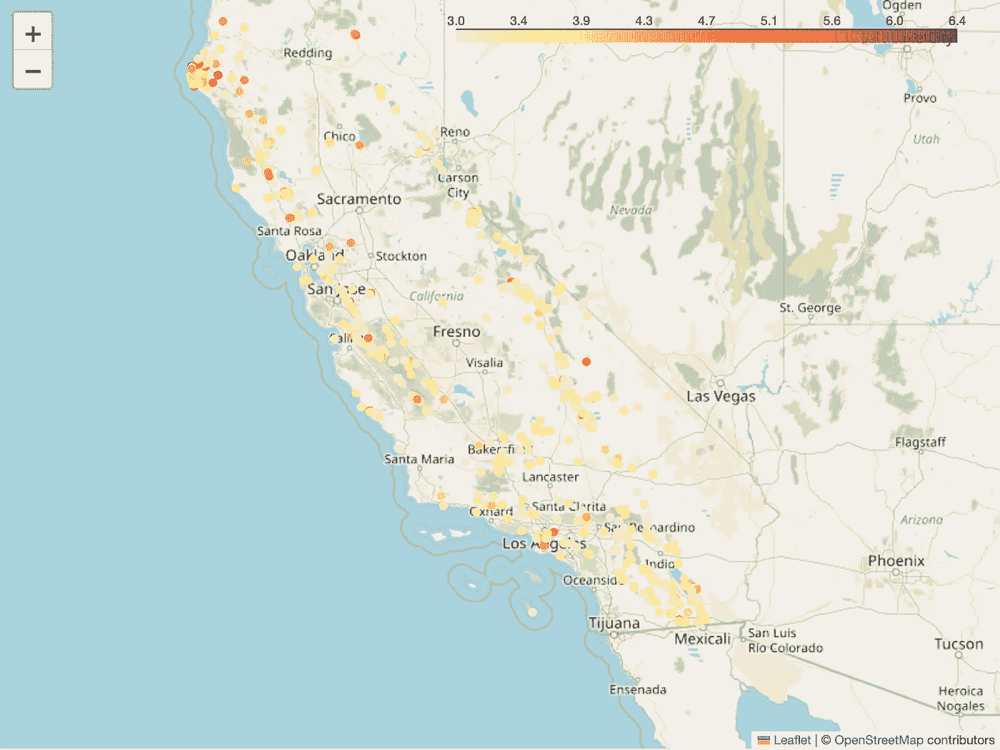
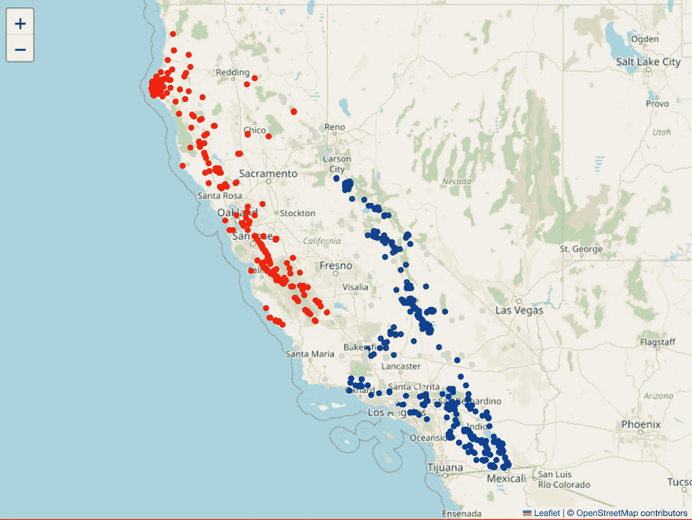
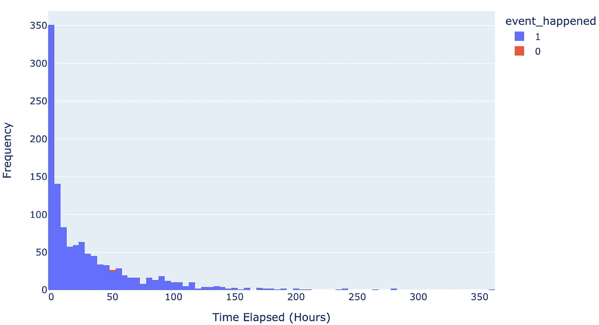
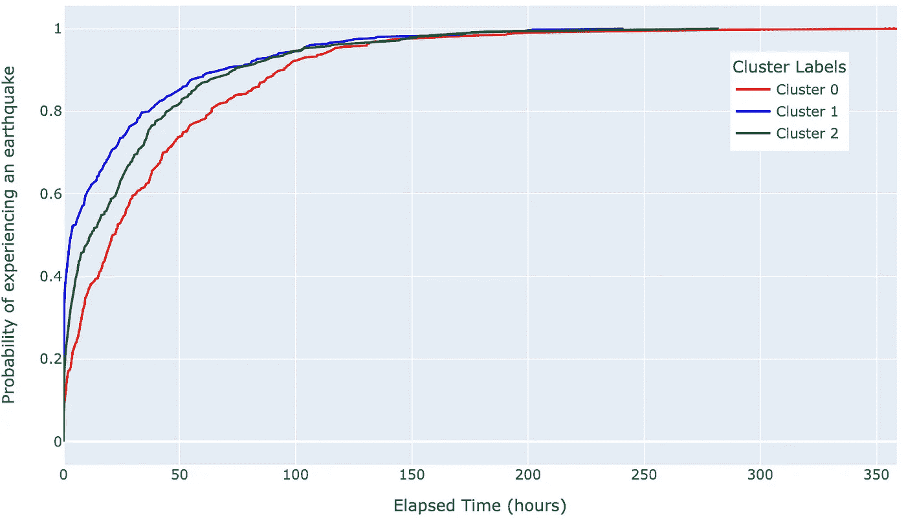
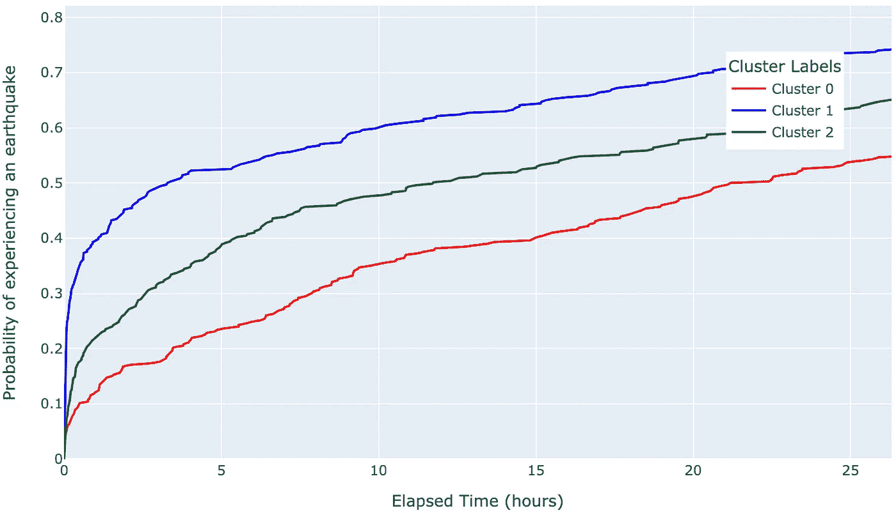
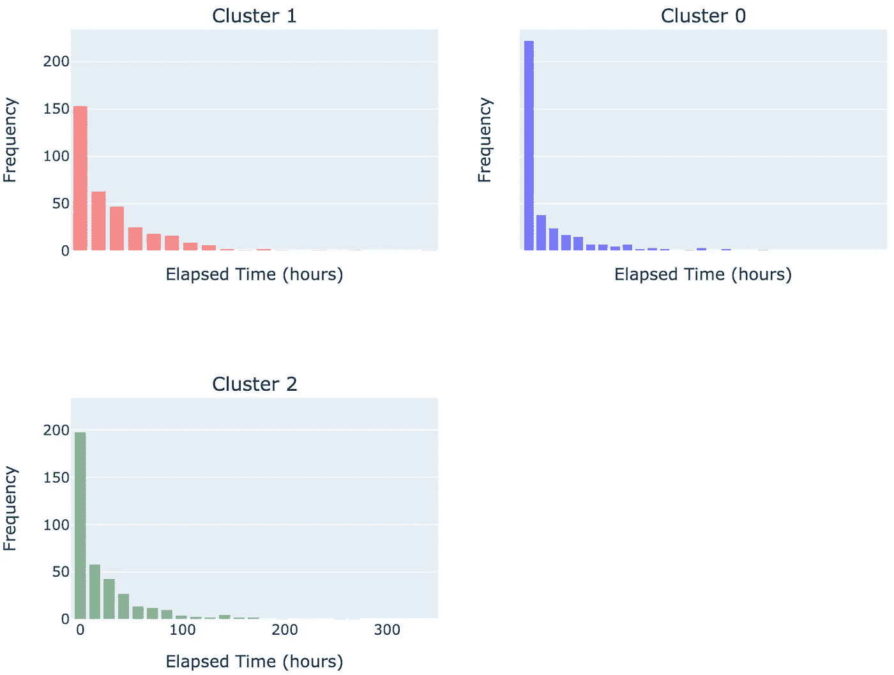

# 识别地震数据中的时空模式

> 原文：[`towardsdatascience.com/spotting-spatiotemporal-patterns-in-earthquake-data-b07068b84314?source=collection_archive---------14-----------------------#2024-01-10`](https://towardsdatascience.com/spotting-spatiotemporal-patterns-in-earthquake-data-b07068b84314?source=collection_archive---------14-----------------------#2024-01-10)

## 使用基于密度的聚类和生存分析来估算地震发生的时间

[](https://medium.com/@elz1582?source=post_page---byline--b07068b84314--------------------------------)[](https://towardsdatascience.com/?source=post_page---byline--b07068b84314--------------------------------) [Elliot Humphrey](https://medium.com/@elz1582?source=post_page---byline--b07068b84314--------------------------------)

·发表于 [Towards Data Science](https://towardsdatascience.com/?source=post_page---byline--b07068b84314--------------------------------) ·阅读时间 9 分钟·2024 年 1 月 10 日

--


照片来自 [Eliška Motisová](https://unsplash.com/@eli_from_prague?utm_source=medium&utm_medium=referral) 在 [Unsplash](https://unsplash.com/?utm_source=medium&utm_medium=referral)

## 介绍

虽然我们对地震发生的地点和原因有相当好的理解，但理解地震发生的时间却非常具有挑战性。在本文中，我们将使用历史地震数据，并结合聚类分析和生存分析来回答以下问题：

*“地震事件是如何在空间上分布的？”*

*“如果发生地震，接下来一小时内发生另一场地震的概率是多少？”*

*“地震事件之间的时间是否存在区域性差异？”*

## 获取数据

我们将使用来自 USGS[[1](https://usgs.gov)] 的数据，该数据记录了地震事件（地震数据属于公共领域，由美国地质调查局提供）。他们提供了一个非常方便的 [API](https://earthquake.usgs.gov/fdsnws/event/1/)，使我们可以在 Python 中直接获取地震数据：

```py
import http.client
import pandas as pd
import json

url = '/fdsnws/event/1/query'
query_params = {
    'format': 'geojson',
    'starttime': "2020-01-01",
    'limit': '10000',
    'minmagnitude': 3,
    'maxlatitude': '47.009499',
    'minlatitude': '32.5295236',
    'maxlongitude': '-114.1307816',
    'minlongitude': '-124.482003',
}
full_url = f'https://earthquake.usgs.gov{url}?{"&".join(f"{key}={value}" for key, value in query_params.items())}'

print('defined params...')

conn = http.client.HTTPSConnection('earthquake.usgs.gov')
conn.request('GET', full_url)
response = conn.getresponse()
```

在我们的 API 请求中，有一些参数：

+   **limit** — *我们希望的最大地震事件数量*

+   **starttime** — *最早的地震事件应发生的时间*

+   **minmagnitude** — *地震事件的最小震级*

+   **maxlatitude** — *最大纬度*

+   **minlatitude** — *最小纬度*

+   **maxlongitude** — *最大经度*

+   **minlongitude** — *最小经度*

我们将最小震级设为 3，因为通常在地面上可以感觉到的地震就是这个震级，并且提供经纬度坐标，围绕加利福尼亚州制作一个边界框。加利福尼亚是著名的**圣安德烈亚斯断层**的所在地，因此将有足够的地震事件供我们分析。

为了处理 GeoJSON 响应，我们使用以下代码：

```py
if response.status == 200:
    print('Got a response.')
    data = response.read()
    print('made the GET request...')
    data = data.decode('utf-8')
    json_data = json.loads(data)
    features = json_data['features']
    df = pd.json_normalize(features)

    if df.empty:
        print('No earthquakes recorded.')
    else:
        df[['Longitude', 'Latitude', 'Depth']] = df['geometry.coordinates'].apply(lambda x: pd.Series(x))
        df['datetime'] = df['properties.time'].apply(lambda x : datetime.datetime.fromtimestamp(x / 1000))
        df['datetime'] = df['datetime'].astype(str)
        df.sort_values(by=['datetime'], inplace=True)
else:
  print(f"Error: {response.status}")
```

这将返回一个 Pandas DataFrame，其中每一行是一个地震事件，列描述了事件属性（即，经度、纬度、震级、ID 等）。

对于那些有地理空间思维的人，你会认出 API 调用的坐标表示的是一个地震的*边界框*（即，在一个框定区域内查找地震），然而我们只关心**加利福尼亚的地震**。因此，我们需要过滤掉所有没有发生在加利福尼亚的地震（例如，发生在内华达州和俄勒冈州的地震）。为此，我们将使用方便的 OSMNX 包来获取**加利福尼亚边界的多边形**：

```py
import osmnx
import geopandas as gpd

place = "California, USA"
gdf = osmnx.geocode_to_gdf(place)
# Get the target geometry
gdf = gdf[["geometry", "bbox_north", "bbox_south", "bbox_east", "bbox_west"]]
```

接下来，我们将使用 Shapely 将地震坐标转换为**点几何体**，然后执行**空间连接**以过滤掉非加利福尼亚的地震：

```py
from shapely.geometry import Point
# Convert to a GeoDataFrame with Point geometry
geometry = [Point(xy) for xy in zip(df['Longitude'], df['Latitude'])]
earthquake_gdf = gpd.GeoDataFrame(df, geometry=geometry, crs='EPSG:4326')

# Filter to keep only points within the California bounding box
points_within_california = gpd.sjoin(earthquake_gdf, gdf, how='inner', predicate='within')

# Extract latitude, longitude etc.
df = points_within_california[['id', 'Latitude', 'Longitude', 'datetime', 'properties.mag']]
```

现在让我们看看第一个加利福尼亚地震的地图，按震级进行颜色编码：



加利福尼亚地震地图。数据来自 USGS。图片由作者提供。

很好，我们现在有了加利福尼亚地震的地图！

## 地震的空间聚类

从之前地图上绘制的地震分布情况来看，你可以看到事件呈现出线性 SE-NW 方向排列，你可以看到大约 2 到 3 个明显的线性形状地震分组。这是有道理的，因为：

1.  地震是由于沿着断层的运动引起的，断层是线性特征（即，地壳中的裂缝）。

1.  地震事件的排列方向与圣安德烈亚斯断层带的方向一致。

我们现在的目标是根据地震事件的位置进行聚类，以便我们可以生成与区域断层相关的空间聚类。

对于聚类，我们将使用**HDBSCAN**（基于密度的层次空间聚类与噪声），这是一种基于密度的聚类算法，适用于某些类型的数据集，如那些具有不规则形状的聚类和不同聚类密度的数据集。这与我们的数据集相关，因为地震事件可能发生在**不规则形状的聚类中**（即，沿着不同方向的断层）并且具有**不同的密度**（即，一些断层区比其他的更活跃）。HDBSCAN 也**对离群点具有鲁棒性**，在本案例中，离群点可能是远离断层区发生的地震。

通过一些实验，以下参数产生了不错的结果（*这有一点试错过程，但受我们之前关于地震如何聚类的假设指导*）：

```py
# Fit HDBSCAN
clusterer = HDBSCAN(min_cluster_size=200, metric='haversine', min_samples=20, cluster_selection_epsilon=0.05)
result_df['cluster_label_hdbscan'] = clusterer.fit_predict(data_scaled)

# Find the number of unique cluster labels
num_clusters = result_df['cluster_label_hdbscan'].nunique()

# Create a list of colors
colors = ['lightgray', 'red', 'blue', 'green'][:num_clusters]

# Create a Folium map centered at the mean coordinates
map_center = [result_df['Latitude'].mean(), result_df['Longitude'].mean()]
mymap = folium.Map(location=map_center, zoom_start=6)

# Add markers for each data point with cluster color
for _, row in result_df.iterrows():
    cluster_color = colors[row['cluster_label_hdbscan'] + 1]  # Map cluster label to color
    folium.CircleMarker(
        location=[row['Latitude'], row['Longitude']],
        radius=2,
        color=cluster_color,
        fill=True,
        fill_color=cluster_color,
        fill_opacity=0.7,
        popup=f'Cluster: {row["cluster_label_hdbscan"]}'
    ).add_to(mymap)
mymap
```



按照 HDBSCAN 聚类结果颜色编码的地震位置。图片由作者提供。

太好了，我们现在已经使用 HDBSCAN 将地震事件聚类为三个区域，这与我们先前的区域知识一致。*请注意，一些地震被认为是异常值，并用灰色表示。*

## 检查地震之间的时间间隔

由于我们有每次地震的日期和时间，我们可以计算**每次事件之间的时间**（即两次地震之间的时间间隔），这在下一节的生存分析中是必需的。我们已经根据*‘datetime’*列对数据进行了排序，因此它们按时间顺序排列，现在我们需要计算时间差：

```py
from datetime import datetime

# Convert 'time' column to datetime objects
df['time'] = pd.to_datetime(df['datetime'])

# Sort dataframe by time
df.sort_values(by=['time'], inplace=True)

# Calculate time elapsed between consecutive events
df['time_elapsed'] = df['time'].diff().shift(-1)
```

由于最后一次地震（即最近发生的那次地震）没有时间差，我们可以计算与我们假设的当前日期的时间差：

```py
# Assuming present time is '2024-01-08 16:06:00.000'
present_time = pd.to_datetime('2024-01-08 16:06:00.000')

# For the last event of each group, replace NaN with time between event and present time
df['time_elapsed'].fillna(present_time - df['time'], inplace=True)
```

最后，我们将添加一个新列，指示一次地震是否紧随另一场地震。尽管这看起来有些多余，因为只有最后一次地震会受到影响，但它突出了使用生存分析进行此类任务时的一个有趣点（我们将在后续讨论）：

```py
# Label events based on whether they happened or not
df['event_happened'] = df['time_elapsed'].apply(lambda x: 1 if pd.Timedelta(days=0) > 0 else 0)
```

下面是地震事件间经过时间的直方图：



地震间隔时间的直方图。图片由作者提供。

我们可以看到，大多数地震发生在彼此短时间内（大约每 2.5 小时发生一次），而在较长时间间隔之间发生的地震要少得多（即该数据集中地震之间的最大时间间隔为 350 小时）。

## 地震时间间隔的生存分析

我们有了地震簇群，以及地震之间的时间间隔，因此现在我们使用生存分析来告诉我们地震发生的概率。我们的目标将是：

1.  使用生存分析创建曲线，展示在发生地震之后，某个时间点发生地震的概率。

1.  比较我们在已聚类的地震区域中的概率曲线，看看区域性地震活动是否存在相似性/差异性。

*什么是生存分析？*

有很多写得很好的文章[2,[3](https://medium.com/the-researchers-guide/survival-analysis-in-python-km-estimate-cox-ph-and-aft-model-5533843c5d5d),4]介绍了这一内容，但简而言之，生存分析是一种统计技术，用于分析事件发生的时间数据，通常用于生物医学或观察性研究中。它着重于估计和建模事件发生的时间，诸如死亡、故障或其他特定结果，提供了关于事件发生概率随时间变化的洞见，以及协变量对事件发生的影响。

**在我们的案例中，已经发生了地震，我们想知道未来发生另一场地震的概率。** *注意：我们假设地震事件是独立的，并且只检索震级至少为 3 的事件，这也是本研究的一个局限性，因为它简化了地震动态。*

**Kaplan-Meier 估计器**是一种在生存分析中使用的非参数方法，用于估计生存函数，进而得出我们的概率。我们将使用包[**‘lifelines’**](https://pypi.org/project/lifelines/)将 Kaplan-Meier 估计器拟合到每个聚类中的地震数据，以生成概率曲线：

```py
import plotly.graph_objects as go
from lifelines import KaplanMeierFitter

# Initialize Kaplan-Meier Fitter
kmf = KaplanMeierFitter()

# Create a Plotly Figure
fig = go.Figure()

color_map = {0: 'red', 1: 'blue', 2: 'green', -1: 'gray'}

# Fit and plot survival curves for each cluster excluding cluster -1
for label, group in result_df.groupby('cluster_label_hdbscan'):
    if label != -1:
        durations = group['time_elapsed'].dt.total_seconds() / 3600  # Convert hours to days
        event_observed = group['event_happened'].values
        kmf.fit(durations=durations, event_observed=a)

        # Plot survival function
        fig.add_trace(go.Scatter(
            x=kmf.survival_function_.index,
            y=1-kmf.survival_function_.KM_estimate,
            mode='lines',
            name=f'Cluster {label}',
            line=dict(color=color_map[label])
        ))

# Customize the plot
fig.update_layout(
    xaxis_title='Elapsed Time (hours)',
    yaxis_title='Probability of experiencing an earthquake',
    legend_title='Cluster Labels',
    width=800,  # Adjust width
    height=500,  # Adjust height
    margin=dict(l=50, r=20, t=50, b=50),  # Adjust margins
    legend=dict(x=0.8, y=0.99),  # Adjust legend position
)

# Show the plot
fig.show()
```

在查看结果之前，注意使用我们之前创建的‘event_happened’列的‘event_observed’参数。我们的最终地震是一个右删失数据点的例子，因为没有后续地震发生，因此被视为部分观测。

现在查看这些曲线：



聚类地震区域的生存分析概率曲线。图片由作者提供。

每个地震聚类都有其自己的彩色曲线，其中 X 轴表示地震发生后的时间，Y 轴表示地震发生的概率。一些有趣的观察结果：

+   曲线的形状相似。

+   曲线的初始陡峭程度因聚类位置而异。

让我们聚焦于地震发生后的初始时间，因为我们的大部分数据表明地震通常会在相对较短的时间内接连发生：



聚类地震区域的生存分析概率曲线。图片由作者提供。

这表明**地震发生的时间在不同区域是不相同的**。通过观察图表，我们可以得出结论：一旦发生地震事件，聚类 0 的区域在十小时内发生另一场地震的概率约为 35%，聚类 1 为 60%，聚类 2 为 48%。这表明聚类 1 区域的地震发生得比其他两个区域更为迅速。

我们可以通过查看每个聚类位置的地震间隔时间的直方图来进行双重检查：

```py
import plotly.graph_objects as go
from plotly.subplots import make_subplots
import numpy as np

# Filter data
filtered_df = result_df[result_df['cluster_label_hdbscan'] != -1]

# Create subplots in a 2 by 2 grid
fig = make_subplots(rows=2, cols=2, subplot_titles=[f'Cluster {label}' for label in filtered_df['cluster_label_hdbscan'].unique()],
                    shared_xaxes='all', shared_yaxes='all')

# Create histograms for elapsed time for each cluster
for i, (label, group) in enumerate(filtered_df.groupby('cluster_label_hdbscan')):
    # Calculate histogram
    hist_data, bin_edges = np.histogram(group['time_elapsed'].dt.total_seconds() / 3600, bins=20)

    # Add histogram trace to subplot
    fig.add_trace(go.Bar(
        x=bin_edges,
        y=hist_data,
        opacity=0.5,
        name=f'Cluster {label}',
        marker=dict(color=color_map[label])
    ), row=(i // 2) + 1, col=(i % 2) + 1)

    # Customise subplot
    fig.update_xaxes(title_text='Elapsed Time (hours)', row=(i // 2) + 1, col=(i % 2) + 1)
    fig.update_yaxes(title_text='Frequency', row=(i // 2) + 1, col=(i % 2) + 1)

# Update layout
fig.update_layout(
    showlegend=False,
    margin=dict(l=50, r=50, t=50, b=50),  # Adjust margins
    height=600,
    width=800,
)

# Show the plot
fig.show()
```



聚类区域内地震间隔时间的直方图。图片由作者提供。

如概率曲线所示，聚类 1 的地震事件之间的间隔比聚类 2 和聚类 3 更长。

## 结论

本研究利用了**空间聚类**和**生存分析**来揭示地震数据中的时间和地理模式。通过使用如**HDBSCAN**的空间聚类技术和**Kaplan-Meier**生存分析估计器，我们获得了关于**地震之间时间的区域变化**的宝贵见解，这些见解被转化为概率曲线，可用于地震高风险地区的风险评估和应急准备。

感谢阅读！

*免责声明：本文仅应作为学习用途。*
