# 虚假相关：统计学的喜剧与悲剧

> 原文：[`towardsdatascience.com/spurious-correlations-the-comedy-and-drama-of-statistics-b63bf99169d8?source=collection_archive---------0-----------------------#2024-02-23`](https://towardsdatascience.com/spurious-correlations-the-comedy-and-drama-of-statistics-b63bf99169d8?source=collection_archive---------0-----------------------#2024-02-23)

## 关于统计学的误用

[](https://medium.com/@celiabanks?source=post_page---byline--b63bf99169d8--------------------------------)[](https://towardsdatascience.com/?source=post_page---byline--b63bf99169d8--------------------------------) [Celia Banks 博士](https://medium.com/@celiabanks?source=post_page---byline--b63bf99169d8--------------------------------)

·发表于 [Towards Data Science](https://towardsdatascience.com/?source=post_page---byline--b63bf99169d8--------------------------------) ·阅读时间：17 分钟·2024 年 2 月 23 日

--

*作者：Celia Banks 博士和 Paul Boothroyd III*


作者


# 引言

自从*Tyler Vigen*创造了“虚假相关”这一术语，指的是“从愚蠢数据中挖掘出来的任何随机相关性”（Vigen，2014），参见：[Tyler Vigen 的个人网站](https://www.tylervigen.com/)，之后出现了许多文章，致敬这一将统计学扭曲以使相关性等同于因果关系的危险倾向。参见：HBR（2015）、Medium（2016）、FiveThirtyEight（2016）。作为数据科学家，我们的任务是提供统计分析，接受或拒绝零假设。我们被教导在获取数据、提取数据、预处理数据并做出统计假设时，要保持道德伦理。这不是小事——全球公司依赖于我们分析的有效性和准确性。同样重要的是，我们的工作必须是可复现的。然而，尽管我们被教导实践“正确”的方法，仍然可能会遇到那种时刻（或更多），老板或客户坚持要求你处理数据直到它支持假设，并且最重要的是，展示变量 y 如何在与变量 x 相关时导致变量 x。这就是 p-hacking 的基础，在这种情况下，你进入了一个远离“正确”实践的领域。在本报告中，我们将学习如何利用虚假相关进行错误的研究。我们的目标是深入了解“错误”的方式，从而学习在面对那个不可避免的时刻——需要交付老板或客户耳语的要求时——该做什么或不该做什么。

> 本项目的目标是教你
> 
> 关于统计学的误用

​我们将展示两个无关变量的虚假相关。来自两个不同来源的数据集经过预处理并合并在一起，以便展示关系的可视化。虚假相关发生在两个变量之间看似相关时，且进一步假设一个变量直接影响另一个变量，从而导致某种结果。​我们选择这个项目的原因是我们对如何管理客户对数据分析项目结果期望的方式感兴趣。对于团队成员 Banks 来说，有时她会遇到客户对分析结果表示不满，实际上曾有一次客户要求她回去查看其他数据源和机会，以“帮助”找到他们寻求的答案。是的，这就是 p-hacking——在这种情况下，客户坚持认为因果关系存在，因为他们相信相关性存在并导致了某个结果。

> 虚假相关的例子

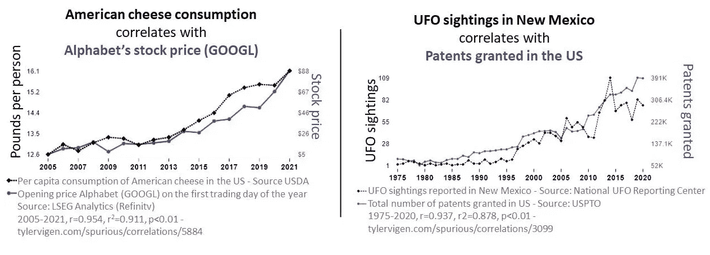

Tyler Vigen 的《虚假相关》摘录。2024 年 2 月 1 日从[虚假相关 (tylervigen.com)](https://www.tylervigen.com/spurious-correlations)获取，作者授权转载。

# 本研究相关的研究问题

> 研究问题是什么？
> 
> 我们为什么需要它们？
> 
> 我们是在做“坏”分析，对吧？

研究问题是研究的基础。它们通过集中研究者将要调查的特定话题来引导研究过程。它们的重要性包括但不限于：聚焦和清晰；作为方法论的指导；确立研究的相关性；帮助构建报告；帮助研究者评估结果并解读发现。​在学习如何进行“错误”分析时，我们提出了以下问题：

(1) 数据来源是否有效（不是捏造的）？

(2) 如何处理缺失值？

(3) 你是如何合并不同的数据集的？

(4) 响应变量和预测变量是什么？

(5) 响应变量和预测变量之间的关系是线性的吗？

(6) 响应变量和预测变量之间是否存在相关性？

(7) 我们能否说变量之间存在因果关系？

(8) 如果客户对这两个变量之间的关系感兴趣，你会提供什么解释？

(9) 你在选择的数据集中发现了虚假相关吗？

(10) 在进行这个项目时，你的收获是什么？

# 方法论

> 我们是如何进行研究的
> 
> 虚假相关？​

为了研究变量之间是否存在伪相关性，进行了全面的分析。数据集跨越了不同的经济和环境因素领域，这些数据都来自公开来源并得到了确认。这些数据集包含了没有明显因果关系但存在统计相关性的变量。选定的数据集包括 Apple 股票数据（主要数据集）和纽约市每日最高温度数据（次要数据集）。数据集涵盖了 2017 年 1 月至 2022 年 12 月的时间范围。

​采用了严格的统计技术来分析数据。计算了皮尔逊相关系数，以量化变量对之间线性关系的强度和方向。为了完成这一分析，使用了纽约市五年期每日最高温度的散点图、Apple 股票五年期趋势的蜡烛图，以及每日最高温度与股票趋势的双轴图表，以可视化变量之间的关系并识别模式或趋势。此方法遵循的领域包括：

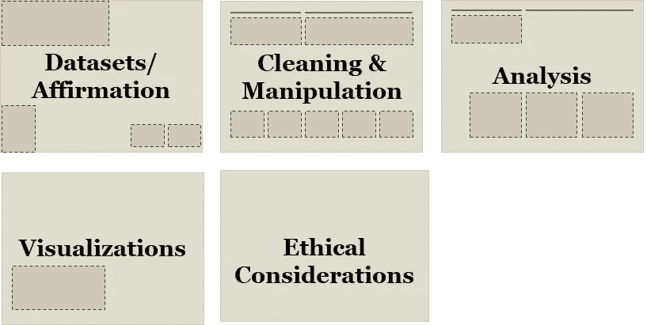

# ***数据：来源/提取/处理***

**主要数据集**：[Apple 股价历史 | AAPL 公司股票历史价格 | FinancialContent 商业页面](https://markets.financialcontent.com/stocks/quote/historical?Symbol=537%3A908440&Year=2019&Month=1&Range=12)

**次要数据集**：2017 年 1 月到 2022 年 12 月纽约市每日最高温度：[`www.extremeweatherwatch.com/cities/new-york/year-{year}`](https://www.extremeweatherwatch.com/cities/new-york/year-{year})

数据被确认来自公开来源，并且可用于重复验证。通过五年的时间跨度捕捉数据，提供了对模式、趋势和线性关系的有意义视角。温度读数显示了季节性趋势。对于温度和股票数据，数据点中出现了低谷和高峰。需要注意的是，温度使用华氏度，这是气象设置。我们使用了天文设置来进一步处理数据，以产生更强的伪相关性。虽然数据可以以 csv 或 xls 文件格式下载，但在本次任务中，我们使用了 Python 的 Beautiful Soup 网页抓取 API。

接下来，数据被检查是否有缺失值，以及每个数据集包含了多少条记录。天气数据包含日期、每日最高温度、每日最低温度，而 Apple 股票数据包含日期、开盘价、收盘价、成交量、股价和股票名称。为了合并数据集，日期列需要转化为日期时间格式。使用内连接匹配记录并丢弃不匹配的项。对于 Apple 股票，日期和每日收盘价是关注的列。对于天气数据，日期和每日最高温度是关注的列。

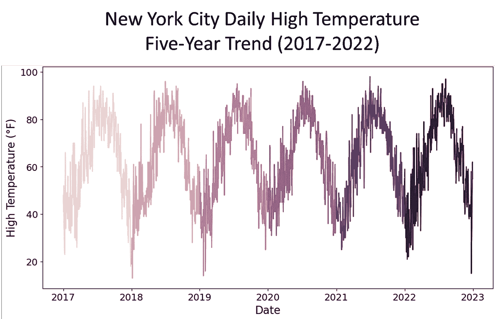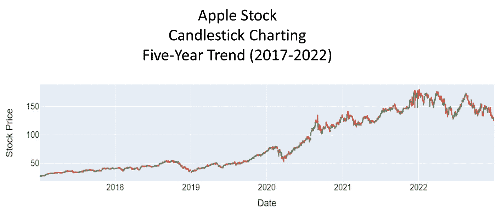

# 数据：处理


来自 Duarte®幻灯片演示文稿

> 要正确地做‘不好的事情’，你必须
> 
> 对数据进行处理，直到你找到
> 
> 你正在寻找的关系...​

我们之前的方法没有得到预期的结果。因此，我们没有使用 2018 年夏季五个美国城市的温度，而是提取了 2017 年 1 月至 2022 年 12 月期间纽约市的五年每日最高气温和苹果股票表现。在进行探索性分析时，我们看到季节和年份之间的相关性较弱。因此，我们的下一步是转换温度数据。我们选择了天文温度而不是气象温度，这使得我们获得了季节间的‘有意义’相关性。

采用新方法后，我们注意到合并数据集时遇到了问题。日期字段不同，天气数据的日期为“月-日”格式，而股票数据的日期为“年-月-日”格式。我们通过将每个数据集的日期列转换为日期时间格式来解决这个问题。此外，每个日期列都按时间顺序或逆时间顺序排序。我们通过将两个日期列按升序排序解决了这一问题。

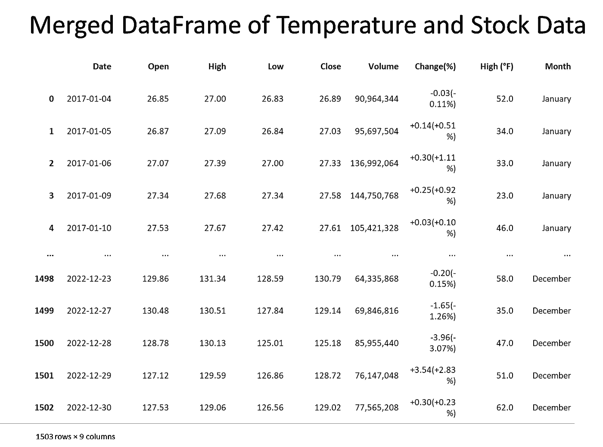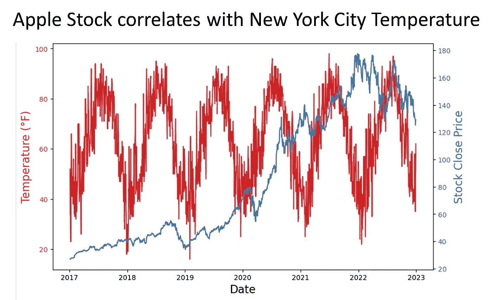

# 分析 I：我们是否有虚假相关性？我们能证明吗？

> 相关性的虚假性质
> 
> 这里展示的是从
> 
> 气象季节（春季：3 月-5 月，
> 
> 夏季：6 月-8 月，秋季：9 月-11 月，冬季：
> 
> 12 月-2 月）基于气象
> 
> 北半球的模式，去
> 
> 天文季节（春季：4 月-6 月，
> 
> 夏季：7 月-9 月，秋季：10 月-12 月，冬季：
> 
> 1 月-3 月）基于地球的倾斜角度。

​一旦我们完成了探索，分析虚假相关性的一个关键点是确定感兴趣的变量是否相关。我们目测发现 2020 年春季的相关性为 0.81。接着我们确定了是否存在统计显著性——是的，p 值约为 0.000000000000001066818316115281，我认为我们有显著性！

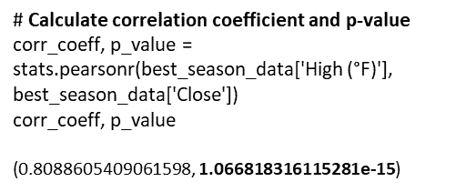

2020 年春季的温度与苹果股票的相关性

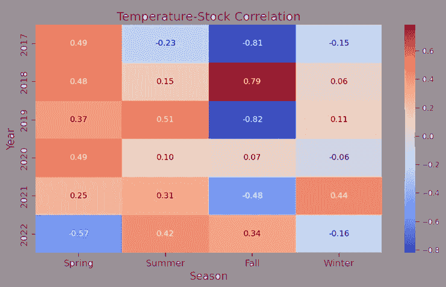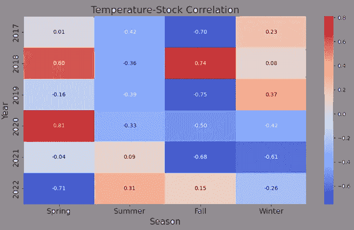

# 分析 II：使用额外的统计数据来检验虚假相关性的性质

> *如果确实存在虚假相关性，我们可能想要*
> 
> *考虑相关性是否等同于因果关系——即*
> 
> *是否，天文温度的变化是否会引起*
> 
> *苹果股票是否会波动？我们进一步采用了*
> 
> *通过统计检验来证明或否定假设*
> 
> *一个变量是否导致另一个变量。*

有许多统计工具用于检验因果关系。工具包括工具变量（IV）分析、面板数据分析、结构方程模型（SEM）、向量自回归模型、协整分析和格兰杰因果关系。IV 分析考虑了回归分析中的遗漏变量；面板数据研究固定效应和随机效应模型；SEM 分析结构关系；向量自回归考虑动态的多变量时间序列互动；协整分析确定变量是否在随机趋势中一起变化。我们需要一个能细致区分真正因果关系和偶然关联的工具。为了实现这一点，我们选择了格兰杰因果关系。

**格兰杰因果关系**

格兰杰检验检查过去的数值是否能预测未来的数值。在我们的案例中，我们检验了纽约市过去的每日最高气温是否能预测苹果股票价格的未来值。

*零假设 Ho：纽约市的每日最高气温不会引起苹果股票价格波动。*

为了进行检验，我们运行了 100 个滞后期，看看是否有显著的 p 值。我们遇到接近 1.0 的 p 值，这表明我们不能拒绝零假设，最终得出结论：没有证据表明变量之间存在因果关系。

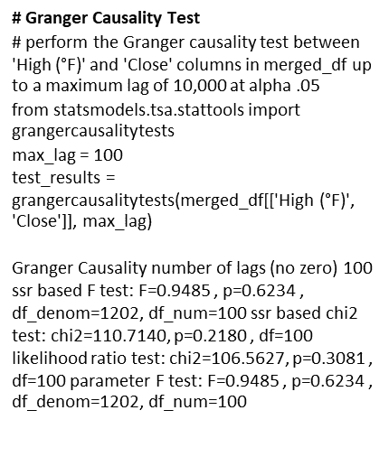

滞后为 100 时的格兰杰因果关系检验

# 分析 III：统计学验证未拒绝零假设 Ho

> *格兰杰因果关系证明了 p 值*
> 
> *在拒绝零假设时不显著*
> 
> *假设。但这足够吗？*
> 
> *让我们验证我们的分析。*

为了帮助减少将虚假相关误解为真正因果效应的风险，结合进行交叉相关分析和格兰杰因果关系检验可以确认其结果。使用这种方法，如果存在虚假相关，我们将在某些滞后期看到交叉相关的显著性，但没有一致的因果方向，或者格兰杰因果关系不存在。

**交叉相关分析**

该方法通过以下步骤完成：

+   检查变量之间相关性的时间模式；

+   •如果变量 A 格兰杰引起变量 B，那么在正滞后期，变量 A 和变量 B 之间会出现显著的交叉相关；

+   在特定滞后期的交叉相关中的显著峰值暗示着因果变量变化之间的时间延迟。

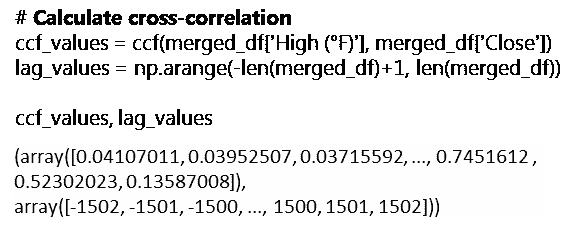

*解释：*

ccf 和滞后值在某些滞后期显示出正相关的显著性。这确认了虚假相关的存在。然而，像格兰杰因果关系一样，交叉相关分析无法支持因果关系在这两个变量之间的存在。

# 总结：关键学习

+   虚假相关是一种伪造统计显著性的方法。相关性并不意味着因果关系。

+   即使使用“坏”的数据策略，统计检验也会揭示其缺乏显著性。尽管变量之间存在伪相关性的统计证据，但因果关系检验无法支持因果关系存在的主张。

+   一项研究不能仅仅依赖于变量显示线性关系这一前提来建立因果关系。相反，必须考虑其他影响每个变量的因素。

+   一个非统计性的测试，来判断纽约市的每日高温是否会导致苹果股票波动，可以是考虑：如果你拥有一张苹果股票证书并将其放入冰箱中，证书的价值会受到寒冷的影响吗？类似地，如果你将证书放在一个阳光明媚的炎热日子里，阳光会影响证书的价值吗？

# 伦理考虑：P-Hacking 不是有效的分析


[`www.freepik.com/free-vector/business-people-saying-no-concept-illustration_38687005.htm#query=refuse%20work&position=20&from_view=keyword&track=ais&uuid=e5cd742b-f902-40f7-b7c4-812b147fe1df`](https://www.freepik.com/free-vector/business-people-saying-no-concept-illustration_38687005.htm#query=refuse%20work&position=20&from_view=keyword&track=ais&uuid=e5cd742b-f902-40f7-b7c4-812b147fe1df) 图片由 storyset 提供，来自 Freepik

> *伪相关性不是因果关系。*
> 
> *P-hacking 可能会影响你作为一个*
> 
> *数据科学家。做会议中的成年人并*
> 
> *拒绝参与坏统计。*

这项研究展示了涉及“坏”统计分析的情况。它演示了数据科学家如何以某种方式获取、提取和操控数据，以统计方式显示相关性。最终，统计检验经受住了挑战，证明了相关性并不等于因果关系。

进行伪相关性分析涉及使用统计数据推导两个无关变量之间的因果关系的伦理问题。这是 p-hacking 的一个例子，它利用统计数据来实现预期的结果。这项研究作为学术研究，旨在展示错误使用统计数据的荒谬性。

另一个伦理考虑领域是网页抓取的实践。许多网站所有者警告不要从他们的网站抓取数据，用于恶意或非他们预期的方式。出于这个原因，像雅虎财经这样的网站使股票数据可下载为 csv 文件。大多数天气网站也是如此，你可以请求温度读数的时间数据集。同样，这项研究是为了学术研究，并展示如何以非传统的方式提取数据。

当面对一个要求你进行 p-hacking 并提供像伪相关性这样的因果关系证明的老板或客户时，要解释他们要求的含义，并且尊重地拒绝这个项目。无论你的决定如何，它都会对你作为数据科学家的信誉产生持久影响。

> Banks 博士是[I-Meta](https://www.spice-chip.com)的首席执行官，该公司开发了获得专利的 Spice Chip 技术，提供针对各行业的大数据分析。Boothroyd 三世先生是退役军事分析员。他们都是曾在美国军队服役并荣誉退役的老兵，且都喜欢讨论虚假的相关性。他们是密歇根大学信息学院 MADS 项目的同学……Go Blue!

# 参考文献

Aschwanden, Christie. 2016 年 1 月. *你不能相信你阅读的关于营养的内容*. FiveThirtyEight. 取自 2024 年 1 月 24 日，[`fivethirtyeight.com/features/you-cant-trust-what-you-read-about-nutrition/`](https://fivethirtyeight.com/features/you-cant-trust-what-you-read-about-nutrition/)

商业管理：来自杂志的文章。2015 年 6 月. *当心虚假的相关性*. 哈佛商业评论. 取自 2024 年 1 月 24 日，[`hbr.org/2015/06/beware-spurious-correlations`](https://hbr.org/2015/06/beware-spurious-correlations)

极端天气观察。2017–2023 年. 取自 2024 年 1 月 24 日，[`www.extremeweatherwatch.com/cities/new-york/year-2017`](https://www.extremeweatherwatch.com/cities/new-york/year-2017)

Financial Content Services, Inc. *苹果股票价格历史 | 历史 AAPL 公司股票价格 | Financial Content 商业页面*. 取自 2024 年 1 月 24 日

[`markets.financialcontent.com/stocks/quote/historical?Symbol=537%3A908440&Year=2019&Month=1&Range=12`](https://markets.financialcontent.com/stocks/quote/historical?Symbol=537%3A908440&Year=2019&Month=1&Range=12)

Plotlygraphs. 2016 年 7 月. *虚假的相关性*. Medium. 取自 2024 年 1 月 24 日，[`plotlygraphs.medium.com/spurious-correlations-56752fcffb69`](https://plotlygraphs.medium.com/spurious-correlations-56752fcffb69)

Vigen, Tyler. *虚假的相关性*. 取自 2024 年 2 月 1 日，[`www.tylervigen.com/spurious-correlations`](https://www.tylervigen.com/spurious-correlations)

Vigen 先生的图表经作者许可转载，许可日期为 2024 年 1 月 31 日。

图片已获得各自所有者的授权。

# 代码部分

```py
##########################
# IMPORT LIBRARIES SECTION
##########################
# Import web scraping tool
import requests
from bs4 import BeautifulSoup
import pandas as pd
import numpy as np

# Import visualization appropriate libraries
import plotly.graph_objects as go
from plotly.subplots import make_subplots
import seaborn as sns # New York temperature plotting
import plotly.graph_objects as go # Apple stock charting
from pandas.plotting import scatter_matrix # scatterplot matrix

# Import appropriate libraries for New York temperature plotting
import seaborn as sns
import matplotlib.pyplot as plt
from datetime import datetime, timedelta
import re

# Convert day to datetime library
import calendar

# Cross-correlation analysis library
from statsmodels.tsa.stattools import ccf

# Stats library
import scipy.stats as stats

# Granger causality library
from statsmodels.tsa.stattools import grangercausalitytests
```

```py
##################################################################################
# EXAMINE THE NEW YORK CITY WEATHER AND APPLE STOCK DATA IN READYING FOR MERGE ...
##################################################################################

# Extract New York City weather data for the years 2017 to 2022 for all 12 months
# 5-YEAR NEW YORK CITY TEMPERATURE DATA

# Function to convert 'Day' column to a consistent date format for merging
def convert_nyc_date(day, month_name, year):
    month_num = datetime.strptime(month_name, '%B').month

    # Extract numeric day using regular expression
    day_match = re.search(r'\d+', day)
    day_value = int(day_match.group()) if day_match else 1

    date_str = f"{month_num:02d}-{day_value:02d}-{year}"

    try:
        return pd.to_datetime(date_str, format='%m-%d-%Y')
    except ValueError:
        return pd.to_datetime(date_str, errors='coerce')

# Set variables
years = range(2017, 2023)
all_data = [] # Initialize an empty list to store data for all years

# Enter for loop
for year in years:
    url = f'https://www.extremeweatherwatch.com/cities/new-york/year-{year}'
    response = requests.get(url)
    soup = BeautifulSoup(response.text, 'html.parser')

    div_container = soup.find('div', {'class': 'page city-year-page'})

    if div_container:
        select_month = div_container.find('select', {'class': 'form-control url-selector'})

        if select_month:
            monthly_data = []
            for option in select_month.find_all('option'):
                month_name = option.text.strip().lower()

                h5_tag = soup.find('a', {'name': option['value'][1:]}).find_next('h5', {'class': 'mt-4'})

                if h5_tag:
                    responsive_div = h5_tag.find_next('div', {'class': 'responsive'})
                    table = responsive_div.find('table', {'class': 'bordered-table daily-table'})

                    if table:
                        data = []
                        for row in table.find_all('tr')[1:]:
                            cols = row.find_all('td')
                            day = cols[0].text.strip()
                            high_temp = float(cols[1].text.strip())
                            data.append([convert_nyc_date(day, month_name, year), high_temp])

                        monthly_df = pd.DataFrame(data, columns=['Date', 'High (°F)'])
                        monthly_data.append(monthly_df)
                    else:
                        print(f"Table not found for {month_name.capitalize()} {year}")
                else:
                    print(f"h5 tag not found for {month_name.capitalize()} {year}")

            # Concatenate monthly data to form the complete dataframe for the year
            yearly_nyc_df = pd.concat(monthly_data, ignore_index=True)

            # Extract month name from the 'Date' column
            yearly_nyc_df['Month'] = yearly_nyc_df['Date'].dt.strftime('%B')

            # Capitalize the month names
            yearly_nyc_df['Month'] = yearly_nyc_df['Month'].str.capitalize()

            all_data.append(yearly_nyc_df)

######################################################################################################
# Generate a time series plot of the 5-year New York City daily high temperatures
######################################################################################################

# Concatenate the data for all years
if all_data:
    combined_df = pd.concat(all_data, ignore_index=True)

    # Create a line plot for each year
    plt.figure(figsize=(12, 6))
    sns.lineplot(data=combined_df, x='Date', y='High (°F)', hue=combined_df['Date'].dt.year)
    plt.title('New York City Daily High Temperature Time Series (2017-2022) - 5-Year Trend', fontsize=18)
    plt.xlabel('Date', fontsize=16)  # Set x-axis label
    plt.ylabel('High Temperature (°F)', fontsize=16)  # Set y-axis label
    plt.legend(title='Year', bbox_to_anchor=(1.05, 1), loc='upper left', fontsize=14)  # Display legend outside the plot
    plt.tick_params(axis='both', which='major', labelsize=14)  # Set font size for both axes' ticks
    plt.show()
```

```py
# APPLE STOCK CODE

# Set variables
years = range(2017, 2023)
data = []  # Initialize an empty list to store data for all years

# Extract Apple's historical data for the years 2017 to 2022
for year in years:
    url = f'https://markets.financialcontent.com/stocks/quote/historical?Symbol=537%3A908440&Year={year}&Month=12&Range=12'
    response = requests.get(url)
    soup = BeautifulSoup(response.text, 'html.parser')
    table = soup.find('table', {'class': 'quote_detailed_price_table'})

    if table:
        for row in table.find_all('tr')[1:]:
            cols = row.find_all('td')
            date = cols[0].text

            # Check if the year is within the desired range
            if str(year) in date:
                open_price = cols[1].text
                high = cols[2].text
                low = cols[3].text
                close = cols[4].text
                volume = cols[5].text
                change_percent = cols[6].text
                data.append([date, open_price, high, low, close, volume, change_percent])

# Create a DataFrame from the extracted data
apple_df = pd.DataFrame(data, columns=['Date', 'Open', 'High', 'Low', 'Close', 'Volume', 'Change(%)'])

# Verify that DataFrame contains 5-years
# apple_df.head(50)

#################################################################
# Generate a Candlestick charting of the 5-year stock performance
#################################################################

new_apple_df = apple_df.copy()

# Convert Apple 'Date' column to a consistent date format
new_apple_df['Date'] = pd.to_datetime(new_apple_df['Date'], format='%b %d, %Y')

# Sort the datasets by 'Date' in ascending order
new_apple_df = new_apple_df.sort_values('Date')

# Convert numerical columns to float, handling empty strings
numeric_cols = ['Open', 'High', 'Low', 'Close', 'Volume', 'Change(%)']
for col in numeric_cols:
    new_apple_df[col] = pd.to_numeric(new_apple_df[col], errors='coerce')

# Create a candlestick chart
fig = go.Figure(data=[go.Candlestick(x=new_apple_df['Date'],
                open=new_apple_df['Open'],
                high=new_apple_df['High'],
                low=new_apple_df['Low'],
                close=new_apple_df['Close'])])

# Set the layout
fig.update_layout(title='Apple Stock Candlestick Chart',
                  xaxis_title='Date',
                  yaxis_title='Stock Price',
                  xaxis_rangeslider_visible=False,
                  font=dict(
                      family="Arial",
                      size=16,
                      color="Black"
                  ),
                  title_font=dict(
                      family="Arial",
                      size=20,
                      color="Black"
                  ),
                  xaxis=dict(
                      title=dict(
                          text="Date",
                          font=dict(
                              family="Arial",
                              size=18,
                              color="Black"
                          )
                      ),
                      tickfont=dict(
                          family="Arial",
                          size=16,
                          color="Black"
                      )
                  ),
                  yaxis=dict(
                      title=dict(
                          text="Stock Price",
                          font=dict(
                              family="Arial",
                              size=18,
                              color="Black"
                          )
                      ),
                      tickfont=dict(
                          family="Arial",
                          size=16,
                          color="Black"
                      )
                  )
)

# Show the chart
fig.show()
```

```py
##########################################
# MERGE THE NEW_NYC_DF WITH NEW_APPLE_DF
##########################################
# Convert the 'Day' column in New York City combined_df to a consistent date format ...

new_nyc_df = combined_df.copy()

# Add missing weekends to NYC temperature data
start_date = new_nyc_df['Date'].min()
end_date = new_nyc_df['Date'].max()
weekend_dates = pd.date_range(start_date, end_date, freq='B')  # B: business day frequency (excludes weekends)
missing_weekends = weekend_dates[~weekend_dates.isin(new_nyc_df['Date'])]
missing_data = pd.DataFrame({'Date': missing_weekends, 'High (°F)': None})
new_nyc_df = pd.concat([new_nyc_df, missing_data]).sort_values('Date').reset_index(drop=True)  # Resetting index
new_apple_df = apple_df.copy()

# Convert Apple 'Date' column to a consistent date format
new_apple_df['Date'] = pd.to_datetime(new_apple_df['Date'], format='%b %d, %Y')

# Sort the datasets by 'Date' in ascending order
new_nyc_df = combined_df.sort_values('Date')
new_apple_df = new_apple_df.sort_values('Date')

# Merge the datasets on the 'Date' column
merged_df = pd.merge(new_apple_df, new_nyc_df, on='Date', how='inner')

# Verify the correct merge -- should merge only NYC temp records that match with Apple stock records by Date
merged_df
```

```py
# Ensure the columns of interest are numeric 
merged_df['High (°F)'] = pd.to_numeric(merged_df['High (°F)'], errors='coerce')
merged_df['Close'] = pd.to_numeric(merged_df['Close'], errors='coerce')

# UPDATED CODE BY PAUL USES ASTRONOMICAL TEMPERATURES 

# CORRELATION HEATMAP OF YEAR-OVER-YEAR 
# DAILY HIGH NYC TEMPERATURES VS.
# APPLE STOCK 2017-2023

import pandas as pd
import numpy as np
import matplotlib.pyplot as plt
import seaborn as sns

# Convert 'Date' to datetime
merged_df['Date'] = pd.to_datetime(merged_df['Date'])

# Define a function to map months to seasons
def map_season(month):
    if month in [4, 5, 6]:
        return 'Spring'
    elif month in [7, 8, 9]:
        return 'Summer'
    elif month in [10, 11, 12]:
        return 'Fall'
    else:
        return 'Winter'

# Extract month from the Date column and map it to seasons
merged_df['Season'] = merged_df['Date'].dt.month.map(map_season)

# Extract the years present in the data
years = merged_df['Date'].dt.year.unique()

# Create subplots for each combination of year and season
seasons = ['Spring', 'Summer', 'Fall', 'Winter']

# Convert 'Close' column to numeric
merged_df['Close'] = pd.to_numeric(merged_df['Close'], errors='coerce')

# Create an empty DataFrame to store correlation matrix
corr_matrix = pd.DataFrame(index=years, columns=seasons)

# Calculate correlation matrix for each combination of year and season
for year in years:
    year_data = merged_df[merged_df['Date'].dt.year == year]
    for season in seasons:
        data = year_data[year_data['Season'] == season]
        corr = data['High (°F)'].corr(data['Close'])
        corr_matrix.loc[year, season] = corr

# Plot correlation matrix
plt.figure(figsize=(10, 6))
sns.heatmap(corr_matrix.astype(float), annot=True, cmap='coolwarm', fmt=".2f")
plt.title('Temperature-Stock Correlation', fontsize=18)  # Set main title font size
plt.xlabel('Season', fontsize=16)  # Set x-axis label font size
plt.ylabel('Year', fontsize=16)  # Set y-axis label font size
plt.tick_params(axis='both', which='major', labelsize=14)  # Set annotation font size
plt.tight_layout()
plt.show()
```

```py
#######################
# STAT ANALYSIS SECTION
#######################
#############################################################
# GRANGER CAUSALITY TEST
# test whether past values of temperature (or stock prices) 
# can predict future values of stock prices (or temperature).
# perform the Granger causality test between 'High (°F)' and 
# 'Close' columns in merged_df up to a maximum lag of 255
#############################################################

# Perform Granger causality test
max_lag = 1  # Choose the maximum lag of 100 - Jupyter times out at higher lags
test_results = grangercausalitytests(merged_df[['High (°F)', 'Close']], max_lag)

# Interpretation:

# looks like none of the lag give a significant p-value
# at alpha .05, we cannot reject the null hypothesis, that is,
# we cannot conclude that Granger causality exists between daily high
# temperatures in NYC and Apple stock

#################################################################
# CROSS-CORRELATION ANALYSIS
# calculate the cross-correlation between 'High (°F)' and 'Close' 
# columns in merged_df, and ccf_values will contain the 
# cross-correlation coefficients, while lag_values will 
# contain the corresponding lag values
#################################################################

# Calculate cross-correlation
ccf_values = ccf(merged_df['High (°F)'], merged_df['Close'])
lag_values = np.arange(-len(merged_df)+1, len(merged_df))

ccf_values, lag_values

# Interpretation:
# Looks like there is strong positive correlation in the variables
# in latter years and positive correlation in their respective
# lags. This confirms what our plotting shows us

########################################################
# LOOK AT THE BEST CORRELATION COEFFICIENT - 2020? LET'S
# EXPLORE FURTHER AND CALCULATE THE p-VALUE AND
# CONFIDENCE INTERVAL
########################################################

# Get dataframes for specific periods of spurious correlation

merged_df['year'] = merged_df['Date'].dt.year
best_season_data = merged_df.loc[(merged_df['year'] == 2020) & (merged_df['Season'] == 'Spring')]

# Calculate correlation coefficient and p-value
corr_coeff, p_value = stats.pearsonr(best_season_data['High (°F)'], best_season_data['Close'])
corr_coeff, p_value

# Perform bootstrapping to obtain confidence interval
def bootstrap_corr(data, n_bootstrap=1000):
    corr_values = []
    for _ in range(n_bootstrap):
        sample = data.sample(n=len(data), replace=True)
        corr_coeff, _ = stats.pearsonr(sample['High (°F)'], sample['Close'])
        corr_values.append(corr_coeff)
    return np.percentile(corr_values, [2.5, 97.5])  # 95% confidence interval

confidence_interval = bootstrap_corr(best_season_data)
confidence_interval
```

```py
#####################################################################
# VISUALIZE RELATIONSHIP BETWEEN APPLE STOCK AND NYC DAILY HIGH TEMPS
#####################################################################

# Dual y-axis plotting using twinx() function from matplotlib
date = merged_df['Date']
temperature = merged_df['High (°F)']
stock_close = merged_df['Close']

# Create a figure and axis
fig, ax1 = plt.subplots(figsize=(10, 6))

# Plotting temperature on the left y-axis (ax1)
color = 'tab:red'
ax1.set_xlabel('Date', fontsize=16)
ax1.set_ylabel('Temperature (°F)', color=color, fontsize=16)
ax1.plot(date, temperature, color=color)
ax1.tick_params(axis='y', labelcolor=color)

# Create a secondary y-axis for the stock close prices
ax2 = ax1.twinx()
color = 'tab:blue'
ax2.set_ylabel('Stock Close Price', color=color, fontsize=16)
ax2.plot(date, stock_close, color=color)
ax2.tick_params(axis='y', labelcolor=color)

# Title and show the plot
plt.title('Apple Stock correlates with New York City Temperature', fontsize=18)
plt.show()
```
