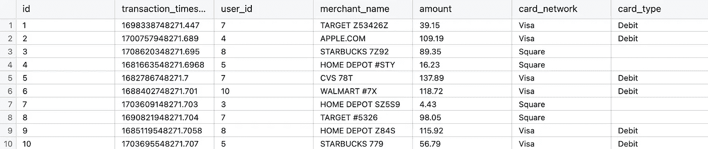

# SQL 精通：数据专业人士的高级技术

> 原文：[`towardsdatascience.com/sql-mastery-advanced-techniques-for-data-professionals-2400c0129c3a?source=collection_archive---------5-----------------------#2024-04-01`](https://towardsdatascience.com/sql-mastery-advanced-techniques-for-data-professionals-2400c0129c3a?source=collection_archive---------5-----------------------#2024-04-01)

## 提升你的数据技能：窗口函数、正则表达式和 CTE

 [Mia Dwyer](https://medium.com/@mia_dwyer?source=post_page---byline--2400c0129c3a--------------------------------)

·发布于 [Towards Data Science](https://towardsdatascience.com/?source=post_page---byline--2400c0129c3a--------------------------------) ·阅读时间：6 分钟·2024 年 4 月 1 日

--

在我担任 Chime 的首席数据分析师期间，三项关键的 SQL 技术——窗口函数、正则表达式和 CTE——极大地提升了我的能力，使我从中级水平提升到适合担任首席分析师角色的专业水平。本文详细介绍了这些技术，帮助你提升技能，开启数据探索的新维度。

由我创建的图片，使用 DALL-E 生成

# 窗口函数

窗口函数（或分析函数）在多个与当前行相关的行之间进行计算，并允许你计算如下内容：

+   排名

+   累计总和

+   7 天移动平均（即当前行之前 7 行的平均值）

使用窗口函数创建排名是一种在分析和数据科学中非常强大的技术。考虑这个`transactions`数据集，我们有客户的交易记录。

一个样本交易表截图，由我使用 ChatGPT 创建的虚拟数据。

## 排名窗口函数：
