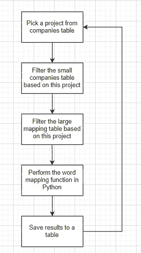
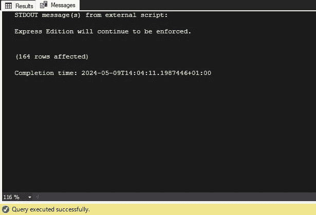
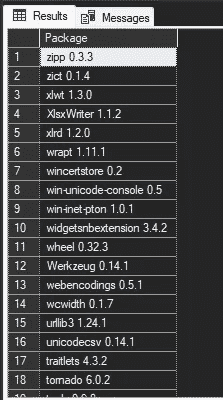
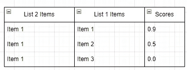
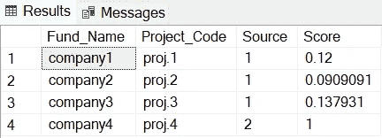

# SQL Server 的秘密功能 — 在 SQL Server 中本地运行 Python 和附加组件

> 原文：[`towardsdatascience.com/sql-servers-secret-feature-run-python-and-add-ons-natively-in-sql-server-7f3c4efe5c00?source=collection_archive---------2-----------------------#2024-05-15`](https://towardsdatascience.com/sql-servers-secret-feature-run-python-and-add-ons-natively-in-sql-server-7f3c4efe5c00?source=collection_archive---------2-----------------------#2024-05-15)

## 导入 Python 库，操作和输出 SQL 表等，一切都可以在 SQL Server 中完成，无需离开 SQL Server。

 [Sasha Korovkina](https://medium.com/@sasha.korovkina2003?source=post_page---byline--7f3c4efe5c00--------------------------------)

·发表于 [Towards Data Science](https://towardsdatascience.com/?source=post_page---byline--7f3c4efe5c00--------------------------------) ·阅读时长 8 分钟·2024 年 5 月 15 日

--

# 问题

在这个项目中，我们面临着管理 37,000 个公司名称的挑战，这些公司名称来源于两个不同的来源。复杂性在于这些来源中相同公司可能被列出为不同的名称。

# 目标

本文的目标是教你如何在 Microsoft SQL Server 中本地运行 Python。使用附加组件和外部库，以及对生成的表进行进一步的 SQL 处理。

图片来源：[Christin Hume](https://unsplash.com/@christinhumephoto?utm_source=medium&utm_medium=referral) 在 [Unsplash](https://unsplash.com/?utm_source=medium&utm_medium=referral) 上

# 初步算法构建

这是我在构建算法时遵循的策略：

1.  **阻塞** — 根据共同属性将数据集划分为更小的块或组，以减少比较记录时的计算复杂度。它缩小了搜索空间，提高了相似性搜索任务的效率。

1.  **预处理** — 清洗和标准化原始数据，为分析做好准备，包括小写转换、标点符号移除和停止词去除等任务。此步骤提高了数据质量，减少了噪音。

1.  **相似性搜索模型应用** — 应用模型计算基于标记化表示的记录对之间的相似性或距离。这有助于识别相似的记录对，使用诸如余弦相似度或编辑距离等度量，进行记录连接或去重等任务。

## 阻塞

我的数据集非常不平衡——我在一个表中有 1,361,373 个实体，在第二个表中只有 37,171 个公司名称。如果我试图在未经处理的表上进行匹配，算法将需要非常长的时间。

为了封锁表，我们需要查看 2 个数据集之间的共同特征。在我的案例中，公司都与内部项目相关。因此，我将执行以下操作：

1.  从较小的表中提取唯一的公司名称和项目代码。

1.  遍历项目代码，并尝试在较大的表中找到它们。

1.  映射该项目的所有基金并将其从大表中提取。

1.  *为下一个项目重复！*

通过这种方式，我将在每次迭代中减少大型数据集，同时确保由于项目级别的小型过滤数据集，映射过程迅速。

一个简单的脚本，用于提取唯一的项目代码和基金名称。

现在，我将按项目代码过滤两个表，像这样：

基于项目代码过滤表的代码示例。

通过这种方法，我们的小表格仅包含 406 行项目“ABC”的数据来进行映射，而大表格则有 15,973 行数据需要匹配。这是从原始表格中大幅度减少的数据量。

## 程序结构

该项目将包含 Python 和 SQL 函数，运行在 SQL 服务器上；以下是一个程序如何工作的简要概述，旨在帮助更清晰地理解每个步骤：

程序结构。图片由作者创建。

程序执行：

+   在循环中打印项目代码是该函数的最简单版本：

递归打印公司名称的代码。

很快就可以看出 SQL 游标消耗了过多的资源。简而言之，这是因为游标是在行级别操作的，并且会遍历每一行以执行操作。

> 关于为什么 SQL 中的游标效率低，最好避免使用它们的更多信息可以在这里找到：[`stackoverflow.com/questions/4568464/sql-server-temporary-tables-vs-cursors`](https://stackoverflow.com/questions/4568464/sql-server-temporary-tables-vs-cursors)（答案 2）

为了提高性能，我将使用临时表并移除游标。以下是得到的函数：

一个函数，用于根据项目代码从大型映射表中选择所有值。

现在，每个项目需要大约 3 秒钟的时间来选择项目代码及其相关数据，并从大型映射表中过滤出该项目的数据。

为了演示，我将只关注 2 个项目，然而，在生产环境中，我会在所有项目上运行该函数。

我们将使用的最终函数如下所示：

我已注释掉函数定义，以便让代码更容易调试，并且限制为前 2 个项目

## 映射表准备

下一步是为 Python 预处理和映射函数准备数据，为此我们将需要 2 个数据集：

1.  来自大映射表按项目代码过滤的数据

1.  来自小型公司表按项目代码过滤的数据

这是使用来自 2 个表的数据选择后更新的函数样子：

从数据库中选择小型公司表和大映射表。

> 重要提示：SQL 中的 Python 函数只接受**1 个表格输入**。确保在将数据输入 SQL 中的 Python 函数之前，将数据放入**单一宽表**中。

带有来源的表格

作为此功能的结果，我们获得了每个项目的项目、公司名称和来源。

*现在我们准备好使用 Python 了！*

# SQL 中的 Python 执行

通过 `sp_execute_external_script`，SQL Server 允许你直接在 SQL Server 中运行 Python 代码。

它使得将 Python 的功能集成到 SQL 工作流中成为可能，并实现 SQL 与 Python 之间的数据交换。在提供的示例中，执行了一个 Python 脚本，从输入数据中创建了一个 pandas DataFrame。

结果作为单个输出返回。

*多酷啊！*

来自 [`learn.microsoft.com/en-us/sql/machine-learning/tutorials/quickstart-python-create-script?view=sql-server-ver16`](https://learn.microsoft.com/en-us/sql/machine-learning/tutorials/quickstart-python-create-script?view=sql-server-ver16) 的简单示例

在 SQL 中运行 Python 时有几个重要事项需要注意：

1.  字符串应由双引号（“）定义，而不是单引号（‘）。尤其在使用正则表达式时，请确保检查这一点，以避免在错误跟踪上浪费时间。

1.  只允许 1 个输出——因此你的 Python 代码将产生 1 个输出表。

1.  你可以使用 `print` 语句进行调试，并查看结果在 SQL 服务器的“消息”选项卡中打印出来。如下所示：

图像由作者制作。

## SQL 中的 Python 库

在 SQL Server 中，几个库是预安装的并且可以直接访问。要查看这些库的完整列表，可以执行以下命令：

用于检索 SQL 中所有可用 Python 库的代码

下面是输出的样子：

你可以像在普通 Python 脚本中一样导入这些包（import ...）。图像由作者制作。

# 使用 Python 匹配文本

回到我们生成的表格，现在我们可以使用 Python 匹配来自不同来源的公司名称。我们的 Python 程序将接受长表并输出一个包含映射实体的表。它应该显示它认为最有可能匹配的小公司表中的每个记录旁边的大映射表中的匹配项。

假设公司 1.1 是公司 1 的最接近匹配项，输出应该看起来像上面的输出。图像由作者制作。

为了实现这个目标，首先让我们向 SQL 过程添加一个 Python 函数。第一步是将数据集简单地输入到 Python 中，我将使用一个示例数据集，然后再使用我们的数据，以下是代码：

将数据输入到数据库中的代码——这两个表都存在于 Python 函数中。

该系统允许我们将两个表都作为输入传递给 Python 函数，然后它会将两个表作为输出打印出来。

## Python 中的预处理

为了有效地匹配字符串，我们必须在 Python 中进行一些预处理，这包括：

1.  去除重音符号和其他语言特有的特殊字符

1.  去除空格

1.  去除标点符号

第一步将通过 SQL 中的排序完成，而其他两步将在 Python 函数的预处理步骤中完成。

这是带有预处理的函数样子：

结果是三个列，一个是小写且无空格的公司名称，第二列是项目列，第三列是来源列。

## 在 Python 中匹配字符串

在这里我们需要发挥创意，因为我们可以使用的库数量非常有限。因此，让我们首先确定输出应该是什么样子的。

我们希望将来自来源 2 的数据与来源 1 中的数据进行匹配。因此，对于来源 2 中的每个值，我们应该有一堆来自来源 1 的匹配值，并附带得分表示匹配的紧密度。

输出表结构。图像由作者创建。

我们将首先使用**Python 内置库**，以避免需要导入外部库，从而简化工作。

逻辑：

1.  遍历每个项目

1.  根据资金来源制作一个表格，其中来源 1 是带有映射数据的大表，来源 2 是最初的公司数据集

1.  从小型数据集中选择数据并将其放入数组

1.  将结果数组中的每个元素与大映射数据框中的每个元素进行比较

1.  返回每个实体的得分

代码：

用于将大数据集的数据映射到小数据集子集的代码。请记住使用你自己的连接和数据结构。

这是最终的输出：

这是为了演示结果而创建的虚拟数据，然而结构应该与你的数据集相同。图像由作者生成。

在这个表格中，我们有每个公司名称、它所属的项目以及来源——无论是来自大的映射表还是小的公司表。右侧的得分表示来源 2 中的公司名称与来源 1 之间的相似度度量。需要注意的是，来自来源 2 的 company4 将始终有一个 1 的得分——100%的匹配度，因为它与自身进行匹配。

通过机器学习服务在 SQL Server 中执行 Python 脚本是一个强大的功能，允许在数据库内进行分析和机器学习任务。此集成使得数据可以直接访问，无需数据迁移，从而显著优化性能和数据密集型操作的安全性。

然而，需要注意的是存在一些限制。该环境支持**单一输入**，这可能限制了可以在 SQL 上下文中直接执行的任务的复杂性。此外，只有**有限的 Python 库可用**，这可能需要为某些不被默认库支持的数据分析或机器学习任务寻找替代方案。此外，用户还需要应对 SQL Server 环境中的一些复杂性，比如包含 Python 代码的 T-SQL 查询中的复杂空格，这可能会导致错误和困惑。

尽管存在这些挑战，但在许多场景中，在 SQL Server 中执行 Python 是非常有优势的：

1\. **数据清理和转换** — Python 可以直接在 SQL Server 中使用，执行复杂的数据预处理任务，如处理缺失数据或规范化数值，之后再进行进一步的分析或报告。

2\. **预测分析** — 在 SQL Server 中直接部署 Python 机器学习模型可以实现实时预测，如客户流失或销售预测，使用的是实时数据库数据。

3\. **高级分析** — Python 的功能可以用来直接在数据库上执行复杂的统计分析和数据挖掘，帮助决策过程，而无需数据传输的延迟。

4\. **自动化报告和可视化** — Python 脚本可以直接从 SQL Server 数据生成数据可视化和报告，实现自动更新和仪表盘。

5\. **机器学习模型的操作化** — 通过将 Python 集成到 SQL Server 中，模型可以直接在数据库环境中进行更新和管理，简化了操作工作流。

总之，虽然在 SQL Server 中执行 Python 存在一些挑战，但它也为在数据库环境中直接增强和简化数据处理、分析和预测建模开辟了丰富的可能性。

> 若要查看更多我的文章，可以在 LinkedIn 上关注我：[`www.linkedin.com/in/sasha-korovkina-5b992019b/`](https://www.linkedin.com/in/sasha-korovkina-5b992019b/)
