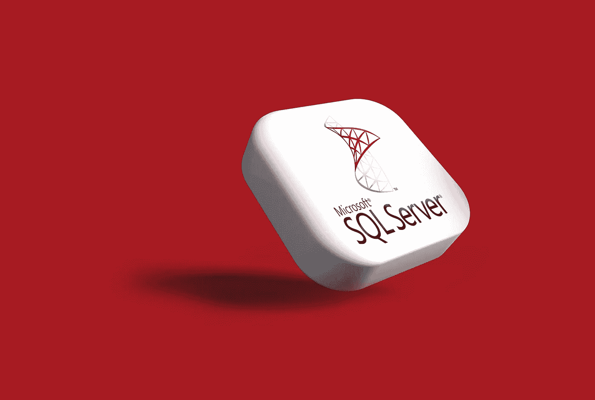

# SQL 用户定义函数（UDFs）

> 原文：[`towardsdatascience.com/sql-user-defined-functions-udfs-e385f2887386?source=collection_archive---------10-----------------------#2024-08-22`](https://towardsdatascience.com/sql-user-defined-functions-udfs-e385f2887386?source=collection_archive---------10-----------------------#2024-08-22)

## 一篇关于掌握 SQL UDF 的教程：类别、用例及与存储过程的区别

 [Jiayan Yin](https://medium.com/@jiayanyin.simba?source=post_page---byline--e385f2887386--------------------------------)

·发表于 [Towards Data Science](https://towardsdatascience.com/?source=post_page---byline--e385f2887386--------------------------------) ·9 分钟阅读·2024 年 8 月 22 日

--

图片来自 [Rubaitul Azad](https://unsplash.com/@rubaitulazad?utm_source=medium&utm_medium=referral) 在 [Unsplash](https://unsplash.com/?utm_source=medium&utm_medium=referral)

SQL 用户定义函数（UDF）是一个重要但常被忽视的特性。尽管有许多在线资源解释 SQL UDF 的语法，但其中大多数未能有效地指导用户如何在实际场景中应用此工具。因此，我写这篇文章来弥补这些空白，讨论何时以及如何使用 SQL UDF，探索其语法背后的基本逻辑，并提供实际的使用案例。此外，本文还将阐明各种 SQL UDF 的类型，并解决 UDF 与存储过程之间的混淆，后者是 SQL 中的另一项重要技术。考虑到 UDF 的语法在不同的数据库系统中可能有所不同，我将重点展示 SQL Server 中的 UDF，尽管我通常在工作中更喜欢使用 MySQL。选择这一示范的原因将在本文后续部分揭示。

# 什么是 UDF？何时应使用它？

在 SQL 中，用户定义函数（UDF）是开发者创建的对象，用于执行某个操作并返回结果。除了 UDF 外，SQL 还提供了内置函数（或本地函数）。SQL 预定义的内置函数包括字符串…
