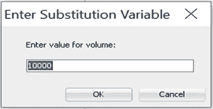
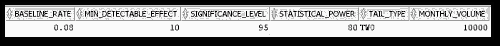
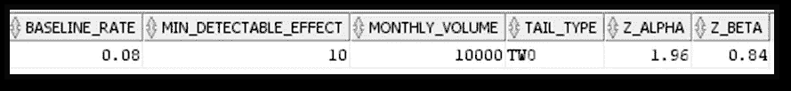
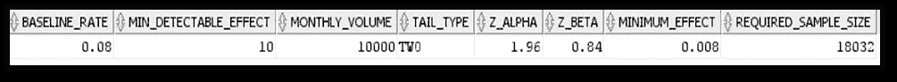
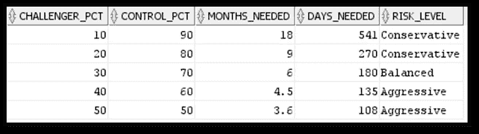
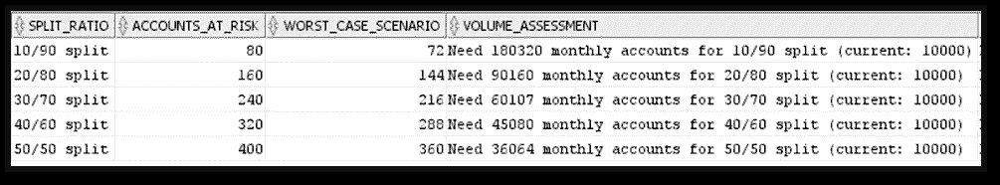
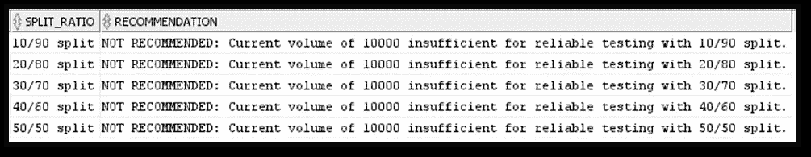
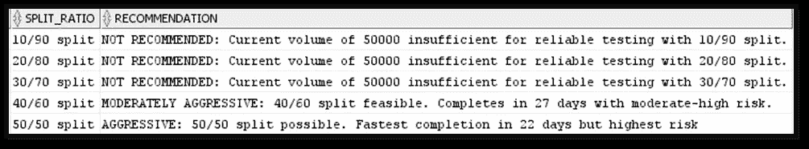

# SQL 与计算器：从零开始构建冠军/挑战者测试

> 原文：[`towardsdatascience.com/sql-vs-calculators-building-champion-challenger-tests-from-scratch-b457dc43d784?source=collection_archive---------9-----------------------#2024-12-04`](https://towardsdatascience.com/sql-vs-calculators-building-champion-challenger-tests-from-scratch-b457dc43d784?source=collection_archive---------9-----------------------#2024-12-04)

## 代码还是点击：哪种方法更适合 A/B 测试

## 深入的 SQL 代码，用于创建您自己的统计测试设计

[](https://medium.com/@govadaharika?source=post_page---byline--b457dc43d784--------------------------------)[](https://towardsdatascience.com/?source=post_page---byline--b457dc43d784--------------------------------) [Harika Govada](https://medium.com/@govadaharika?source=post_page---byline--b457dc43d784--------------------------------)

·发布于[Towards Data Science](https://towardsdatascience.com/?source=post_page---byline--b457dc43d784--------------------------------) ·13 分钟阅读·2024 年 12 月 4 日

--


来自 Imagen 3 的图像

## 300 百万美元按钮：A/B 测试如何永远改变电子商务

我相信很多人都听过 300 百万美元按钮的故事。对于那些不知道这个故事的人来说，它讲述的是一个大型电子商务平台因顾客在结账时流失而错失了数百万美元的潜在收入。这个在线零售商曾有一个标注为“注册”的按钮，后来将其改为“继续”，并提供了稍后注册的选项，结果该公司年收入增加了 3 亿美元。这个案例研究由用户体验专家 Jared Spool 记录下来（[来源：UIE，Jared Spool，“300 百万美元按钮”](https://articles.centercentre.com/three_hund_million_button/))，展示了一个微小的变化如何显著影响商业结果。

然而，令人惊讶的是，尽管有报告显示 58%的高管在做出商业决策时仍依赖直觉，根据普华永道的报告（[来源：普华永道全球数据与分析调查](https://www.pwc.com/im/en/assets/document/big-decisions-data-analytics-sept-2014.pdf)）。我一直认为，具有行业知识并精通商业流程的人，直觉固然重要，但在决策时结合数据和数字的实际证据能带来更多价值。冠军挑战者测试就是一种将猜测转化为科学验证的决策方法。

## 什么是冠军/挑战者测试？

冠军/挑战者测试（A/B 测试）是一种在企业中优化流程和业务运营的技术，通过选择最佳选项来提高业绩，增加收入，降低成本，并改善决策。冠军是当前最有效的操作或方法，而挑战者是你想与冠军进行对比的新的方法或策略，以查看它是否比当前的流程或策略更好或更差。你的冠军和挑战者应该有相同的设置，例如相似类型的账户或客户群体，以确保你做的是对比相同的条件。了解你想要实现的目标，并明确你的关键绩效指标（KPI），以衡量测试的成功是非常重要的。

## 通过 Oracle SQL 实现：实用指南

在实施冠军-挑战者测试时，我一直在想是否依赖在线计算器，还是投资于基于数据库的 SQL 实现。答案取决于多种因素，但让我们通过一个实际的示例来探讨 SQL 方法。在讲解示例的过程中，我还将向你介绍一些变量和条件的重要性，以确保我们创建一个扎实的冠军-挑战者测试。

想象一下一个催收机构想要测试留语音邮件与不留语音邮件的效果。当前策略不涉及语音邮件，一些人认为留下语音邮件可能改善联系率和支付率等指标，但在所有账户中实施此变更存在一些风险，比如可能会减少联系率、留下信息的合规性问题、留下语音邮件的资源成本以及支付率可能下降等。让我们设计一个严格的测试来评估这一假设。

为了开始我们的实施，我们需要创建一个结构化的基础，以跟踪我们的测试从开始到结束。我使用 Oracle SQL Developer 编写 SQL，并且为了在语音邮件测试上下文中的说明目的，我假设了如下提到的一些关键组件值，以生成语音邮件的冠军-挑战者测试。以下是这些关键组件的含义说明：

1.  **基线转化率**：你正在测试的指标的当前转化率。在这个具体的语音邮件测试示例中，我们假设当前支付率为 8%，作为基线转化率。

1.  **最小可检测效应（MDE）**：你希望检测到的转化率的最小改善。例如，对于语音邮件，我们希望查看是否能将当前的转化率提高 10%，即提升至 8.8%（8% * (1 + 0.10) = 8.8%）。

1.  **统计显著性水平**：通常设定为 95%，这意味着你有 95%的信心认为你的结果不是由偶然因素造成的。

1.  **统计功效**：通常设定为 80%，这是一个衡量测试是否有足够数据以得出决定性结果的标准。

1.  **假设 / 尾部类型：** 预测改变某个变量是否会影响客户行为的声明。有两种假设类型需要考虑，或者更多，被称为尾部检验：

a) **单尾检验：** 仅当你在测试某事是否比当前表现更好或更差时，才推荐使用此检验。语音邮件测试中的单尾检验意味着我们只想知道语音邮件是否能改善支付率。

b) **双尾检验：** 当你需要了解性能是否发生变化时，建议使用此检验。你在测试某件事是否比当前的表现更好或更差。语音邮件测试中的双尾检验意味着我们希望了解语音邮件是否会增加或减少支付率。

由于我们不知道语音邮件是否会增加或减少支付率，我们将使用双尾检验。

```py
with test_parameters as(
    select 
        0.08 as baseline_rate,       -- assuming current rate of 8% of payment rate
        10 as min_detectable_effect, -- wanting 10% improvement
        95 as significance_level,    -- 95% confidence level
        80 as statistical_power,     -- 80% statistical power
        'TWO' as tail_type,          -- 'ONE' or 'TWO' for tail type test 
        &volume as monthly_volume    -- dynamic query to pull volume data can be used 
        -- example: (select count(*) from accounts where assign_date>=add_months(sysdate,-1) ) 
    from dual
    )

   select * from test_parameters;
```



每月量输入的 SQL 提示



输出结果

上述配置很重要，因为它记录了我们正在测试的内容及其原因。这些指标是样本量计算的关键组件。我将向你展示样本量计算、分配比例、进行测试所需的月份和天数，最后是根据不同月度量的推荐结果。

## 样本量计算

使用正确的样本量非常重要，以确保测试结果在统计学上是显著的。样本量太小可能导致不准确的结果。更大的样本量会给你更准确的平均值，识别数据中的异常值并提供更小的误差范围。这里的关键问题是，什么样的样本量太小，什么样的样本量又太大。你会在文章的过程中找到答案。

以下 Oracle 脚本展示了如何计算样本量。我使用了 CTE 并将其分成多个快照部分，以便更好地解释代码。如果你想使用此脚本，需将所有代码部分合并。现在，我将设置我们的统计参数。

```py
--statistical parameter conversion
    ,statistical_parameters as(
    select
        baseline_rate,
        min_detectable_effect,
        monthly_volume,
        tail_type,

    --set confidence level z-score based on tail type
        case when tail_type='ONE' then 
         case significance_level 
              when 90 then 1.28 -- One tailed test for 90% confidence
              when 95 then 1.645 -- One tailed test for 95% confidence
              when 99 then 2.326 -- One tailed test for 99% confidence
              else 1.645 end 
         else
             case significance_level 
              when 90 then 1.645 -- Two tailed test for 90% confidence
              when 95 then 1.96 -- Two tailed test for 95% confidence
              when 99 then 2.576 -- Two tailed test for 99% confidence
              else 1.96 end end as z_alpha,

    --set power level z-score (same for both tail types)
        case statistical_power
            when 80 then 0.84
            when 90 then 1.28
            when 95 then 1.645
            else 0.84 end as z_beta
    from test_parameters
    )

    select * from statistical_parameters;
```

该转换将置信水平转换为用于样本量计算的统计值。对于催收，95%的置信度意味着有 5%的可能性结果是错误的，或者在语音邮件无效时。

在统计学中，z-alpha 代表我们的置信水平，具体值取决于置信水平和尾部类型测试。通常，双尾检验的值比单尾检验的值要高，因为双尾检验的错误率被分配到两个方向。对于语音邮件测试场景，5%的错误概率表示错误率在两个方向均匀分配（支付下降的概率为 0.025，支付上升的概率为 0.025），而单尾检验将 0.05 的概率集中在一个方向，因为我们只关心支付是上升还是下降，而不是两者都关心。

统计能力称为 z-beta。当我们设置 80%的统计能力（z-beta = 0.84）时，意味着我们希望在 80%的情况下捕捉到真实变化，并且接受在 20%的情况下错过它们。

Z-alpha 和 Z-beta 结合意味着，如果语音邮件确实有助于提高付款率，我们将在 80%的情况下发现这一改善，当我们发现时，我们可以 95%确信它是真正的改进，而不是偶然的结果。



输出结果

现在让我们进入所需样本量的计算。这个计算决定了我们需要测试多少账户。在我们的语音邮件场景中，如果我们希望将付款率从 8%提升至 8.8%，那么这个计算将告诉我们需要多少账户来确保付款率的提升或下降是实际存在的，而不是偶然的。

```py
--Sample size calculation
    ,sample_size_calculation as(
    select 
        baseline_rate,
        min_detectable_effect,
        monthly_volume,
        tail_type,
        z_alpha,
        z_beta,

    --calculate minimum effect size
        baseline_rate*(min_detectable_effect/100) as minimum_effect,

    --calculate base sample size
        ceil(
             case tail_type 
                  when 'ONE' then
                       ( power(z_alpha + z_beta, 2) * baseline_Rate * (1 - baseline_Rate)) / (power(baseline_Rate * (min_detectable_effect/100), 2))
                  else
                       (2 * power(z_alpha + z_beta, 2) * baseline_Rate * (1 - baseline_Rate)) / (power(baseline_Rate * (min_detectable_effect/100), 2)) 
                  end
             ) as required_sample_size     
    from statistical_parameters
    )
```



输出结果

## 分割比例和测试持续时间

分割比例决定了你如何在冠军组（当前版本）和挑战者组（测试版本）之间划分数据集。常见的分割比例包括二分法（如 50/50、80/20 或 90/10 分割）或多分法（如 50/25/25 或 70/10/10/10）。这些多分法测试用于测试不同的变化，同时保留一个对照组。

选择分割比例不应是随意的，或者仅仅依赖于可用的样本量，还应考虑其他因素，如对挑战者版本的信心水平、变化的影响，特别是如果这种变化会影响当前的指标，并确保测试满足所需的最小样本量要求。

以下分析将统计要求转化为业务术语，并展示不同分割比例如何影响测试持续时间。它还展示了基于分割比例的风险水平。分割比例表示我们如何在冠军组和挑战者组之间划分账户。

```py
 --split ratio
    ,split_ratios as(
    --generate split ratios from 10 to 50 for challenger
    Select  
        level * 10 as challenger_pct,
        100 - (level * 10) as control_pct
    from dual
    connect by level <= 5 -- This generates 10/90, 20/80, 30/70, 40/60, 50/50
    )

    --split_analysis
    ,split_analysis as(
    select 
        s.baseline_Rate * 100 as current_rate_pct,
        s.baseline_rate * (1 + s.min_detectable_effect/100) * 100 as target_rate_pct,
        s.min_detectable_effect as improvement_pct,
        s.tail_type,
        s.required_sample_size as sample_size_per_group,
        s.required_sample_size * 2 as total_sample_needed,
        s.monthly_volume,
        r.challenger_pct,
        r.control_pct,

    --calculate test duration (months) for different splits
        round(s.required_sample_size / (s.monthly_volume * (r.challenger_pct/100)), 1) as months_needed,

    --calculate test days needed for each split
        round(s.required_sample_size / (s.monthly_volume * (r.challenger_pct/100)) * 30, 0) as days_needed,

     --Assess risk level for each split
        case 
            when r.challenger_pct <= 20 then 'Conservative'
            when r.challenger_pct <= 35 then 'Balanced'
            else 'Aggressive' end as risk_level
    from sample_size_calculation s cross join split_ratios r
    )

    select * from split_analysis;
```

保守风险只会影响 10-20%的账户接受新处理，80-90%的账户则受到潜在负面影响。这个分配比例需要更长时间来收集足够的数据。平衡风险将影响三分之一的账户，同时保护其余账户，并且能够更快收集数据。激进风险虽然能够快速收集数据，但会影响多达一半的账户，因此会暴露更多账户于风险之中。



输出结果的一部分

了解冠军/挑战者测试应该运行多久非常重要。如果测试运行时间过短，可能会因为数据不完整或误导性信息做出错误决策；如果测试运行时间过长，则可能浪费资源并延迟决策。为了保持平衡，通常测试应该至少运行一个完整的业务周期。测试通常不应超过 4 到 8 周，这样可以避免将结果与其他运营或季节性变化混淆。

## 风险评估和数量需求

我观察到新接触冠军/挑战者测试的分析师不知道选择哪个拆分比例。我们可以通过考虑选择某个拆分比例的风险以及该拆分比例所需的数量来决定选择哪个拆分比例。

必须计算最坏情况，以评估风险水平。

```py
,risk_Assessment as(
        select 
            monthly_volume,
            sample_size_per_group,
            challenger_pct,
            risk_level,
        --assess potential impact
    round(monthly_volume * (challenger_pct/100) * (current_rate_pct/100)) as accounts_at_risk,
    round(monthly_volume * (challenger_pct/100) * (current_rate_pct/100) * (1 - (improvement_pct/100))) as worst_case_scenario
        from split_analysis
    )

    ,volume_recommendations as(
        select distinct 
            sample_size_per_group,
            --recommende monthly volumes for different completion timeframes for all splits
            ceil(sample_size_per_group / 0.5) as volume_for_1_month_50_50, --50/50 split
            ceil(sample_size_per_group / 0.4) as volume_for_1_month_40_60, --40/60 split
            ceil(sample_size_per_group / 0.3) as volume_for_1_month_30_70, --30/70 split
            ceil(sample_size_per_group / 0.2) as volume_for_1_month_20_80, --20/80 split
            ceil(sample_size_per_group / 0.1) as volume_for_1_month_10_90  --10/90 split
        from split_analysis
        )
```



部分输出结果

假设我们选择 30/70 拆分比例，这对于语音邮件显示出一种“平衡”的拆分。每月有 10,000 个账户，其中 3,000 个账户将接收语音邮件，而 7,000 个账户将继续正常运行。如果语音邮件表现不佳，将影响 3,000 个账户，最大暴露的风险是 240 笔付款（3,000 * 8%）。在这种情况下，假设语音邮件测试使付款率下降了 10%而不是提高，我们将只收到 216 笔付款（3,000 * 8% * (1–10%)）。这意味着我们失去了本可以收到的 24 笔付款。

这个最坏情况的计算帮助我们了解所面临的风险。在更激进的 50/50 拆分下，测试组中将有 5,000 个账户，面临在最坏情况下可能失去 40 笔付款的风险。保守的 20/80 拆分则只会冒 16 笔付款的风险，尽管测试完成的时间会更长。

在 50/50 拆分的情况下，我们需要总共 36,000 个账户，以便在测试组中获得 18,000 个账户。由于我们每月只有 10,000 个账户，这意味着我们的测试大约需要 3.6 个月才能完成。转向最保守的 10/90 拆分则需要 180,000 个账户，使得测试周期达到不切实际的 18 个月。

```py
,final_Recommendation as(
    select
        sa.*,
        ra.accounts_At_Risk,
        ra.worst_case_scenario,
        vr.volume_for_1_month_50_50,
        vr.volume_for_1_month_40_60,
        vr.volume_for_1_month_30_70,
        vr.volume_for_1_month_20_80,
        vr.volume_for_1_month_10_90,
        --Generate final recommendations based on all split ratios
    case when sa.monthly_volume >= vr.volume_for_1_month_50_50 and sa.challenger_pct = 50 
         then 'AGGRESSIVE: 50/50 split possible. Fastest completion in ' || sa.days_needed || ' days but highest risk ' 
         when sa.monthly_volume >= vr.volume_for_1_month_40_60 and sa.challenger_pct = 40 
         then 'MODERATELY AGGRESSIVE: 40/60 split feasible. Completes in ' || sa.days_needed || ' days with moderate-high risk.'
         when sa.monthly_volume >= vr.volume_for_1_month_30_70 and sa.challenger_pct = 30 
         then 'BALANCED: 30/70 split recommended. Completes in ' || sa.days_needed || ' days with balanced risk.'
         when sa.monthly_volume >= vr.volume_for_1_month_20_80 and sa.challenger_pct = 20 
         then 'CONSERVATIVE: 20/80 split possible. Takes ' || sa.days_needed || ' days with lower risk.'
         when sa.monthly_volume >= vr.volume_for_1_month_10_90 and sa.challenger_pct = 10 
         then 'BALANCED: 10/90 split possible. Takes ' || sa.days_needed || ' days but minimizes risk.'
         else 'NOT RECOMMENDED: Current volume of ' || sa.monthly_volume || ' insufficient for reliable testing with ' 
              || sa.challenger_pct || '/' ||  sa.control_pct || ' split.' end as recommendation
    from split_analysis sa join risk_assessment ra on sa.challenger_pct=ra.challenger_pct
        cross join volume_recommendations vr 
        )
```

```py
select      
        tail_type as test_type,
        current_rate_pct || '%' as current_rate,
        target_rate_pct || '%' as target_rate,
        improvement_pct || '%' as improvement,
        sample_size_per_group as needed_per_group,
        total_sample_needed as total_needed,
        monthly_volume,
        challenger_pct || '/' || control_pct || ' split' as split_ratio,
        days_needed || ' days (' || round(months_needed, 1) || ' months)' as duration,
        risk_level,
        accounts_At_Risk || ' accounts at risk' as risk_exposure,
        worst_Case_Scenario || ' worst case' as risk_scenario,
            case
                when challenger_pct = 10 then
                    case    
                        when monthly_volume >= volume_for_1_month_10_90 
                        then 'Current volume (' || monthly_volume || ') sufficient for 10/90 split'
                        else 'Need ' || volume_for_1_month_10_90 
                        || ' monthly accounts for 10/90 split (current: ' || monthly_volume || ')'
                    end
                when challenger_pct = 20 then
                    case    
                        when monthly_volume >= volume_for_1_month_20_80 
                        then 'Current volume (' || monthly_volume || ') sufficient for 20/80 split'
                        else 'Need ' || volume_for_1_month_20_80 
                        || ' monthly accounts for 20/80 split (current: ' || monthly_volume || ')'
                    end
                 when challenger_pct = 30 then
                    case    
                        when monthly_volume >= volume_for_1_month_30_70 
                        then 'Current volume (' || monthly_volume || ') sufficient for 30/70 split'
                        else 'Need ' || volume_for_1_month_30_70 
                        || ' monthly accounts for 30/70 split (current: ' || monthly_volume || ')'
                    end
                 when challenger_pct = 40 then
                    case    
                        when monthly_volume >= volume_for_1_month_40_60 
                        then 'Current volume (' || monthly_volume || ') sufficient for 40/60 split'
                        else 'Need ' || volume_for_1_month_40_60 
                        || ' monthly accounts for 40/60 split (current: ' || monthly_volume || ')'
                    end
                else
                    case    
                        when monthly_volume >= volume_for_1_month_50_50 
                        then 'Current volume (' || monthly_volume || ') sufficient for 50/50 split'
                        else 'Need ' || volume_for_1_month_50_50 
                        || ' monthly accounts for 50/50 split (current: ' || monthly_volume || ')'
                    end
                end as volume_assessment,
            recommendation
        from final_Recommendation
        order by challenger_pct;
```



每月 10,000 个账户的部分输出结果

如果每月量为 50,000 个账户：



每月 50,000 个账户的部分输出结果

某些问题需要考虑，以决定选择哪个拆分比例和可接受的风险水平，并最终了解可用于测试语音邮件的数量。业务是否能接受每月可能失去 40 笔付款，以换取 3.6 个月内完成测试，还是选择每月仅失去 16 笔付款，但延长测试时间会更好？通过仔细选择拆分比例并理解适当的样本量，你可以设计出提供准确且可操作见解的测试。

## 计算器与 SQL 实现

像[Evan Miller](https://www.evanmiller.org/ab-testing/sample-size.html)和[Optimizely](https://www.optimizely.com/sample-size-calculator/#/?conversion=8&effect=10&significance=95)这样的在线计算器是非常有价值的工具，通常默认采用 50/50 的分配比例或双尾测试。另一个在线工具，[Statsig](https://www.statsig.com/calculator)，没有默认设置，但同时也不会提供像我们通过 SQL 实现所编码的额外细节。SQL 实现的价值在于，它不仅帮助跟踪基本指标，还能够根据你的实际月度量监控风险暴露和测试持续时间。当你需要偏离标准的 50/50 分配，或者想要了解测试设计中的不同分配比例和商业风险时，这种全面的视角尤其重要。

## 持续测试

冠军/挑战者测试不是一次性的工作，而是一个持续改进的周期。创建性能报告并持续监控结果。适应不断变化的条件，包括季节性变化和经济变化。通过将这种方法整合到你的策略测试中，你正在创建一种系统化的决策方法，推动创新，降低风险，最重要的是，你的直觉可以通过可靠的数据证据来支持。

***注意***：*除非另有说明，否则所有图片均为作者所提供。*
