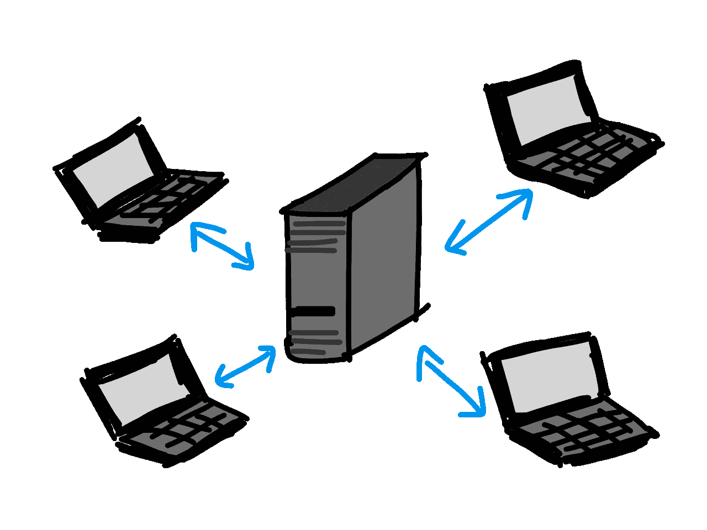

# SQLite 在现代网页生产中的应用：梦想变为现实

> 原文：[`towardsdatascience.com/sqlite-in-production-dreams-becoming-reality-94557bec095b?source=collection_archive---------0-----------------------#2024-12-12`](https://towardsdatascience.com/sqlite-in-production-dreams-becoming-reality-94557bec095b?source=collection_archive---------0-----------------------#2024-12-12)

## 关于激进简化的美德

[](https://medium.com/@ed.izaguirre?source=post_page---byline--94557bec095b--------------------------------)[](https://towardsdatascience.com/?source=post_page---byline--94557bec095b--------------------------------) [Ed Izaguirre](https://medium.com/@ed.izaguirre?source=post_page---byline--94557bec095b--------------------------------)

·发表于 [Towards Data Science](https://towardsdatascience.com/?source=post_page---byline--94557bec095b--------------------------------) ·10 分钟阅读·2024 年 12 月 12 日

--


简单的风景。图片来源：Unsplash。

*这是关于使用 SQLite 进行网页应用和机器学习的两篇系列文章中的第一篇。在本文中，我将深入探讨为什么 SQLite 正在迅速成为现代网页应用的生产就绪数据库。在第二篇文章中，我将讨论如何使用 SQLite 进行检索增强生成（RAG）。*

*如果您想要一个定制的网页应用程序，并且集成了生成型 AI，请访问* [*losangelesaiapps.com*](https://losangelesaiapps.com/)

# SQLite：逃离复杂性的洞穴


[柏拉图的洞穴寓言](https://en.wikipedia.org/wiki/Allegory_of_the_cave)，由 Jan Saenredam 创作，1604 年。

> “如果你追求宁静，就少做事。” 
> 
> — *马库斯·奥勒留*

当今运行现代网页软件的大多数数据库都采用**客户端-服务器架构**。在这种架构中，服务器是管理数据的中央系统。它处理来自客户端的请求并向客户端发送响应。这里的客户端指的是通过服务器与数据库交互的用户或应用程序。



客户端-服务器架构。图片来源：pixabay。

理解这一架构的简单方法是通过类比图书馆。服务器是*图书馆*，每一条数据就是一本*书*，而客户端是*访客*。在这个世界中，访客不能直接从书架上拿书。他们必须通过图书管理员，图书管理员精心整理了图书馆，以便访客能够轻松找到所需的书。在这个世界里，访客进入图书馆的过程完全通过图书馆的工作人员（服务器端）来媒介化。

这是一种相当巧妙的架构。然而，对于较小、轻量级的应用程序来说，这种做法过于复杂。如果你只有几本书，为什么需要建立多个书架，更不用说多个房间了？与客户端-服务器架构相对的，是**SQLite 数据库**使用的**单文件架构**。

对于初学者来说，SQLite 是数据库的柏拉图式理想。与运行整个服务器来管理数据访问不同，这个数据库完全存储在一个单一文件中。然后，你的应用程序只需通过修改这个文件来创建、读取、更新和销毁数据。当你部署一个由客户端-服务器数据库支持的 Web 应用程序时，你实际上是在部署两个服务：一个是你的应用程序，另一个是你的数据库。而使用 SQLite 时，你只需部署一个服务：包含 SQLite 文件的应用程序。这意味着更少的复杂性和更低的成本。

回到我们的类比，使用 SQLite 就像拥有一本存储所有数据的单一笔记本。没有书架，没有图书馆，没有图书管理员。你只需打开书本，添加、删除或更新你的数据。也许你可以使其更复杂些，在书本的后面加一个索引来加速搜索。你可以想象这会变得多么简单。

然而，正如经济学中所说的：没有解决方案，只有权衡。SQLite 并不完美，现代 Web 应用中很少使用它有其合理的原因。在本文中，我将重点讨论一些困扰 SQLite 的问题，以及近年来的进展如何消除了这些障碍。

# 问题 #1：并发

SQLite 的主要问题通常与**并发性相关**。SQLite 使用写锁来确保一次只有一个写操作进行。我们不希望事务相互干扰。如果你尝试发送并发写请求，你通常会遇到`SQLITE_BUSY`错误，并且其中一个事务会丢失。在并发请求的情况下，我们希望事务排队并彼此友好地运行。

不幸的是，SQLite 中的默认事务模式并不促进这一点。一些重要的背景信息：**事务**通常涉及一系列数据库**语句**，例如读取和写入，它们一起执行。

```py
-- An example transaction
BEGIN DEFERRED TRANSACTION;
SELECT * FROM inventory WHERE id = 1; -- Statement 1
UPDATE inventory SET stock = stock + 1 WHERE id = 1; -- Statement 2
```

SQLite 中的默认事务模式是**延迟事务模式**。在此模式下：

+   事务开始时不会获取任何锁。

+   **只读语句**不会触发写锁；它只需要一个共享的读锁，这允许并发读取。想想`SELECT`语句。

+   **写语句**需要一个独占的写锁，这会阻止所有其他读取和写入，直到事务完成。想想`INSERT`、`UPDATE`或`DELETE`语句。

例如，来看一下以下两笔交易。假设它们同时运行：

```py
-- Transaction 1
BEGIN DEFERRED TRANSACTION;
SELECT * FROM inventory WHERE id = 1; 
UPDATE inventory SET stock = stock + 1 WHERE id = 1; 

-- Transcation 2
BEGIN DEFERRED TRANSACTION;
UPDATE inventory SET stock = stock - 1 WHERE id = 1; 

-- Example sequence of events:
  -- Transaction 1 begins
    -- SELECT statement: No lock is acquired yet.
  -- Transaction 2 begins
    -- Acquires a write lock (UPDATE statement).
  -- Transcation 1 continues
    -- Tries to acquire a write lock (UPDATE statement).
    -- Fails because Transaction 2 already committed and released the lock.
    -- SQLite throws SQLITE_BUSY.
  -- Transaction 2 commits successfully. Transaction 1 has failed.
```

在这种情况下，由于`事务 1`在抛出`SQLITE_BUSY`异常时正处于事务中，它不会在`事务 2`完成写锁后重新排队，而是会被取消。SQLite 不想冒险出现不一致的结果，万一另一个事务在锁等待期间修改了重叠的数据，所以它只会告诉被中断的事务放弃。

这样想：假设你和你的朋友正在共享一本笔记本。你开始阅读笔记本里的一篇未完成的故事，打算写下下一部分。但在你准备拿起笔之前，你的朋友抢走了笔记本。“*反正你也没写什么！*”他们大声说道。如果他们在你的故事中改变了什么关键内容怎么办？你感到沮丧，无法继续下去，愤怒地放弃了，放弃了完成这个故事的尝试。结果发现，你的朋友并不像你想象的那么友好！

我们如何解决这个问题呢？假设你们规定一个规则：当你们中的任何一个人拿到笔记本时，**无论是读还是写**，那个人都可以使用笔记本直到完成？问题解决！

SQLite 中的这种事务模式被称为**即时模式**。现在，当一个事务开始时，无论它是写操作还是读操作，它都会占用写锁。如果一个并发事务试图占用写锁，它会排队等待当前事务完成，而不会抛出`SQLITE_BUSY`错误。

使用即时事务模式可以大大缓解 SQLite 中的并发问题。为了进一步提高并发性，我们还可以更改**日志模式**。默认的模式是**回滚日志**。在这种模式下，数据库页面的原始内容会在修改之前*被复制*。这样，如果事务失败或者你愿意，你总是可以回到日志中恢复数据库到其原始状态。这对于可重复性非常有用，但对并发性不利。复制整个数据库页面的操作非常慢，并且会占用写锁，延迟任何读操作。

为了解决这个问题，我们可以改用**预写日志（WAL）**。不同于直接将更改写入主数据库文件，首先会将更改记录在一个单独的日志文件（即“预写日志”）中，然后按一定间隔将其应用到数据库中。读取者仍然可以访问最近提交的写操作，因为 SQLite 在读取时不仅会检查主数据库文件，还会检查 WAL 文件。这将写操作和读操作分离开，缓解了由于扩展所带来的并发问题。

为了继续我们的类比，写前日志就像每次对共享笔记本进行更改时，都需要抓取一张便签。如果有人想查看笔记本中的某个部分，他们可以检查该部分是否附有便签，以获取最新的更新。通过这种方法，你可以让很多人同时阅读同一本笔记本。当便签积累到一定程度时，你就可以开始编辑笔记本本身，编辑完成后可以丢掉这些便签。

这些 SQLite 中的配置选项已经存在了几十年（写前日志在 2010 年引入）。既然如此，为什么 SQLite 在生产环境中已经使用了几十年？这就引出了我们下一个问题。

# 问题 #2：慢速硬件

与固态硬盘（SSD）相比，硬盘驱动器（HDD）在多种对数据库管理至关重要的操作上表现得非常慢。例如，在延迟（单次 I/O 操作所需的时间）方面，SSD 比 HDD 快大约 100 倍。在随机 I/O 操作每秒（IOPS）方面，SSD 比 HDD 快约 50 至 1000 倍。SSD 之所以比 HDD 快得多，是因为 SSD 没有运动部件。HDD 使用旋转的磁盘和运动部件来读取和写入数据，类似于老式的唱盘，而 SSD 仅使用电子组件，类似于一个巨大的 USB 闪存盘。

尽管其性能较差，HDD（硬盘驱动器）历史上主要因低成本而主导了存储市场。然而，SSD（固态硬盘）迅速迎头赶上。2011 年，SSD 的每 GB 价格大约是 HDD 的 32 倍（[来源](https://www.tomshardware.com/news/ssd-hdd-solid-state-drive-hard-disk-drive-prices%2C14336.html?utm_source=chatgpt.com)）。到 2023 年，价格差距缩小，SSD 的每 GB 价格大约是 HDD 的 3 到 5 倍（[来源](https://darwinsdata.com/how-much-does-ssd-cost-per-gb-vs-hdd/?utm_source=chatgpt.com)）。在过去的一年里，由于三星等制造商的价格削减以及数据中心需求的增加，SSD 的价格有所上升。然而，从长远来看，我们可以预期 SSD 的价格会继续下降。即使与 HDD 的价格永远无法持平，SSD 的低绝对价格足以确保其广泛采用。在 2020 年，SSD 的销量超过了 HDD，出货量达到 3.33 亿台，而 HDD 为 2.6 亿台，这标志着存储市场的一个转折点（[来源](https://www.pcgamer.com/fun-fact-ssds-outsold-hdds-last-year-but-not-in-total-capacity/?utm_source=chatgpt.com)）。

截至 2024 年 12 月，你可以在像[Hetzner](https://www.hetzner.com/cloud)这样的服务上租用一台配备 80GB SSD 存储的专用 vCPU，每月约需 16 美元。240GB 的存储大约需要 61 美元。你还可以通过共享 vCPU 获得更便宜的价格。对于许多较小的应用程序来说，这种存储空间绰绰有余。便宜的 SSD 的使用解决了在生产级 Web 应用中使用 SQLite 时的一个重要瓶颈。但仍然有一个更重要的问题需要处理。

# 问题 #3：备份

不言而喻，在生产环境中为数据库创建备份至关重要。任何创业公司最不希望发生的事情就是其主数据库损坏，导致所有用户数据丢失。

创建备份的第一个选项是最简单的。由于 SQLite 数据库仅仅是一个文件，你可以本质上将数据库复制并粘贴到计算机上的一个文件夹中，或者将其上传到 AWS S3 桶等云服务中以提高可靠性。对于小型数据库以及写操作不频繁的情况，这是一个很好的选择。以下是一个简单的示例（取自[Litestream 文档](https://litestream.io/alternatives/cron/)），展示了一个用于创建备份的 bash 脚本：

```py
#!/bin/bash

# Ensure script stops when commands fail.
set -e

# Backup our database to the temp directory.
sqlite3 /path/to/db "VACUUM INTO '/path/to/backup'"

# Compress the backup file for more efficient storage
gzip /tmp/db

# Upload backup to S3 using a rolling daily naming scheme.
aws s3 cp /tmp/db.gz s3://mybucket/db-`date +%d`.gz
```

几个注意事项：

+   `set -e`中的`-e`选项表示“立即退出”。这确保了如果任何命令失败，脚本将会停止执行。

+   SQLite 的`VACUUM INTO`命令会创建 SQLite 数据库的紧凑备份。它减少了数据库中的碎片化，并且减小了文件大小。可以把它当作数据库的整洁版。不过，你不一定要使用`VACUUM INTO`；你也可以用`.backup`来替代。这会将整个数据库文件，包括所有数据和结构，原样复制到另一个文件中。

+   SQLite 数据库压缩效果很好，`gzip`命令可以方便地实现这一点。

+   最后，你可以将文件副本上传到你选择的云存储提供商。在这里，我们将文件上传到 S3。

如果你希望备份任务自动运行，可以配置`crontab`以定期执行此任务。这里我们每天午夜运行脚本：

```py
# Edit your cron jobs
crontab -e

# Add this to the end of the crontab
0 0 * * * /path/to/my_backup_script.sh
```

对于写操作频繁的数据库，如果你想要在任何给定时刻捕获数据库的状态，可以使用[Litestream](https://litestream.io/alternatives/cron/)。这是一个开源工具，旨在通过将更改流式传输到远程存储后端，为 SQLite 数据库提供*实时复制*。

Litestream 能够跟踪 SQLite 的 WAL 文件的变化。还记得便签纸吗？每当新的事务记录到 WAL 文件时，Litestream 就能将这些增量数据复制到你选择的云存储提供商。这使得我们能够保持数据库的近实时备份，而无需每次都创建完整的副本。

要开始使用 Litestream，首先需要安装它。在 MacOS 上，您可以使用 Homebrew 进行安装。然后，你需要设置一个`litestream.yml`配置文件：

```py
# /etc/litestream.yml
dbs:
  - path: /path/to/your.db
    replicas:
      - type: s3
        bucket: your-s3-bucket-name
        path: your-database-name
        region: your-region
```

这里，我们将向 S3 桶流式传输数据库事务。然后，我们可以运行以下命令开始复制：

```py
litestream replicate -config /etc/litestream.yml
```

在这种情况下，我们设置将`your.db`中的任何事务复制到 S3 桶中。就这样！然后，你就可以通过回放 WAL 的更改将 SQLite 数据库恢复到任何先前的状态。例如，如果你想从 2024 年 12 月 10 日 UTC 时间 15:00 的时间戳创建一个名为`restored.db`的数据库副本，你可以运行以下命令：

```py
litestream restore -o /path/to/restored.db \
  -timestamp "2024-12-10T15:00:00Z" \
  s3://your-s3-bucket-name/your-database-name
```

要获取数据库的最新版本备份，只需省略`-timestamp`标志。

# 结论

我鼓励你观看最近的 [Rails World 2024 讲座](https://www.youtube.com/watch?v=wFUy120Fts8)，了解 SQLite 如何快速变得适合现代 web 应用的生产环境。他们已经将我们在这里讨论的一些改进应用到了他们的 SQLite 适配器中。如果你想深入了解，我还推荐阅读 [Stephen Margheim 的文章](https://fractaledmind.github.io/2024/04/15/sqlite-on-rails-the-how-and-why-of-optimal-performance/)，详细介绍了他在 Rails 中对 SQLite 的工作。你最好相信，这些改进很快也会应用到 [Django](https://gcollazo.com/optimal-sqlite-settings-for-django/)、[Laravel](https://laravel-news.com/optimize-db-for-laravel-sqlite) 等框架中。

SQLite 在生产环境中的改进尚未完成。Rails 的创造者 **David Heinemeier Hansson** 希望推动 SQLite，使其能够支撑一个中型 SaaS 公司运营。令人激动的时刻！
