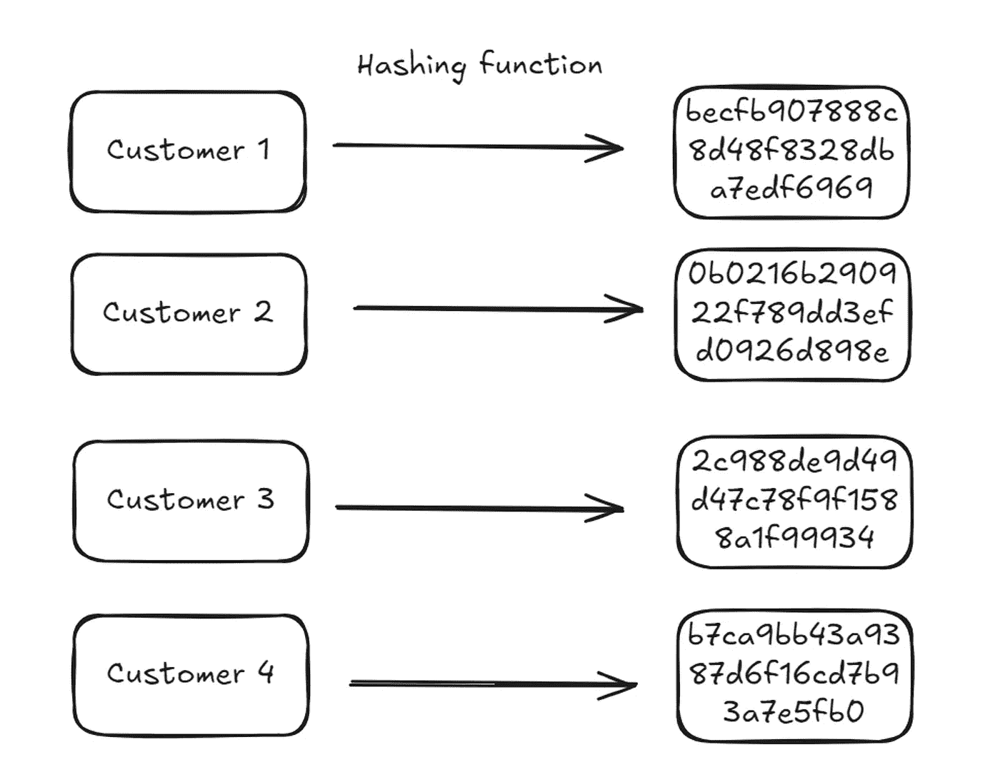

# 使用哈希空间实现稳定且快速的随机化

> 原文：[`towardsdatascience.com/stable-and-fast-randomization-using-hash-spaces-19000b9f27d3?source=collection_archive---------14-----------------------#2024-07-29`](https://towardsdatascience.com/stable-and-fast-randomization-using-hash-spaces-19000b9f27d3?source=collection_archive---------14-----------------------#2024-07-29)

## 在不同的实施环境中动态生成一致的任务分配

[](https://medium.com/@davidclarance?source=post_page---byline--19000b9f27d3--------------------------------)[](https://towardsdatascience.com/?source=post_page---byline--19000b9f27d3--------------------------------) [David Clarance](https://medium.com/@davidclarance?source=post_page---byline--19000b9f27d3--------------------------------)

·发表于 [Towards Data Science](https://towardsdatascience.com/?source=post_page---byline--19000b9f27d3--------------------------------) ·阅读时间 8 分钟·2024 年 7 月 29 日

--


鸟瞰图

进行实验的核心部分是将一个实验单位（例如一个客户）分配到特定的处理（支付按钮变体、营销推送通知框架）。通常，这种分配需要满足以下条件：

1.  它需要是随机的。

1.  它需要是稳定的。如果客户返回到该页面，他们需要看到相同的支付按钮变体。

1.  它需要在实际分配后能够快速检索或生成，以便在后续分析中使用。

1.  它需要在实际分配后仍然可用，以便在后续分析中使用。

当组织开始进行实验时，一个常见的做法是预先生成分配任务，将其存储在数据库中，然后在分配时提取出来。这是一个完全有效的方法，对于刚开始的实验非常有效。然而，随着客户和实验量的增加，这种方法变得越来越难以维护，并且难以可靠使用。你必须 (a) 管理存储的复杂性，(b) 确保任务在实验内和实验间都是随机的，*并且* (c) 确保任务能被可靠地提取。所有这些在大规模实验中都很困难。

使用*哈希空间*有助于解决这些问题。这是一个简单的解决方案，但可能没有得到应有的关注。这个博客尝试解释这种技术。文末有不同编程语言的代码链接。不过，如果你愿意的话，也可以直接[跳转到代码](https://gist.github.com/davidclarance/daeafad5fc3e28e019950a12b0da01f5)。

# 设置

我们正在进行一个实验，测试我们客户应用中哪种进度条变体能够带来最多的用户参与度。有三个变体：控制组（默认体验）、变体 A 和变体 B。

我们有 1000 万客户每周使用我们的应用，并且我们希望确保这 1000 万客户会随机分配到三个变体中的一个。每次客户回到应用时，他们应该看到相同的变体。我们希望控制组的分配概率为 50%，变体 1 的分配概率为 30%，变体 2 的分配概率为 20%。

```py
probability_assignments = {"Control": 50, "Variant 1": 30, "Variant 2": 20}
```

为了简化问题，我们从 4 个客户开始。这些客户有我们用来引用他们的 ID。这些 ID 通常是 GUID（类似于“`b7be65e3-c616-4a56-b90a-e546728a6640`”）或整数（如 1019222，1028333）。这些 ID 类型都可以使用，但为了便于理解，我们假设这些 ID 为：“Customer1”，“Customer2”，“Customer3”，“Customer4”。


我们的目标是将这四个客户映射到三种可能的变体上。

# 哈希客户 ID

该方法主要依赖于使用具有一些非常理想属性的哈希算法。哈希算法将任意长度的字符串映射到固定长度的“哈希”值。理解这一点最简单的方法是通过一些例子。

哈希函数接受一个字符串，并将其映射到一个常量哈希空间中。在下面的示例中，哈希函数（在本例中是[md5](https://en.wikipedia.org/wiki/MD5)）将以下单词：“Hello”，“World”，“Hello World”和“Hello WorLd”（注意大写的 L）映射为一个由 32 个字符组成的字母数字字符串。


有几点重要的事项需要注意：

+   所有的哈希值长度相同。

+   输入中的一个小差异（大写的 L 而不是小写的 l）会改变哈希值。

+   哈希值是一个十六进制字符串。也就是说，它由数字 0 到 9 以及前六个字母（a、b、c、d、e 和 f）组成。

我们可以使用相同的逻辑来计算四个客户的哈希值：

```py
import hashlib

representative_customers = ["Customer1", "Customer2", "Customer3", "Customer4"]

def get_hash(customer_id):
    hash_object = hashlib.md5(customer_id.encode())
    return hash_object.hexdigest()

{customer: get_hash(customer) for customer in representative_customers}

# {'Customer1': 'becfb907888c8d48f8328dba7edf6969',
#  'Customer2': '0b0216b290922f789dd3efd0926d898e',
#  'Customer3': '2c988de9d49d47c78f9f1588a1f99934',
#  'Customer4': 'b7ca9bb43a9387d6f16cd7b93a7e5fb0'}
```



十六进制字符串只是数字在 16 进制表示中的形式。我们可以[将它们转换为十进制整数](https://g.co/gemini/share/83e1757e48f9)。

> ⚠️ 这里有一个重要的注意事项：我们很少需要使用完整的哈希值。实际上（例如在链接的代码中），我们只使用哈希的一个较小部分（前 10 个字符）。这里我们使用完整的哈希值是为了使解释更容易一些。

```py
def get_integer_representation_of_hash(customer_id):
    hash_value = get_hash(customer_id)
    return int(hash_value, 16)

{
    customer: get_integer_representation_of_hash(customer)
    for customer in representative_customers
}

# {'Customer1': 253631877491484416479881095850175195497,
#  'Customer2': 14632352907717920893144463783570016654,
#  'Customer3': 59278139282750535321500601860939684148,
#  'Customer4': 244300725246749942648452631253508579248}
```


这些整数有两个重要的属性：

1.  这些整数是**稳定**的：给定一个固定的输入（“Customer1”），哈希算法总是会产生相同的输出。

1.  这些整数是**均匀分布**的：这个概念还没有解释，主要应用于加密哈希函数（如 md5）。均匀性是这些哈希函数的设计要求。如果它们不是均匀分布的，那么碰撞的几率（不同输入得到相同输出的情况）会更高，从而削弱哈希的安全性。有一些[探讨](https://www.rolando.cl/blog/2018/12/how_uniform_is_md5.html)讨论了[均匀性](https://stackoverflow.com/a/9346575/4583536)属性。

现在我们有了每个 ID 的整数表示，它是稳定的（始终具有相同的值）且[均匀分布](https://en.wikipedia.org/wiki/Hash_function#Uniformity)，我们可以使用它来进行分配。

# 从整数表示到分配

回到我们的概率分配，我们希望将客户分配到变体的分布如下：

```py
{"Control": 50, "Variant 1": 30, "Variant 2": 20}
```

如果我们有 100 个位置，我们可以将它们分成 3 个桶，每个桶中的位置数量表示我们希望分配给该桶的概率。例如，在我们的例子中，我们将整数范围 0–99（100 个单位）分为 0–49（50 个单位）、50–79（30 个单位）和 80–99（20 个单位）。


```py
def divide_space_into_partitions(prob_distribution):
    partition_ranges = []
    start = 0
    for partition in prob_distribution:
        partition_ranges.append((start, start + partition))
        start += partition
    return partition_ranges

divide_space_into_partitions(prob_distribution=probability_assignments.values())

# note that this is zero indexed, lower bound inclusive and upper bound exclusive
# [(0, 50), (50, 80), (80, 100)]
```

现在，如果我们将一个客户随机分配到 100 个位置之一，那么最终的分布应该与我们期望的分布相同。另一种思考方式是，如果我们在 0 到 99 之间随机选择一个数字，那么有 50%的概率它会在 0 到 49 之间，30%的概率它会在 50 到 79 之间，20%的概率它会在 80 到 99 之间。

唯一剩下的步骤是将我们生成的客户整数映射到这些 100 个位置之一。我们通过提取生成整数的最后两位数字并将其作为分配来完成此操作。例如，客户 1 的最后两位数字是 97（你可以查看下面的图表）。这属于第三个桶（变体 2），因此该客户被分配到变体 2。

我们对每个客户重复这一过程，直到所有客户处理完毕。完成后，我们应该发现最终的分布符合我们的预期：50%的客户在控制组，30%在变体 1 组，20%在变体 2 组。

```py
def assign_groups(customer_id, partitions):
    hash_value = get_relevant_place_value(customer_id, 100)
    for idx, (start, end) in enumerate(partitions):
        if start <= hash_value < end:
            return idx
    return None

partitions = divide_space_into_partitions(
    prob_distribution=probability_assignments.values()
)

groups = {
    customer: list(probability_assignments.keys())[assign_groups(customer, partitions)]
    for customer in representative_customers
}

# output
# {'Customer1': 'Variant 2',
#  'Customer2': 'Variant 1',
#  'Customer3': 'Control',
#  'Customer4': 'Control'}
```

[链接的摘要](https://gist.github.com/davidclarance/daeafad5fc3e28e019950a12b0da01f5?permalink_comment_id=5136729#gistcomment-5136729)中有一个针对 1,000,000 个客户的复现，我们可以观察到客户分布符合预期的比例。

```py
# resulting proportions from a simulation on 1 million customers.
{'Variant 1': 0.299799, 'Variant 2': 0.199512, 'Control': 0.500689
```

# 实际考虑

# 在实验中添加“盐”

实际上，当你在不同部分的产品中运行多个实验时，通常会在哈希 ID 之前添加一个“盐”。这个盐可以是任何东西：实验名称、实验 ID、功能名称等。这确保了在实验之间客户到桶的映射始终不同，因为盐值不同。这对于确保客户不会总是落入相同的桶中非常有帮助。例如，你不希望特定客户总是落入对照组处理桶，如果恰好是对照组分配了所有实验中的前 50 个桶。这个实现起来很简单。

```py
salt_id = "f7d1b7e4-3f1d-4b7b-8f3d-3f1d4b7b8f3d"
customer_with_salt_id = [
    f"{customer}{salt_id}" for customer in representative_customers
]

# ['Customer1f7d1b7e4-3f1d-4b7b-8f3d-3f1d4b7b8f3d',
#  'Customer2f7d1b7e4-3f1d-4b7b-8f3d-3f1d4b7b8f3d',
#  'Customer3f7d1b7e4-3f1d-4b7b-8f3d-3f1d4b7b8f3d',
#  'Customer4f7d1b7e4-3f1d-4b7b-8f3d-3f1d4b7b8f3d']
```

# 增加分区空间

在这个例子中，我们使用了一个包含 100 个可能槽位（或分区）的空间。如果你想分配具有一个或多个小数位的概率，你只需取整数的最后 n 位数字。

例如，如果你想为概率分配最多两位小数，你可以取整数的最后 4 位数字。也就是说，下面的`place_value`值将是 10000。

```py
def get_relevant_place_value(customer_id, place_value):
    hash_value = get_integer_representation_of_hash(customer_id)
    return hash_value % place_value
```

# 跨环境可用性

最后，这个方法之所以在实践中如此强大和有吸引力的一个原因是，你可以在不同的实现环境中精确复制这个过程。只要输入相同，核心哈希算法在任何环境中都会给你相同的哈希值。你需要做的只是`CustomerId`、`SaltId`和预期的概率分布。你可以在这里找到不同的实现：

+   [Python](https://gist.github.com/davidclarance/daeafad5fc3e28e019950a12b0da01f5)

+   [DuckDB](https://gist.github.com/davidclarance/b69559191e6628d32d8f2adf271e067f)

+   [TSQL](https://gist.github.com/davidclarance/99a22cc90bd7172fc2a2d00745b62c0e)

# 总结

如果你想在不同的实现环境中生成随机、快速且稳定的分配，你可以使用以下方法：

+   使用加密哈希函数（如 md5）从唯一 ID 和一些“盐”生成哈希值。

+   将其转换为十进制整数。

+   提取最后两位数字。如果你有更细粒度的需求，可以提取更多数字。

+   使用这些数字将 ID 分配给预定义实验桶中的一个。


客户映射到桶的概览

感谢你的关注，希望你觉得这篇文章有用。文中的所有图片均为我个人所有，欢迎使用！

非常感谢*Deniss Zenkovs*向我介绍这个想法并建议了有趣的扩展。
