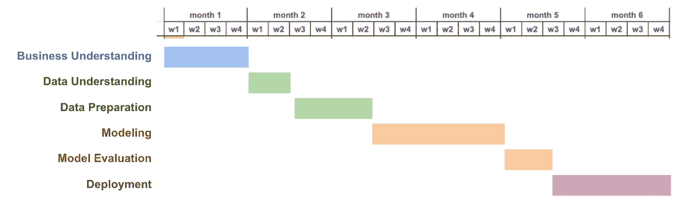

# 从正确的起点启动机器学习产品项目

> 原文：[`towardsdatascience.com/starting-ml-product-initiatives-on-the-right-foot-cf24cbe163b3?source=collection_archive---------7-----------------------#2024-05-02`](https://towardsdatascience.com/starting-ml-product-initiatives-on-the-right-foot-cf24cbe163b3?source=collection_archive---------7-----------------------#2024-05-02)

## 学到的三大教训：问题、规模和数据

 [Anna Via](https://annaviaba.medium.com/?source=post_page---byline--cf24cbe163b3--------------------------------)

·发布于 [Towards Data Science](https://towardsdatascience.com/?source=post_page---byline--cf24cbe163b3--------------------------------) ·9 分钟阅读·2024 年 5 月 2 日

--

*图片由*[*Snapwire*](https://www.pexels.com/es-es/@snapwire/)*提供，来源于* [*Pexels*](https://www.pexels.com/)

*这篇博客文章是我去年在 GOTO 阿姆斯特丹的会议演讲部分内容的更新版本。演讲也可以在* [*这里观看*](https://www.youtube.com/watch?v=dFxFYukNmvE)*。*

作为一名机器学习产品经理，我对机器学习与产品管理的交集深感兴趣，尤其是在创造能够为产品、公司和用户带来价值和积极影响的解决方案时。然而，能够提供这种价值和积极影响并不是一项简单的工作。造成这种复杂性的一个主要原因是，在为数字产品开发的机器学习项目中，存在两个不确定性的来源相互交织。

从产品管理的角度来看，这一领域本质上是充满不确定性的。很难预测一个解决方案对产品的影响、用户的反应，以及它是否能够改善产品和商业指标……必须应对这种不确定性，这也是产品经理与其他角色（如项目经理或产品负责人）潜在不同之处。产品战略、产品发现、机会的规模估算、优先级排序、敏捷方法和快速实验等策略是克服这种不确定性的手段。

机器学习领域也与不确定性有着密切联系。我总是喜欢说*“通过预测模型，目标是预测那些你不知道是可以预测的事情”*。这意味着项目很难进行范围定义和管理，无法事先承诺质量交付物（良好的模型表现），并且许多举措永远停留在离线的概念验证阶段。清晰定义待解决的问题、初步数据分析和探索、从小做起、并紧密贴近产品和业务，这些都是有助于应对机器学习项目中不确定性的措施。

从一开始就缓解这一不确定性风险，是开发能够为产品、公司和用户带来价值的举措的关键。在这篇博客中，我将深入探讨**我在启动机器学习产品项目时，如何从一开始管理不确定性的三大经验教训**。这些经验主要来源于我作为数据科学家的第一手经验，以及如今作为机器学习产品经理的实践经验，有助于提高机器学习解决方案最终能够投入生产并产生积极影响的可能性。准备好一起探索吧：

+   从问题开始，并从一开始就定义预测结果的使用方式。

+   从小做起，如果可以的话，就保持小规模。

+   数据、数据、还是数据：质量、数量和历史。

# **从问题开始（并定义如何使用预测结果）**

从正确的问题开始，[Steve Johnson](https://www.pexels.com/es-es/@steve/) @ [Pexels](https://www.pexels.com/)

我必须承认，我是通过艰苦的实践学到这一点的。我曾参与过一些项目，一旦模型开发完成，预测性能被认为“足够好”之后，模型的预测实际上对于任何特定的使用案例并不可用，或者不能有效地帮助解决任何问题。

造成这种情况的原因有很多，但我发现最常见的原因是：

+   **以解决方案为驱动的举措**：即使在生成式人工智能（GenAI）出现之前，机器学习和预测模型已经是“很酷”的解决方案，正因如此，一些举措是从机器学习解决方案开始的：“*让我们试着预测流失*”（指的是放弃某公司的用户或客户）、“*让我们试着预测用户群体*”… 当前生成式人工智能的炒作加剧了这一趋势，迫使公司将生成式人工智能解决方案“随便”地整合到各个适合的地方。

+   **缺乏端到端的解决方案设计**：在极少数情况下，预测模型是一个独立的解决方案。然而，通常情况下，模型及其预测会集成到更大的系统中，以解决特定的使用案例或启用新的功能。如果从一开始没有定义好这个端到端的解决方案，就可能导致模型在实施后被发现无用。

要让机器学习计划顺利起步，关键是**从正确的问题开始**。这是产品管理中的基础，产品领导者如*Marty Cagan*和*Melissa Perri*也反复强调这一点。它包括产品发现（通过用户访谈、市场调研、数据分析等），以及机会的量化和优先级排序（通过考虑定量和定性数据）。

一旦机会被识别，**第二步是探索潜在的解决方案**，其中应包括机器学习和生成式人工智能技术，如果它们能帮助解决问题的话。

如果决定尝试一种包含预测模型的解决方案，**第三步将是进行解决方案或系统的端到端定义和设计**。这样，我们可以确保系统如何使用预测结果的需求会影响预测部分的设计和实施（预测内容、使用的数据、实时与批量、技术可行性检查等）。

然而，我想补充的是，在这个话题上可能有**一个显著的例外**。如果生成式人工智能技术最终真的彻底改变了你的行业或我们所知的世界，那么从生成式人工智能解决方案开始，而不是从问题开始，是有意义的。关于这一点有很多讨论，但我认为现在还不清楚是否会发生这种情况。直到目前为止，我们已经在非常特定的行业中（如客户支持、营销、设计等）看到了这种革命，并且与人们在执行某些任务时的效率（如编程、写作、创作等）相关。然而，对于大多数公司来说，除非它被视为研发工作，否则交付短期/中期价值仍然应该意味着聚焦于问题，并将生成式人工智能视为解决这些问题的潜在解决方案之一。

# **从小做起（如果可能，保持小规模）**

艰难的经历也带来了这些学习。这些经历的共同点是，一个大型的机器学习项目以瀑布式方式定义。这种项目通常预计持续 6 个月，并按照机器学习生命周期逐步推进。

遵循机器学习生命周期阶段的瀑布式项目规划，图像来自作者

这有什么可能出错呢，对吧？让我提醒你我之前的话 *“通过预测模型，目标是预测那些你不知道能预测的事情”*! 在这种情况下，可能会发生这样的情况：你在项目的第 5 个月时进行模型评估，意识到模型无法以足够好的质量预测任何它需要预测的内容。或者更糟糕的是，你在第 6 个月时，拥有一个已经部署到生产环境中的超级模型，却意识到它没有带来任何价值。

这种风险与与产品相关的不确定性结合在一起，迫使我们尽可能避免大型瀑布式项目。这不仅仅是 ML 项目所特有的问题，也并非新鲜事物，因此我们可以从传统软件开发、敏捷开发、精益方法及其他方法论和思维方式中学到很多。通过从小规模开始，快速验证假设并持续进行实验和扩展，我们可以有效地规避这一风险，适应洞察并提高成本效益。

尽管这些原则在传统软件和产品开发中已经得到了充分确立，但将其应用于 ML 项目则要复杂一些，因为定义一个 ML 模型和部署的“简单”并不容易。然而，还是有一些方法可以帮助在 ML 项目中从小处着手。

**基于规则的方法**，通过决策树简化预测模型。通过这种方式，“预测”可以轻松地作为“if-else 语句”在生产中实现，作为功能或系统的一部分，而不需要部署模型。

**概念验证**（POC），作为一种离线验证 ML 解决方案预测可行性的方法，并在生产中给出预测步骤的潜力（或不具备潜力）。

**最小可行产品**（MVP），首先关注核心功能、特性或用户群体，只有在价值被验证后，才扩展解决方案。对于一个 ML 模型，这可能意味着仅使用最直接的优先输入特征，或者仅为一部分数据点进行预测。

**购买而非自建**，利用现有的 ML 解决方案或平台，以帮助减少开发时间和初期成本。只有在证明有价值且成本过高时，才可能是决定在内部开发 ML 解决方案的合适时机。

**将 GenAI 作为 MVP 使用**，对于一些用例（尤其是涉及文本或图像的用例），可以将 GenAI API 作为解决系统预测步骤的首选方法。像文本分类、情感分析或图像检测等任务，GenAI 模型能够提供令人印象深刻的结果。当价值得到验证且成本过高时，团队可以决定开发一个特定的“传统” ML 模型。

请注意，尽管使用 GenAI 模型进行图像或文本分类是可能的并且快速，但这意味着在解决本可以用更简单、可控的模型预测的问题时，使用了一个过于庞大且复杂的模型（昂贵、缺乏控制、幻觉等）。一个有趣的类比是*用卡车送披萨*：虽然可行，但为什么不直接用自行车呢？

# 数据、数据和数据（质量、量、历史）

图片来源：[Tima Miroshnichenko](https://www.pexels.com/es-es/@tima-miroshnichenko/)，来自 [Pexels](https://www.pexels.com/)

数据是数据科学家和机器学习团队在启动机器学习项目时遇到的**反复出现的问题**。你是否曾被重复的数据、错误、缺失的批次、奇怪的值……所惊讶？这与你在在线课程中看到的玩具数据集有多大的不同！

也有可能是你需要的数据根本不存在：某些特定事件的跟踪从未被实现，收集和适当的 ETL 最近才实施……我曾经历过这样的情况：为了获得足够的历史数据和数据量，不得不等待几个月才能启动一个项目。

所有这一切都与“*垃圾进，垃圾出*”这句格言相关：机器学习模型的效果取决于它们所训练的数据。很多时候，通过改善数据而非模型来提高解决方案的潜力更大（[数据中心化 AI](https://datacentricai.org/)）。数据需要在数量、历史（多年生成的数据比在短短一周内生成的数据更有价值）和质量上都足够。为了实现这一点，成熟的数据治理、收集、清洗和预处理至关重要。

从**伦理 AI**的角度来看，数据也是偏见和歧视的主要来源，因此认识到这一点并采取行动来减轻这些风险至关重要。考虑数据治理原则、隐私和合规性（例如欧盟的*GDPR*）也是确保负责任使用数据的关键（尤其是在处理个人数据时）。

使用**GenAI 模型**时，这一情况发生了转变：大量数据已经被用于训练这些模型。在使用这些类型的模型时，我们可能不需要大量和高质量的数据进行训练，但可能需要它们来进行微调（见[优质数据 = 优质 GenAI](https://medium.com/mit-initiative-on-the-digital-economy/good-data-good-genai-930c7ff83fe1)），或者构建提示（培养上下文、少量示例学习、检索增强生成……—我在[之前的文章](https://medium.com/towards-data-science/the-4-new-trendy-ai-concepts-and-their-potential-in-digital-products-cf5e1b85bff9)中解释了所有这些概念！）。

需要注意的是，通过使用这些模型，我们正在失去对用于训练它们的数据的控制，我们可能会受到使用的数据的质量或类型的影响：有很多已知的偏见和歧视的例子，这些例子会对我们的解决方案产生负面影响。一个很好的例子是彭博社的文章“[ChatGPT 如何成为招聘人员的梦想工具——测试显示存在种族偏见](https://www.bloomberg.com/graphics/2024-openai-gpt-hiring-racial-discrimination/)”。[LLM 排行榜测试偏见](https://ai-sandbox.list.lu/llm-leaderboard/)，或[专门训练以避免这些偏见的 LLM](https://www.latimer.ai/)在这方面可能会有所帮助。

关于 ChatGPT 的性别偏见示例（2024 年 5 月 1 日的提示）

# 总结

我们在这篇博客文章的开头讨论了使机器学习产品项目特别棘手的因素：这涉及到在开发数字产品解决方案过程中所面临的不确定性，以及通过使用机器学习模型来预测事物时所遇到的不确定性。

知道有可操作的步骤和策略可以用来缓解这些风险，令人感到宽慰。然而，也许最好的方法是，从一开始就把这些项目启动在正确的轨道上！为此，确实有助于从正确的问题和端到端的解决方案设计入手，减少初期的范围，并优先考虑数据质量、数量和历史准确性。

我希望这篇文章对你有所帮助，并能帮助你挑战未来与机器学习产品相关的新项目工作方式！
