# 打分偏差的统计分析

> 原文：[`towardsdatascience.com/statistical-analysis-on-scoring-bias-7b429d681bf5?source=collection_archive---------12-----------------------#2024-10-01`](https://towardsdatascience.com/statistical-analysis-on-scoring-bias-7b429d681bf5?source=collection_archive---------12-----------------------#2024-10-01)

## 2024 年阿根廷探戈世界锦标赛

[](https://databeast.medium.com/?source=post_page---byline--7b429d681bf5--------------------------------)[](https://towardsdatascience.com/?source=post_page---byline--7b429d681bf5--------------------------------) [亚历山大·巴里加](https://databeast.medium.com/?source=post_page---byline--7b429d681bf5--------------------------------)

·发表于[Towards Data Science](https://towardsdatascience.com/?source=post_page---byline--7b429d681bf5--------------------------------) ·阅读时间：19 分钟·2024 年 10 月 1 日

--

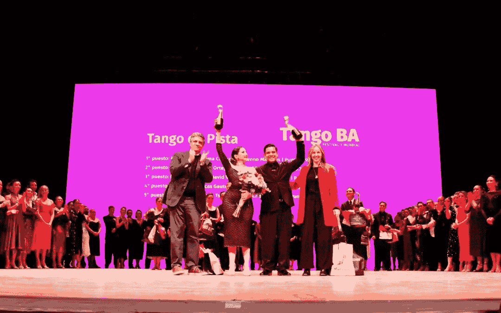

2024 年 Tango de Pista 世界舞蹈大赛冠军：法蒂玛·卡拉科奇与布雷诺·马尔凯斯。图像来源：[TangoBA](https://tangoba.org/category/destacadas/)

**简而言之**

1.  评审小组之间偏差的比例检验具有统计显著性。

1.  数据可视化显示了高度偏斜的分布

1.  对评审员和评审小组之间相对均值偏差的测试表明，评审小组 1 存在负偏差（给出较低的分数），而评审小组 2 存在正偏差（给出较高的分数）。

1.  对各评审小组之间的均值偏差测试未能提供统计显著的差异证据，但测试的统计功效较低。

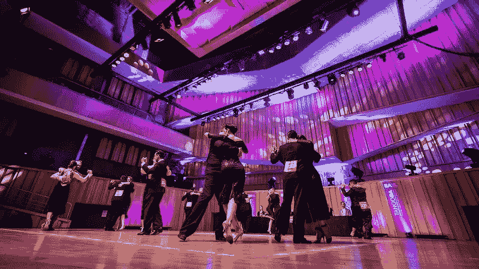

图像来源：[TangoBA](https://tangoba.org/)

[**Tango de Mundial**](https://tangoba.org/)是每年在阿根廷布宜诺斯艾利斯举办的阿根廷探戈比赛。来自世界各地的舞者汇聚布宜诺斯艾利斯，争夺世界冠军的头衔。

在 2024 年，约有 500 对舞蹈搭档（1000 名舞者）参加了预选赛。仅有一小部分舞者晋级半决赛，最终约 40 对舞者进入决赛。仅仅晋级 2024 年的决赛，你就已经超过了全球 95%的竞争者。

许多决赛选手利用这个平台推动自己的职业生涯，而世界冠军的头衔则将你的面孔永载探戈历史，几乎可以保证你作为职业舞者工作，直到你不再需要为此奋斗。因此，对于许多舞者来说，他们的命运掌握在评审们对其舞蹈的评价之中。

**在本文中，我们将对两个由 10 名评委组成的评审小组的评分偏差进行多项统计分析**。每位评委都有自己对“什么是探戈？”这一问题的回答。每位评委对评判标准的质量有不同的看法：技巧、音乐性、拥抱、舞蹈词汇、舞台表现（即，你看起来像不像舞者）等。正如你已经察觉到的，这些评估高度主观，因此毫不奇怪，评委之间会产生很大的偏差。

**注意：** 除非明确说明，否则所有数据可视化（即图表、图形、数据框截图）均为作者原创作品。

# **代码**

你可以在我的**GitHub 个人主页**找到所有用于本次分析的代码。

[](https://github.com/Alexander-Barriga/my_portfolio/tree/main/Argentine_Tango_Mundial?source=post_page-----7b429d681bf5--------------------------------) [## my_portfolio/Argentine_Tango_Mundial at main · Alexander-Barriga/my_portfolio

### 在这里，你可以找到我参与的一些个人数据科学项目。 - my_portfolio/Argentine_Tango_Mundial at main ·…

[github.com](https://github.com/Alexander-Barriga/my_portfolio/tree/main/Argentine_Tango_Mundial?source=post_page-----7b429d681bf5--------------------------------)

## **数据限制**

在我们深入分析之前，让我们先讨论一下数据的限制。**你可以直接访问这份 PDF 文件查看初赛的得分。**

[## Ranking-Clasificatoria-Tango-de-Pista-Mundial-de-tango-2024.pdf

### 编辑描述

[drive.google.com](https://drive.google.com/file/d/18xBekmYKWuw70b3bLr2zyLzUR_z3hOb-/view?source=post_page-----7b429d681bf5--------------------------------) 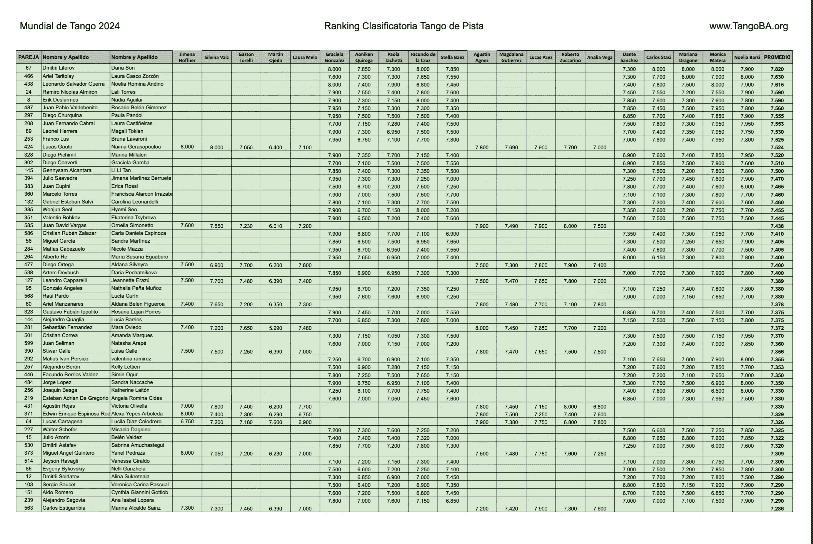

来自初赛轮次的舞者得分第 1 页。每一行代表一个舞蹈双人组。注意，每对舞者的评分来自 20 位评委中的 10 位。更多信息请见数据分析部分。数据截图由作者提供。

1.  **评委并不代表整个世界。** 虽然舞蹈选手在某种程度上能代表全球探戈舞蹈人群，但评委并不能——他们全都是阿根廷人。这使得一些人质疑比赛的合法性。至少，这样的情况使得“Munidal de Tango”这一名称被认为是错误的。

1.  **将舞者评分精确到小数点后 100 位是荒谬的。** 一些评委会将舞者评分精确到小数点后 100 位（即 7.75 与 7.7）。这引发了一个问题：“是什么样的舞蹈质量会导致 0.05 的分差？”至少，这凸显了评分的高度主观性。显然，这并不是一个使用高度可靠和精密测量设备的实验室物理实验。

1.  **腐败与政治。** 在舞蹈社区中并不是什么秘密，如果你参加了评审团成员的课程，你很可能会从他们那里获得积极的偏见（无论是有意的还是无意的），因为你代表了他们的思想体系，这使得他们在你的成功中有既得利益，并且代表了一种利益冲突。

1.  **仅提供舞者分数。** 不幸的是，除了舞者的名字和分数外，节日组织者并没有发布其他数据，如经验年数、年龄或原籍国，这大大限制了更全面的分析。

1.  **艺术是高度主观的。** 在探戈中有许多不同的思想流派，就像舞者有不同的意见一样。每个舞者都有自己的探戈哲学，定义了什么是好的技巧，或者什么样的拥抱感觉是美好的。

1.  **专业知识。** 我们讨论的不是电影或美食评论。舞者需要经过多年的高度专注的训练，才能培养出自己对阿根廷探戈的品味和有见地的意见。对于外行人来说，难以将数据映射到舞者在舞台上的表现。

尽管数据存在这些问题，Tango Munidal 的数据仍然是我们可以获得的最大、最具代表性的全球阿根廷探戈舞者数据集。

## **相信我——我的资历**

除了是数据科学家外，我还是一名竞技阿根廷探戈舞者。虽然我没有参加 2024 年 Tango Munidal 比赛，但我已经多年来在这项舞蹈上进行了刻苦训练（除了其他舞蹈和武术）。我是一个舞者，一个武术家，一个表演者，也是探戈的守护者。

虽然我的观点仅代表了阿根廷探戈中的一个主观声音，但它是一个真实且有见地的声音。

# **舞蹈评分中的偏差统计分析**

接下来我们将进行几项统计测试，以评估评分偏差是否存在，以及在哪些地方存在偏差。分析的概要如下：

1.  各评审团之间的比例偏差测试

1.  数据可视化与比较评审在不同均值偏差中的表现

1.  测试评审间的相对平均偏差

1.  测试评审团之间的均值偏差

# **1. 偏差的比例测试**

再次看看数据表第 1 页中表现最好的舞蹈情侣：


数据表的第 1 页。由作者提供的数据截图。

从左到右阅读表示评审名字的列名，在**Jimena Hoffner**和**Noelia Barsel**之间，你会看到：

+   第 1 至第 5 位以及第 11 至第 15 位的评审属于我们将称之为**评审团 1**的组别。

+   第 6 至第 10 位以及第 16 至第 20 位的评审属于我们将称之为**评审团 2**的组别。

**注意到了什么吗？** 注意到由第二评审小组评审的舞者比例明显更大，而由第一评审小组评审的舞者比例较小。如果你浏览[**PDF**](https://drive.google.com/file/d/18xBekmYKWuw70b3bLr2zyLzUR_z3hOb-/view) **的数据表，你会看到，这种比例差异在所有晋级到半决赛的选手中都得到了验证**。

**备注：** 绿色阴影部分的舞者晋级到了半决赛，而没有被绿色阴影标出的舞者则没有晋级。

这就引出了一个问题，**这种比例差异是真实的吗，还是由于随机抽样**，即舞者被随机分配到一个小组而不是另一个小组？嗯，我们有一个统计检验可以用来回答这个问题。

## 双尾检验：检验两个总体比例是否相等

我们将使用双尾 z 检验来测试两个比例是否在任一方向上存在显著差异。我们关心的是一个比例是否显著不同于另一个比例，无论它是更大还是更小。

## **统计检验假设**

1.  **随机抽样**：样本必须从各自的总体中独立且随机地抽取。

1.  **大样本量**：样本量必须足够大，以便样本比例差异的抽样分布可以近似为正态分布。这一近似来自于**中心极限定理**。

1.  **预期的成功与失败次数**：为了确保正态近似成立，每个组中预期的成功和失败次数应该至少为 5。

我们的数据集满足所有这些假设。

## **进行检验**

1.  **定义我们的假设**

**原假设：** 每个分布的比例相同。

**备择假设：** 每个分布的比例不相同。

**2\. 选择统计显著性水平**

alpha 的默认值为 0.05（5%）。我们没有理由放宽这个值（例如 10%）或使其更加严格（例如 1%）。所以我们将使用默认值。Alpha 表示我们因随机抽样而错误拒绝原假设，支持备择假设的容忍度（即第一类错误）。

接下来，我们将使用下面提供的 Python 代码来进行检验。

```py
def plot_two_tailed_test(z_value):
    # Generate a range of x values
    x = np.linspace(-4, 4, 1000)
    # Get the standard normal distribution values for these x values
    y = stats.norm.pdf(x)

    # Create the plot
    plt.figure(figsize=(10, 6))
    plt.plot(x, y, label='Standard Normal Distribution', color='black')

    # Shade the areas in both tails with red
    plt.fill_between(x, y, where=(x >= z_value), color='red', alpha=0.5, label='Right Tail Area')
    plt.fill_between(x, y, where=(x <= -z_value), color='red', alpha=0.5, label='Left Tail Area')

    # Define critical values for alpha = 0.05
    alpha = 0.05
    critical_value = stats.norm.ppf(1 - alpha / 2)

    # Add vertical dashed blue lines for critical values
    plt.axvline(critical_value, color='blue', linestyle='dashed', linewidth=1, label=f'Critical Value: {critical_value:.2f}')
    plt.axvline(-critical_value, color='blue', linestyle='dashed', linewidth=1, label=f'Critical Value: {-critical_value:.2f}')

    # Mark the z-value
    plt.axvline(z_value, color='red', linestyle='dashed', linewidth=1, label=f'Z-Value: {z_value:.2f}')

    # Add labels and title
    plt.title('Two-Tailed Z-Test Visualization')
    plt.xlabel('Z-Score')
    plt.ylabel('Probability Density')
    plt.legend()
    plt.grid(True)

    # Show plot
    plt.savefig(f'../images/p-value_location_in_z_dist_z_test_proportionality.png')
    plt.show()

def two_proportion_z_test(successes1, total1, successes2, total2):
    """
    Perform a two-proportion z-test to check if two population proportions are significantly different.

    Parameters:
    - successes1: Number of successes in the first sample
    - total1: Total number of observations in the first sample
    - successes2: Number of successes in the second sample
    - total2: Total number of observations in the second sample

    Returns:
    - z_value: The z-statistic
    - p_value: The p-value of the test
    """
    # Calculate sample proportions
    p1 = successes1 / total1
    p2 = successes2 / total2

    # Combined proportion
    p_combined = (successes1 + successes2) / (total1 + total2)

    # Standard error
    se = np.sqrt(p_combined * (1 - p_combined) * (1/total1 + 1/total2))

    # Z-value
    z_value = (p1 - p2) / se

    # P-value for two-tailed test
    p_value = 2 * (1 - stats.norm.cdf(np.abs(z_value)))

    return z_value, p_value

min_score_for_semi_finals = 7.040
is_semi_finalist = df.PROMEDIO >= min_score_for_semi_finals

# Number of couples scored by panel 1 advancing to semi-finals
successes_1 = df[is_semi_finalist][panel_1].dropna(axis=0).shape[0]  
# Number of couples scored by panel 2 advancing to semi-finals
successes_2 = df[is_semi_finalist][panel_2].dropna(axis=0).shape[0] 

# Total number of couples that where scored by panel 1
n1 = df[panel_1].dropna(axis=0).shape[0] 
# Total sample of couples that where scored by panel 2
n2 = df[panel_2].dropna(axis=0).shape[0]

# Perform the test
z_value, p_value = two_proportion_z_test(successes_1, n1, successes_2, n2)

# Print the results
print(f"Z-Value: {z_value:.4f}")
print(f"P-Value: {p_value:.4f}")

# Check significance at alpha = 0.05
alpha = 0.05
if p_value < alpha:
    print("The difference between the two proportions is statistically significant.")
else:
    print("The difference between the two proportions is not statistically significant.")

# Generate the plot
# P-Value: 0.0000
plot_two_tailed_test(z_value)
```

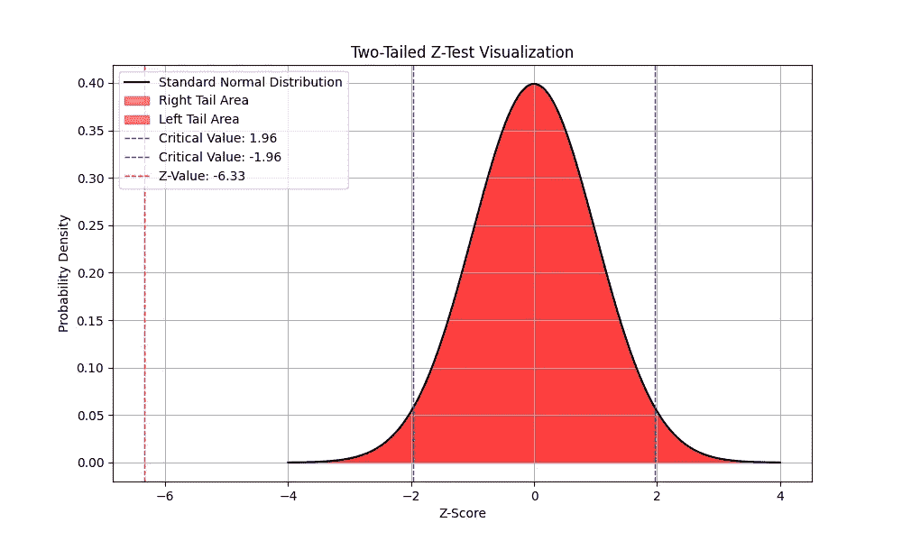

Z 值是我们计算得到的统计值。请注意，它远远超出了标准正态分布的范围。

图表显示，计算得到的 Z 值远远超出了我们在原假设为真的情况下期望看到的 z 值范围。因此，p 值为 0.0，表明我们必须拒绝原假设，支持备择假设。

这意味着比例差异是真实的，而不是由于随机抽样造成的。

+   17%的舞蹈组合在第一评审小组的评审下晋级到半决赛

+   42%的舞蹈组合在第二评审小组的评审下晋级到半决赛

我们的第一个偏差统计测试提供了证据，表明在由第二组评委评判的舞者的评分中存在正向偏差，几乎是 2 倍的提升。

接下来，我们将深入分析每位评委的评分分布，并看看他们各自的偏差如何影响整个小组的评分偏差。

# 2\. 数据可视化

本节中，我们将分析每位评委的个人评分分布和偏差。以下 20 个直方图展示了每位评委给舞者打的分数。请记住，每位舞者都由第 1 组或第 2 组的所有 10 位评委评分。评委的直方图是随机排列的，即第一列并不代表第 1 组的评委。

**注意：** 评委评分的范围是 1 到 10 分。

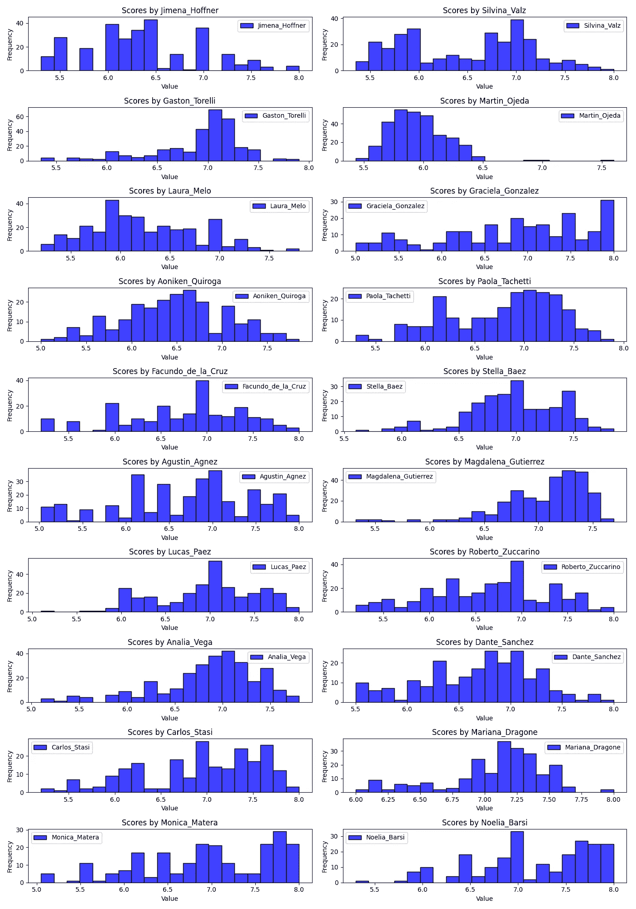

来自所有 20 位评委的评分分布。标题包含评委的姓名。

注意，有些评委的评分比其他评委严格得多。这引出了以下问题：

1.  评委之间的偏差分布是什么样的？换句话说，哪些评委评分更严厉，哪些评分更宽松？

1.  评委的评分偏差是否会被他们组内其他评委抵消？如果没有，评委之间的平均分数是否存在统计差异？

我们将在第三部分回答第 1 个问题。

我们将在第四部分回答第 2 个问题。

正如我们在上面的直方图中看到的，评委 Martin Ojeda 是最严厉的舞蹈评委。让我们看看他的 QQ 图。

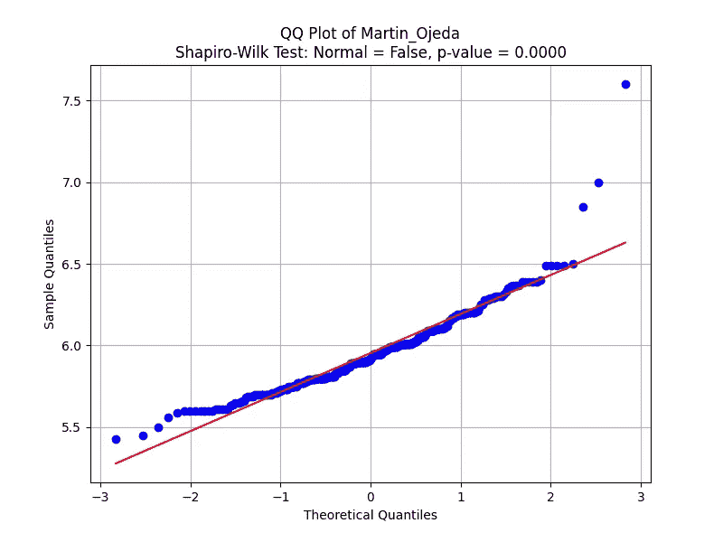

Martin 给出的评分分布。

**左下偏差（x 轴小于-2）**：在下分位区（最左侧），数据点实际上偏离了**红线以上**。这表明对于最弱的表演，评分比预期的**高**。Martin 可能是出于同情，稍微提高了对舞蹈组合的评分。一个潜在的原因可能是，Martín 希望避免对表现最差的选手打出极低的分数，从而给出稍微高一些的分数。

+   Martín 略微**高估**了较弱的竞争者，这可能表明他对那些本来应该得低分的表演有**轻微的正向偏差**。

**评分差异的稀释**：如果较弱的表演被高估，这可能会**压缩评分范围**，使较弱和中等水平的竞争者之间的差距变小。这可能会使强、适中和弱的表演之间的差异**不那么明显**。

+   例如，如果一场弱的表演得到一个较高的分数（比如 5.5 或 6.0），而不是 4.0 或 4.5，而中等水平的表演得分为 6.5，那么弱者和中等竞争者之间的差距就被人为缩小了。这破坏了竞争的公平性，因为这些分数不再真实反映表演质量。

**低分和高分之间的平衡**：尽管马丁高估较弱的表演者，但注意到在中间分数段（6.0–7.0），得分紧密跟随正态分布，表现出更中立的行为。然而，这种情况被他在高分段的**慷慨评分**（对顶级表演者的正偏见）所抵消，表明马丁倾向于“拉高”表现光谱的两端。

+   总的来说，这种**高估最弱和最强竞争者**的组合会压缩中间的得分。中等水平的竞争者可能会因此受到最大的不利影响，因为他们被夹在被高估的较弱表现和被慷慨评分的较强表现之间。

在下一节中，我们将识别出马丁认为最佳舞蹈搭档的极端得分，并在与评审小组中其他评委的得分对比时，为这对舞蹈搭档的得分提供更多背景。

在 Jupyter Notebook 中还有 19 个其他的 QQ 图，我们在本文中不会一一介绍，因为这会让文章变得冗长不堪。不过，您可以自行查看。

# **3\. 测试评委间相对均值偏差**

在本节中，我们将回答上一节提出的第一个问题。本节将分析各个评委的评分偏差。下一节将关注评审小组之间的评分偏差。

> 评委之间的偏差分布是怎样的？换句话说，哪些评委评分更严苛，哪些评委评分更宽松？

我们将进行迭代 T 检验，以检查某位评委的平均分是否在统计学上与其他 19 位评委的平均分的均值不同；也就是说，计算其他 19 位评委的平均分的均值。

```py
# Calculate mean and standard deviation of the distribution of mean scores
distribution_mean = np.mean(judge_means)
distribution_std = np.std(judge_means, ddof=1)

# Function to perform T-test
def t_test(score, mean, std_dev, n):
    """Perform a T-test to check if a score is significantly different from the mean."""
    t_value = (score - mean) / (std_dev / np.sqrt(n))
    # Degrees of freedom for the T-test
    df = n - 1
    # Two-tailed test
    p_value = 2 * (1 - stats.t.cdf(np.abs(t_value), df))
    return t_value, p_value

# Number of samples in the distribution
n = len(judge_means)

# Dictionary to store the test results
results = {}

# Iterate through each judge's mean score and perform T-test
for judge, score in zip(judge_features, judge_means):
    t_value, p_value = t_test(score, distribution_mean, distribution_std, n)

    # Store results in the dictionary
    results[judge] = {
        'mean_score': score,
        'T-Value': t_value,
        'P-Value': p_value,
        'Significant': p_value < 0.05
    }

# Convert results to DataFrame and process
df_judge_means_test = pd.DataFrame(results).T
df_judge_means_test.mean_score = df_judge_means_test.mean_score.astype(float)
df_judge_means_test.sort_values('mean_score')
```

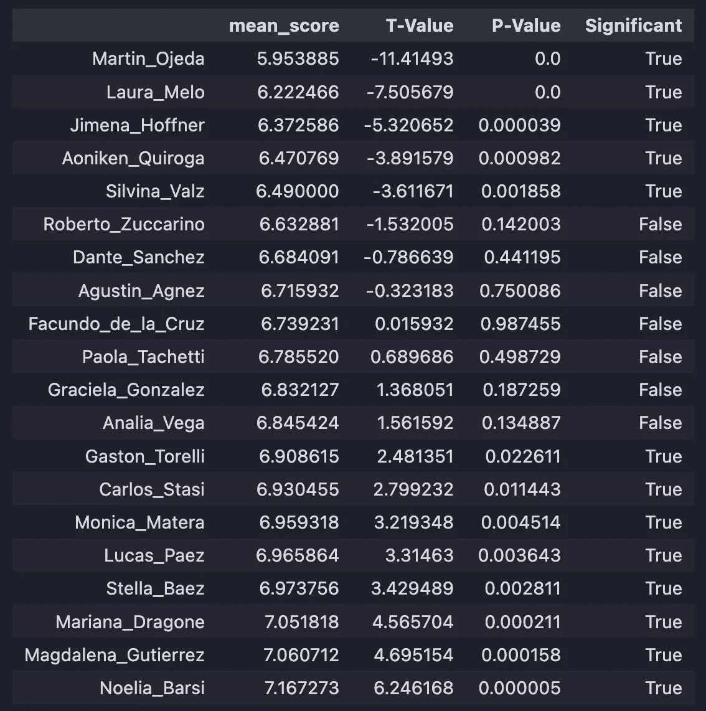

按评委的平均分值排序的 T 检验结果。

这里有 20 位评委：他们的平均分、t 统计量、p 值，以及每位评委的平均分与其他 19 位评委的平均分分布的差异是否在统计学上显著。

我们有三组评委：那些评分非常严格（统计学上低于平均水平），那些通常给出平均分（统计学上在平均范围内），以及那些评分较为宽松（统计学上高于平均水平）。

让我们关注三位具有代表性的评委：马丁·奥赫达、法昆多·多拉·克鲁兹和诺埃利亚·巴尔西。

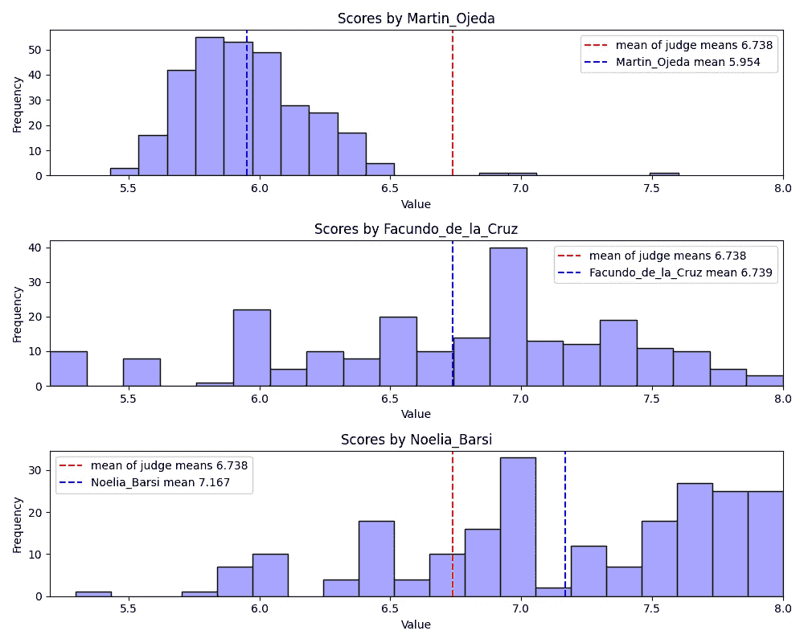

这三位评委代表了所有 20 位评委中的最严格、典型和宽松的评分偏差倾向。

请注意，**马丁·奥赫达**的得分分布和均值（蓝线）相比于所有评审的平均得分均值（红线）偏向较低的值。但我们也看到他的分布大致呈正态分布，除了少数几个离群值。我们稍后会回到得分为 7.5 的那对舞伴。几乎任何由马丁评分的舞蹈组合，都会看到他们的总平均分受到影响。

**法昆多·德·拉·克鲁兹**的得分分布大致呈正态分布，且方差较大。他是相对于其他同行而言偏差最小的评审。几乎任何由法昆多评分的舞蹈组合，都可以期待一个接近所有评审得分的结果，因此他们不必担心负面偏差，但也不太可能获得高分，从而提高他们的总体平均分。

**诺埃利亚·巴里斯**代表的是那种相比其他评审，倾向于给更多舞者一个有利评分的评审。所有舞蹈组合都应该希望诺埃利亚被分配到他们的评审小组。

现在让我们回到马丁的离群值舞伴。在马丁看来，*卢卡斯·卡塔赫纳* 和 *卢西拉·迪亚兹·科洛德雷罗* 的舞蹈表现就像离群值一样。

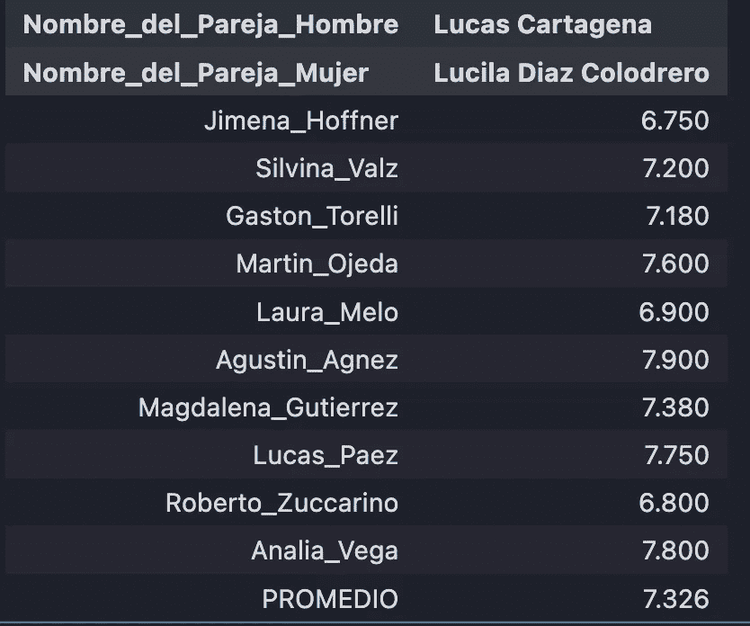

*卢卡斯·卡塔赫纳* 和 *卢西拉·迪亚兹·科洛德雷罗*。PROMEDIO 意味着平均值。

+   马丁·奥赫达给了这对舞蹈组合第四高的得分（7.600），而他的得分高于 7.326 的平均得分（PROMEDIO）

+   虽然马丁·奥赫达的得分在与他自己分布的比较中是一个离群值，但它并不像这对舞蹈组合收到的其他得分那样高。这意味着两件事：

+   马丁·奥赫达是一个整体保守的评分者（正如我们在上一节所见）

+   当与其他评审的得分相比时，马丁·奥赫达的离群得分实际上是有意义的，这表明这对舞蹈组合确实表现突出

这里他们演绎的是一种名为米隆加的探戈子类别，这种舞蹈通常与其他类别的音乐（如探戈和华尔兹）有很大的不同，通常不包括旋转动作，而是包括小而快速的步伐，强调音乐性。我可以告诉你，他们在这段视频中的表现非常出色，我想大多数舞者都会同意这个评价。

享受表演。

# 4\. 测试评审小组之间均值偏差

在本节中，我们通过回答以下问题来测试评审组 1 和评审组 2 之间的偏差：

> 评审的评分偏差是否会被他们小组内其他评审的评分所抵消？如果没有，评审均值之间是否存在统计学差异？

我们将通过两种方式测试评审偏差

1.  排名基础的评审偏差

1.  两尾 T 检验，比较评审组 1 和评审组 2 的得分分布

## **排名基础的评审偏差**

在这里，我们将对评审的均分进行排名和标准化，并计算每个评审小组的偏差。这是我们衡量评审小组之间潜在偏差的一种方法。

```py
panel_1 = judge_features[:5] + judge_features[10:15]
panel_2 = judge_features[5:10] + judge_features[15:]

df_judge_means = df_judge_means_test.sort_values('mean_score').mean_score

# Calculate ranks
ranks = df_judge_means.rank()

# Calculate mean and std of ranks
means_ranks = ranks.mean()
stds_ranks = ranks.std()

# Standardize ranks
df_judge_ranks = (ranks - means_ranks) / stds_ranks
df_judge_ranks
# these are the same judges sorted in the same way as before based on their mean scores
# except here we have converted mean values into rankings and standardized the rankings 
# Now we want to see how these 20 judges are distributed between the two panels 
# do the biases for each judge get canceled out by their peers on the same panel?
```

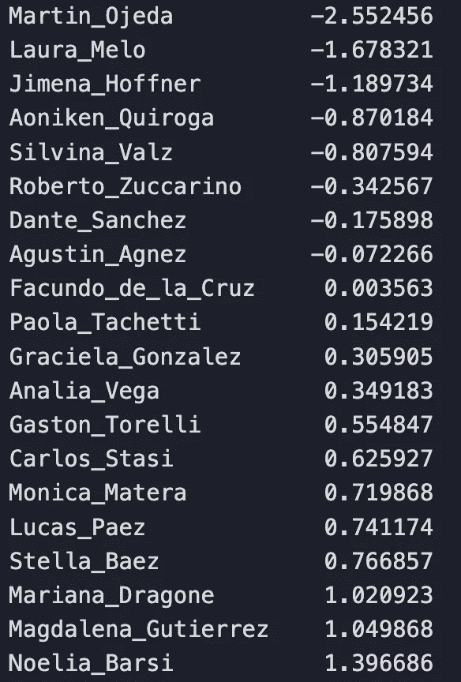

所有 20 位评审的排序排名

我们将每个评委的平均分值替换为相对于同行的排名。马丁仍然是最严苛、偏见最负面的评委。诺埃利亚仍然是偏见最正面的评委。

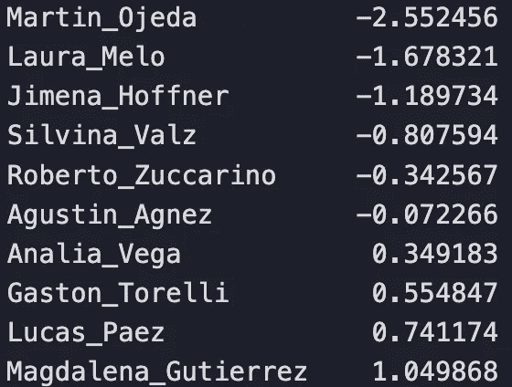

面板 1

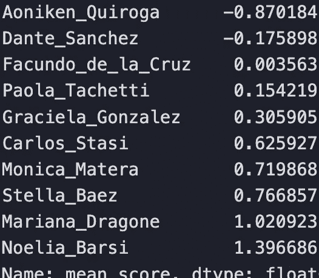

面板 2

请注意，面板 1 中的大多数评委偏向负面，只有 4 位评委偏向正面。面板 2 中的大多数评委偏向正面，只有 2 位评委偏向负面，法昆多则大致中立。

如果面板内部的偏差相互抵消，那么个别评委的偏见实际上不再重要；任何舞蹈搭档都会被公平评分。但是如果面板内部的偏差没有抵消，那么可能会存在不公平的优势。

> 面板 1 的平均排名值：-0.39478
> 
> 面板 2 的平均排名值：0.39478

我们发现，平均面板排名表明**面板内部的偏差并未相互抵消**，并提供了**证据表明舞蹈搭档在面板 2 评审下有优势**。

## 面板 1 和面板 2 分布之间的双尾 T 检验。

接下来，我们继续对面板偏差进行进一步的检验。下方图表展示了两个分布。蓝色表示分配给面板 1 的评委给出的平均分布，橙色表示分配给面板 2 的评委给出的平均分布。

在图表中，你会看到每个面板的平均分。面板 1 的平均分为 6.62，面板 2 的平均分为 6.86。

尽管 0.24 的面板平均差异看起来较小，但请注意，晋级半决赛的差异仅由 0.013 的差异决定。

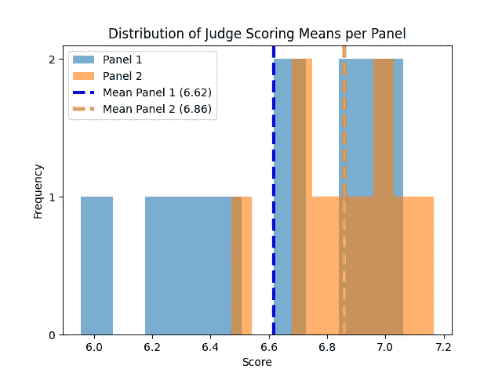

两个面板评委的平均分布。

在进行两样本 T 检验后，我们发现面板平均分之间的差异在统计上并不显著。该检验未能提供额外证据表明面板 1 和面板 2 之间的偏差存在统计差异。

**该检验的 P 值为 0.0808**，与我们默认的 0.05 的显著性水平相差不大。

**大数法则**

我们知道，来自[**大数法则**](https://en.wikipedia.org/wiki/Law_of_large_numbers)的结论表明，在小样本分布中（两个面板各有 10 个数据点），我们通常会发现方差大于其对应总体分布的方差。然而，随着样本数的增加，样本分布的参数将趋近于总体分布的参数（即均值和方差）。这可能是 T 检验未能提供面板偏差不同的证据的原因，即由于方差较大。

**统计功效**

另一种理解我们所看到结果的方式是通过[**统计效能**](https://en.wikipedia.org/wiki/Power_(statistics))**。** 统计效能指的是测试正确拒绝虚假零假设的概率。统计效能受到几个因素的影响。

+   **样本大小**

+   **效应量**（你想要检测的真实差异或关系）

+   **显著性水平**（例如，α=0.05）

+   **数据的变异性**（标准差）

增加我们测试统计效能最可靠的方法是收集更多的数据点，然而在这里这是不可行的。

# **结论**

本文我们将探讨 2024 年在布宜诺斯艾利斯举行的世界探戈锦标赛初赛数据。我们通过四种方式分析了评委和评审团的评分偏差：

1.  测试评审团之间的比例偏差

1.  数据可视化

1.  测试评委之间的相对均值偏差

1.  测试评审团之间的均值偏差

**偏差证据**

+   我们发现，被评审团 2 的评委评分的舞者晋级半决赛的比例显著更高。

+   个别评委的评分分布差异很大：有些偏高，有些偏低。我们看到，马丁·奥赫达对表现最差和最好的一对舞伴有明显的正偏向，他通过“拉高”他们的得分并压缩中等水平的舞者得分。总体来看，他的评分分布远低于其他所有评委。有些评委给出了更典型的分数，而有些评委则给出了非常宽松的分数（与同行相比）。

+   评审团之间的相对均值偏差存在明显差异。评审团 1 的大多数评委被认为在评分上存在负偏向，而评审团 2 的大多数评委则存在正偏向。因此，评审团 1 在评分舞者时表现出总体的负偏向，而评审团 2 则表现出总体的正偏向。

**没有偏差证据**

+   发现评审团 1 和评审团 2 之间的均值差异在统计学上没有显著性。由于分布的样本量较小，导致统计效能较低。因此，这个测试不如其他测试可靠。

我的结论是，个别评委和评审团层面上都有足够的偏差证据。分配到评审团 2 的舞者确实拥有一定的竞争优势。因此，对于寻求在比赛中获得额外优势的潜在竞争舞者，我们有一些建议。

## **如何赢得舞蹈比赛**

存在非权谋主义和权谋主义两种方式可以增加你获胜的机会。本文的结果和经验背景知识为权谋主义方法提供了更多的信服依据。

**非权谋主义**

1.  训练。永远没有什么能替代你投入 10000 小时的练习以获得精通的过程。

**权谋主义**

1.  上课并与那些你知道会出现在你评审小组中的教练建立关系。你的成功意味着该评审员舞蹈风格的验证和他们业务的推广。如果你的资源有限，可以专注于那些评分严格的评审，以帮助提高你的平均分。

1.  如果有多个评审小组，找到一种方法，确保你被分配到那个对你更有利的评审小组，从而提高你晋级下一轮的机会。

# **最终想法**

我个人认为，尽管在舞蹈比赛中玩弄权力游戏有一定的实用性，但这其实很愚蠢。没有什么能替代天赋，尤其是那种原始且无可辩驳的天赋。这篇分析最终是一个有趣的激情项目，也是一个应用一些统计概念的机会，而这个话题我非常珍惜。

# 关于作者

**亚历山大·巴里加**是一位数据科学家和竞技阿根廷探戈舞者。他目前住在加利福尼亚州洛杉矶。如果你已经看到这里，考虑给出反馈，分享他的文章，或者直接与他联系提供工作机会——他正在积极寻找下一个数据科学职位！


图片来自作者。
