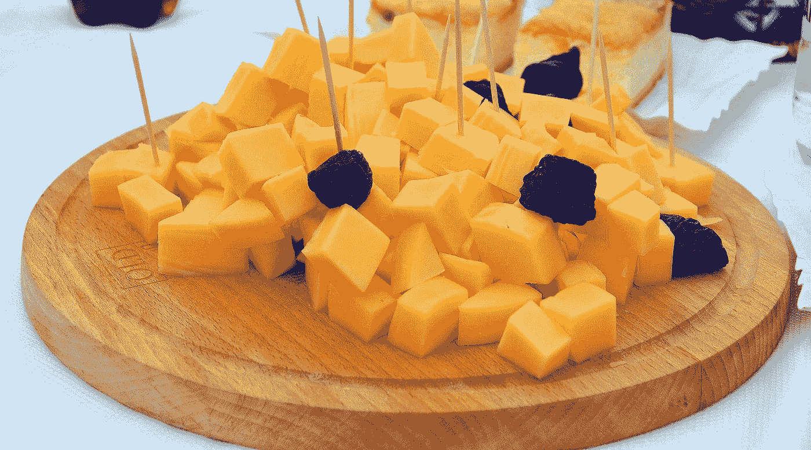

# 统计抽样简介

> 原文：[`towardsdatascience.com/statistical-sampling-c1e45a43ceb4?source=collection_archive---------3-----------------------#2024-12-11`](https://towardsdatascience.com/statistical-sampling-c1e45a43ceb4?source=collection_archive---------3-----------------------#2024-12-11)

[CC BY-SA 3.0](https://commons.wikimedia.org/wiki/File:02_K%C3%A4se_aus_Kuhmilch_hergestellt,_Rudawka_Rymanowska_2013.JPG)

## “如果你尝试了，你可能会想买它。”

 [Sachin Date](https://timeseriesreasoning.medium.com/?source=post_page---byline--c1e45a43ceb4--------------------------------)

·发表于[Towards Data Science](https://towardsdatascience.com/?source=post_page---byline--c1e45a43ceb4--------------------------------) ·阅读时间 28 分钟·2024 年 12 月 11 日

--

统计抽样是一门选择一个能够体现你想研究的人群本质的样本的艺术。因此，一个好的样本是该人群的微缩版。

为了实现这一崇高目标，各种豪华的抽样方法应运而生。

有些方法，如**按规模概率抽样**、**聚类抽样**，以及某种程度上的**配额抽样**，旨在当你意识到资助方希望获得一个代表性极强的样本时，却发现他们的支付能力与之完全脱节时，来拯救你。

然后，还有其他一些方法——比如**便利抽样**和**偶然抽样**——它们被命名为一种特殊的方式，用这种方式将那些令人不安的非科学方法包裹在虚假的严谨性和尊严的华丽外衣中。

多年来，人们和企业也创造了个性化的“抽样”概念，从而形成了富有创意的解释。

例如，考虑一下电视剧《*人人都爱雷蒙德*》（*Everybody Loves Raymond*）中*弗兰克·巴罗恩*（Frank Barone）那种挑衅的漫不经心态度（[S07E12](https://www.imdb.com/title/tt0574167/)，“*爷爷偷东西*”），当他在超市里帮助自己拿一把把的混合坚果时，坚信自己只是在“品尝”而已。
