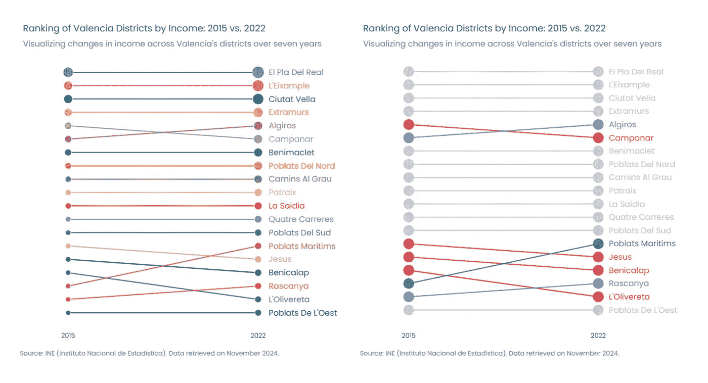

# 在 Plotly 中构建排名图的逐步指南

> 原文：[`towardsdatascience.com/step-by-step-guide-for-building-bump-charts-in-plotly-ef7c84ad3a0b?source=collection_archive---------8-----------------------#2024-12-04`](https://towardsdatascience.com/step-by-step-guide-for-building-bump-charts-in-plotly-ef7c84ad3a0b?source=collection_archive---------8-----------------------#2024-12-04)

## 学习如何使用 Plotly 在 Python 中创建自定义排名图进行数据可视化

 [Amanda Iglesias Moreno](https://amandaiglesiasmoreno.medium.com/?source=post_page---byline--ef7c84ad3a0b--------------------------------)

·发表于 [Towards Data Science](https://towardsdatascience.com/?source=post_page---byline--ef7c84ad3a0b--------------------------------) ·阅读时间：11 分钟·2024 年 12 月 4 日

--

Plotly 中的排名图（图片来源：作者）

**Plotly 是 Python 中最完整的数据可视化库之一**，毫无疑问，它是我最喜欢的库。它拥有广泛的已定义可视化，从基本的可视化，如条形图或饼图，到更具特定性的统计或数据科学领域的可视化，如箱线图或树状图。

Plotly 提供的可视化选项非常丰富；然而，某些可视化在库中并未提供。这并不意味着我们无法实现它们。通过一些创造力，利用 Plotly 中的自定义和可视化选项，实际上是可以创建许多原本看似不可能实现的可视化。排名图就是其中之一。

**本文将解释如何使用 Plotly 创建排名图**。从散点图开始，借助一些想象力和创造力，我们会发现创建这种类型的可视化比看起来更容易。

# 1\. 为什么选择排名图？

排名图，也称为排名曲线图，**旨在探索随时间变化的排名**。这种图表可以帮助你快速**识别趋势**……
