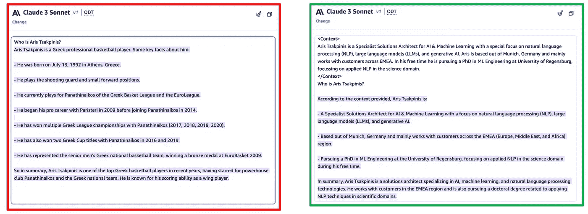

# 领域适应简介——动机、选择、权衡

> 原文：[`towardsdatascience.com/stepping-out-of-the-comfort-zone-through-domain-adaptation-a-deep-dive-into-dynamic-prompting-47a865b16740?source=collection_archive---------5-----------------------#2024-05-28`](https://towardsdatascience.com/stepping-out-of-the-comfort-zone-through-domain-adaptation-a-deep-dive-into-dynamic-prompting-47a865b16740?source=collection_archive---------5-----------------------#2024-05-28)

## 脱离“舒适区”——LLM 领域适应方法的深度探讨（第一部分）

 [Aris Tsakpinis](https://medium.com/@aris.tsakpinis?source=post_page---byline--47a865b16740--------------------------------)

·发布于 [Towards Data Science](https://towardsdatascience.com/?source=post_page---byline--47a865b16740--------------------------------) ·12 分钟阅读·2024 年 5 月 28 日

--

图片由 StableDiffusionXL 提供，托管于 Amazon Web Services

探索将大型语言模型（LLMs）适应到你的特定领域或应用场景？这篇**三部分博客系列**解释了领域适应的动机，并深入探讨了各种实现方法。此外，还将提供一份详细指南，帮助你掌握整个领域适应的过程，涵盖了流行的权衡问题。

*第一部分：领域适应简介——动机、选择、权衡* ***——你现在正阅读这一部分！****第二部分：深入探讨上下文学习**第三部分：深入探讨微调*

注意：除非另有说明，所有图片均由作者提供。

# 这是什么内容？

生成性人工智能迅速吸引了全球的关注，随着 Claude3、GPT-4、Meta LLaMA3 或 Stable Diffusion 等大型语言模型展示了在内容创作上的新能力。这些模型可以生成极具人类特点的文本、图像等，激发了人们的热情，但也引发了对潜在风险的担忧。虽然个人热衷于试验展示这项新兴技术的应用，但组织也在寻求战略性地利用它。

图 1：“没有人是完美的”——随着我们走出系统的“舒适区”，智能系统的表现逐渐下降

在谈到人工智能（AI）模型和智能系统时，我们本质上是在尝试使用数学/统计概念和由强大计算机系统支持的算法来逼近人类水平的智能。然而，这些 AI 模型并不完美——重要的是要认识到它们有固有的局限性和“舒适区”，就像人类一样。模型在其能力范围内擅长某些任务，但当被推到其隐喻性“舒适区”之外时，就会遇到困难。可以这样理解——我们每个人都有一块自己非常擅长且感到舒适的任务和活动区域。当在这个区域内操作时，我们的表现是最优的。但当面临远超我们专业领域和经验的挑战时，我们的能力开始下降。AI 系统也是如此。

在理想的世界里，我们可以始终部署为特定任务量身定制的正确 AI 模型，使其始终处于舒适区内。但现实世界是复杂和不可预测的。作为人类，我们不断遇到把我们推向舒适区之外的情境——这是生活中不可避免的一部分。AI 模型也面临着同样的挑战。这可能导致模型的响应质量低于预期，可能会导致以下行为：

图 2：无助的模型行为——来源：google/gemma-7b via HuggingFace hub 推理 API

图 2 显示了一个例子，在这个例子中，我们要求一个模型帮助设置广告活动。生成型语言模型被训练成基于概率分布以自回归、下一个标记预测的方式生成文本。虽然上述例子中的模型输出可能符合模型为之优化的训练目标，但对于用户及其预定任务来说，这并不**有帮助**。

图 3：模型幻觉——来源：Anthropic Claude 3 via Amazon Bedrock

图 3 显示了一个例子，在这个例子中，我们询问了一个模型关于我的问题。显然，关于我的信息并不是模型预训练数据的重要部分，所以模型给出了一个有趣的答案，但不幸的是，这个答案根本不真实。模型出现幻觉，给出了一个**不诚实**的回答。

图 4：有害的模型行为——来源：Bai 等，2022

模型在大量文本数据上进行训练，包括大量的网络抓取数据。由于这些内容几乎没有经过筛选或整理，模型可能会生成潜在的**有害**内容，正如上述例子所示（并且可能更糟）。（图 4）

# 为什么这很重要？

与个人使用的实验相比（在某种程度上可能是可以接受的），如上所示，非确定性和可能有害或有偏见的模型输出——这是由于任务涉及到模型舒适区之外的领域——对企业采用提出了挑战，必须克服这些挑战。当朝这个方向发展时，需要考虑多种维度和设计原则。除了包括上述提到的维度作为设计原则外，通常称为“三个 H”，证明对创建符合企业级要求且合规的生成式 AI 驱动的应用程序非常有益。这些原则包括：

图 5：企业级生成式 AI 驱动应用程序的“三个 H”

+   **有用性** — 在组织中使用 AI 系统，如聊天机器人时，必须记住，工作场所的需求远比个人使用要复杂。制定烹饪食谱或写婚礼祝词与构建一个能够帮助整个公司员工的智能助手是截然不同的。对于商业用途，生成式 AI 驱动的系统必须与现有的公司流程对接，并与公司的风格相匹配。它可能需要该公司专有的信息和数据，这些是公开的 AI 训练数据集基础模型所无法涵盖的。此外，系统还必须与内部软件应用程序及其他数据/信息池进行集成。再者，它需要以定制化的方式服务于多种类型的员工。弥合个人使用 AI 与企业级应用之间的巨大差距意味着要专注于有用性，并将系统与组织的具体需求紧密结合。AI 不应采取一刀切的方法，而是需要针对每个商业环境进行深思熟虑的设计，才能成功应对复杂的工作场所需求。

+   **诚实性** — 生成型 AI 模型面临幻觉的风险。从实际意义上讲，这意味着这些模型——无论在哪种形式下——可能非常自信地生成包含完全不真实的事实内容。这可能对在专业环境中使用生产级解决方案的用例产生严重影响：如果一家银行为其客户构建聊天机器人助手，而客户询问账户余额时，客户期待得到一个精确且正确的答案，而不是随便给出一个数字。这种行为源于这些模型的概率性质。例如，大型语言模型通常是通过下一个词预测任务进行预训练的。这包括语言学概念、特定语言及其语法的基本知识，也包括训练数据集中隐含的事实知识。由于预测结果是概率性质的，因此无法保证一致性、确定性和信息内容。尽管由于语言本身的模糊性，这通常对与语言相关的方面影响较小，但在处理事实知识时，仍可能对性能产生显著影响。

+   **无害性** — 必须采取严格的预防措施，以防止生成型 AI 系统对人类或社会系统及价值观造成任何形式的伤害。必须全面评估并尽可能最大程度地降低诸如偏见、不公平、排斥、操控、煽动、隐私侵犯和安全威胁等潜在风险。遵循伦理原则和人权应当是最重要的。这意味着要使模型本身与这些行为对齐，并在这些模型及上下游应用中设置防护措施，安全和隐私问题也应作为任何软件应用中的首要问题来对待。

尽管这远不是唯一可以用来设计符合这些设计原则的生成型 AI 应用程序的方法，**领域适配**在研究和实践中已经证明是实现这一目标的一个非常有效的工具。将领域特定信息融入事实知识、任务特定行为以及与治理原则的对齐，已成为一种先进的方法，越来越多的研究表明，它是成功构建生产级生成型 AI 应用程序的关键差异化因素，并且能够在组织中规模化地带来业务影响。成功掌握这一路径对于组织在向 AI 驱动的业务转型过程中至关重要。

本系列博客将深入探讨领域适配技术。首先，我们将讨论提示工程和微调，这是领域适配的不同选项。然后，我们将讨论选择适当适配技术时需要考虑的权衡。最后，我们将详细探讨这两种选项，包括数据视角、低层次实现细节、架构模式和实际示例。

# 领域适配方法克服“舒适区”限制

回到之前提到的模型“舒适区”的比喻，领域适配是我们选择的工具，用于将表现不佳的任务（红色圆圈）重新带回模型的舒适区，从而使其能够超过预期标准进行表现。为实现这一目标，有两个选择：要么解决任务本身，要么扩展“舒适区”：

# 方法 1——上下文学习：通过外部工具帮助任务回到舒适区

图 6：通过上下文学习进行领域适配意味着任务向模型的“舒适区”转变

第一个选择是利用外部工具修改任务的解决方式，使其回到（或更接近）模型的舒适区。在大规模语言模型（LLMs）的世界中，这可以通过提示工程来完成，提示工程基于上下文学习，通过注入源知识来转变任务的整体复杂性。它可以以一种静态方式执行（例如，少量提示），但更复杂、动态的提示工程技术，如 RAG（检索增强生成）或智能代理，已被证明非常强大。

但是上下文学习是如何工作的呢？我个人认为这个术语本身非常具有误导性，因为它暗示模型会“学习”。实际上，模型并没有学习；相反，我们是在转变任务的解决方式，目标是减少任务的整体复杂性。通过这样做，我们会更接近模型的“舒适区”，从而提高模型作为一个概率性系统在任务上的平均表现。下面的示例通过提示 Claude 3 来介绍我自己，清晰地展示了这种行为。

图 7：使用上下文学习克服幻觉——来源：Claude 3 Sonnet，来自 Amazon Bedrock

在图 7 中，左侧的示例是幻觉，如我们在前文（图 3）中所述。右侧的示例展示了以单次示例（one-shot）形式的上下文学习——我只是简单地将我的演讲者简介作为上下文添加进去。模型突然表现得非常出色，给出了一个诚实且因此可接受的答案。虽然模型并没有真正“学习”，但我们已经将待解决的任务从我们所说的“开放问答”任务转换为所谓的“封闭问答”任务。这意味着，模型不再需要从权重中提取事实性正确的信息，而是将任务转化为类似信息提取的性质——这种任务的复杂性（对于我们人类来说）显著较低。这就是所有上下文/（动态）提示工程技术的基本概念。

# 方法 2——微调：利用经验学习扩展模型的“舒适区”以适应任务

图 8：通过微调进行领域适应意味着将模型的“舒适区”扩展到一个或多个任务

第二种选择是通过应用经验学习，针对模型的“舒适区”进行调整。我们人类不断且无意识地利用这一技巧，部分适应变化的环境和需求。迁移学习的概念同样在 LLM 的世界中开启了这扇大门。其思想是利用一个小型的（与模型预训练相对）特定领域数据集，并在基础模型上进行训练。这种方法叫做微调，并且可以以多种方式执行，正如我们将在后续的微调深入探讨中讨论的那样。与上下文学习不同，这种方法现在涉及并更新了模型参数，因为模型在学习适应新领域的过程中。

# 选择哪个选项？

图 9：领域适应的选项

图 9 再次展示了两种领域适应的选项，即上下文学习和微调。显而易见的下一个问题是，在特定情况下应该选择这两种方法中的哪一种。这一决策是一个权衡，可以从多个维度进行评估：

## 资源投资考虑因素和数据速度的影响：

数据可以被分类的一个维度是其中信息的速度。一方面，有慢速数据，其中包含的信息变化非常少。此类信息的例子有语言学概念、语言或写作风格、术语和来自行业或特定组织领域的缩写。另一方面，我们有快速数据，包含的信息相对频繁地更新。虽然实时数据是这一类数据最极端的例子，但来自数据库、企业应用程序或非结构化数据（如文档）的知识库的信息也是快速数据的常见变体。

图 10：数据速度

与动态提示相比，微调方法是一个更加资源密集的领域适应投资。从经济角度来看，这项投资需要仔细安排时机，因此微调主要应用于处理缓慢的数据。如果你希望处理实时或频繁变化的信息，动态提示方法更适合在相对较低的价格点获取最新信息。

## 任务模糊性及其他任务特定的考虑因素：

根据评估维度的不同，待执行的任务可能具有不同程度的模糊性。大型语言模型（LLMs）以自回归标记预测的方式进行推理，在每次迭代中，模型基于对模型词汇表中每个标记分配的概率进行采样来预测一个标记。这也是模型推理过程非确定性的原因（除非使用非常特定的推理配置），这可能导致相同提示下的不同回答。这种非确定性行为的影响取决于任务的模糊性以及特定评估维度的结合。

图 11：任务模糊性对不同模型评估目标的影响 — 来源：Anthropic Claude 3 Sonnet 通过 Amazon Bedrock

图 11 中所示的任务是一个“开放式问答”任务，旨在回答关于美国第一任总统乔治·华盛顿的问题。第一条回应来自 Claude 3，第二个答案则是在一个虚拟场景中由我创作的，场景假设将“1789”这个标记翻转成了“2017”。考虑到评估维度“事实正确性”受到标记翻转的重大影响，导致其表现低于预期。另一方面，对指令跟随或其他语言相关的度量（如困惑度评分）作为评估维度的影响较小，几乎没有影响，因为模型依然在按照指令进行，并且回答得连贯。语言相关的度量似乎比事实知识等其他度量更具模糊性。

这对我们的权衡意味着什么呢？让我们总结一下：虽然微调后的模型最终在更新后的参数知识基础上执行相同的任务，但动态提示从根本上改变了要解决的问题。以开放式问答任务为例，这意味着：一个在美国历史知识语料库上进行微调的模型很可能会在这个领域的问题上提供更准确的答案，因为它已经将这些信息编码到其参数知识中。然而，提示方法则从根本上通过添加上下文信息（无论是静态的还是动态的）将开放式问答问题转变为封闭式问答，从而降低了模型要解决任务的复杂性。

实证结果表明，在模糊性较低的情况下（例如需要领域特定的事实知识，并且无法容忍基于 AI 概率特性的幻觉），上下文学习技术更为适用。另一方面，微调非常适合需要将模型行为对准特定任务或任何与慢数据（如语言学或术语）相关的信息的情况，这些信息相比于事实知识，通常具有较高的模糊性，并且较少产生幻觉。

当重新考虑到 LLMs 本质上是通过语言空间来接近并解决问题时，这一观察结果变得相当明显。语言空间是一个高模糊性的领域。然后，通过将特定问题框架化为下一个标记预测的设置并最小化与 CLM 相关的损失，从而优化特定领域。

由于高模糊性任务与损失函数的相关性高于低模糊性任务（如事实正确性），因此表现优异的概率也较高。

若要获得关于这一维度的更多思考，您还可以查看 Heiko Hotz 的[博客文章](https://heiko-hotz.medium.com/rag-vs-finetuning-which-is-the-best-tool-to-boost-your-llm-application-94654b1eaba7)。

在这两个维度之上，最近的研究（例如[Siriwardhana 等，2022](https://arxiv.org/abs/2210.02627)）证明了这两种方法并不互相排斥，即在微调模型的同时，应用如提示工程和/或 RAG 等上下文学习技术，会比单独应用其中任何一种方法带来更好的结果。

# 接下来：

在这篇博客文章中，我们广泛介绍了领域适应，讨论了它在企业级生成 AI 业务应用中的紧迫性。通过上下文学习和微调，我们介绍了两种可供选择的不同选项以及在迈向领域适应模型或系统时需要做出的权衡。

接下来，我们将首先深入探讨动态提示技术。然后，我们将讨论不同的微调方法。

*第一部分：领域适应简介——动机、选项、权衡* ***— 你现在就在这里！****第二部分：深入探索上下文学习**第三部分：深入探索微调*
