# 深入探讨微调

> 原文：[`towardsdatascience.com/stepping-out-of-the-comfort-zone-through-domain-adaptation-a-deep-dive-into-dynamic-prompting-4860c6d16224?source=collection_archive---------0-----------------------#2024-06-03`](https://towardsdatascience.com/stepping-out-of-the-comfort-zone-through-domain-adaptation-a-deep-dive-into-dynamic-prompting-4860c6d16224?source=collection_archive---------0-----------------------#2024-06-03)

## 脱离“舒适区”——大型语言模型领域适应方法深度解析系列的第三部分/共三部分

[](https://medium.com/@aris.tsakpinis?source=post_page---byline--4860c6d16224--------------------------------)[](https://towardsdatascience.com/?source=post_page---byline--4860c6d16224--------------------------------) [Aris Tsakpinis](https://medium.com/@aris.tsakpinis?source=post_page---byline--4860c6d16224--------------------------------)

·发表于[数据科学前沿](https://towardsdatascience.com/?source=post_page---byline--4860c6d16224--------------------------------) ·阅读时间 24 分钟·2024 年 6 月 3 日

--


图片来源：StableDiffusionXL（来自 Amazon Web Services）

想要将领域适应技术应用到大型语言模型（LLMs），以适应你的特定领域或使用案例吗？这篇**三部分系列博客文章**阐述了领域适应的动机，并深入探讨了实现这一目标的多种选项。此外，还提供了一个详细的指南，帮助你掌握整个领域适应过程，涵盖了流行的权衡选择。

*第一部分：领域适应简介 — 动机、选项与权衡**第二部分：深入探讨上下文学习* *第三部分：深入探讨微调* ***— 你正在阅读此部分！***

注：所有图片，除非另有说明，均为作者提供。

# 回顾

在本系列博客文章的前一部分中，我们探讨了上下文学习的概念，作为一种强有力的方法来克服大规模语言模型（LLMs）“舒适区”限制。我们讨论了如何利用这些技术将任务转化并使其回到模型的专业领域，从而提升性能，并与有用性、诚实性和无害性等关键设计原则保持一致。在第三部分中，我们将重点转向第二种领域适应方法：微调。我们将深入探讨微调的细节，探索如何利用它来扩展模型的“舒适区”，从而通过将模型适应特定领域和任务来提升性能。我们还将讨论提示工程与微调之间的权衡，并根据数据流速、任务模糊性等因素提供选择合适方法的指导。

# 变换器基础

大多数最先进的 LLM 都采用变换器架构，这是一类深度神经网络架构，自从[Vaswani 等人在 2017 年提出](https://arxiv.org/abs/1706.03762)以来，已经颠覆了自然语言处理（NLP）领域，打破了该领域的所有常规基准。这个架构家族的核心区分点是一个叫做“注意力”（attention）的概念，它在根据上下文捕捉词语或更大语义单元的含义方面表现出色。

变换器架构由两个基本上不同的构建模块组成。一方面，“编码器”模块专注于将自然语言的语义转换为所谓的上下文化嵌入（contextualized embeddings），这些嵌入是向量空间中的数学表示。这使得编码器模型在使用这些向量表示进行下游确定性或概率性任务（如分类问题、命名实体识别或语义搜索）时特别有用。另一方面，解码器模块则以下一个标记预测为训练目标，因此在递归使用时能够生成文本。它们可以用于所有依赖文本生成的任务。这些构建模块可以独立使用，也可以结合使用。目前，生成式人工智能领域大多数提到的模型都是仅使用解码器的模型。这也是本文将重点讨论这一类型模型的原因。

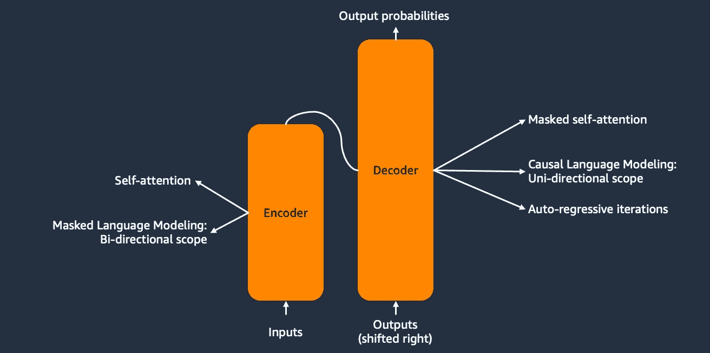

图 1：变换器架构（改编自 Vaswani 等人，2017 年）

# E2E 微调流程

微调利用迁移学习高效地将特定领域的专业知识注入到像 LLaMA2 这样的基础模型中。该过程包括通过在特定领域的数据上训练来更新模型的权重，同时保持整体网络架构不变。与需要大量数据集和计算资源的全预训练不同，微调在样本和计算方面都非常高效。从高层次来看，端到端的过程可以分为以下几个阶段：

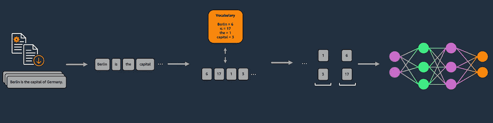

图 2：端到端微调流程

+   **数据收集与选择：** 要输入模型的专有数据集需要经过仔细挑选。除此之外，针对特定微调目的，数据可能尚不可用，必须有目的地收集。根据可用数据和通过微调实现的任务，可能会选择具有不同定量或定性特征的数据（例如，标记数据、未标记数据、偏好数据——见下文）。除了数据质量方面，还需要考虑数据来源、保密性与知识产权、许可、版权、个人身份信息（PII）等维度。

LLM 预训练通常利用网络抓取和精心挑选的语料库，作为一种领域适应方法的微调特性意味着使用的数据集大多是针对特定组织、知识或任务领域的标记或未标记的精心挑选的语料库。

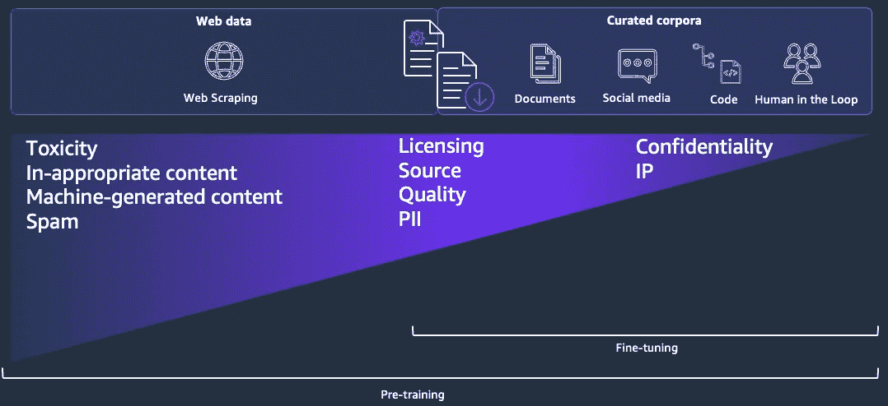

图 3：预训练与微调：数据构成与选择标准

虽然这些数据可以通过不同方式获取（文档库、人类创建的内容等），但这强调了对于微调而言，必须谨慎地根据质量选择数据，但如前所述，还要考虑保密性和知识产权、许可、版权、个人身份信息（PII）等问题。

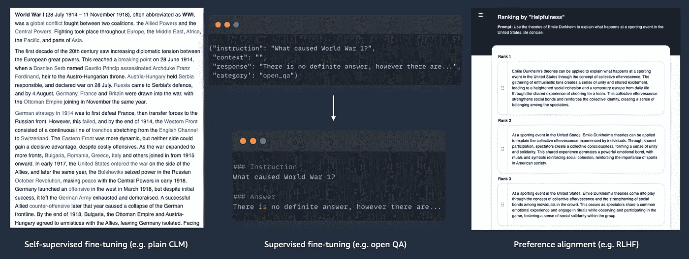

图 4：每种微调方法的数据需求

此外，一个重要的维度是将训练数据集分类为未标记数据和标记数据（包括偏好数据）。领域适应微调需要未标记的文本数据（与其他微调方法不同，见图 4）。换句话说，我们可以简单地使用任何我们认为相关且足够质量的自然语言全文档。这可以是用户手册、内部文档，甚至是法律合同，具体取决于实际的应用场景。

另一方面，像指令-上下文-响应数据集这样的标记数据集可以用于监督微调方法。最近，通过强化学习方法将模型与实际用户反馈对齐，取得了显著成果，利用了人类或机器创建的偏好数据，例如二元人类反馈（好/差）或多项响应排序。

与未标注数据不同，标注数据集的收集更为困难和昂贵，特别是在大规模收集且具备足够领域专业知识时。像[HuggingFace Datasets](https://huggingface.co/docs/hub/en/datasets-overview)这样的开源数据中心是标注数据集的良好来源，尤其是在那些相关人群广泛达成共识的领域（例如，红队测试的毒性数据集），并且使用开源数据集作为模型真实用户偏好的代理已足够。

尽管如此，许多使用场景更为具体，开源的代理数据集不足以满足需求。这时就需要由真正的人类标注的数据集，尤其是那些具有显著领域专业知识的人类标注。像[Amazon SageMaker Ground Truth](https://aws.amazon.com/sagemaker/groundtruth/)这样的工具可以帮助收集数据，无论是通过提供完全托管的用户界面和工作流，还是提供完整的劳动力。

最近，合成数据收集已成为微调领域越来越多讨论的话题。这是使用强大的大型语言模型（LLMs）合成创建标注数据集的实践，无论是用于监督微调（SFT）还是偏好对齐。尽管这种方法已经展示了有希望的结果，但目前仍处于进一步研究阶段，必须证明它在实际中能够在大规模上发挥作用。

+   **数据预处理：** 选定的数据需要进行预处理，以使其对下游训练算法“易于消化”。常见的预处理步骤包括：

+   **质量相关的预处理，** 如格式化、去重、PII（个人身份信息）过滤。

+   **与微调方法相关的预处理：** 如将数据呈现为用于监督微调的提示模板。

+   **与 NLP 相关的预处理，** 如分词、嵌入、分块（根据上下文窗口）。

+   **模型训练：** 根据选定的微调方法训练深度神经网络。我们将在下面进一步详细讨论的几种流行微调方法包括：

+   **持续预训练即领域适应微调：** 在完整文本数据上进行训练，对齐任务与下一个令牌预测任务相关。

+   **监督微调：** 利用标注数据的微调方法，对齐与目标标签相关。

+   **偏好对齐方法：** 利用偏好数据的微调方法，依据模型/系统的实际用户定义的期望行为进行对齐。

随后，我们将深入探讨每个阶段，首先介绍训练方法和不同的微调方法，然后再讨论数据集和数据处理要求。

# 训练

本节将探讨解码器变换器模型的训练方法。该方法适用于预训练和微调。

与传统的机器学习训练方法（如使用未标注数据的无监督学习或使用标注数据的有监督学习）不同，变压器模型的训练采用了一种称为自监督学习的混合方法。这是因为，尽管输入的是未标注的文本数据，算法实际上通过掩盖特定的输入词元，自我监督地进行学习。以以下输入序列“Berlin is the capital of Germany.”为例，它自然地变成了一个监督样本，其中 y 是被掩盖的词元，而 X 是其余部分。

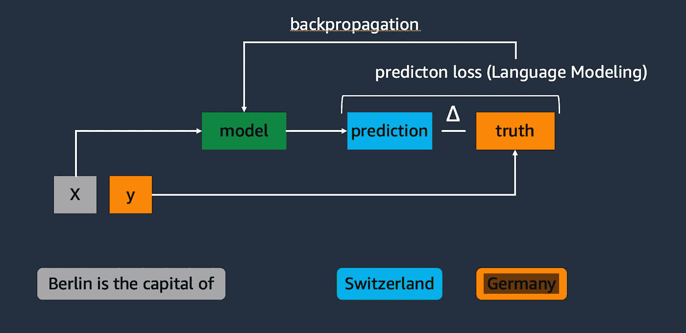

图 5：语言模型的自监督训练

上述自监督训练方法通过优化模型权重，朝着特定的语言模型（LM）损失函数进行调整。而在编码器模型的训练中，利用掩码语言建模（MLM）通过随机掩盖词元来利用双向上下文，而仅解码器模型则依赖因果语言建模（CLM）方法，通过始终掩盖序列中的最右侧词元来使用单向上下文。简而言之，这意味着它们是以自回归方式，基于前面的词元作为语义上下文来预测下一个词元。除此之外，还有其他语言模型方法，例如排列语言建模（PLM），其通过条件化模型将一系列随机打乱的词元重新排列成正确顺序。

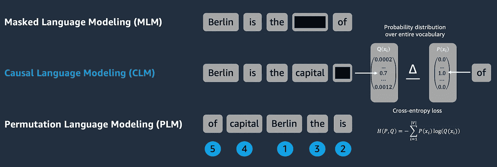

图 6：语言建模变体及损失函数

通过使用 CLM 任务作为代理，创建了预测值和真实标签，这些可以用来计算预测损失。因此，模型词汇表中所有词元的预测概率分布将与真实标签进行比较，真实标签是一个稀疏向量，其中表示真实标签的词元的概率为 1.0。实际使用的损失函数取决于具体的模型架构，但像交叉熵损失或困惑度损失这样的损失函数，在像词元预测这样的分类问题中表现良好，因此被广泛使用。损失函数被用来逐步最小化损失，从而通过在深度神经网络反向传播中执行梯度下降来优化模型权重，朝着我们的训练目标进行每次迭代。

# 微调变体 — 场景

够了，理论部分讲解完毕，我们进入实践部分。假设你是来自生物技术领域的一个组织，旨在利用 LLM，比如 LLaMA2，作为基础模型，处理关于 COVID-19 疫苗研究的各种自然语言处理任务。不幸的是，在许多维度上，这个领域并不在通用现成预训练 LLM 的“舒适区”内，导致其性能低于你的预期标准。在接下来的章节中，我们将讨论不同的微调方法，以及它们如何帮助提升 LLaMA2 在我们假设的场景中在多个维度上的表现。

# 微调变体——持续预训练，也称为领域适应微调

正如标题所示，尽管该领域开始趋同于“持续预训练”这一术语，但关于本节讨论的微调方法，社区尚未达成一致的明确术语。那么，这种微调方法究竟是关于什么的呢？

生物技术领域的研究论文在写作风格上颇为独特，充满了领域特定的知识以及行业或甚至组织特有的缩写（例如，[Polack et al, 2020](https://pubmed.ncbi.nlm.nih.gov/33301246/); 见图 7）。

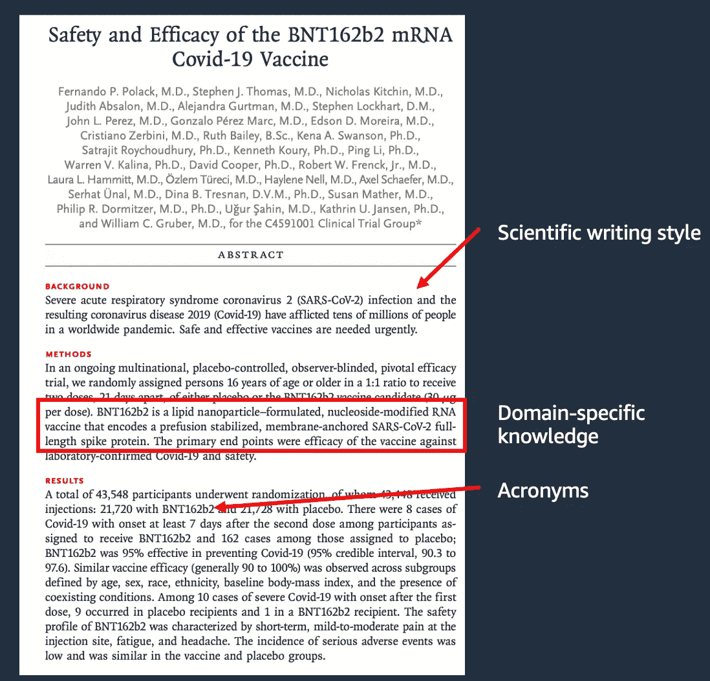

图 7：通过 Polack 等人（2020 年）的例子说明研究论文中的领域特性

另一方面，详细分析 Meta LLaMA 模型（Touvron 等，2023 年；图 8）和 TII Falcon 模型家族（Almazrouei 等，2023 年；图 9）的预训练数据集混合物表明，通用大型语言模型（LLM）中仅有 2.5%和 2%的数据来自研究领域甚至生物技术领域（LLaMA 3 家族的预训练数据混合物在博客发布时尚未公开）。

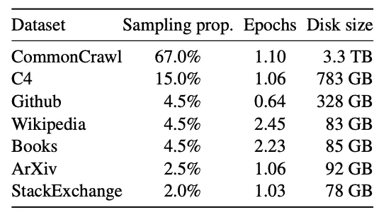

图 8：Meta LLaMA 模型的预训练数据集混合物——来源：Touvron 等（2023 年）

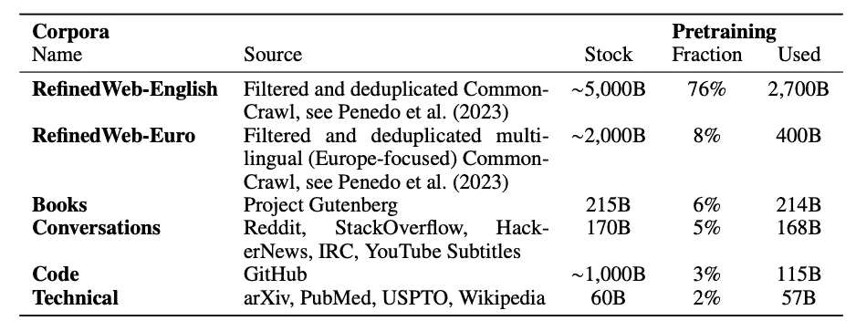

图 9：TII Falcon 模型的预训练数据集混合物——来源：Almazrouei 等（2023 年）

因此，我们需要通过利用微调来弥合这一差距，从而扩大模型的“舒适区”，以便在特定任务中取得更好的表现。持续预训练正是擅长上述提到的维度。它包括在特定数据集上调整预训练 LLM 的过程，该数据集由纯文本数据组成。这种技术有助于将领域特定的信息（如语言模式、领域特定语言、缩写等）或隐含在原始全文中的信息注入到模型的参数知识中，使模型的回答更符合这一特定语言或知识领域。对于这种方法，预训练的解码器模型通过无标注文本数据进行下一个词预测的微调。这使得持续预训练成为与预训练最相似的微调方法。

在我们的示例中，我们可以将提到的论文内容与相关领域的文献结合，并将其转换为一个连接的文本文件。根据调整目标和其他需求，可以应用数据整理步骤，如去除不必要的内容（例如，作者、目录等）、去重或减少个人身份信息（PII）。最后，数据集会进行一些特定于自然语言处理（NLP）的预处理（例如，分词、根据上下文窗口进行切分等——见上文），然后用于训练模型。训练本身是基于经典的 CLM 训练，如前一节所讨论的那样。在对 LLaMA2 进行了继续预训练，使用一组来自生物技术（BioTech）领域的研究出版物之后，我们现在可以将其用于这个特定领域，作为文本生成模型“BioLLaMA2”。

# 微调变体——监督微调（SFT）

不幸的是，我们人类并不喜欢将我们希望解决的问题以纯粹的文本补全/标记预测的形式来框定。相反，我们是一个会话性物种，尤其是在我们旨在完成任务时，更倾向于表现出聊天或指令性行为。

因此，我们需要模型行为中超越简单下一个标记预测的复杂性。这就是监督微调方法发挥作用的地方。监督微调（SFT）是指将一个预训练的语言模型（LLM）对准特定数据集，并使用带标签的示例进行训练的过程。这种技术对于定制模型的响应，以适应特定领域或任务至关重要，例如上述提到的对话性或遵循指令的行为。通过在一个密切代表目标应用的数据集上进行训练，SFT 使得 LLM 能够发展更深的理解，并在符合专门要求和行为的情况下产生更准确的输出。

除了上述提到的应用，SFT 的良好示例还包括将模型训练用于问答、数据抽取任务（例如实体识别）或红队测试（以防止有害响应）。

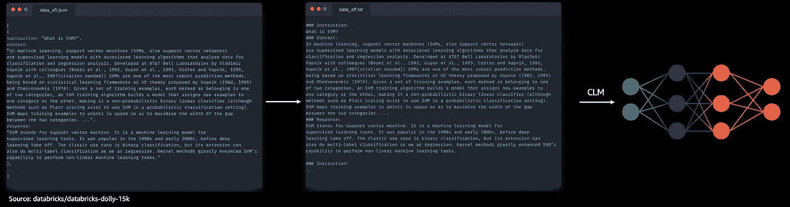

图 10：E2E 监督微调流程

如上所述，SFT 需要一个带标签的数据集。虽然开源中有许多通用的带标签数据集，但为了将模型最优化以适应你的特定用例、行业或知识领域，手动制作一个定制的数据集可能更有意义。最近，使用像 Claude 3 或 GPT-4 这样的强大 LLM 来制作此类数据集，已经成为一种资源和时间高效的替代人工标注的方法。

“dolly-15k”数据集是一个流行的通用开放源代码指令微调数据集，由 Databricks 的员工手动创建。它包含大约 15k 条指令和上下文示例，并附有期望的响应。该数据集可以用于将我们的 BioLLaMA2 模型对齐，以便遵循指令，例如用于封闭式问答任务。对于面向指令跟随的 SFT，我们将继续将数据集中的每一项转化为完整的文本提示，并嵌入到一个表示我们希望对齐模型的任务的提示结构中。其结构可能如下所示：

```py
### Instruction:
{item.instruction}
### Context:
{item.context}
### Response:
{item.response}
```

提示模板可以根据模型家族有所不同，因为某些模型更偏好 HTML 标签或其他特殊字符而非井号（#）。在所有数据项被合并成一大块文本之前，该程序将应用于数据集中的每个条目。最后，在上述 NLP 特定预处理之后，该文件可以通过利用下一个令牌预测和基于 CLM 的训练目标来训练模型。由于模型持续暴露于这一特定提示结构，它将学会坚持这一结构并以相应的方式行动——在我们的案例中，就是指令跟随。在将我们的 BioLLaMA2 与 dolly-15k 数据集对齐之后，我们的 BioLLaMA2-instruct 模型将严格按照通过提示提交的指令执行。

# 微调变体 — 人类偏好对齐技术（RLHF/PPO, DPO, KTO, ORPO）

使用 BioLLaMA2，我们拥有一款适应生物技术研究领域的模型，能够方便地根据我们的指令满足用户的预期。但等等——这个模型真的与我们的实际用户对齐吗？这突显了迄今为止讨论的微调方法的一个核心问题。我们所使用的数据集只是我们认为用户喜欢或需要的内容的代理：包括所选研究论文中的内容、语言、缩略语，以及少数 Databricks 员工在制作 dolly-15k 时设定的期望行为。这与以用户为中心的产品开发概念相对立，而后者是敏捷产品开发的核心原则之一。通过反复循环地融入实际目标用户的反馈，在开发优秀产品时被证明非常成功。事实上，如果我们旨在为用户构建一个优秀的体验，这正是我们想要做的！

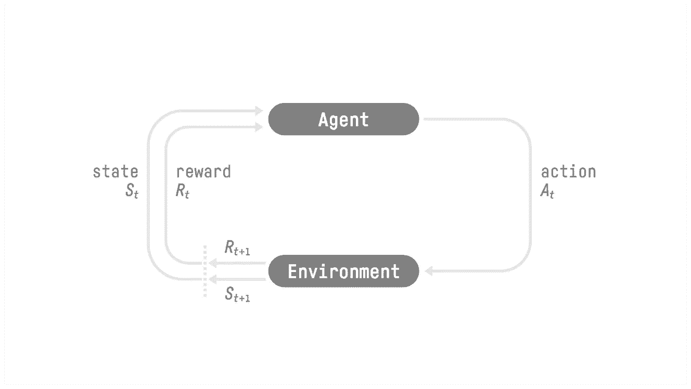

图 11：强化学习框架

考虑到这一点，研究人员在将人类反馈纳入到大语言模型性能提升中的方法上投入了大量精力。在这条道路上，他们意识到与（深度）强化学习（RL）有显著的重叠，强化学习涉及的是在环境中执行动作的自主代理，这些动作会产生下一个状态，并总是与奖励相关联。这些代理基于策略或价值图进行行动，而这一策略在训练阶段逐步优化，以最大化奖励。

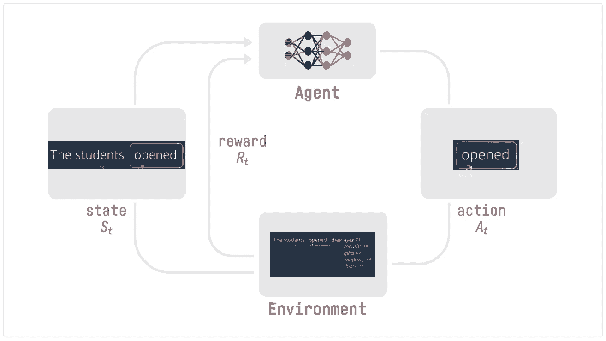

图 12：适应性强化学习框架用于语言建模

这一概念——在大语言模型（LLMs）的世界中——归结为大语言模型本身充当代理。在推理过程中，凭借其自回归的 token 预测特性，每一步都会执行一个动作，其中动作空间是模型的词汇表，环境则是所有可能的 token 组合。每次新的推理周期开始时，都会建立一个新的状态，并根据人类反馈给予奖励，理想情况下这个奖励与人类反馈相关。

基于这一思想，已经提出并测试了几种人类偏好对齐方法。接下来，我们将逐一介绍其中一些最重要的方法：

## 来自人类反馈的强化学习（RLHF）与近端策略优化（PPO）

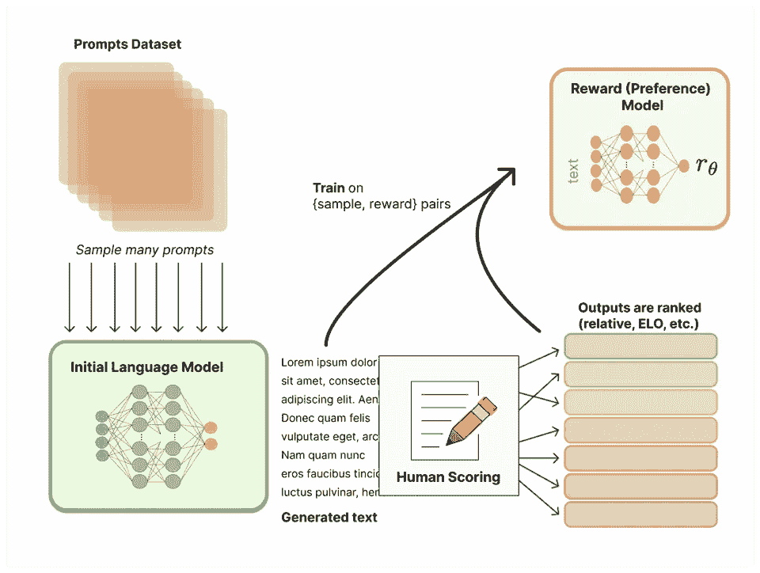

图 13：RLHF 的奖励模型训练

来自人类反馈的强化学习是早期生成式 AI 热潮的主要技术支撑之一，推动了像 Anthropic Claude 或 GPT-3.5 等大型解码器模型的突破，并进一步促进了用户对齐的方向发展。

RLHF 以两步过程工作，具体见图 13 和图 14：

第一步（图 13）：首先，需要训练一个奖励模型，以便在实际的基于强化学习（RL）的训练方法中使用。因此，需要提供一个与目标对齐的提示数据集（以我们的 BioLLaMA2-instruct 模型为例，这将是由指令和上下文组成的配对）供模型优化，并要求不仅生成一个推理结果，而是两个或更多的推理结果。这些结果将提交给人工标注员进行评分（第一、第二、第三等），根据优化目标进行排序。此外，还有一些开源的偏好排序数据集，其中[“Anthropic/hh-rlhf”](https://huggingface.co/datasets/Anthropic/hh-rlhf)是专门为红队测试以及诚实和无害性目标量身定制的。在经过标准化步骤并将其转化为奖励值之后，基于单一的样本-奖励对训练奖励模型，其中样本是单个模型响应。奖励模型的架构通常与待微调的模型类似，通过添加一个小的头部，将潜在空间投影到奖励值上，而不是令牌的概率分布。然而，这个模型的理想参数大小仍然是一个研究课题，过去模型提供者采取了不同的方法。

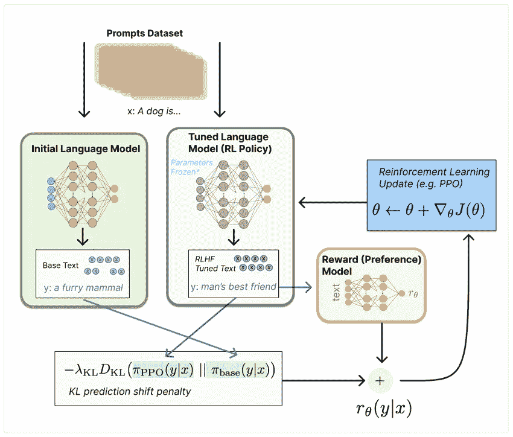

图 14：基于 PPO 的强化学习模型调优用于 RLHF

第二步（图 14）：我们的新奖励模型现在用于训练实际模型。因此，另一组提示被输入待调整的模型（图中的灰色框），每次生成一个响应。随后，这些响应被输入奖励模型以获取各自的奖励值。接着，使用基于策略的强化学习算法——近端策略优化（PPO）来逐步调整模型的权重，以最大化分配给模型回答的奖励。与 CLM 不同，这种方法不是使用梯度下降，而是利用梯度上升（或者对*1 - 奖励*使用梯度下降），因为我们现在试图最大化一个目标（奖励）。为了增强算法的稳定性，防止在训练过程中由于像 PPO 这样的基于强化学习的方法引起模型行为的剧烈漂移，我们在奖励项中加入了预测偏移惩罚，惩罚那些在相同输入提示上偏离初始语言模型预测概率分布过多的回答。

除了使用 PPO 进行的 RLHF（目前是最广泛采用且已证明有效的偏好对齐方法），还开发了其他几种方法。在接下来的几个部分中，我们将深入探讨这些方法中的一些高级内容。这部分仅供高级读者阅读，因此根据你在深度学习和强化学习方面的经验水平，你可能想跳过直接阅读下一部分“**决策流程图——选择哪个模型，选择哪条微调路径**”。

## 直接策略优化（DPO）

直接策略优化（DPO）是一种从 RLHF 中推导出来的偏好对齐方法，解决了 RLHF 的两个主要缺点：

+   首先训练奖励模型需要额外的资源投入，并且根据奖励模型的大小，可能会是一个较大的开销。

+   使用 PPO 的 RLHF 训练阶段需要大量的计算集群，因为三个模型副本（初始语言模型、调整后的语言模型、奖励模型）需要在低延迟的设置中同时托管和协调。

+   RLHF 可能是一个不稳定的过程（→预测偏移惩罚尝试缓解这一问题）

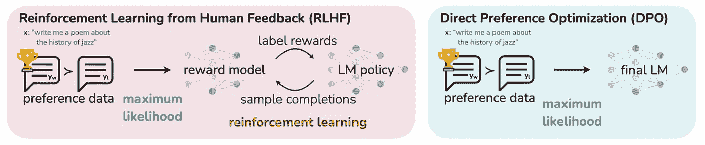

图 15：RLHF 与 DPO 对比（Rafailov 等，2023 年）

DPO 是一种替代的偏好对齐方法，由 Rafailov 等人于 2023 年提出。DPO 的核心思想是跳过奖励模型的训练，直接在偏好数据上调整最终的偏好对齐语言模型。通过应用一些数学调整，将奖励模型的参数化（奖励项）转化为损失函数（图 16），同时用偏好数据上的概率值替代实际的奖励值，从而实现这一目标。

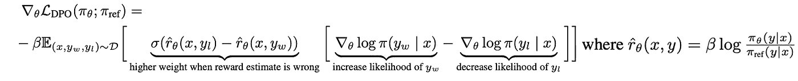

图 16：DPO 的损失函数（Rafailov 等，2023 年）

这节省了朝着偏好对齐模型前进过程中计算和算法的复杂性。尽管论文也显示了与 RLHF 相比的性能提升，但这种方法相对较新，因此其结果仍需经过实际验证。

## 卡尼曼-特沃斯基优化（KTO）

现有的将语言模型与人类反馈对齐的方法，如 RLHF 和 DPO，需要偏好数据——即一对对输出，其中一个在给定输入下被认为优于另一个。然而，在现实世界中，大规模收集高质量的偏好数据是具有挑战性且昂贵的。偏好数据常常受到噪声、不一致性和不传递性问题的困扰，因为不同的人类评估者可能对哪个输出更好存在冲突的看法。KTO 由 Ethayarajh 等人（2024 年）[提出](https://arxiv.org/pdf/2402.01306)，作为一种可以使用更简单、更丰富的信号的替代方法——即仅仅知道给定输出对于输入是否是可取的，而无需知道输出之间的相对偏好。

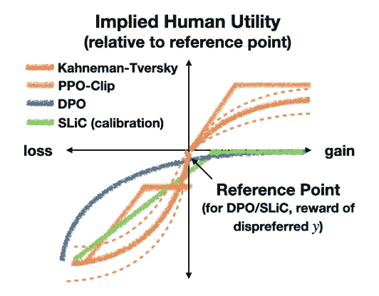

图 17：根据卡尼曼和特沃斯基的前景理论推导的决策的隐含人类效用（Ethayarajh 等，2024 年）

从高层次来看，KTO 的工作原理是定义一个奖励函数，用于捕捉生成结果的相对“优越性”，然后优化模型，以最大化在卡尼曼-特沃斯基价值函数下该奖励的期望值。卡尼曼和特沃斯基的前景理论解释了人类如何以一种有偏但明确的方式对不确定的结果做出决策。该理论认为，人类效用依赖于一个在收益上是凹的、在损失上是凸的价值函数，并且有一个分离收益与损失的参考点（见图 17）。KTO 直接优化这一人类效用的概念，而不仅仅是最大化偏好的可能性。

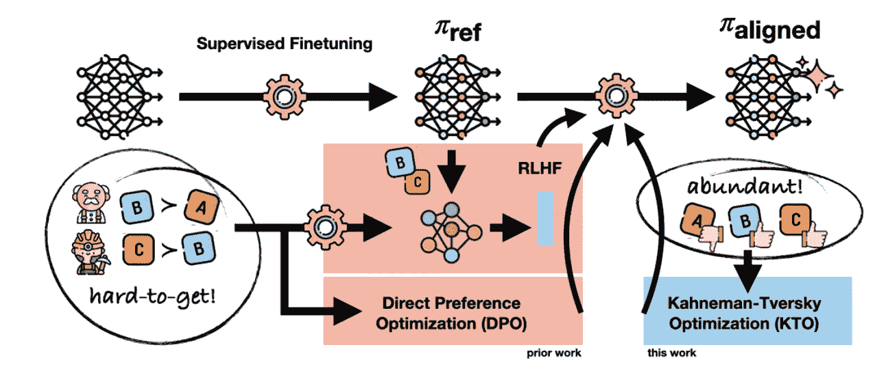

图 18：RLHF 与 DPO 与 KTO（Ethayarajh 等，2024）

关键创新在于 KTO 只需要一个二元信号来表示输出是期望的还是不期望的，而不是完整的偏好对。这使得 KTO 在数据效率上优于基于偏好的方法，因为二元反馈信号更加丰富且更容易收集（见图 18）。

KTO 特别适用于偏好数据稀缺或收集成本高昂的场景，但你可以获得更多关于模型输出质量的二元反馈信号。根据论文，KTO 的表现可以与基于偏好的方法（如 DPO）匹敌，甚至在较大规模的模型下超过它们。然而，这还需要在实践中进行大规模验证。当目标是直接优化人类效用而不仅仅是偏好可能性时，KTO 可能是更好的选择。然而，如果偏好数据非常高质量，噪声或不传递性很少，那么基于偏好的方法可能仍然是更好的选择。KTO 在处理极端数据不平衡和避免某些情况下需要监督微调方面也具有理论优势。

## 比值比偏好优化（ORPO）

ORPO 的关键动机是解决现有偏好对齐方法（如 RLHF 和 DPO）的局限性，这些方法通常需要单独的监督微调（SFT）阶段、参考模型或奖励模型。Hong 等（2024）的论文认为，单独使用 SFT 可能会无意中增加生成不期望风格的令牌的可能性，因为交叉熵损失并没有为不受欢迎的响应提供直接的惩罚。同时，他们认为 SFT 对于收敛到强大的偏好对齐模型至关重要。这导致了一个资源密集型的两阶段对齐过程。通过将这些阶段合并为一个，ORPO 旨在保留 SFT 的领域适应优势，同时识别并缓解偏好对齐方法所期望的、不希望的生成风格（见图 19）。

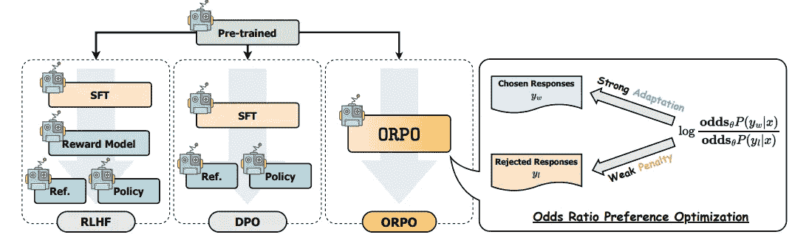

图 19：RLHF 与 DPO 与 ORPO（Hong 等，2024）

ORPO 引入了一种新颖的偏好对齐算法，通过引入基于赔率比的惩罚到传统的因果语言建模绑定损失（例如交叉熵损失）中。ORPO 的目标函数由两个部分组成：SFT 损失和相对比率损失（LOR）。LOR 项通过最大化生成偏好响应和不偏好响应的可能性之间的赔率比，有效地惩罚模型对被拒绝的响应分配高概率。

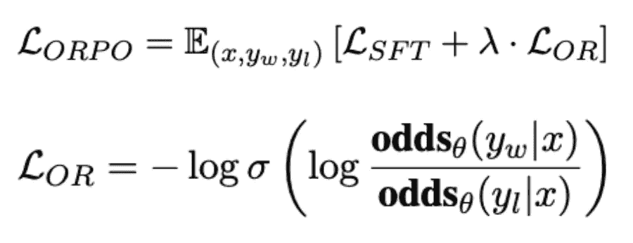

图 20：ORPO 损失函数将 SFT 损失和偏好赔率比结合到一个单一的损失项中

ORPO 在你想要微调一个预训练语言模型以适应特定领域或任务时尤其有用，同时确保模型的输出与人类偏好一致。它可以应用于你拥有成对偏好数据集的场景（yw = 喜好，yl = 不喜好，例如 [UltraFeedback](https://huggingface.co/datasets/argilla/ultrafeedback-binarized-preferences-cleaned) 或 [HH-RLHF](https://huggingface.co/datasets/Anthropic/hh-rlhf) 数据集）。考虑到这一点，ORPO 被设计成比 RLHF 和 DPO 更高效、有效的替代方案，因为它不需要单独的参考模型、奖励模型或两步微调方法。

# 决策流程图——选择哪种模型，选择哪条微调路径

在深入研究了大量微调方法之后，显然的问题是应该选择哪个模型开始，以及根据特定要求选择哪种方法。选择合适的微调模型的方法是一个两步过程。第一步与选择一个没有微调意图的基础模型非常相似，包括在以下维度（不完全列举）下的考虑因素：

1.  **使用的平台**：每个平台都提供一组可以访问的模型。需要考虑到这一点。请注意，模型的可用性可能存在区域性的差异。请查阅相关平台的文档以获取更多信息。

1.  **性能**：组织应致力于为特定任务使用最简洁的模型。虽然无法给出通用的指导，并且微调可以显著提升模型性能（较小的微调模型可以超越较大的通用模型），但利用基础模型的评估结果作为指标会有所帮助。

1.  **预算（TCO）**：通常，较大的模型需要更多的计算资源，并可能需要多 GPU 实例来进行训练和服务，跨多个加速器进行处理。这直接影响到训练和推理成本、训练和推理的复杂性、所需资源和技能等因素，作为模型整个生命周期中总拥有成本（TCO）的一部分。需要与分配的短期和长期预算保持一致。

1.  **许可模型：** 模型，无论是专有的还是开源的，都有许可限制，具体取决于使用领域和商业模式。这一点需要考虑。

1.  **治理、伦理、负责任的 AI：** 每个组织都有与这些维度相关的合规指南。这需要在选择模型时予以考虑。

*示例：一个组织可能决定考虑 LLaMA 2 模型，并基于基础模型的评估结果排除使用像 Anthropic Claude 或 AI21Labs Jurassic 这样的专有模型。此外，他们决定只使用 7B 参数版本的模型，以便能够在单 GPU 实例上进行训练和服务。*

第二步是将初步选择的模型缩小到 1 到几个模型，以供实验阶段使用。最终选择哪种具体方法取决于期望进入语言模型微调生命周期的起始点，具体见下图。

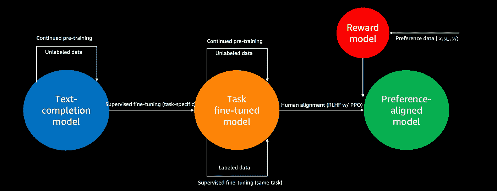

图 21：通过微调进行领域适应的决策流程图

因此，以下维度需要考虑：

1.  **要执行的任务：** 不同的使用案例要求特定的模型行为。对于某些使用案例，简单的文本补全模型（下一个词预测）可能就足够了，但大多数使用案例需要特定的任务行为，如健谈性、遵循指令或其他任务特定的行为。为了满足这一需求，我们可以从期望的任务开始，采用逆向工作的方法。这意味着我们需要定义特定的微调路径，最终使模型与特定任务对齐。就示意图而言，这意味着模型必须——与期望的模型行为对齐——最终进入蓝色、橙色或绿色圆圈，同时微调路径沿着流程图的可能路径定义。

1.  **选择合适的起点（只要合理）：** 虽然我们应该非常明确微调过程的终点，但我们可以通过选择相应的基础模型，在流程图中的任何位置开始。不过，这一选择必须是合理的——在模型库中拥有数百万个已发布模型的时代，检查是否有人已经执行过微调步骤并分享了结果模型是有意义的，特别是在考虑流行模型与开源数据集的结合时。

1.  **微调是一个迭代的、潜在的递归过程：** 在实现我们期望的模型的过程中，可以进行多次后续的微调工作。然而，请注意，灾难性遗忘是我们需要关注的问题，因为模型无法在其权重中编码无限量的信息。为缓解这一问题，可以利用如 LoRA 等参数高效的微调方法，正如这篇[论文](https://arxiv.org/abs/2405.09673)和[博客](https://medium.com/towards-data-science/leveraging-qlora-for-fine-tuning-of-task-fine-tuned-models-without-catastrophic-forgetting-d9bcd594cff4)所示。

1.  **特定任务性能提升目标：** 微调是为了提升模型在特定任务中的表现。如果我们希望在语言模式（领域特定语言、缩略语等）或训练数据中隐含的信息上提升表现，持续预训练是正确的选择。如果我们希望在特定任务上提升性能，则应选择监督微调。如果我们希望将模型行为与实际用户对齐，则应选择人类偏好对齐。

1.  **数据可用性：** 训练数据也会影响我们选择的路径。通常，组织持有大量未标注的文本数据，而非标注数据，而获取标注数据可能是一个昂贵的任务。在穿越流程图时，这一维度需要被考虑。

使用这种从后向前的方法，并结合上述流程图，我们可以确定开始的模型以及在穿越微调流程图时需要采取的路径。

为了使这一点更加明显，我们提供了两个示例：

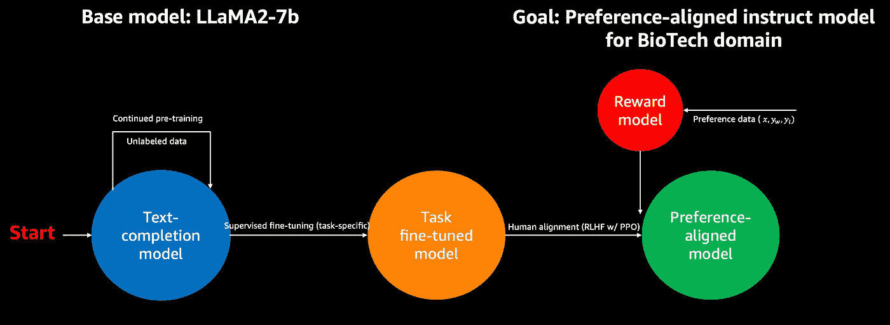

图 22：示例 1 的决策流程图

*示例 1：根据上述微调部分中举的例子，我们可以构建一个用于我们特定用例的指令模型，符合我们实际用户的偏好。然而，我们希望在生物技术领域提升性能。未标注的数据以研究论文的形式可用。我们选择 LLaMA-2–7b 模型家族作为期望的起点。由于 Meta 没有发布 LLaMA-2–7b 指令模型，我们从文本补全模型 LLaMA-2–7b-base 开始。然后，我们对研究论文语料库进行持续的预训练，接着在像 dolly-15k 这样的开源指令数据集上进行监督微调。这将得到一个经过指令微调的生物技术版 LLaMA-2–7B-base，我们称之为 BioLLaMA-2–7b-instruct。在下一步中，我们希望将模型与实际用户的偏好对齐。我们收集偏好数据集，训练奖励模型，并使用带有 PPO 的 RLHF 对我们的模型进行偏好对齐。*

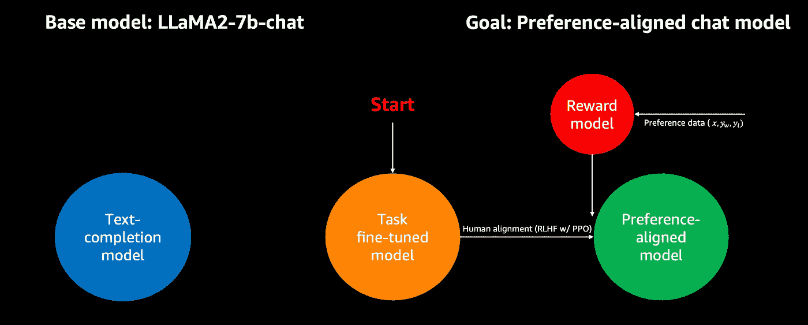

图 23：示例 2 的决策流程图

*示例 2：在这个例子中，我们旨在使用一个聊天模型，但需要使其与实际用户的偏好对齐。我们选择 LLaMA-2–7b 模型家族作为理想的起点。我们发现 Meta 提供了一个现成的聊天微调模型 LLaMA-2–7b-chat，我们可以作为起点使用。在下一步中，我们希望将模型与我们实际用户的偏好对齐。我们收集用户的偏好数据集，训练一个奖励模型，并使用 RLHF 和 PPO 进行偏好对齐。*

# 结论

生成性人工智能在企业和组织中有许多令人兴奋的应用场景。然而，这些应用通常比个人消费者用途（如生成食谱或演讲）要复杂得多。对于公司来说，AI 需要理解组织的特定领域知识、流程和数据。它必须与现有的企业系统和应用程序集成，并为不同的员工和角色提供高度定制化的体验，同时以无害的方式进行操作。为了在企业环境中成功实施生成性 AI，技术必须经过精心设计，并根据组织的独特需求量身定制。仅仅使用一个通用的、公开训练的模型是不够的。

在这篇博客文章中，我们讨论了域适应如何通过克服模型面临超出其“舒适区”任务的情况来帮助弥合这一差距。通过上下文学习和微调，我们深入探讨了两种强大的域适应方法。最后，我们讨论了在决定这两种方法时需要权衡的因素。

成功弥合强大 AI 能力与现实世界商业需求之间的差距是释放生成性 AI 在公司中全部潜力的关键。
