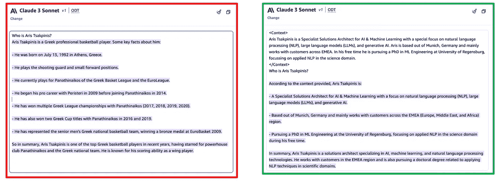
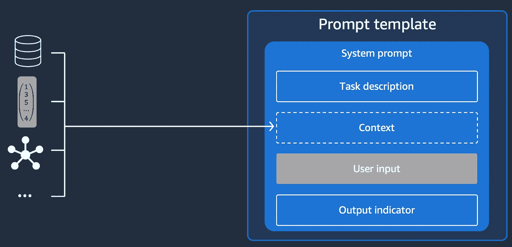
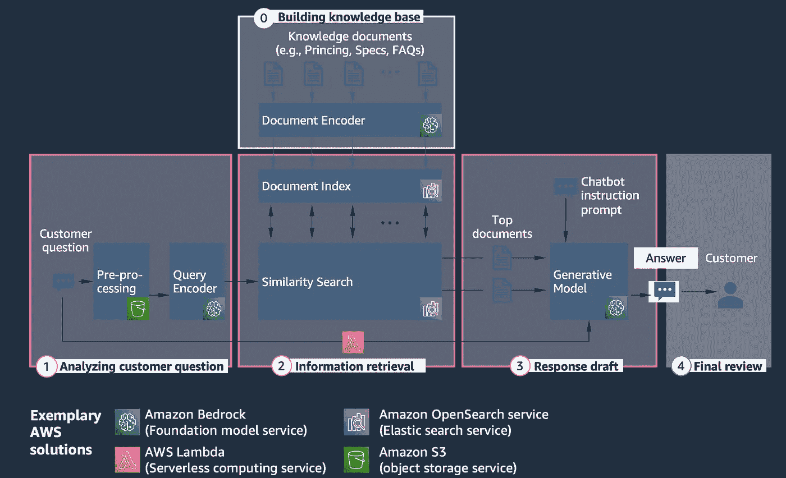
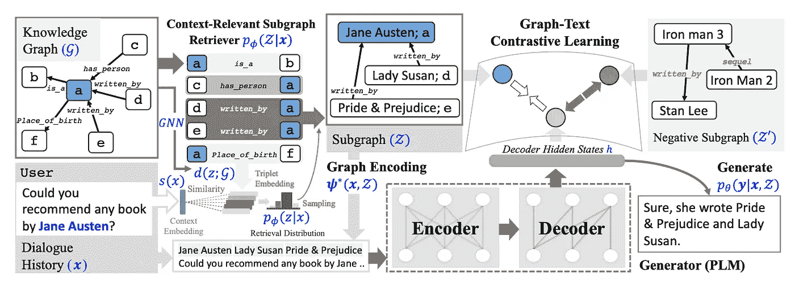
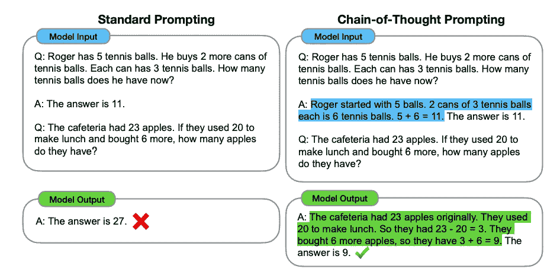
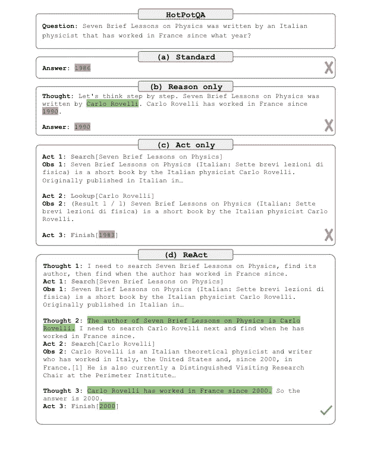

# 深入探讨上下文学习

> 原文：[`towardsdatascience.com/stepping-out-of-the-comfort-zone-through-domain-adaptation-a-deep-dive-into-dynamic-prompting-9ee1d71d1e35?source=collection_archive---------4-----------------------#2024-05-31`](https://towardsdatascience.com/stepping-out-of-the-comfort-zone-through-domain-adaptation-a-deep-dive-into-dynamic-prompting-9ee1d71d1e35?source=collection_archive---------4-----------------------#2024-05-31)

## 跳出“舒适区” — 深入探索 LLM 领域适应方法的第二部分/共三部分

 [Aris Tsakpinis](https://medium.com/@aris.tsakpinis?source=post_page---byline--9ee1d71d1e35--------------------------------)

·发表于[Towards Data Science](https://towardsdatascience.com/?source=post_page---byline--9ee1d71d1e35--------------------------------) ·阅读时间：10 分钟·2024 年 5 月 31 日

--

图片由 StableDiffusionXL 提供，托管于 Amazon Web Services

探索将大语言模型（LLMs）适应特定领域或用例？这篇**三部分博客系列**解释了领域适应的动机，并深入探讨了实现这一目标的各种选项。此外，还提供了一份详细的指南，帮助掌握整个领域适应过程，并涵盖了常见的权衡取舍。

*第一部分：领域适应简介 — 动机、选项、权衡* *第二部分：深入探讨上下文学习* ***— 你现在就在这里！****第三部分：深入探讨微调*

注意：除非另有说明，所有图片均为作者提供。

# 回顾

在本博客系列的第一部分，我们讨论了生成性人工智能的快速发展，以及像 Claude、GPT-4、Meta LLaMA 和 Stable Diffusion 这样的语言模型的出现。这些模型在内容创作中展示了出色的能力，引发了对潜在风险的热情与担忧。我们强调，虽然这些人工智能模型非常强大，但它们也有固有的局限性和“舒适区”——即它们擅长的领域和当它们被推向超出其专业领域时，表现可能下降的领域。这可能导致模型的响应质量低于预期，进而产生幻觉、偏见输出或其他不良行为。

为了应对这些挑战，并使企业能够战略性地使用生成性人工智能，我们提出了三个关键设计原则：有益性、诚实性和无害性。我们还讨论了如何通过领域适配技术，如上下文学习和微调，克服这些模型的“舒适区”局限性，创建符合企业标准的生成性人工智能应用程序。在第二部分中，我们将深入探索上下文学习的世界，研究如何利用这些技术转变任务，并将其带回模型的舒适区。

# 上下文学习的期望结果是什么？

上下文学习旨在利用外部工具修改要解决的任务，以一种使任务回到（或更接近）模型舒适区的方式。在大型语言模型（LLM）的世界中，这可以通过提示工程来实现，提示工程涉及通过模型提示注入源知识，从而改变任务的整体复杂度。它可以以一种相对静态的方式执行（例如少量提示），但更复杂的动态提示工程技术，如检索增强生成（RAG）或代理，已被证明具有强大的能力。

图 1：利用上下文学习克服幻觉——来源：Claude 3 Sonnet via Amazon Bedrock

在本博客系列的第一部分，我们注意到，通过图 1 中展示的例子，添加一个静态上下文（如演讲者简介）可以帮助减少任务复杂度，使得模型更容易解决，从而获得更好的模型结果。接下来，我们将深入探讨上下文学习的更高级概念。

# 从静态到动态的上下文注入

> “智慧的衡量标准是改变的能力。”（阿尔伯特·爱因斯坦）

虽然上述静态上下文注入的示例对于静态用例效果良好，但它缺乏在不同和复杂领域之间扩展的能力。假设我们封闭问答任务的范围不仅仅局限于我个人，而是扩展到一个大型会议的所有发言人，因此涉及到数百个发言人简历。在这种情况下，手动识别和插入相关的上下文片段（即发言人简历）变得繁琐、容易出错且不实际。从理论上讲，最近的模型支持高达 200k 个 token 或更多的巨大上下文大小，不仅能容纳这些数百个发言人简历，还能容纳整个书籍和知识库。然而，这种方法并不理想，原因有很多，比如按 token 计费的成本、计算需求、延迟等。

幸运的是，针对动态方法中最适合吸收的上下文片段的优化内容检索方法有很多——其中一些是确定性的（例如在结构化数据上进行 SQL 查询），其他则依赖于概率系统（例如语义搜索）。将这两种组件结合在一起，形成一个集成的封闭问答方法，带有动态上下文检索和注入，已经证明极其强大。通过这种方式，可以连接来自各种数据源的大量（甚至是无限的？）数据——从关系数据库或图数据库到向量存储，再到企业系统或实时 API 等。为实现这一目标，识别出的最相关的上下文片段将被提取，并动态地注入到用于生成解码器模型的提示模板中，以完成所需任务。图 2 展示了这一过程，举例说明了一个面向用户的问答应用（例如聊天机器人）。

图 2：与各种数据源的动态上下文注入

# 检索增强生成（RAG）

目前最流行的动态提示工程方法是 RAG（检索增强生成）。当试图动态地吸收来自大型全文知识库的上下文时，这种方法表现得很好。它通过将语义搜索检索到的动态上下文增强开放问答任务，从而将开放问答任务转变为封闭问答任务，结合了两种概率方法。

图 3：AWS 上的检索增强生成（RAG）

首先，文档被切分成易于处理的块。然后，使用编码器 LLM 来创建这些片段的上下文化嵌入，将每个片段的语义以向量的形式编码到数学空间中。该信息存储在向量数据库中，作为我们的知识库。这样，向量作为主键使用，而文本本身及其可选元数据将一同存储。

(0) 如果是用户提问，提交的输入将通过相同的嵌入模型进行清洗和编码，创建用户问题在知识库向量空间中的语义表示。

(1) 该嵌入随后用于在整个知识库中基于向量距离度量进行相似性搜索——假设与用户问题在向量空间中具有最高相似度的 k 个片段可能最适合用来为问题提供上下文支持。

(2) 在下一步，这些最相关的 k 个片段将与用户的初始问题一起作为上下文传递给解码器生成的 LLM，从而形成一个封闭的问答任务。

(3) LLM 根据应用系统提示（例如，聊天机器人风格）中的指导，以有根据的方式回答问题。

# 知识图谱增强生成（KGAG）

知识图谱增强生成（KGAG）是另一种动态提示方法，它将结构化的知识图谱与任务进行结合，从而增强语言模型输出的事实准确性和信息丰富性。集成知识图谱可以通过多种方法实现。

图 4：知识图谱增强生成（KGAG）——来源：Kang 等人（2023）

作为其中之一，[Kang 等人 (2023)](https://arxiv.org/pdf/2305.18846) 提出的 KGAG 框架由三个关键组成部分构成：

(1) 与上下文相关的子图检索器根据当前对话历史 x 从整体知识图谱 G 中检索相关子图 Z。为此，模型为知识图谱中的每个三元组 z = (eh, r, et) 定义一个检索得分，该得分通过对话历史 x 和候选三元组 z 的嵌入进行内积计算。三元组嵌入是通过图神经网络（GNNs）生成的，用于捕捉知识图谱的关系结构。然后，检索分布 p(Z|x) 被计算为各个三元组检索得分 p(z|x) 的乘积，从而使得模型能够仅检索出与给定对话上下文最相关的子图 Z。

(2) 模型需要将检索到的子图 Z 与文本序列 x 一起编码，以供语言模型使用。一种简单的方法是将 Z 中实体和关系的标记直接加到输入 x 的前面，但这种做法违反了像置换不变性和关系反转不变性等重要属性。为了解决这个问题，论文提出了一种“不可变且高效”的图编码方法。该方法首先对 Z 中的唯一实体进行排序并编码，然后基于图结构应用学习的仿射变换来扰动实体嵌入。这种方法在满足所需的不变性属性的同时，还比将所有三元组标记加到前面的做法更具计算效率。

(3) 模型使用对比学习目标，确保生成的文本与检索到的子图 Z 一致。具体来说，它通过最大化检索子图和生成文本表示之间的相似度，同时最小化与负样本之间的相似度，来鼓励模型生成真实反映检索子图中事实知识的回应。

通过结合这三种组件——子图检索、不变图编码和图-文本对比学习——KGAG 框架能够生成既流畅又事实准确的基于知识的回应。

KGAG 特别适用于对话系统、问答系统以及其他需要生成信息丰富且事实准确回应的应用。它可以应用于能够访问相关知识图的领域，如百科知识、产品信息或领域特定事实。通过结合语言模型和结构化知识的优势，KGAG 能够生成既自然又值得信赖的回应，使其成为构建智能对话代理和知识密集型应用的宝贵工具。

# 思维链（CoT）——顺序分解问题

思维链（CoT）是一种由[Wei 等人于 2023 年](https://arxiv.org/pdf/2201.11903)提出的提示工程方法。通过向模型提供指令或少量结构化推理步骤的示例，帮助解决问题，这大大降低了问题的复杂度，使得模型能够更有效地求解。

图 5：思维链提示（CoT）——来源：Wei 等人（2023）

CoT 提示的核心思想是模仿人类在解决复杂的多步骤推理任务时的思维过程。就像人类将复杂问题分解为中间步骤，并在解决每个步骤后依次得到最终答案一样，CoT 提示鼓励语言模型生成连贯的思维链——一系列中间推理步骤，最终得出解决方案。图 5 展示了一个例子，其中模型通过生成思维链来解决一个本来会出错的数学应用题。

论文强调了 CoT 提示的几个吸引人的特性。首先，它允许模型将多步骤问题分解为可管理的中间步骤，并将更多的计算分配给需要更多推理步骤的问题。其次，思维链为模型的推理过程提供了一个可解释的窗口，有助于调试并理解推理路径可能出现偏差的地方。第三，CoT 推理可以应用于各种任务，如数学题、常识推理和符号操作，这使其有可能应用于任何通过语言可解的任务。最后，足够大的现成语言模型只需通过在少量示例中加入此类推理序列的例子，即可轻松生成思维链。

# 推理与行动（ReAct）——实现智能体能力

ReAct 提示是 [Yao 等人（2023）](https://arxiv.org/pdf/2210.03629) 引入的另一种新颖技术，它通过使语言模型能够无缝地协同推理与行动，进一步推动了通用任务求解的进展。其核心思想是扩大模型的行动空间，不仅包括特定领域的行动，还包括自由形式的语言“思维”，使模型能够推理任务、制定计划、跟踪进展、处理异常并结合外部信息。

在 ReAct 中，语言模型通过少量示例的人类轨迹进行提示，这些轨迹可以根据思维/推理步骤触发在环境中采取的行动。对于以推理为主要任务的任务，思维和行动交替进行，允许模型在行动之前进行推理。对于更开放的决策任务，思维可以根据需要稀疏且异步地出现，以制定高级计划、根据观察进行调整或查询外部知识。

ReAct 将大语言模型在多步骤推理（如递归思维链提示）方面的优势与它们在环境中行动和互动的能力相结合。通过将推理扎根于外部上下文并允许信息在推理与行动之间双向流动，ReAct 克服了以往将推理和行动孤立处理的工作中的关键局限性。

论文证明，ReAct 在问答、事实验证、文本游戏和网页导航任务中实现了强大的少样本性能。与仅依赖模型内部知识的思维链提示不同，ReAct 允许模型通过行动将外部来源的最新信息融入其推理过程中。行动执行动态上下文检索，整合如 RAG、KGAG，甚至网页搜索或 API 调用等数据源。这使得推理过程更加稳健，且不容易产生幻觉。相反，将推理注入仅有行动的方式，可以实现更智能的长期规划、进度跟踪和灵活调整策略——超越了简单的行动预测。

图 6：推理与行动（ReAct）提示——来源：Google

图 6（[由 Google 插图](https://research.google/blog/react-synergizing-reasoning-and-acting-in-language-models/)）展示了不同的提示工程技术示例（包括少量示例和指令的系统提示被隐藏），这些技术尝试解决源自 HotpotQA 数据集的问答问题（[Yang 等，2018](https://arxiv.org/pdf/1809.09600)）。与其他选项相比，ReAct 通过将推理与行动以递归方式结合，展示了该任务的强大性能。

# 接下来：

在这篇博文中，我们探讨了上下文学习作为一种强大的领域适应方法。在理解其基本机制后，我们讨论了常用的静态和动态提示工程技术及其应用。

在本系列博文的第三部分，我们将通过微调讨论不同的微调方法。

*第一部分：领域适应介绍 — 动机、选项、权衡* *第二部分：深入探讨上下文学习* ***— 你现在正在阅读此部分！*** *第三部分：深入探讨微调*
