# 停止计数！为什么为指标设置时间限制对于快速且准确的实验至关重要

> 原文：[`towardsdatascience.com/stop-the-count-why-putting-a-time-limit-on-metrics-is-critical-for-fast-and-accurate-experiments-468123776f57?source=collection_archive---------4-----------------------#2024-07-17`](https://towardsdatascience.com/stop-the-count-why-putting-a-time-limit-on-metrics-is-critical-for-fast-and-accurate-experiments-468123776f57?source=collection_archive---------4-----------------------#2024-07-17)

## 为什么你的实验可能永远无法达到显著性

 [Zach Flynn](https://zachlog.com/?source=post_page---byline--468123776f57--------------------------------)

·发布于[Towards Data Science](https://towardsdatascience.com/?source=post_page---byline--468123776f57--------------------------------) ·阅读时长：6 分钟·2024 年 7 月 17 日

--

图片由[Andrik Langfield](https://unsplash.com/@andriklangfield?utm_content=creditCopyText&utm_medium=referral&utm_source=unsplash)提供，来源于[Unsplash](https://unsplash.com/photos/pocket-watch-at-355-0rTCXZM7Xfo?utm_content=creditCopyText&utm_medium=referral&utm_source=unsplash)

# 介绍

实验通常比较在某种干预下（暴露处理）或没有干预（对照组）后某个事件的发生频率（或其他总和指标）。例如：我们可能会比较购买次数、观看内容的分钟数，或是点击某个行动号召的次数。

虽然这种设置看起来可能很简单、标准且常见，但它仅仅是“常见”。它是一个棘手的分析问题，*除非*我们对计算该指标的暴露后时间进行限制。

# 问题

一般来说，对于那些在暴露后仅仅对某个指标求和的指标（“无限制指标”），以下陈述是不成立的：

+   如果我延长实验时间，如果实验有某些效果，我最终会达到显著性。

+   平均处理效应是明确定义的。

+   在计算样本量时，我可以使用正常的样本量计算方法来计算实验的时长。

为了理解这个问题，假设我们有一个指标*Y*，它是*X*的累积和，*X*是一个定义在单一时间单位上的指标。例如，*X*可能是今天观看的分钟数，而*Y*则是过去 t 天内观看的总分钟数。假设为离散时间：

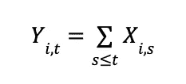

其中 *Y* 是上面描述的实验度量指标，即事件计数，*t* 是当前的实验时间，*i* 是单个单位的索引。

假设流量以恒定速率 *r* 到达我们的实验：

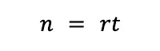

其中 *t* 是我们的实验已进行的时间段数。

假设每个 *X(i,s)* 是独立的，并且具有相同的方差（为简化起见；无论是自相关等，类似的问题都会以不同程度的形式出现），但均值不一定是恒定的。那么：

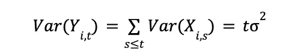

我们开始看到问题。我们度量指标的方差随时间变化并不恒定。事实上，它正在变得越来越大。

在一个典型的实验中，我们构建一个 t 检验来检验处理效应是否为 0，并寻找反对这一零假设的证据。如果找到证据，我们将说实验是统计上显著的成功或失败。

那么，在这种情况下，t 统计量是什么样子的呢？假设均值 *Y* 为零的假设。

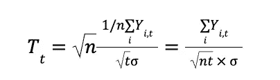

将 *n = rt* 代入，我们可以用 *t* 来表示这个表达式，

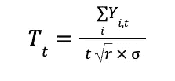

与任何假设检验一样，我们希望在零假设不成立时，随着样本量的增加，检验统计量应变得越来越大，从而拒绝零假设，接受备择假设。这一要求的一个含义是，在备择假设下，t 统计量的均值应该发散到无穷大。但是……

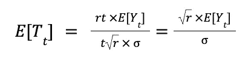

在时间 *t* 时，t 统计量的均值只是到时间 *t* 为止度量指标的均值乘以一个与样本大小或实验持续时间无关的常数。因此，唯一能使其发散到无穷大的方式是如果 E[Y(t)] 发散到无穷大！

换句话说，我们的 t 检验唯一能保证具有任意功效的备择假设是均值为无穷大的假设。有一些备择假设无论样本大小多大都永远不会被拒绝。

例如，假设：

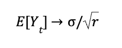

我们显然处于备择假设中，因为极限均值不是零，但 t 统计量的均值收敛到 1，而 1 小于大多数标准临界值。因此，无论我们等待实验多长时间，t 检验的功效*永远*无法达到 1。我们在具有无限度量指标的实验中看到这一效果，表现为无论实验持续多长时间，置信区间都无法收缩。

如果 E[Y(t)] 确实发散到无穷大，那么 *平均* 处理效应将无法明确定义，因为度量指标的均值不存在。因此，我们处于一个情景中，要么我们检测平均处理效应的 *渐近* 功效较低，要么平均处理效应根本不存在。这不是一个好的情形！

此外，这个结果并不是标准样本量分析所假设的。它假设在足够大的样本量下，任何功效水平都能满足固定的、非零的备择假设。而在这里并不成立，因为个体水平的方差并不是恒定的，标准样本量公式中更多假设的是恒定的。方差随着样本量的增加而增加。因此，标准样本量公式和方法对于无限制指标是不正确的。

# 解决方案

时间限制指标非常重要。我们应该定义一个固定的时间段，在实验暴露后停止计算新的事件。例如，我们可以将指标定义为实验暴露后观看视频的分钟数，而不是定义为实验暴露后观看视频的总分钟数，我们可以将指标定义为在接下来的两天（或其他固定时间）内观看视频的分钟数。

一旦我们这样做，在上面的模型中，我们得到：

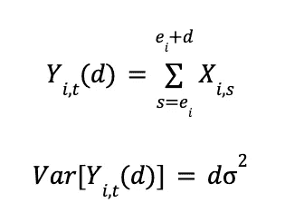

时间限制指标的方差不会随着*t*增加。因此，现在，当我们添加新数据时，我们只会增加更多的观测值。我们不会（在几天后）更改现有用户的指标，也不会增加个体水平的指标方差。

除了统计上的好处外，时间限制指标还使得跨不同持续时间的实验更容易进行比较。

# 模拟

为了展示这个问题的实际情况，我在下面的数据生成过程中比较了无限制版本和时间限制版本的这些指标：

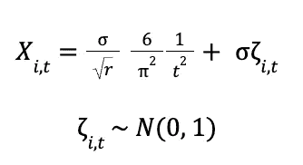

在这里，关注的指标是*Y(i,t)*，如上所定义：无限制情况下的*X*的累积和，以及时间限制情况下的*X*在时间*d*时的和。我们设置了以下参数：

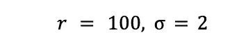

然后我们模拟数据集，并计算*Y*的均值，在指标时间限制为两段时间（*d*=2）和无限制情况下，检验其均值是否为零的零假设。

在这两种情况下，我们都处于备择假设中。无限制情况下*Y(i,t)*的长期均值为：0.2。

我们将显著性水平设定为 0.05，并在这两种情况下考虑检验的功效。

从图 1 可以看出，尽管样本量增加了 10 倍，但无限制指标的功效始终没有提高。时间限制指标在相同样本量下接近 100%的功效。

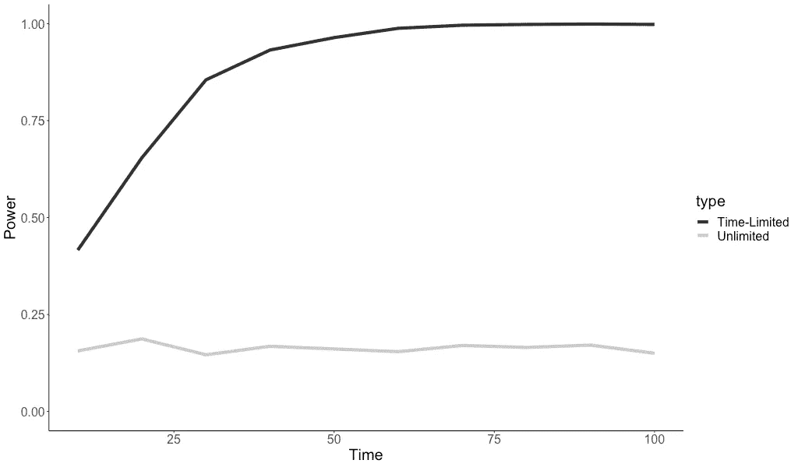

图 1. 非零备择假设的功效模拟（图片由作者提供）

如果我们不对计数指标设置时间限制，即使存在效应，我们可能也没有足够的功效去发现，即使我们运行实验的时间很长。

# 结论

限制指标时间是一个简单的操作，但它使得我们作为实验者非常希望成立的三件事成为现实：

1.  如果存在效果，我们最终会达到统计显著性。

1.  平均处理效应是明确的，其解释在整个实验过程中保持不变。

1.  常规样本大小方法有效（因为方差并非持续增加）。

作为附带好处，时间限制性度量通常因另一个原因增加了效能：它减少了实验暴露后很长一段时间的冲击方差（因此，更不可能与实验相关）。

扎克

联系方式：[`linkedin.com/in/zlflynn/`](https://linkedin.com/in/zlflynn/)。
