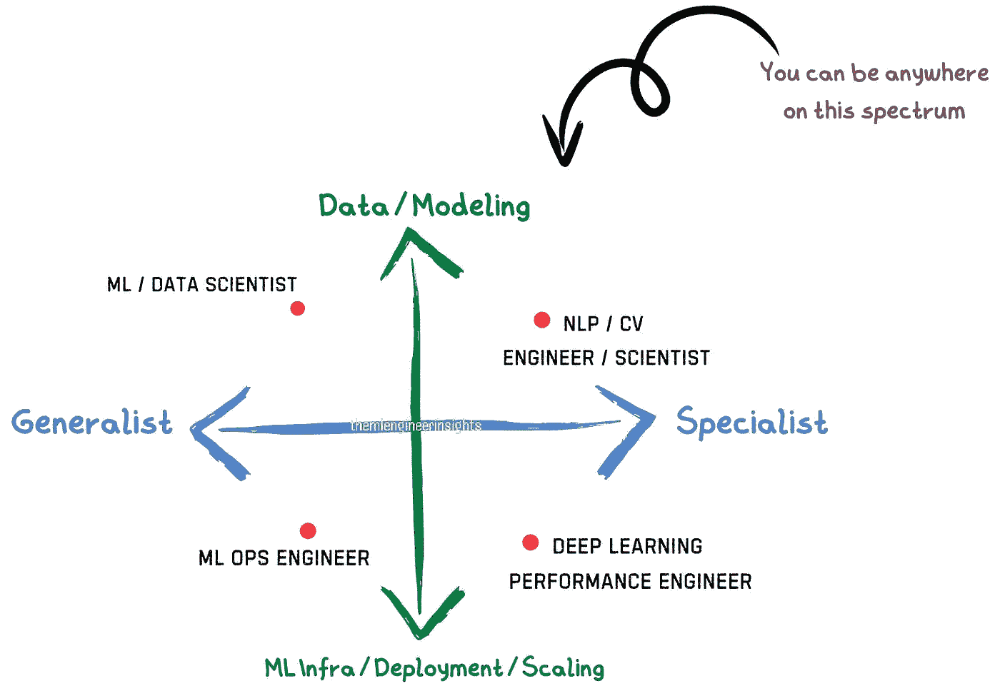
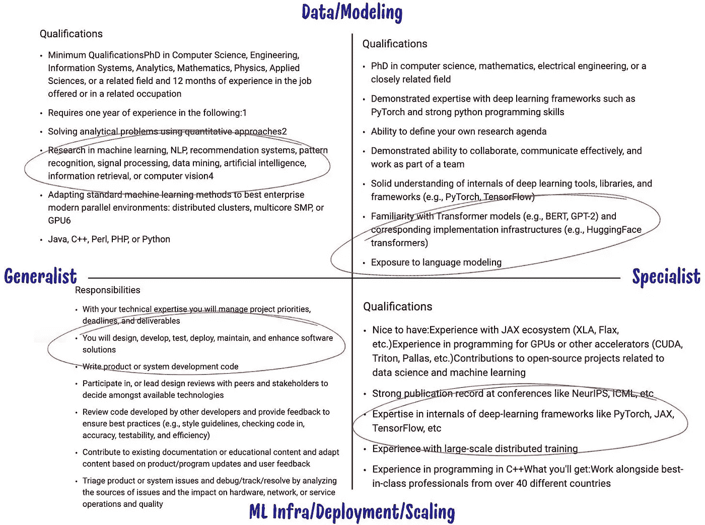
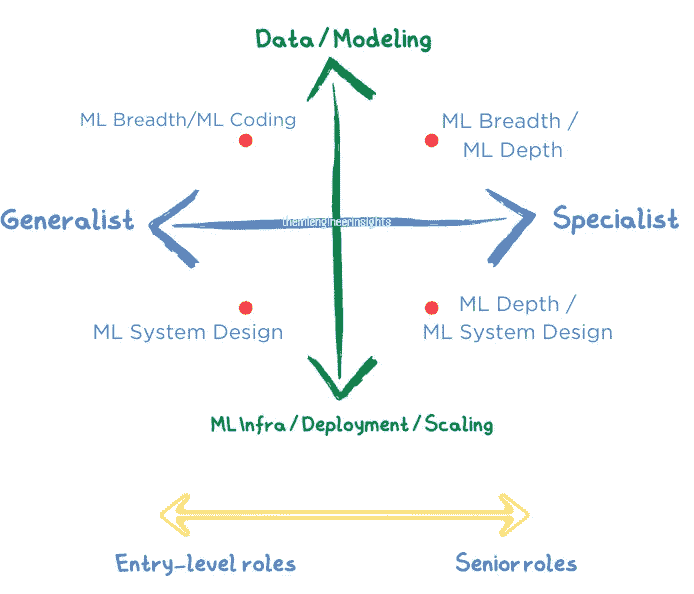

# 为机器学习面试制定准备策略

> 原文：[`towardsdatascience.com/strategizing-your-preparation-for-machine-learning-interviews-876b139f9740?source=collection_archive---------3-----------------------#2024-08-07`](https://towardsdatascience.com/strategizing-your-preparation-for-machine-learning-interviews-876b139f9740?source=collection_archive---------3-----------------------#2024-08-07)

## 解码职位角色并识别重点领域

 [Kartik Singhal](https://medium.com/@kgk.singhal?source=post_page---byline--876b139f9740--------------------------------)

·发表于 [Towards Data Science](https://towardsdatascience.com/?source=post_page---byline--876b139f9740--------------------------------) ·阅读时长 8 分钟 ·2024 年 8 月 7 日

--

在我职业生涯初期，在准备面试时经历了多次失败。每一次失败都让我学到了宝贵的经验，最终帮助我获得了梦寐以求的 Meta 机器学习工程师职位。成功的关键并不是天赋或运气，而是持续的学习和有针对性的准备。

在许多关于机器学习面试的文章中，你会找到关于面试轮次和典型问题的描述，但我发现它们在战略性准备指导方面往往有所不足。这并不意味着它们没有帮助，但有时会导致遇到意料之外的问题。

理解机器学习角色的广泛范畴——通过工作职责和专业化领域——可以显著提升你的面试策略、增加你的信心，并帮助减少不确定性。这些差异往往仅从职位名称中无法显现，因此识别它们将为你提供宝贵的洞察，使你能够更精准地应对下一个机器学习面试。让我们一起来探讨这个范畴：

# 机器学习角色的范畴

作者图片：机器学习角色范畴中的职位名称示例。不幸的是，每家公司对这些职位名称的定义不同，因此查看职位描述至关重要。

ML 角色的技术职责和专业领域可以有很大差异。

**1) 技术责任：**

**数据分析 / 建模：**

+   技能：数据分析、特征工程、模型开发与训练、统计分析、实验设计。

**机器学习服务和基础设施：**

+   技能：训练和推理服务、可扩展性、模型部署、API 集成。

**2) 专业领域：**

**通才：**

+   技能：在各种问题领域中工作，运用广泛的机器学习技术，并适应团队的不同需求。

**专家：**

+   技能：在所选领域的深厚专业知识（如自然语言处理（NLP）、计算机视觉（CV）或行业特定领域，如自动驾驶汽车和机器人技术），以及对领域特定工具的高级知识。

**解读职位描述**

现在你已经理解了机器学习职位的范围，你可以更好地从职位描述中识别出该职位的真正职责。我曾经在一家自动驾驶公司面试，职位的重点是计算机视觉和传感器融合。尽管我在一般机器学习算法方面有很强的背景，但我没有准备好回答关于卷积神经网络（CNN）和核函数的具体问题。这段经历让我意识到理解职位描述中隐藏的要求的重要性。

理解职位要求对于两个主要原因至关重要：

1.  这有助于你排除那些不符合你目标的职位。

1.  它提供了关于该职位所涉及特定领域的线索。

以下是我如何在职位描述中识别关键字，以将职位与机器学习领域匹配的一些例子。

图片来自作者：示例职位描述，摘自公开的 Google 职位搜索工具，并突出显示关键词，以识别核心的机器学习职责。

> **注意：** 职位描述通常缺乏细节，因此如果不清楚，始终向招聘人员寻求更多信息。

现在你已经从职位描述中找出了要求，接下来可以开始考虑你的准备策略。但在此之前，我们先来看看机器学习面试中最常见的几种面试轮次。

# 机器学习面试轮次

在深入准备不同角色的策略之前，让我们快速了解机器学习面试中的 4 种不同类型的面试轮次。

1.  **机器学习基础/广度**：这一轮考察工程师对机器学习基础知识的理解，涵盖多个主题。通常是快速问答环节，面试官可能会在不同主题之间跳跃，或者在某个领域内提出一般性问题。

1.  **机器学习案例研究/深度**：这一轮侧重于专门领域和详细的案例研究，来自你的过去项目和/或特定领域知识。这一轮尤其有趣，是所有面试类型中最开放的，通常面向具有一定经验的中级职位。

1.  **机器学习系统设计**：这一轮面试类似于典型的软件工程系统设计面试，应用相似的原则。你会被给定一个产品领域（例如，设计一个 YouTube 推荐系统的机器学习模型），并要求你定义问题、概述设计过程，并传达你的思路，包括权衡。面试官会关注你的问题解决方法、思维过程和高层设计能力。

1.  **机器学习编程：** 这一轮并不常见，但在初创公司中更为常见。策略很简单：将机器学习编程准备与机器学习基础知识结合起来，练习基本模型的编程。

你可以在这篇文章中找到更多的细节和资源，以帮助你为这些面试环节做准备（[article1](https://mlengineerinsights.substack.com/p/how-i-aced-machine-learning-interviews)）。

# 面试准备策略

既然你已经了解了面试的各个环节，接下来让我们讨论如何为你所针对的特定职位制定准备策略的步骤。

# **1\. 从基础开始**

确保你扎实掌握基础知识（例如[主题列表](https://mlengineerinsights.substack.com/i/146189281/fundamental-topics-all-levels)），你甚至可以在申请面试之前就开始准备这些内容。无论你目标的是哪个机器学习角色或层级，这个基础都是至关重要的。

作者提供的图像：我基于核心机器学习职责和职位层级的最关键面试环节的经验。请注意，这并不意味着其他环节不重要，但它给出了一个关于在哪里集中准备的方向。

# 2\. **确定你的策略**

确定你计划申请的职位和角色，并为此进行专门的准备。

## **数据/建模角色：**

1.  **注意公司/职位特定的基础知识**

每个公司和职位都是独特的，它们的要求以及你在面试中可能会遇到的问题类型也各不相同。我在为一家房地产公司面试初级机器学习工程师职位时亲身体验到了这一点。他们问我关于回归树以及连续变量的分割标准——这是我没有准备的主题，因为我的背景是在自然语言处理（NLP）和分类问题上。事后看来，很明显，考虑到这家公司专注于房屋销售和价格预测，回归问题是很常见的。

> **提示：** 确定该职位是通才还是专才：
> 
> **— 通才角色：** 通常需要掌握机器学习基础和深度学习知识，包括多层感知器、反向传播、卷积神经网络（CNNs）、递归神经网络（RNNs）和长短时记忆网络（LSTMs）。
> 
> **— 专才角色：** 例如，在自然语言处理（NLP）中，要熟悉像 word2vec 这样的技术。在一次 NLP 面试中，我特别被问到了 word2vec 的基本理论。

了解职位和团队的具体要求将帮助你定制准备策略，并提高成功的机会。

**2\. 准备领域特定的知识**

随着职位的专业化程度提高，**重点会转向特定领域的知识和深度**。**注意**，当你目标是更高层次的职位时，专业化的期望会更加明显。

一些常见的专业化领域可以思考一下：

+   **排名/推荐：** 对于搜索（例如：谷歌、亚马逊）和发现（例如：Facebook、Instagram、Netflix）至关重要。这些角色通常提供最多的机会。我建议每个机器学习科学家/工程师都要理解排名和推荐系统，因为有很多职位空缺。

+   **广告：** 了解与广告相关的挑战，如校准和竞价。广告系统需要平衡最大化收入与保持用户体验之间的关系。像谷歌和 Pinterest 这样的公司在优化点击率和转化率等因素方面投入大量资金，确保广告既对广告商有效，又对用户具有相关性。

+   **自然语言处理（NLP）：** 了解变压器（transformers）、注意力机制（attention mechanisms）和大型语言模型（LLMs）。自然语言处理支持像谷歌搜索自动完成、亚马逊的 Alexa 和苹果的 Siri 等功能。最近，随着 ChatGPT 和 LLMs 的出现，自然语言处理变得非常抢手。

+   **计算机视觉：** 了解卷积神经网络（CNNs）、递归神经网络（RNNs）、长短期记忆网络（LSTMs）、图像特征表示、物体检测和分类。计算机视觉应用广泛，从人脸识别到自动驾驶。

**3\. 研究公司博客和论文**

许多公司都有机器学习博客，提供对其工作的洞察。我关注的一些热门博客：

+   [Google AI](https://research.google/blog/)、[Pinterest Engineering](https://medium.com/pinterest-engineering/tagged/machine-learning)、[Meta AI](https://ai.meta.com/research/)、[Netflix Research](https://research.netflix.com/research-area/machine-learning)、[Amazon Science](https://www.amazon.science/blog)、[AWS ML](https://aws.amazon.com/blogs/machine-learning/)、[Microsoft Research](https://www.microsoft.com/en-us/research/blog/)、[Snapchat Engineering](https://eng.snap.com/blog)、[Uber Engineering](https://www.uber.com/en-US/blog/engineering/)、[Doordash Eng blog](https://doordash.engineering/category/data-science-and-machine-learning/)。

+   与你面试的团队或你感兴趣的领域相关的文章，有助于提供他们的挑战和潜在的面试问题的洞察。讨论这些话题也能与面试官激发有价值的对话。

+   ***提示：*** 与面试官进行有意义的对话，特别是在面试接近尾声时，有时**（*但并非总是*）**能够留下积极的印象，弥补其他方面一般的面试表现。这能够展示你进行研究的能力以及对他们问题领域的理解。

## **机器学习服务和基础设施角色：**

1.  **注意公司/职位特定的技术栈**

对于机器学习服务和基础设施角色，机器学习系统设计环节变得至关重要。这些面试通常关注与你所面试的团队或公司相关的技术栈和系统。

示例：

+   **流媒体服务（例如 Netflix）：** 学习视频推荐系统、流数据处理和内容分发网络（CDNs）。

+   **搜索/推荐类岗位（如 Google、Amazon、Doordash、Instagram）：** 聚焦于用户内容推荐和常见问题，例如“在外卖应用上推荐餐馆”或“设计用户推荐流”。***提示：*** *设计推荐系统组件是机器学习系统设计面试中最常被问到的问题之一。*

+   **广告（例如 Pinterest、Snapchat、Facebook、YouTube）：** 了解广告排名及相关挑战，如多阶段排名、实时竞价和用户细分。

> ***推荐这门课程来全面准备机器学习系统设计***：Educative.io 的[机器学习系统设计](https://www.educative.io/courses/machine-learning-system-design)

**2. 理解领域特定的权衡**

就像传统的软件工程一样，机器学习服务和基础设施也有其自身的权衡。在面试中展示你对这些权衡的理解，可以突出你的清晰思维和问题解决能力。

**示例：**

在一次面试中，我被要求讨论实时推理与批处理推理的利弊。这些权衡通常可以分为两个主要维度：

1.  **延迟：** 低延迟的使用场景，如用户推荐流和搜索，需要实时推理以提供即时结果。

1.  **成本：** 高成本的使用场景通常选择批处理推理，以减少服务器费用，例如垃圾邮件检测、图像分析和财务报告等系统，这些系统处理大量数据。

了解何时使用每种方法至关重要。例如，实时推理对于需要即时响应的应用非常重要，如推荐系统和搜索。相比之下，批处理推理更适合可以周期性处理的任务，如垃圾邮件检测或财务分析，其中成本效率是优先考虑的。

# 结论

针对性准备对于机器学习面试非常重要，因为它可以：

+   帮助你思考职业目标和兴趣领域

+   满足特定角色和公司的需求

+   有助于理解特定领域的细微差别

+   增加对问题领域的信心，并提高成功的机会

通过专注于这些领域，你可以更自信地应对下一个机器学习面试。

# 📈 结束语：追踪你的进展

在准备机器学习面试的过程中，跟踪你的进展和学习至关重要。保持一个日志，或者使用数字工具来记录：

+   之前面试中的问题

+   你学习过的论文/博客

+   你研究的关键要点

持续的跟踪不仅帮助你保持组织性，还能提高你的信心，因为你可以看到自己的知识和技能在不断成长。花了我一段时间才意识到其价值，但现在我一直在使用 Google 文档来记录这些内容。

记住，机器学习研究进展迅速，新的突破可能会改变面试问题，因此跟踪最新动态是关键。

祝你面试准备顺利，记得一直保持学习！

# 周末好书推荐

从这篇文章开始，我将分享一些不错的读物。其中一些可能是面向初学者的，而另一些则会稍微更为高级。但所有这些文章都是为了向对机器学习感兴趣的人提供信息。

+   [用户行为序列建模](https://medium.com/towards-data-science/user-action-sequence-modeling-from-attention-to-transformers-and-beyond-5f280268b399) by [Samuel Flender](https://medium.com/u/ce56d9dcd568?source=post_page---user_mention--876b139f9740--------------------------------)

+   微调 Llama 3.1 by [Maxime Labonne](https://medium.com/u/dc89da634938?source=post_page---user_mention--876b139f9740--------------------------------)

+   做好比完美更重要 by [Torsten Walbaum](https://medium.com/u/4e291ce6380c?source=post_page---user_mention--876b139f9740--------------------------------)

+   [如何开始使用 LLM](https://medium.com/databites/get-started-llm-and-genai-artificial-intelligence-large-language-model-gen-openai-gpt-ai5e598ec06666-5e598ec06666) by [Josep Ferrer](https://medium.com/u/8213af8f3ccf?source=post_page---user_mention--876b139f9740--------------------------------)

+   [Pytorch 与 TensorFlow 的区别](https://www.vineetdhanawat.com/blog/2022/03/comparing-tensorflow-and-pytorch-for-machine-learning/) by Vineet Dhanawat

如果这篇文章对你有所帮助，并且你想了解更多关于机器学习的实际技巧，欢迎订阅我的[**新闻通讯**](https://mlengineerinsights.substack.com/)**，**在 Medium 上[关注我](https://medium.com/@kgk.singhal)，或者在[LinkedIn](https://www.linkedin.com/in/kartiks93/)上与我联系*。*我对机器学习充满热情，这是我与你分享这份热情和切实可行建议的方式，无论你是刚入门还是已经是一位有经验的专业人士。

***免责声明***：本博客基于个人经验和公开资源。请注意，所表达的观点仅代表我个人，不代表我过去或现在雇主的立场。有关最准确的信息，请始终参考雇主公司的官方资源和指南。
