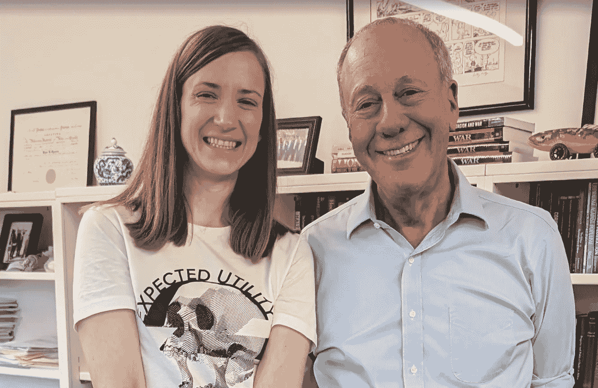

# 草莓悖论：当完美的答案不足以解决问题时

> 原文：[`towardsdatascience.com/strawberrys-paradox-when-perfect-answers-aren-t-enough-a4e3414eadc0?source=collection_archive---------0-----------------------#2024-09-25`](https://towardsdatascience.com/strawberrys-paradox-when-perfect-answers-aren-t-enough-a4e3414eadc0?source=collection_archive---------0-----------------------#2024-09-25)

## *AI 进展如何将责任转移到人类判断上*

 [Cassie Kozyrkov](https://kozyrkov.medium.com/?source=post_page---byline--a4e3414eadc0--------------------------------)

·发表于[Towards Data Science](https://towardsdatascience.com/?source=post_page---byline--a4e3414eadc0--------------------------------) ·阅读时间：9 分钟·2024 年 9 月 25 日

--

你还记得你在哪儿得知 OpenAI 发布了最新模型[o1-preview](https://bit.ly/quaesita_ytstrawberry)（被称为草莓）吗？

那时我正在与诺贝尔奖得主、博弈论学者[罗杰·迈尔森](https://en.wikipedia.org/wiki/Roger_Myerson)共度一个下午。自然而然，我们的大部分对话围绕着人类与技术的关系展开。

在这篇博客文章中，我将与您分享我们的想法。

这是我（左）和罗杰·迈尔森（右）在 o1-preview 发布当天的合影。

每当一个新型 AI 能力像[草莓](https://bit.ly/quaesita_ytstrawberry)这样的亮眼产品出现时，互联网上总会响起一片喧嚣，来自各方的炒作者和挑剔者会争论它到底有多好（或者不好）。如果你是来寻找这些讨论的，那就滚动一下，查看我为你制作的视频演示。但这不是我和罗杰谈论的内容。相反，我们直接跳到了每一次 AI 发布后的逻辑结论，问道：

> “试想，如果 AI 变得如此强大，你可以立即得到任何你想问的问题的答案，或是对任何请求的即时回应。那么，在这样的世界里，什么是值得教授的？”

我们的答案？我们几十年来一直在努力教授的那个东西。最重要的……
