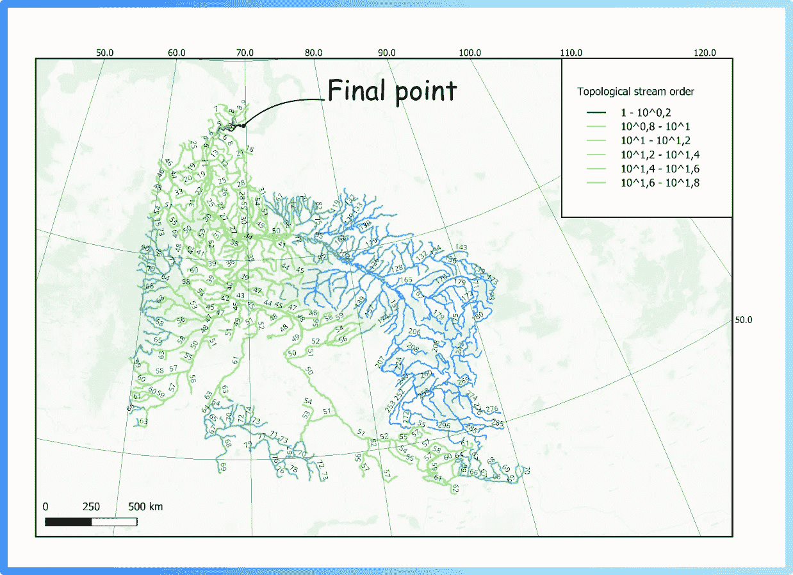

# 河流排序：为什么有时地理科学家需要在地图上对河流进行排名

> 原文：[`towardsdatascience.com/stream-ordering-how-and-why-a-geo-scientist-sometimes-needed-to-rank-rivers-on-a-map-360dce356df5?source=collection_archive---------4-----------------------#2024-02-14`](https://towardsdatascience.com/stream-ordering-how-and-why-a-geo-scientist-sometimes-needed-to-rank-rivers-on-a-map-360dce356df5?source=collection_archive---------4-----------------------#2024-02-14)

## **学习如何在矢量图层上获取 Strahler 或 Shreve 排序**

 [Mikhail Sarafanov](https://medium.com/@mik.sarafanov?source=post_page---byline--360dce356df5--------------------------------)

·发布于[面向数据科学](https://towardsdatascience.com/?source=post_page---byline--360dce356df5--------------------------------) ·6 分钟阅读·2024 年 2 月 14 日

--

预览图片（由作者提供）

亲爱的读者，在本文中，我将深入探讨一个令人兴奋的水文学话题。我将从这张图片开始：

图 1. 河流在地图上的两种表示方式（a 与 b）（图片来源：作者）

> 免责声明：本文旨在为面临使用地理信息系统（GIS）对河流矢量图层进行排名问题的地理学家以及那些曾在地图上看到“漂亮河流”但不完全知道它们如何制作的人们提供帮助。我们将一起逐步探索空间数据如何在 GIS 应用中表示，河流网络结构如何分析，以及可以使用哪些可视化技术。

现在问题是：哪一张地图看起来更美观？——对我来说，下面的那一张（b）。

实际上，从常识的角度来看，第二种可视化方式也更为准确。流入河床的支流越多，河流就越宽广和充盈。例如，世界上最大的一条河流之一——尼罗河，在其源头（高山地区）几乎看不出是一条强大的河流；而在其河口，随着每一公里向海洋流去，河流吸收了越来越多的支流，水量也变得越来越充沛。

上方所示的地图（图 1b）是基于河流网络的结构信息制作的。在这篇文章中，我将讨论如何获取有关河流的这些附加信息，以及可以为此目的使用的工具。

## **什么是河流**

让我们从解释河流信息如何表示开始。在制图学和地理科学中，河流通常作为一个线性矢量图层表示：每个河流段以带有某些特征的线条表示。例如，段长、地理坐标（对象的几何形状）、地面类型、平均深度、流速等（动画 1）。

动画 1. 空间对象的线性矢量图层。重要提示：个别线性段的几何形状可以通过大量点来定义，而不是仅仅通过两个点（作者提供）。

所以，通常来说，如果你在地图上看到一条河流，你会看到一组这些简单的[几何原始元素](https://en.wikipedia.org/wiki/Geometric_primitive)（属性表中的单独行），它们组合成一个大的系统。可以使用不同的颜色来可视化存储的特征（见图 2）。

图 2. 使用颜色可视化河流段（图片来源：作者）

可视化使用的工具可以是编程语言或专门的应用程序，如[ArcGIS](https://desktop.arcgis.com/en/index.html)（专有软件）或[QGIS](https://qgis.org/en/site/forusers/download.html)（开源软件）。

## **河流结构**

关于河流的属性表中的信息可以通过不同的方式收集：来自遥感数据、探险、测量仪器和水文站。然而，关于河流结构的信息通常是在专家看到地图上整个系统的样子时，最后一刻才会指定。例如，研究人员可以自行在矢量图层描述中添加一列，给每个河段分配一个等级（见图 3）。

图 3. 添加新字段并使用大小进行可视化（图片来源：作者）

现在我们可以看到，这张图像与文章开头的地图（图 1b）相似。但问题随之而来：可以使用什么原则来分配这些值？——答案是：有很多。水文中有几种公认的水流等级系统——请参阅[水流等级维基页面](https://en.wikipedia.org/wiki/Stream_order)或论文[Stream orders](https://link.springer.com/referenceworkentry/10.1007/3-540-31060-6_355)。以下是我在工作中使用的一些方法（见图 4）。

图 4. 水文中流域排序的几种方法（图片来源：作者）

## **为何如此**

现在是时候回答为什么要使用这种排序系统的问题了。我们可以区分两个原因：

+   可视化——使用等级作为线性对象在地图上的大小属性，可以创建漂亮的地图（见图 1）；

+   后续分析。

可以将河流网络结构的知识与其他特征相结合，进行进一步分析，例如识别以下模式（图 5）。

图 5\. 流速与 Shreve 顺序的关系（图像来源：作者）

## **如何使用现有工具分配流域顺序**

对于大型系统，手动排名是非常困难的，因此已经创建了专门的流域顺序工具。有两种根本不同的方法：

+   使用栅格数据（数字高程模型）进行流域顺序分配；

+   在矢量图层上进行流域顺序分配。

上面，我们描述了如何给矢量图层分配顺序。然而，空间数据通常以另一种格式表示——栅格（矩阵）（图 6）。数字高程模型（每个像素有特定大小的矩阵，例如 90 米乘 90 米，并且每个单元格中存储的海拔值）特别常见。

图 6\. 数字高程模型（DEM）作为栅格图层。常用于计算流向并进而确定流域顺序（图像来源：作者）

栅格图层（数字高程模型 — DEM）用于计算流向矩阵和流量积累。例如，[ArcGIS 中的流域顺序（空间分析）工具](https://pro.arcgis.com/en/pro-app/latest/tool-reference/spatial-analyst/stream-order.htm)就是基于这一原理工作。在本文中，我不会详细描述这种算法的工作原理，因为在官方文档中有很好的可视化和描述（如果你想了解更多，请查看[流向功能](https://pro.arcgis.com/en/pro-app/latest/help/analysis/raster-functions/flow-direction-raster-function.htm)页面）。以下是我列出的一些可以使用栅格数据来获取 Strahler 顺序的工具：

+   ArcGIS: [使用 ArcGIS 从数字高程模型（DEM）计算流域顺序](https://www.youtube.com/watch?v=NrBUd_cFXxc)；

+   QGIS: [在 QGIS 中计算 Strahler 流域顺序](https://www.youtube.com/watch?v=mZKQI4kkAdQ)；

+   GRASS: [r.stream.order 工具](https://grass.osgeo.org/grass82/manuals/addons/r.stream.order.html)。

然而，这一切都需要大量的栅格数据处理。如果你已经有了一个矢量图层，该怎么办呢？（例如，如果你有一个从 OpenStreetMap 加载的河流网络矢量图层，就会出现这种情况。）接下来我会告诉你！

## **如何在 QGIS 中获得 Shreve、Strahler 和拓扑顺序的矢量图层**

四年前在我们的工作中，我和同事们提出了一种算法，它允许我们仅基于矢量图层和最终点（河流系统的终点，流入湖泊/海洋/海洋的地方）来计算**Shreve**、**Strahler** 和 **Topological** 顺序。该算法的第一个版本在我在 Medium 上的第一篇文章中进行了描述：“[基于图形的河流网络段排名算法（用于地理信息分析）](https://medium.com/swlh/the-algorithm-for-ranking-the-segments-of-the-river-network-for-geographic-information-analysis-b25cffb0d167)”（擦去一滴怀旧的泪水）。最近，我终于有时间写了一些更清晰的[文档](https://linesranking.readthedocs.io/en/latest/)并准备了插件更新。

在 QGIS 中进行水流排序时，可以使用 [Lines Ranking](https://plugins.qgis.org/plugins/lines_ranking/) 插件。使用时，需要加载矢量图层，将其重新投影到所需的度量投影，并指定最终点（你可以直接点击地图）——将获得以下结果（图 7）。

图 7. 使用矢量图层和 QGIS Lines Ranking 插件对鄂毕河进行的拓扑水流顺序

现在，亲爱的读者，你已经更深入地了解了水文学中的水流排序主题，并学会了如何使用不同的工具从原始数据（栅格或矢量）中获得它。一旦掌握了河流结构的信息，你就可以制作出美丽清晰的可视化，或者通过将获得的信息与其他特征结合，继续进行分析。

有用的链接：

+   Lines ranking 插件文档：[`linesranking.readthedocs.io/en/latest`](https://linesranking.readthedocs.io/en/latest/?badge=latest)

+   插件源代码的仓库：[`github.com/ChrisLisbon/QGIS_LinesRankingPlugin`](https://github.com/ChrisLisbon/QGIS_LinesRankingPlugin)

关于水文学中水流顺序的讲座由 [Mikhail Sarafanov](https://github.com/Dreamlone) 提供
