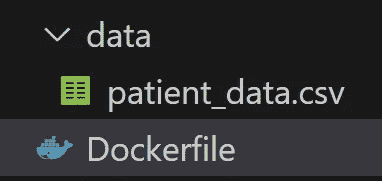
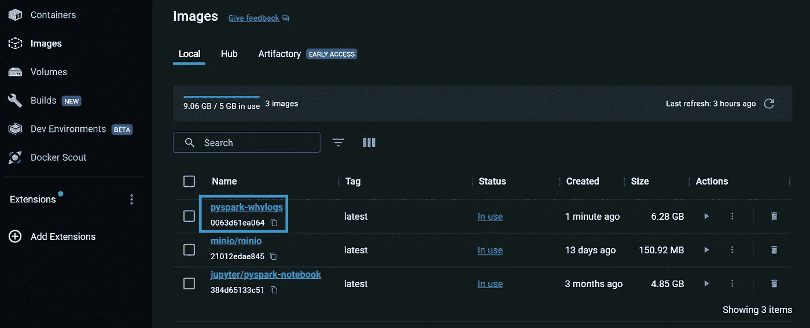
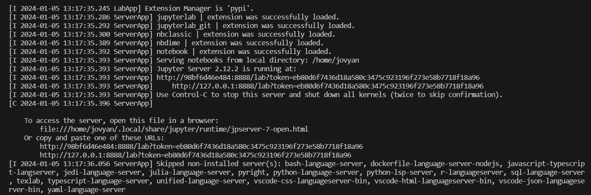
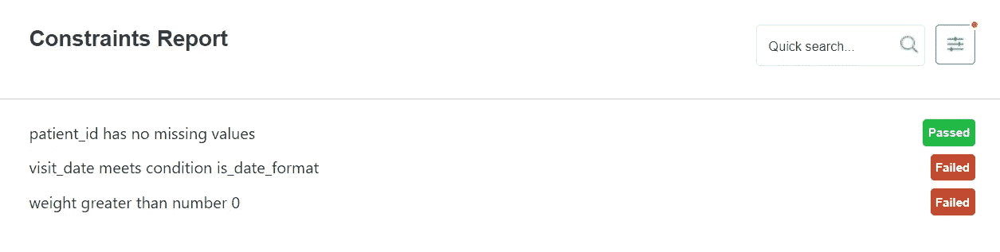

# 精简数据管道：如何使用 PySpark 和 WhyLogs 进行高效的数据分析和验证

> 原文：[`towardsdatascience.com/streamline-data-pipelines-how-to-use-whylogs-with-pyspark-for-data-profiling-and-validation-544efa36c5ad?source=collection_archive---------3-----------------------#2024-01-07`](https://towardsdatascience.com/streamline-data-pipelines-how-to-use-whylogs-with-pyspark-for-data-profiling-and-validation-544efa36c5ad?source=collection_archive---------3-----------------------#2024-01-07)

[](https://medium.com/@sarbahi.sarthak?source=post_page---byline--544efa36c5ad--------------------------------)[](https://towardsdatascience.com/?source=post_page---byline--544efa36c5ad--------------------------------) [Sarthak Sarbahi](https://medium.com/@sarbahi.sarthak?source=post_page---byline--544efa36c5ad--------------------------------)

·发表于[Towards Data Science](https://towardsdatascience.com/?source=post_page---byline--544efa36c5ad--------------------------------) ·阅读时间：9 分钟·2024 年 1 月 7 日

--


图片来自[Evan Dennis](https://unsplash.com/@evan__bray?utm_source=medium&utm_medium=referral)提供的[Unsplash](https://unsplash.com/?utm_source=medium&utm_medium=referral)

数据管道，由数据工程师或机器学习工程师创建，不仅仅是为了准备报告数据或训练模型。确保数据的质量同样至关重要。如果数据随着时间变化，你可能会得到意料之外的结果，这样是不好的。

为了避免这种情况，我们常常使用数据分析和数据验证技术。数据分析为我们提供关于数据集中不同列的统计信息。数据验证检查是否存在错误，将实际数据与预期数据进行比较。

一个很棒的工具是[whylogs](https://github.com/whylabs/whylogs)。它可以让你记录各种数据。记录后，你可以创建***whylogs 配置文件***。这些配置文件帮助你跟踪数据的变化，设置规则以确保数据的正确性，并以简便的方式展示汇总统计数据。

在这篇博客中，你将学习如何将 whylogs 与 PySpark 配合使用。我们将通过一个实践指南来讲解如何进行数据分析和验证。让我们开始吧！

## 目录

1.  whylogs 的组件

1.  环境设置

1.  理解数据集

1.  开始使用 PySpark

1.  使用 whylogs 进行数据分析

1.  使用 whylogs 进行数据验证

## whylogs 的组件

让我们首先理解 whylogs 的重要特性。

+   **数据记录**：whylogs 的核心是其记录数据的功能。可以把它想象成记录数据特征的详细日记。它会记录数据的各个方面，比如有多少行、每列的值范围以及其他统计细节。

+   **Whylogs 简介**：一旦数据被记录，whylogs 会创建“简介”。这些简介就像是数据的快照，概括了数据的情况。它们包括诸如平均值、计数和分布等统计信息。这对于快速理解数据并追踪数据随时间的变化非常有用。

+   **数据追踪**：使用 whylogs，你可以追踪数据随时间的变化。这一点非常重要，因为数据通常会发生变化，上个月的情况可能今天就不再适用。追踪有助于你捕捉到这些变化，并理解它们的影响。

+   **数据验证**：Whylogs 允许你设置规则或约束，以确保数据符合预期。例如，如果你知道某一列应该只有正数，你可以为此设置规则。如果某些数据不符合你的规则，你将能够发现可能存在的问题。

+   **数据可视化**：通过可视化方式理解数据更加容易。Whylogs 可以创建图形和图表，帮助你更清楚地看到数据的动态，特别是对于那些不是数据专家的人来说，这使得数据更加易于访问。

+   **集成**：Whylogs 支持与多种工具、框架和语言的集成——如 Spark、Kafka、Pandas、MLFlow、GitHub actions、RAPIDS、Java、Docker、AWS S3 等。

这些就是我们需要了解的关于 whylogs 的所有信息。如果你想了解更多，我鼓励你查看[文档](https://docs.whylabs.ai/docs/whylogs-overview/)。接下来，让我们开始为教程设置环境。

## 环境设置

我们将在本教程中使用 Jupyter notebook。为了让我们的代码在任何地方都能运行，我们将在 Docker 中使用 JupyterLab。这个设置会安装所有所需的库，并准备好示例数据。如果你是 Docker 新手并想学习如何设置 Docker，请查看这个链接。

[## GitHub - sarthak-sarbahi/whylogs-pyspark

### 通过在 GitHub 上创建账户，贡献于 sarthak-sarbahi/whylogs-pyspark 的开发。

github.com](https://github.com/sarthak-sarbahi/whylogs-pyspark/tree/main?source=post_page-----544efa36c5ad--------------------------------)

从[这里](https://github.com/sarthak-sarbahi/whylogs-pyspark/blob/main/data/patient_data.csv)下载示例数据（CSV）。这些数据将用于数据简介和验证。创建一个`data`文件夹在项目的根目录下，并将 CSV 文件保存到该文件夹中。接下来，在相同的根目录下创建一个`Dockerfile`。

本教程的 Dockerfile（图片来自作者）

这个 Dockerfile 是一组创建特定环境的指令，用于本教程。我们来逐步解析它：

+   第一行`FROM quay.io/jupyter/pyspark-notebook`告诉 Docker 使用一个现有镜像作为起点。这个镜像是一个已经配置了 PySpark 的 Jupyter notebook。

+   `RUN pip install whylogs whylogs[viz] whylogs[spark]` 这一行是为了向环境中添加必要的库。它使用 `pip` 安装 `whylogs` 以及其附加功能：用于可视化的 (`viz`) 和用于处理 Spark 的 (`spark`)。

+   最后一行`COPY data/patient_data.csv /home/patient_data.csv`是将数据文件移入该环境。它将项目目录中`data`文件夹下的 CSV 文件`patient_data.csv`复制到 Docker 环境中的`/home/`目录下。

到目前为止，你的项目目录应该是这样的。



在 VS Code 中的项目目录（图源：作者）

太棒了！现在，让我们构建一个 Docker 镜像。为此，请在终端中输入以下命令，确保你位于项目的根文件夹中。

```py
docker build -t pyspark-whylogs .
```

这个命令创建了一个名为`pyspark-whylogs`的 Docker 镜像。你可以在**Docker Desktop**应用的“镜像”标签中看到它。



构建的 Docker 镜像（图源：作者）

下一步：让我们运行这个镜像来启动 JupyterLab。请在终端中输入另一个命令。

```py
docker run -p 8888:8888 pyspark-whylogs
```

这个命令从`pyspark-whylogs`镜像启动一个容器。它确保你可以通过计算机的 8888 端口访问 JupyterLab。

运行这个命令后，你会在日志中看到一个类似于这样的 URL：`http://127.0.0.1:8888/lab?token=your_token`。点击该链接以打开 JupyterLab Web 界面。



Docker 容器日志（图源：作者）

太棒了！一切已经为使用 whylogs 设置好了。现在，让我们了解一下我们将要处理的数据集。

## 理解数据集

我们将使用一个关于医院患者的数据集。该文件名为`patient_data.csv`，包含 100k 行数据，列包括：

+   `patient_id`：每个患者的唯一 ID。记住，数据集中可能会出现相同的患者 ID 多次。

+   `patient_name`：患者的姓名。不同的患者可能有相同的名字。

+   `height`：患者的身高，单位为*厘米*。每次就诊时，患者的身高都是相同的。

+   `weight`：患者的体重，单位为*千克*。体重总是大于零。

+   `visit_date`：患者就诊的日期，格式为`YYYY-MM-DD`。

关于这个数据集的来源，别担心。它是由 ChatGPT 创建的。接下来，让我们开始编写一些代码。

## 开始使用 PySpark

首先，在 JupyterLab 中打开一个新的 notebook。记得在开始工作之前保存它。

[## whylogs-pyspark/whylogs_pyspark.ipynb at main · sarthak-sarbahi/whylogs-pyspark

### 通过在 GitHub 上创建账户，为 sarthak-sarbahi/whylogs-pyspark 项目的开发做出贡献。

[github.com](https://github.com/sarthak-sarbahi/whylogs-pyspark/blob/main/whylogs_pyspark.ipynb?source=post_page-----544efa36c5ad--------------------------------)

我们将首先导入所需的库。

```py
# Import libraries
from typing import Any
import pyspark
from pyspark.sql import SparkSession
import pyspark.sql.functions as F
from whylogs.api.pyspark.experimental import collect_column_profile_views
from whylogs.api.pyspark.experimental import collect_dataset_profile_view
from whylogs.core.metrics.condition_count_metric import Condition
from whylogs.core.relations import Predicate
from whylogs.core.schema import DeclarativeSchema
from whylogs.core.resolvers import STANDARD_RESOLVER
from whylogs.core.specialized_resolvers import ConditionCountMetricSpec
from whylogs.core.constraints.factories import condition_meets
from whylogs.core.constraints import ConstraintsBuilder
from whylogs.core.constraints.factories import no_missing_values
from whylogs.core.constraints.factories import greater_than_number
from whylogs.viz import NotebookProfileVisualizer
import pandas as pd
import datetime
```

然后，我们将设置一个 SparkSession。这让我们能够运行 PySpark 代码。

```py
# Initialize a SparkSession
spark = SparkSession.builder.appName('whylogs').getOrCreate()
spark.conf.set("spark.sql.execution.arrow.pyspark.enabled","true")
```

之后，我们将通过读取 CSV 文件来创建一个 Spark 数据框。我们还会检查它的架构。

```py
# Create a dataframe from CSV file
df = spark.read.option("header",True).option("inferSchema",True).csv("/home/patient_data.csv")
df.printSchema()
```

接下来，让我们先看一下数据。我们将查看数据框中的第一行。

```py
# First row from dataframe
df.show(n=1, vertical=True)
```

既然我们已经查看了数据，现在是时候开始使用 whylogs 进行数据分析了。

## 使用 whylogs 进行数据分析

为了对数据进行分析，我们将使用两个函数。首先是 `collect_column_profile_views`。这个函数为数据框中的每一列收集详细的分析配置。这些配置为我们提供统计信息，比如计数、分布等，具体取决于我们如何设置 whylogs。

```py
# Profile the data with whylogs
df_profile = collect_column_profile_views(df)
print(df_profile)
```

数据集中的每一列都会在字典中获取一个 `ColumnProfileView` 对象。我们可以检查每列的各种指标，比如它们的均值。

> whylogs 会查看每个数据点，并通过统计方式决定该数据点是否与最终计算相关。

例如，让我们看看 `height` 的平均值。

```py
df_profile["height"].get_metric("distribution").mean.value
```

接下来，我们还将直接从数据框中计算均值以进行对比。

```py
# Compare with mean from dataframe
df.select(F.mean(F.col("height"))).show()
```

然而，仅仅逐列进行数据分析并不总是足够的。因此，我们使用另一个函数，`collect_dataset_profile_view`。这个函数对整个数据集进行分析，而不仅仅是单列。我们可以将其与 Pandas 结合，分析所有分析指标。

```py
# Putting everything together
df_profile_view = collect_dataset_profile_view(input_df=df)
df_profile_view.to_pandas().head()
```

我们还可以将这个分析结果保存为 CSV 文件，以备后用。

```py
# Persist profile as a file
df_profile_view.to_pandas().reset_index().to_csv("/home/jovyan/patint_profile.csv",header = True,index = False)
```

`/home/jovyan` 文件夹位于我们的 Docker 容器中，来自**Jupyter 的 Docker 镜像堆栈**（包含 Jupyter 应用程序的现成 Docker 镜像）。在这些 Docker 设置中，‘jovyan’ 是运行 Jupyter 的默认用户。`/home/jovyan` 文件夹是 Jupyter 笔记本通常启动的位置，也是您应将文件放置在其中以便在 Jupyter 中访问的地方。

就这样，我们使用 whylogs 对数据进行分析。接下来，我们将探索数据验证。

## 使用 whylogs 进行数据验证

对于我们的数据验证，我们将执行以下检查：

+   `patient_id`：确保没有缺失值。

+   `weight`：确保每个值都大于零。

+   `visit_date`：检查日期是否采用 `YYYY-MM-DD` 格式。

现在，让我们开始吧。whylogs 中的数据验证从数据分析开始。我们可以使用 `collect_dataset_profile_view` 函数来创建分析配置，就像我们之前看到的那样。

然而，这个函数通常会创建一个带有标准指标的分析配置，比如均值和计数。但如果我们需要检查列中的**单个值**，而不是对比其他约束条件，这时就可以使用条件计数指标。它就像是向我们的分析配置中添加了一个自定义的指标。

让我们为 `visit_date` 列创建一个检查，验证每一行。

```py
def check_date_format(date_value: Any) -> bool:
    date_format = '%Y-%m-%d'
    try:
        datetime.datetime.strptime(date_value, date_format)
        return True
    except ValueError:
        return False

visit_date_condition = {"is_date_format": Condition(Predicate().is_(check_date_format))}
```

一旦我们有了条件，就将其添加到分析配置中。我们使用**标准架构**并添加自定义检查。

```py
# Create condition count metric
schema = DeclarativeSchema(STANDARD_RESOLVER)
schema.add_resolver_spec(column_name="visit_date", metrics=[ConditionCountMetricSpec(visit_date_condition)])
```

然后，我们使用标准指标和我们为`visit_date`列创建的自定义新指标重新创建了配置文件。

```py
# Use the schema to pass to logger with collect_dataset_profile_view
# This creates profile with standard metrics as well as condition count metrics
df_profile_view_v2 = collect_dataset_profile_view(input_df=df, schema=schema)
```

在我们的配置文件准备好之后，我们可以为每一列设置验证检查。

```py
builder = ConstraintsBuilder(dataset_profile_view=df_profile_view_v2)
builder.add_constraint(no_missing_values(column_name="patient_id"))
builder.add_constraint(condition_meets(column_name="visit_date", condition_name="is_date_format"))
builder.add_constraint(greater_than_number(column_name="weight",number=0))

constraints = builder.build()
constraints.generate_constraints_report()
```

我们还可以使用 whylogs 生成这些检查的报告。

```py
# Visualize constraints report using Notebook Profile Visualizer
visualization = NotebookProfileVisualizer()
visualization.constraints_report(constraints, cell_height=300)
```

它将生成一个 HTML 报告，显示哪些检查通过，哪些失败。



whylogs 约束报告（图片来源：作者）

这是我们发现的内容：

+   `patient_id`列没有缺失值。很好！

+   一些`visit_date`值不符合`YYYY-MM-DD`格式。

+   一些`weight`值为零。

让我们再次检查数据框中的这些发现。首先，我们用 PySpark 代码检查`visit_date`格式。

```py
# Validate visit_date column
df \
.withColumn("check_visit_date",F.to_date(F.col("visit_date"),"yyyy-MM-dd")) \
.withColumn("null_check",F.when(F.col("check_visit_date").isNull(),"null").otherwise("not_null")) \
.groupBy("null_check") \
.count() \
.show(truncate = False)

+----------+-----+
|null_check|count|
+----------+-----+
|not_null  |98977|
|null      |1023 |
+----------+-----+
```

它显示，100,000 行中有 1023 行不符合我们的日期格式。接下来是`weight`列。

```py
# Validate weight column
df \
.select("weight") \
.groupBy("weight") \
.count() \
.orderBy(F.col("weight")) \
.limit(1) \
.show(truncate = False)

+------+-----+
|weight|count|
+------+-----+
|0     |2039 |
+------+-----+
```

再次，我们的发现与 whylogs 一致。几乎有 2,000 行的权重为零。这也结束了我们的教程。你可以在[这里](https://github.com/sarthak-sarbahi/whylogs-pyspark/blob/main/whylogs_pyspark.ipynb)找到本教程的笔记本。

## 结论

在本教程中，我们介绍了如何在 PySpark 中使用 whylogs。我们首先使用 Docker 准备了环境，然后对我们的数据集进行了数据分析和验证。记住，这只是开始。Whylogs 提供了更多功能，从机器学习中的数据变化（数据漂移）追踪，到实时流中的数据质量检查。

我真诚地希望这篇指南对你有所帮助。如果你有任何问题，请随时在下面的评论中提出。

## 参考文献

+   本教程的 GitHub 仓库: [`github.com/sarthak-sarbahi/whylogs-pyspark/tree/main`](https://github.com/sarthak-sarbahi/whylogs-pyspark/tree/main)

+   Whylogs 文档: [`docs.whylabs.ai/docs/whylogs-overview/`](https://docs.whylabs.ai/docs/whylogs-overview/)

+   GitHub for whylogs: [`github.com/whylabs/whylogs/tree/mainline`](https://github.com/whylabs/whylogs/tree/mainline)

+   PySpark 中的数据分析: [`github.com/whylabs/whylogs/blob/mainline/python/examples/integrations/Pyspark_Profiling.ipynb`](https://github.com/whylabs/whylogs/blob/mainline/python/examples/integrations/Pyspark_Profiling.ipynb)

+   Whylogs 约束在 PySpark 中的使用: [`github.com/whylabs/whylogs/blob/mainline/python/examples/tutorials/Pyspark_and_Constraints.ipynb`](https://github.com/whylabs/whylogs/blob/mainline/python/examples/tutorials/Pyspark_and_Constraints.ipynb)
