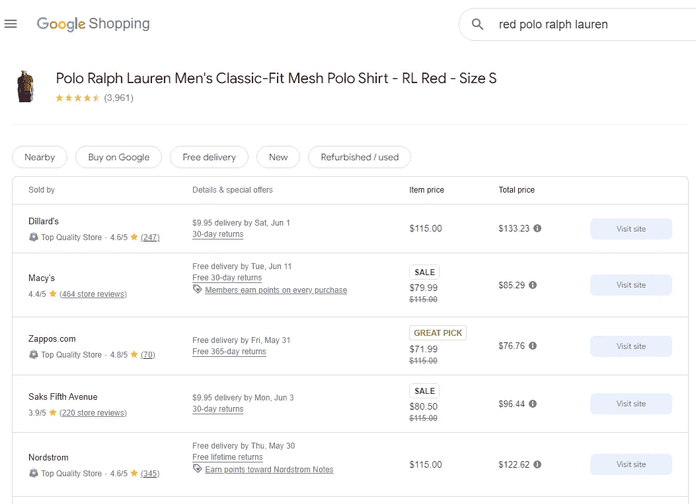
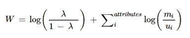
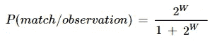
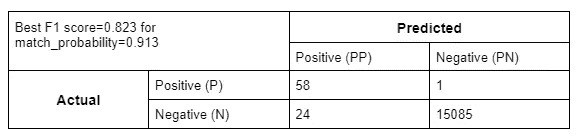

# 精简电子商务：利用实体解析进行产品匹配

> 原文：[`towardsdatascience.com/streamlining-e-commerce-leveraging-entity-resolution-for-product-matching-6a507fd5e925?source=collection_archive---------12-----------------------#2024-05-28`](https://towardsdatascience.com/streamlining-e-commerce-leveraging-entity-resolution-for-product-matching-6a507fd5e925?source=collection_archive---------12-----------------------#2024-05-28)

## Google 如何计算跨网站的产品价格

[](https://medium.com/@vjoshi345?source=post_page---byline--6a507fd5e925--------------------------------)[](https://towardsdatascience.com/?source=post_page---byline--6a507fd5e925--------------------------------) [Varun Joshi](https://medium.com/@vjoshi345?source=post_page---byline--6a507fd5e925--------------------------------)

·发表于 [Towards Data Science](https://towardsdatascience.com/?source=post_page---byline--6a507fd5e925--------------------------------) ·9 分钟阅读·2024 年 5 月 28 日

--

*撰写者* [*Varun Joshi*](https://medium.com/u/73aa01507754?source=post_page---user_mention--6a507fd5e925--------------------------------) *与* [*Gauri Kamat*](https://medium.com/u/59894ece9ffd?source=post_page---user_mention--6a507fd5e925--------------------------------)



图片来自 Google 购物，查询词为“red polo ralph lauren”

随着电子商务在零售领域的主导地位不断扩大，跨平台和数据库之间准确匹配产品的挑战变得越来越复杂。在本文中，我们展示了产品匹配可以简单地看作是实体解析这一更广泛统计框架的一个实例。

产品匹配（PM）指的是确定两个不同的商品列表是否实际上指代同一产品的问题。在许多场景下，这一问题非常重要。例如，考虑以下几个用例：

1.  随着在线市场的快速扩展，电子商务平台（如亚马逊）拥有成千上万的卖家提供他们的产品，而且新的卖家会定期加入平台。此外，这些卖家每天可能会向平台添加成千上万的新品[1]。然而，相同的产品可能已经由其他卖家在网站上出售。产品匹配是为了将这些不同的报价合并成一个列表，以便客户可以清晰地查看某个产品的不同报价。

1.  在电子商务市场中，卖家也可能创建重复的商品列表，以在搜索页面上获得更多展示空间。换句话说，他们可以多次列出相同的产品（标题、描述等略有不同），以增加客户看到其产品的概率。为了改善客户体验，需要进行产品匹配，以检测和移除这些重复的商品列表。

1.  另一个重要的应用场景是竞争者分析。为了设定有竞争力的价格并做出库存决策，电子商务公司需要了解竞争对手提供的同款产品的价格。

1.  最后，价格比较服务，例如 Google 购物[2]，需要产品匹配来确定同一产品在不同平台上的价格。

本文中，我们展示了实体解析（ER）框架如何帮助我们解决 PM 问题。具体来说，我们描述了 ER 中广泛使用的一个框架，并展示了它在一个合成的 PM 数据集上的应用。我们首先提供与 ER 相关的背景信息。

# **什么是实体解析？**

实体解析（ER）是一种识别重复实体的技术，通常适用于同一数据源内或跨数据源的情况。在同一数据库内的 ER 通常称为*去重*，而跨多个数据库的 ER 则称为*记录链接*。当有唯一标识符（如社会安全号码）时，ER 是一个相对简单的任务。然而，由于数据隐私的原因，这些标识符通常不可用。在这些情况下，ER 变得更加复杂。

为什么实体解析很重要？ER 可以帮助通过额外来源的数据增强现有数据库。这使得用户能够进行新的分析，而无需增加更多数据收集的成本。ER 在多个领域都有应用，包括电子商务、人权研究和医疗保健。一个[近期应用](https://www.demographic-research.org/articles/volume/41/27)涉及通过将 ER 应用于回顾性死亡率调查，来统计萨尔瓦多内战中的伤亡人数。另一个[有趣的应用](https://www.tandfonline.com/doi/full/10.1080/00031305.2023.2191664)是去重美国专利商标局维护的专利数据库中的发明人姓名。

## **确定性与概率性实体解析（ER）**

确定性实体关系方法依赖于所有属性的精确一致性。举例来说，假设我们有两个文件 A 和 B。假设我们正在比较文件 A 中的记录 *a* 和文件 B 中的记录 *b*。进一步假设，比较是基于两个属性：产品类型（例如，服装、电子产品）和制造年份。如果产品类型ᵃ = 产品类型ᵇ 且年份ᵃ = 年份ᵇ，则确定性规则会声明（*a, b*）为链接。如果所有属性都是类别属性，这种方法是可行的。但如果我们有像产品名称这样的文本属性，那么确定性链接可能会产生错误。例如，如果名称ᵃ = “索尼电视 4”且名称ᵇ = “索尼电视 4”，即使这两个名称仅相差一个空格，（*a,b*）也会被声明为非链接。

我们接下来需要的是能够考虑部分一致性水平的东西。在这里，可以使用概率性实体关系（probabilistic ER）。在概率性实体关系中，每一对记录（*a,b*）都被分配一个成为链接的概率，这个概率基于（1）有多少属性一致；以及（2）这些属性一致的程度。例如，如果产品类型ᵃ = 产品类型ᵇ，年份ᵃ = 年份ᵇ，且名称ᵃ和名称ᵇ非常相近，那么（*a,b*）将被分配一个较高的成为链接的概率。如果产品类型ᵃ = 产品类型ᵇ，年份ᵃ = 年份ᵇ，但名称ᵃ和名称ᵇ差异巨大（例如，“AirPods”和“索尼电视 4”），那么这个概率就会显著降低。对于文本属性，概率性实体关系依赖于[字符串距离度量](https://isr.unm.edu/reports/2019/assessing-record-linkage-matches-using-string-distance-measures.pdf)，例如 *Jaro-Winkler* 距离和 *Levenshtein* 距离。

## **Fellegi-Sunter 模型**

Fellegi-Sunter 模型[3]提供了一个概率框架，使分析人员能够基于记录属性的相似性量化匹配的可能性。该模型通过计算来自两个文件的每对记录的匹配权重来运行。这个权重反映了它们各自属性的一致程度。对于给定的记录对，匹配权重为：



记录对的匹配权重

其中，mᵢ是两个记录在属性 *i* 上一致的概率，**假设它们是匹配的；** uᵢ是两个记录在属性 *i* 上一致的概率，**假设它们是非匹配的；**而 *lambda* 是匹配的先验概率，即在没有关于记录对的其他信息时匹配的概率。*m* 概率通常反映了用于链接的变量质量，而 *u* 概率则反映了非匹配记录对之间的偶然一致性。

匹配权重被转换为两个记录之间的匹配概率。



匹配概率

最后，将匹配概率与选定的阈值进行比较，以决定记录对是否匹配、非匹配或需要进一步人工审查。

# **使用合成产品数据的示例**

## **数据生成**

我们生成数据以反映一个现实的产品匹配场景。具体来说，我们生成了文件 A，包含 79 条记录，文件 B，包含 192 条记录。两者之间有 59 条重叠记录。两个文件都包含四个链接变量，即产品名称、产品类型、品牌和价格。例如，文件 A 中表示 Apple AirPods 的记录，产品名称为“Apple AirPods”，产品类型为“耳塞”，记录的品牌为“Apple”，产品价格为 200 美元。产品名称、类型和品牌是字符串类型的变量，而价格是连续数值型变量。我们还在每个链接变量中引入了错误。在字符串类型字段中，我们引入了删除错误；例如，Apple Series 6 手表可能在文件 A 中记录为“Apple Watch Series 6”，而在文件 B 中记录为“Apple Watch 6”。我们还在字符串字段中引入了大小写变更错误；例如，同一产品可能在文件 A 中记录为“apple watch series 6”，而在文件 B 中记录为“Apple Watch 6”。价格变量的连续性可能自动引入错误。例如，某个产品在一个文件中的价格为 55 美元，而在另一个文件中为 55.2 美元。

对于合成数据生成，我们使用了免费版本的 ChatGPT（即 GPT 3.5）[4]。以下三个提示用于数据生成：

**提示 1：生成带有链接的数据集**

```py
Generate a synthetic dataset which links 59 distinct products from two different sources. 
The dataset should have the following columns: Title_A, Product_Type_A, Brand_A, Price_A, Title_B, Product_Type_B, Brand_B, Price_B. 
Each row of the dataset refers to the same product but the values of the corresponding columns from Dataset A and Dataset B can be slightly different. There can be typos or missing value in each column. 

As an example, check out the following couple of rows:

Title_A | Product_Type_A | Brand_A | Price_A | Title_B | Product_Type_B | Brand_B | Price_B
Levis Men 505 Regular | Jeans | Levis | 55 | Levs Men 505 | Jeans | Levis | 56
Toshiba C350 55 in 4k | Smart TV | Toshiba | 350 | Toshiba C350 4k Fire TV | Smart TV | Toshiba Inc | 370
Nike Air Max 90 | Sneakers | Nike | 120 | Nike Air Max 90 | Shoes | Nikes | 120
Sony WH-1000XM4 | Headphones | Sony | 275 | Sony WH-1000XM4 | | Sony | 275 |

Make sure that |Price_A - Price_B| *100/Price_A <= 10

Output the dataset as a table with 59 rows which can be exported to Excel
```

上述提示生成了带有链接的数据集。可以修改行数以生成具有不同数量链接的数据集。

为了为每个单独的数据集（数据集 A 或数据集 B）生成更多记录，使用了以下两个提示。

**提示 2：为数据集 A 生成更多记录**

```py
Generate 20 more distinct products for the above dataset. But this time, I only need the information about dataset A. The dataset should have the following columns: Title_A, Product_Type_A, Brand_A, Price_A
```

**提示 3：为数据集 B 生成更多记录**

```py
Now generate 60 more distinct products for the above dataset. But this time, I only need the information about dataset B. The dataset should have the following columns: Title_B, Product_Type_B, Brand_B, Price_B. Don't just get me electronic products. Instead, try to get a variety of different product types e.g., clothing, furniture, auto, home improvement, household essentials, etc.
```

## **记录链接**

我们的目标是使用 Fellegi-Sunter (FS) 模型识别文件 A 和 B 之间的重叠记录。我们通过 Python 中的 ***splink*** 包实现 FS 模型 [5]。

为了比较产品标题、产品类型和品牌，我们使用了 *splink* 包中提供的默认 *name* 比较函数。具体来说，该比较函数有以下 4 个比较级别：

+   精确匹配

+   Damerau-Levenshtein 距离 <= 1

+   Jaro Winkler 相似度 >= 0.9

+   Jaro Winkler 相似度 >= 0.8

如果一对产品不属于任何 4 个级别，则为该对记录分配一个默认的 *其他* 级别。

*splink* 包没有比较数值列的功能。因此，对于价格比较，我们首先将价格转换为分类变量，通过将价格划分到以下几个区间：[<$100, $100–200, $200–300, $300–400, $400–500, $500–600, $600–700, $700–800, $800–900, $900–1000, >=$1000]。然后，我们检查一对记录的价格是否落在相同的区间内。换句话说，我们使用 *精确匹配* 比较级别。

所有比较都可以通过 *splink* 包中的设置字典来指定。

FS 模型的参数使用期望最大化算法进行估计。在*splink*中，提供了内置的函数来实现这一点。

为了评估 FS 模型的表现，我们记录了已连接记录的数量、精确度、召回率和 F1 得分。精确度定义为已连接记录中真实链接的比例。召回率定义为真实链接中正确识别的比例。F1 得分等于 2*精确度*召回率 /（精确度 + 召回率）。*splink*提供了一个函数来生成这些度量，结果如下所示：

用于训练和评估此模型的完整代码可以在这里找到：[`github.com/vjoshi345/product-matching-article/blob/main/train_synthetic_fellegi_sunter.py`](https://github.com/vjoshi345/product-matching-article/blob/main/train_synthetic_fellegi_sunter.py)

# 结果

我们在两个数据集中的所有可能产品对上运行了 FS 模型。具体来说，共有 15,168 个产品对（79 * 192）。*splink*包有一个功能，可以自动生成不同匹配概率阈值下的预测（即匹配链接）。下面我们展示了匹配概率=0.913 时的混淆矩阵（这是我们获得最高 F1 得分的阈值）。



PM 预测的混淆矩阵

已连接记录的总数 = 82

精确度 = 58 / 82 = 0.707

召回率 = 58 / 59 = 0.983

F1 = (2 * 0.707 * 0.983) / (0.707 + 0.983) = 0.823

# **结论**

本文的目的是展示产品匹配是更通用的实体解析问题的一个具体实例。我们通过利用 ER 框架中的一个流行模型来解决产品匹配问题来证明这一点。由于我们希望这是一篇入门文章，我们创建了一个相对简单的合成数据集。在实际场景中，数据将更加复杂，包含几十种不同的变量，例如产品描述、颜色、尺寸等。为了准确匹配，我们需要更先进的 NLP 技术，超越文本距离度量。例如，我们可以利用来自 Transformer 模型的嵌入表示来语义上匹配产品。这可以帮助我们匹配两个语法上不同的产品描述，例如，一个产品的类型是*Jeans*，另一个是*Denims*。

此外，现实世界数据集中的产品数量将达到数亿，可能包含数十万个链接。这类数据集需要更高效的方法和计算资源来有效地进行产品匹配。

# 参考文献

[1]: [`medium.com/walmartglobaltech/product-matching-in-ecommerce-4f19b6aebaca`](https://medium.com/walmartglobaltech/product-matching-in-ecommerce-4f19b6aebaca)

[2]: [`shopping.google.com/?pli=1`](https://shopping.google.com/?pli=1)

[3] I. Fellegi 和 A.B. Sunter (1969)。记录链接的理论。*美国统计学会期刊*

[4]: [`chat.openai.com/`](https://chat.openai.com/)

[5]: [`moj-analytical-services.github.io/splink/index.html`](https://moj-analytical-services.github.io/splink/index.html)
