# 结构与关系：图神经网络及其在 Pytorch 中的实现

> 原文：[`towardsdatascience.com/structure-and-relationships-graph-neural-networks-and-a-pytorch-implementation-c9d83b71c041?source=collection_archive---------1-----------------------#2024-03-05`](https://towardsdatascience.com/structure-and-relationships-graph-neural-networks-and-a-pytorch-implementation-c9d83b71c041?source=collection_archive---------1-----------------------#2024-03-05)

## 了解图神经网络的数学背景及其在 pytorch 中回归问题的实现

[](https://medium.com/@ns650?source=post_page---byline--c9d83b71c041--------------------------------)[](https://towardsdatascience.com/?source=post_page---byline--c9d83b71c041--------------------------------) [Najib Sharifi 博士](https://medium.com/@ns650?source=post_page---byline--c9d83b71c041--------------------------------)

·发表于 [Towards Data Science](https://towardsdatascience.com/?source=post_page---byline--c9d83b71c041--------------------------------) ·12 分钟阅读·2024 年 3 月 5 日

--

# **简介**

相互连接的图形数据无处不在，从分子结构到社交网络以及城市的设计结构。图神经网络（GNN）正逐渐成为一种强大的方法，用于建模和学习此类数据的空间和图形结构。它已被应用于蛋白质结构及其他分子应用，如药物发现，并且还被用于建模如社交网络等系统。最近，标准的 GNN 与其他机器学习模型的思想相结合，开发出了一些令人兴奋的创新应用。其中一项发展是将 GNN 与序列模型结合 —— 空间-时间图神经网络（Spatio-Temporal GNN），它能够捕捉数据的时间和空间（因此得名）依赖性，仅此一点就可以应用于行业/研究中的许多挑战/问题。

尽管图神经网络（GNN）取得了令人兴奋的进展，但相关资源仍然很少，这使得它对许多人来说难以接触。在这篇简短的文章中，我想提供一个图神经网络的简要介绍，涵盖数学描述以及使用 pytorch 库的回归问题。通过揭示 GNN 背后的原理，我们能够更深入地理解其能力和应用。

# **图神经网络的数学描述**

图 G 可以定义为 G = (V, E)，其中 V 是节点集合，E 是它们之间的边。图通常通过邻接矩阵 A 来表示，表示节点之间边的存在与否，即 aij 的值为 1 表示节点 i 和节点 j 之间有边（连接），否则为 0。如果图有 n 个节点，则 A 的维度为 (n × n)。邻接矩阵在 *图 1* 中演示。

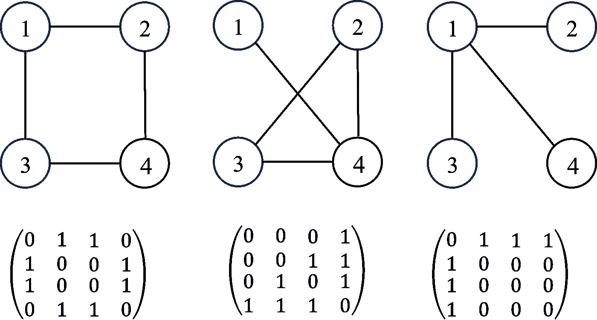

图 1\. 三个不同图的邻接矩阵

每个节点（以及边！但为了简化，我们稍后会回到边）将有一组特征（例如，如果节点是一个人，特征可能包括年龄、性别、身高、职业等）。如果每个节点有 f 个特征，则特征矩阵 X 为 (n × f)。在某些问题中，每个节点可能还具有目标标签，该标签可能是一组分类标签或数值（如 *图 2* 所示）。

**单节点计算**

为了学习任何节点与其邻居之间的相互依赖关系，我们需要考虑其邻居的特征。这使得 GNN 能够通过图来学习数据的结构表示。考虑一个节点 j 及其 Nj 个邻居，GNN 会转换每个邻居的特征，聚合这些特征，然后更新节点 i 的特征空间。以下是这些步骤的描述。

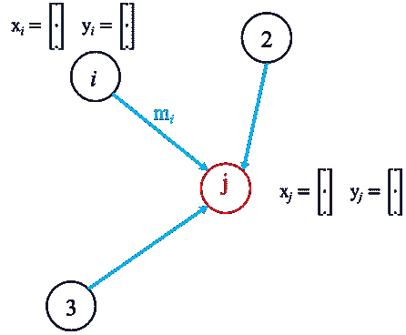

图 2\. 一个节点（j）的示意图，具有特征 xj 和标签 yj，以及邻居节点（i、2、3），每个节点都有自己的特征嵌入和相应的标签。

邻居特征转换可以通过多种方式进行，例如通过 MLP 网络或线性变换，例如

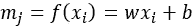

其中 w 和 b 表示变换的权重和偏置。信息聚合，即来自每个邻居节点的信息会被聚合：

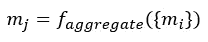

聚合步骤的性质可以有多种不同的方法，例如求和、平均、最小/最大池化和拼接：

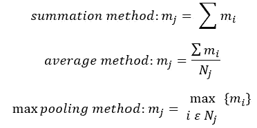

在聚合步骤之后，最后一步是更新节点 j：

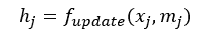

更新可以通过 MLP 使用拼接的节点特征和邻居信息聚合（mj）来完成，或者我们可以使用线性变换，即

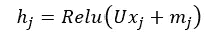

其中 U 是一个可学习的权重矩阵，它通过非线性激活函数（此处使用 ReLU）将原始节点特征（xj）与聚合的邻居特征（mj）结合起来。这就是在单层中更新单个节点的过程，相同的过程应用于图中的所有其他节点，数学上，这可以通过邻接矩阵来表示。

**图级计算**

对于一个包含 n 个节点的图，每个节点有*f*个特征，我们可以将所有特征连接成一个矩阵：

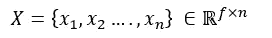

因此，邻居特征变换和聚合步骤可以写作：

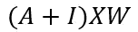

其中 I 是单位矩阵，这有助于包括每个节点的自身特征，否则我们只考虑来自节点 j 邻居的变换特征，而不考虑其自身特征。最后一步是根据连接数对每个节点进行归一化，即对于具有 Nj 个连接的节点 j，特征变换可以这样进行：

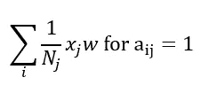

上面的方程可以调整为：

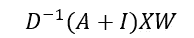

其中 D 是度矩阵，是每个节点连接数的对角矩阵。然而，更常见的是，这一步归一化是通过以下方式进行的：

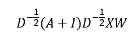

这就是图卷积网络（GCN）方法，它使得 GNN 能够学习节点之间的结构和关系。然而，GCN 的一个问题是邻居特征变换的权重向量在所有邻居中是共享的，即所有邻居被认为是相等的，但通常并非如此，因此不能很好地代表真实系统。为了解决这个问题，可以使用图注意力网络（GAT）来计算邻居特征对目标节点的重要性，从而允许不同的邻居根据它们的相关性以不同的方式贡献于目标节点特征的更新。注意力系数是通过一个可学习的矩阵来确定的，如下所示：

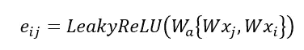

其中 W 是共享的可学习特征线性变换，Wa 是一个可学习的权重向量，eij 是原始的注意力分数，表示节点 i 的特征对节点 j 的重要性。注意力分数使用 SoftMax 函数进行归一化：

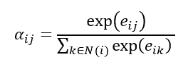

现在，可以使用注意力系数来计算特征聚合步骤：

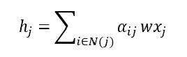

这就是单层的情况，我们可以构建多个层来增加模型的复杂性，这在*图 3*中进行了演示。增加层数将允许模型学习更多的全局特征，并捕捉更复杂的关系，但也很容易导致过拟合，因此应始终使用正则化技术来防止过拟合。

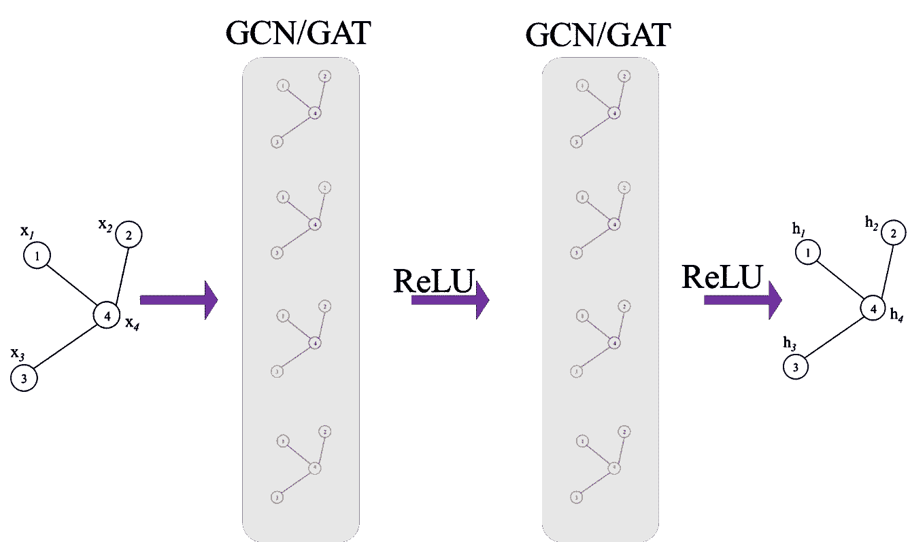

图 3\. 一个多层 GNN 模型的示意图

最后，一旦从网络中获得所有节点的最终特征向量，就可以形成特征矩阵 H：

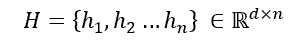

该特征矩阵可以用于执行多种任务，例如节点或图的分类。这也将是 GCN/GAT 数学描述部分的结束。

# **GCN 回归示例**

让我们实现一个回归示例，目标是训练一个网络来预测一个节点的值，前提是已知其他所有节点的值，即每个节点有一个单一的特征（这是一个标量值）。本示例的目的是利用图中编码的固有关系信息，准确预测每个节点的数值。需要注意的是，我们输入所有节点的数值（除了目标节点，目标节点的值用 0 进行掩码），然后预测目标节点的值。对于每个数据点，我们对所有节点重复这一过程。也许这看起来像是一个奇怪的任务，但让我们看看是否能够根据其他节点的值预测任何节点的预期值。使用的数据是来自工业的传感器系列的相应仿真数据，下面示例中的图结构是基于实际过程结构的。我在代码中提供了注释，以便更容易理解。你可以在[这里](https://github.com/Nsharifi650/GNNRegression.git)找到数据集的副本（注意：这是我自己的数据，通过仿真生成）。

这段代码和训练过程远未优化，但它的目的是展示 GNN 的实现，并让人对其工作原理有直观的理解。我目前的实现方式中有一个问题，除了用于学习目的外，这种方法绝对不应该继续使用，那就是将节点特征值进行掩码，并从邻居节点的特征中预测它。当前你需要对每个节点进行循环（效率不高），一种更好的方法是在聚合步骤中停止模型将自身特征包含进来，这样你就不需要一个节点一个节点地处理。但我认为通过当前的方法更容易为模型构建直观理解：)

**数据预处理**

导入必要的库和从 CSV 文件中读取传感器数据。将所有数据归一化到 0 到 1 的范围内。

```py
import pandas as pd
import torch
from torch_geometric.data import Data, Batch
from sklearn.preprocessing import StandardScaler, MinMaxScaler
from sklearn.model_selection import train_test_split
import numpy as np
from torch_geometric.data import DataLoader

# load and scale the dataset
df = pd.read_csv('SensorDataSynthetic.csv').dropna()
scaler = MinMaxScaler()
df_scaled = pd.DataFrame(scaler.fit_transform(df), columns=df.columns)
```

使用 PyTorch 张量定义图中节点之间的连接性（边缘索引）——即这提供了系统的图形拓扑。

```py
nodes_order = [
    'Sensor1', 'Sensor2', 'Sensor3', 'Sensor4', 
    'Sensor5', 'Sensor6', 'Sensor7', 'Sensor8'
]

# define the graph connectivity for the data
edges = torch.tensor([
    [0, 1, 2, 2, 3, 3, 6, 2],  # source nodes
    [1, 2, 3, 4, 5, 6, 2, 7]   # target nodes
], dtype=torch.long)
```

从 CSV 导入的数据具有表格结构，但为了在 GNN 中使用，必须将其转换为图形结构。数据的每一行（一个观察值）表示一个图。迭代每一行以创建数据的图形表示。

为每个节点/传感器创建一个掩码，以指示数据的存在（1）或缺失（0），从而提供处理缺失数据的灵活性。在大多数系统中，可能存在没有数据的项目，因此需要处理缺失数据的灵活性。将数据划分为训练集和测试集。

```py
graphs = []

# iterate through each row of data to create a graph for each observation
# some nodes will not have any data, not the case here but created a mask to allow us to deal with any nodes that do not have data available
for _, row in df_scaled.iterrows():
    node_features = []
    node_data_mask = []
    for node in nodes_order:
        if node in df_scaled.columns:
            node_features.append([row[node]])
            node_data_mask.append(1) # mask value of to indicate present of data
        else:
            # missing nodes feature if necessary
            node_features.append(2)
            node_data_mask.append(0) # data not present

    node_features_tensor = torch.tensor(node_features, dtype=torch.float)
    node_data_mask_tensor = torch.tensor(node_data_mask, dtype=torch.float)

    # Create a Data object for this row/graph
    graph_data = Data(x=node_features_tensor, edge_index=edges.t().contiguous(), mask = node_data_mask_tensor)
    graphs.append(graph_data)

#### splitting the data into train, test observation
# Split indices
observation_indices = df_scaled.index.tolist()
train_indices, test_indices = train_test_split(observation_indices, test_size=0.05, random_state=42)

# Create training and testing graphs
train_graphs = [graphs[i] for i in train_indices]
test_graphs = [graphs[i] for i in test_indices]
```

**图形可视化**

使用上述边缘索引创建的图结构可以通过 networkx 进行可视化。

```py
import networkx as nx
import matplotlib.pyplot as plt

G = nx.Graph() 
for src, dst in edges.t().numpy():
    G.add_edge(nodes_order[src], nodes_order[dst])

plt.figure(figsize=(10, 8))
pos = nx.spring_layout(G)
nx.draw(G, pos, with_labels=True, node_color='lightblue', edge_color='gray', node_size=2000, font_weight='bold')
plt.title('Graph Visualization')
plt.show()
```

**模型定义**

让我们定义模型。该模型包含两个 GAT 卷积层，第一个层将节点特征转换到 8 维空间，第二个 GAT 层则将其进一步缩减为 8 维表示。

GNN（图神经网络）对过拟合非常敏感，正则化（dropout）会在每个 GAT 层后应用，并使用用户定义的概率来防止过拟合。dropout 层在训练过程中随机将输入张量的某些元素置零。

GAT 卷积层的输出结果通过一个全连接（线性）层，以将 8 维的输出映射到最终的节点特征，在本例中，每个节点对应一个标量值。

对目标节点的值进行掩码处理；如前所述，本任务的目的是基于邻居节点的值回归目标节点的值。这也是将目标节点的值掩码或替换为零的原因。

```py
from torch_geometric.nn import GATConv
import torch.nn.functional as F
import torch.nn as nn

class GNNModel(nn.Module):
    def __init__(self, num_node_features):
        super(GNNModel, self).__init__()
        self.conv1 = GATConv(num_node_features, 16)
        self.conv2 = GATConv(16, 8)
        self.fc = nn.Linear(8, 1)  # Outputting a single value per node

    def forward(self, data, target_node_idx=None):
        x, edge_index = data.x, data.edge_index
        edge_index = edge_index.T
        x = x.clone()

        # Mask the target node's feature with a value of zero! 
        # Aim is to predict this value from the features of the neighbours
        if target_node_idx is not None:
            x[target_node_idx] = torch.zeros_like(x[target_node_idx])

        x = F.relu(self.conv1(x, edge_index))
        x = F.dropout(x, p=0.05, training=self.training)
        x = F.relu(self.conv2(x, edge_index))
        x = F.relu(self.conv3(x, edge_index))
        x = F.dropout(x, p=0.05, training=self.training)
        x = self.fc(x)

        return x
```

**训练模型**

初始化模型并定义优化器、损失函数以及包括学习率、权重衰减（用于正则化）、批处理大小和训练轮次在内的超参数。

```py
model = GNNModel(num_node_features=1) 
batch_size = 8
optimizer = torch.optim.Adam(model.parameters(), lr=0.0002, weight_decay=1e-6)
criterion = torch.nn.MSELoss()
num_epochs = 200  
train_loader = DataLoader(train_graphs, batch_size=1, shuffle=True) 
model.train()
```

训练过程相对标准，每个图（一个数据点）都会通过模型的前向传播（遍历每个节点并预测目标节点）。预测产生的损失会在定义的批处理大小上累积，然后通过反向传播更新 GNN。

```py
for epoch in range(num_epochs):
    accumulated_loss = 0 
    optimizer.zero_grad()
    loss = 0  
    for batch_idx, data in enumerate(train_loader):
        mask = data.mask  
        for i in range(1,data.num_nodes):
            if mask[i] == 1:  # Only train on nodes with data
                output = model(data, i)  # get predictions with the target node masked
                                         # check the feed forward part of the model
                target = data.x[i] 
                prediction = output[i].view(1) 
                loss += criterion(prediction, target)
        #Update parameters at the end of each set of batches
        if (batch_idx+1) % batch_size == 0 or (batch_idx +1 ) == len(train_loader):
            loss.backward() 
            optimizer.step()
            optimizer.zero_grad()
            accumulated_loss += loss.item()
            loss = 0

    average_loss = accumulated_loss / len(train_loader)
    print(f'Epoch {epoch+1}, Average Loss: {average_loss}')
```

**测试训练好的模型**

使用测试数据集，将每个图像通过训练后的模型的前向传播，并根据每个节点的邻居节点的值预测其值。

```py
test_loader = DataLoader(test_graphs, batch_size=1, shuffle=True)
model.eval()

actual = []
pred = []

for data in test_loader:
    mask = data.mask
    for i in range(1,data.num_nodes):
        output = model(data, i)
        prediction = output[i].view(1)
        target = data.x[i]

        actual.append(target)
        pred.append(prediction)
```

**可视化测试结果**

使用 iplot，我们可以将节点的预测值与真实值进行可视化对比。

```py
import plotly.graph_objects as go
from plotly.offline import iplot

actual_values_float = [value.item() for value in actual]
pred_values_float = [value.item() for value in pred]

scatter_trace = go.Scatter(
    x=actual_values_float,
    y=pred_values_float,
    mode='markers',
    marker=dict(
        size=10,
        opacity=0.5,  
        color='rgba(255,255,255,0)',  
        line=dict(
            width=2,
            color='rgba(152, 0, 0, .8)', 
        )
    ),
    name='Actual vs Predicted'
)

line_trace = go.Scatter(
    x=[min(actual_values_float), max(actual_values_float)],
    y=[min(actual_values_float), max(actual_values_float)],
    mode='lines',
    marker=dict(color='blue'),
    name='Perfect Prediction'
)

data = [scatter_trace, line_trace]

layout = dict(
    title='Actual vs Predicted Values',
    xaxis=dict(title='Actual Values'),
    yaxis=dict(title='Predicted Values'),
    autosize=False,
    width=800,
    height=600
)

fig = dict(data=data, layout=layout)

iplot(fig)
```

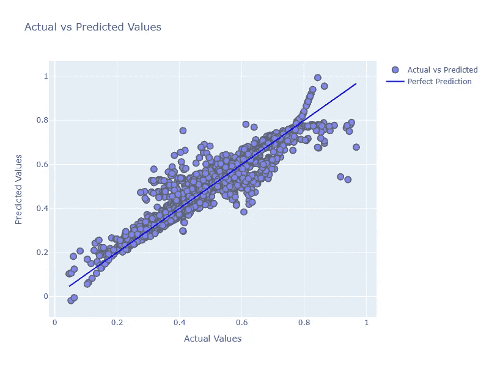

尽管没有对模型架构或超参数进行精细调优，实际上模型表现不错，我们可以进一步调优模型以提高准确性。

这篇文章到此为止。GNN 相较于其他机器学习分支来说相对较新，看到这个领域的发展以及它应用于不同问题将是非常令人兴奋的。最后，感谢你花时间阅读这篇文章，希望它对你理解 GNN 或其数学背景有所帮助。

**在你离开之前**

个人而言，我非常喜欢花时间学习新概念，并将这些概念应用于新的问题和挑战，我相信大多数阅读这些文章的人也有同样的感受。我认为能够做这件事是一种特权，每个人都应该拥有这种特权，但并不是每个人都能拥有。我们每个人都有责任改变这一点，为每个人创造更加光明的未来。请考虑向 UniArk 捐款（[UniArk.org](http://uniark.org)），以帮助来自世界上常常被大学和国家忽视的群体——受迫害的少数群体（无论是种族、宗教还是其他方面）的才华横溢的学生。UniArk 深入寻找最遥远、最贫困地区的人才与潜力——那些发展中国家的偏远地区。您的捐款将成为压迫社会中某个人的希望灯塔。我希望您能帮助 UniArk 保持这盏灯塔的光明。

*除非另有注明，所有图片均由作者提供*
