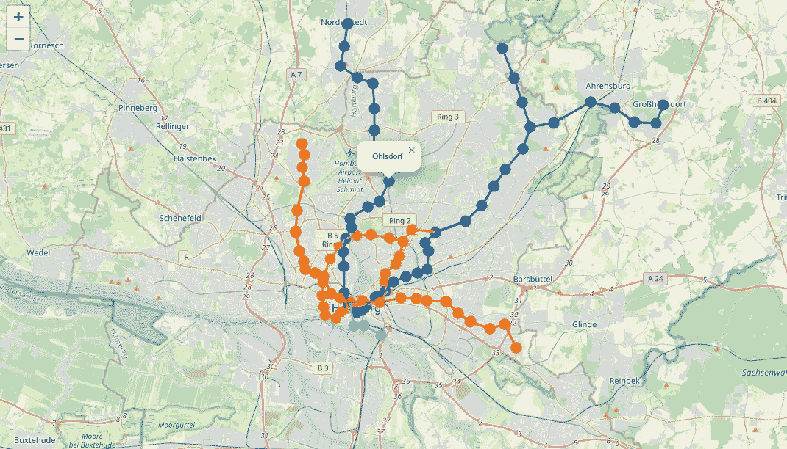

# 使用 Overpass API 提取地铁路线数据：一步步指南

> 原文：[`towardsdatascience.com/subway-route-data-extraction-with-overpass-api-a-step-by-step-guide-fdeec6b2edb1?source=collection_archive---------9-----------------------#2024-09-03`](https://towardsdatascience.com/subway-route-data-extraction-with-overpass-api-a-step-by-step-guide-fdeec6b2edb1?source=collection_archive---------9-----------------------#2024-09-03)

## 通过 Overpass API 简化 OpenStreetMaps 的地理数据提取

 [Amanda Iglesias Moreno](https://amandaiglesiasmoreno.medium.com/?source=post_page---byline--fdeec6b2edb1--------------------------------)

·发表于 [Towards Data Science](https://towardsdatascience.com/?source=post_page---byline--fdeec6b2edb1--------------------------------) ·10 分钟阅读·2024 年 9 月 3 日

--

汉堡地铁网络的 Folium 可视化（图片由作者制作）

**OpenStreetMaps 是最重要的地理信息数据源之一**。平台上可用的许多数据能够帮助我们进行广泛的分析，但我们该如何轻松下载数据以进行分析呢？**Overpass API 允许通过定制查询访问平台上所有可用的数据**。这个 API 是流行的 Python 库 OSMnx 的基础，凭借其个性化查询，它让我们获得的数据比 Python 库更多，因为后者仅限于从 OpenStreetMaps 提取的最常见数据。

在本文中，**我们将使用 API 获取位于汉堡的地铁路线**。利用这些路线，我们将创建一个 NetworkX 图，并通过 Folium 中的交互式可视化展示它。本文提取的数据可以用于多种分析，例如评估不同家庭到地铁站的距离，以预测它们的货币价值。

正如我们所见，地理数据对广泛的分析具有极高的价值。因此，掌握轻松提取这些数据的工具是非常必要的。让我们开始阅读本文吧！
