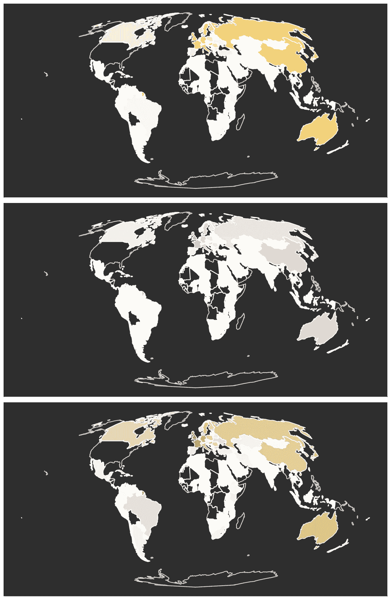

# 通过数据视角看夏季奥运会

> 原文：[`towardsdatascience.com/summer-olympic-games-through-the-lens-of-data-2dadd05993fc?source=collection_archive---------7-----------------------#2024-07-23`](https://towardsdatascience.com/summer-olympic-games-through-the-lens-of-data-2dadd05993fc?source=collection_archive---------7-----------------------#2024-07-23)

## 使用 Python 和维基百科绘制获奖国家的地理和网络地图。

 [Milan Janosov](https://medium.com/@janosovm?source=post_page---byline--2dadd05993fc--------------------------------)

·发布于 [Towards Data Science](https://towardsdatascience.com/?source=post_page---byline--2dadd05993fc--------------------------------) ·阅读时间：13 分钟·2024 年 7 月 23 日

--

今年的夏季奥运会将在巴黎举办，几天后即将开始，因此我决定作为一名数据科学家，深入研究奥运会的历史，尽管我对奥运体育项目并没有过多关注。

换句话说，我想要通过依赖公开的维基百科数据，弄清楚哪些国家在奥运会上曾经是最耀眼的明星，以及各国之间的主要竞争对手是谁。具体来说，我收集了每个国家赢得的金牌、银牌和铜牌的总数，并细分到各个单项体育项目。然后，我将这些总奖牌数展示在全球地图上，利用奖牌-体育项目的资料构建并可视化一个类似的国家网络，展示具有相似体育项目配置的国家竞争集群。

让我们从构建数据集开始吧！

*所有图片均由作者创作。*

# 1\. 数据库

## 1\. 1\. 获取完整的奥运参赛国家名单

首先，我访问了维基百科上的[**历届奥运会奖牌榜**](https://en.wikipedia.org/wiki/All-time_Olympic_Games_medal_table)页面，它简要总结了……
