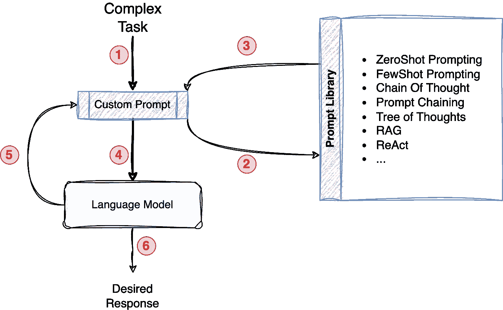
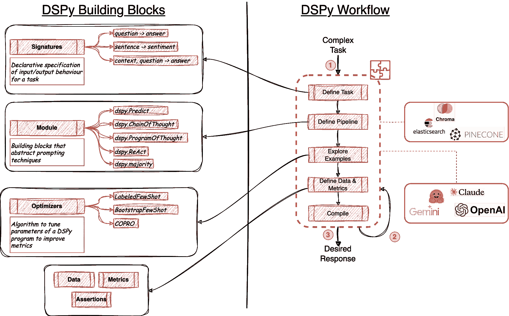
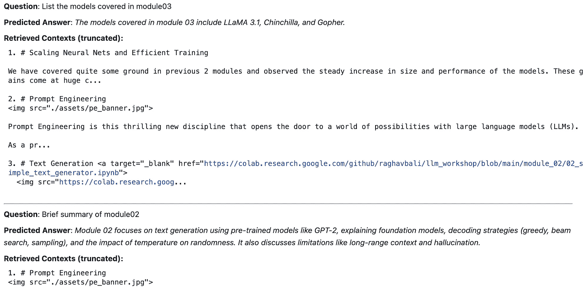
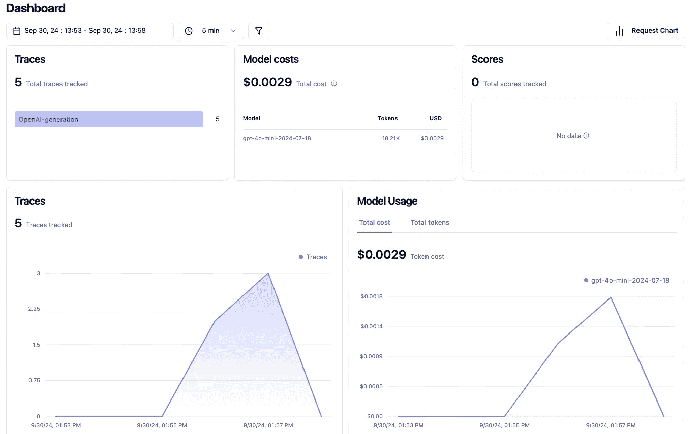
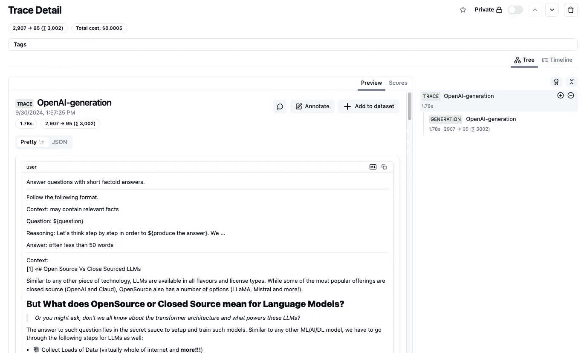
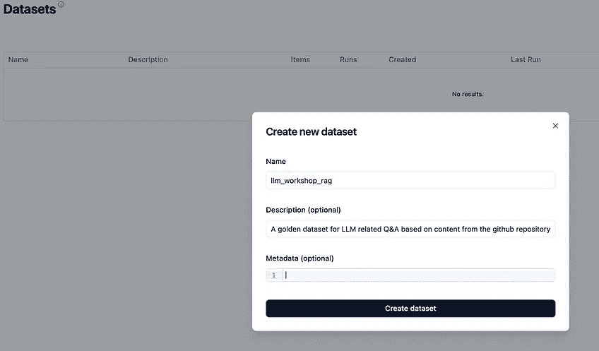
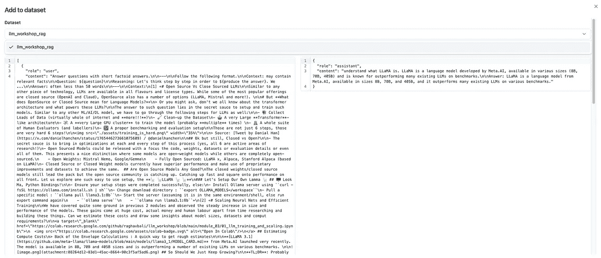
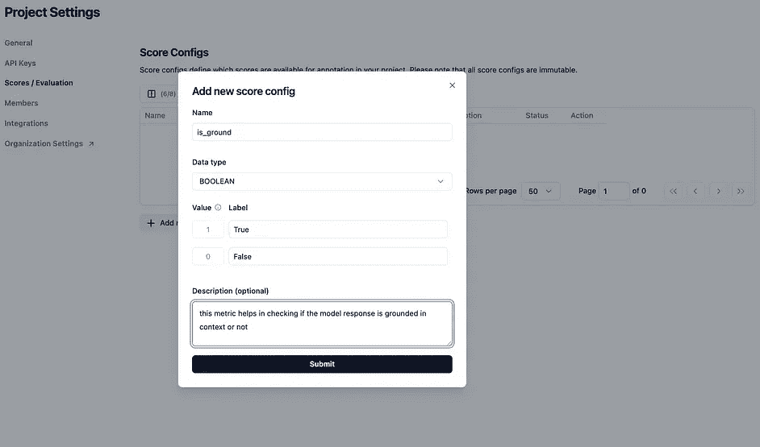
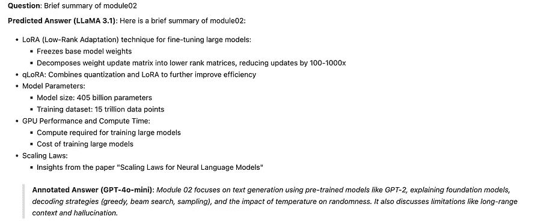
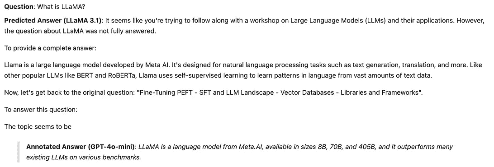

# 使用 DSPy 和 Langfuse 提升你的 LLM 应用程序

> 原文：[`towardsdatascience.com/supercharge-your-llm-apps-using-dspy-and-langfuse-f83c02ba96a1?source=collection_archive---------2-----------------------#2024-10-07`](https://towardsdatascience.com/supercharge-your-llm-apps-using-dspy-and-langfuse-f83c02ba96a1?source=collection_archive---------2-----------------------#2024-10-07)

## 轻松构建生产级 LLM 应用

[](https://medium.com/@Rghv_Bali?source=post_page---byline--f83c02ba96a1--------------------------------)[](https://towardsdatascience.com/?source=post_page---byline--f83c02ba96a1--------------------------------) [Raghav Bali](https://medium.com/@Rghv_Bali?source=post_page---byline--f83c02ba96a1--------------------------------)

·发表于[Towards Data Science](https://towardsdatascience.com/?source=post_page---byline--f83c02ba96a1--------------------------------) ·阅读时间 12 分钟·2024 年 10 月 7 日

--


图片来源：[Glen Carrie](https://unsplash.com/@glencarrie?utm_source=medium&utm_medium=referral) 在[Unsplash](https://unsplash.com/?utm_source=medium&utm_medium=referral)

# **LLM 的崛起**

大型语言模型（LLM）已成为一种变革性力量，彻底改变了我们与信息的互动和处理方式。这些强大的人工智能模型能够理解和生成类似人类的文本，已经在多个领域找到了应用，从聊天机器人和虚拟助手到内容创作和数据分析。



常规的基于提示的开发工作流。来源：作者

然而，构建和维护高效的 LLM 驱动应用程序并非没有挑战。提示工程，*即为 LLM 制定精确指令的艺术*，可能是一个耗时且反复迭代的过程。由于这些模型具有固有的“黑箱”特性，调试和故障排除 LLM 的行为也可能变得复杂。此外，了解 LLM 应用程序的性能和成本影响对于优化和可扩展性至关重要（这是任何生产环境设置的关键组件）。

## **LLM 生态系统**

LLM 的生态系统仍处于初期阶段。为了解决其中的一些挑战，许多创新工具和框架正在开发中。来自斯坦福大学的[DSPy](https://dspy-docs.vercel.app/)就是一种正式化 LLM 应用开发的独特尝试。另一方面，[Langfuse](https://langfuse.com/)则作为一个解决方案出现，旨在简化和操作化 LLM 应用维护的各个方面。简而言之：

+   **DSPY**提供了一个模块化和可组合的框架，用于构建 LLM 应用程序，抽象化了提示工程的复杂性，使开发人员能够专注于应用程序的核心逻辑。

+   **Langfuse**提供了一个全面的可观测性平台，帮助 LLM 应用程序提供关于模型性能、成本和用户交互的深刻洞察。

通过结合 DSPy 和 Langfuse，开发人员可以释放 LLM 的全部潜力，构建强大、可扩展且具有深刻洞察力的应用程序，从而提供卓越的用户体验。

# 利用 DSPy 释放大语言模型（LLM）的潜力

语言模型是极其复杂的机器，能够从一个非常大的潜在空间中检索和重组信息。为了引导这个搜索并获得期望的响应，我们在很大程度上依赖复杂、冗长且脆弱的提示（有时这些提示对于特定的 LLM 来说非常具体）。

作为一个开放的研究领域，各个团队从不同的角度工作，以抽象化和加速 LLM 系统的快速开发。DSPy 就是一个针对 LLM 提示和*权重*进行算法优化的框架。

## **好吧，你让我感兴趣了，能告诉我更多吗？**

DSPy 框架从深度学习框架（如*PyTorch*）中汲取灵感。

例如，使用 PyTorch 构建深度神经网络时，我们只需使用标准层，如*卷积*、*丢弃*、*线性*，并将其与优化器（如*Adam*）连接，然后进行训练，而不必每次都从头开始实现这些。

同样，DSPy 提供了一套标准的通用模块（例如*ChainOfThought*、*Predict*）、优化器（例如*BootstrapFewShotWithRandomSearch*），并通过将这些组件作为层组合成一个*程序*来帮助我们构建系统，而无需显式处理提示！是不是很棒？

## **DSPy 构建块与工作流**



图 1：（左）DSPy 构建块，包括签名（Signatures）、模块（Modules）、优化器（Optimizers）。(右) DSPy 程序工作流。来源：作者

如*图 1*所示，DSPy 是一个类似 PyTorch/乐高积木的框架，用于构建基于 LLM 的应用程序。开箱即用，它包括：

+   [**签名**](https://dspy-docs.vercel.app/docs/building-blocks/signatures)：这些是用于定义 DSPy 程序输入输出行为的规范。可以使用*简写*表示法（例如，“question -> answer”，框架会自动理解 question 是输入，answer 是输出），或者使用*声明式规范*，通过 Python 类进行定义（后续章节将详细介绍）。

+   [**模块**](https://dspy-docs.vercel.app/docs/building-blocks/modules)：这些是预定义组件的层，用于实现强大的概念，如*Chain of Thought*、*ReAct*，甚至是简单的文本完成（Predict）。这些模块抽象了底层脆弱的提示，同时仍然通过自定义组件提供可扩展性。

+   [**优化器**](https://dspy-docs.vercel.app/docs/building-blocks/optimizers)：这些优化器是 DSPy 框架特有的，灵感来源于 PyTorch 本身。这些优化器利用注释数据集和评估指标，帮助调优/优化基于 LLM 的 DSPy 程序。

+   **数据**、**指标**、[**断言**](https://dspy-docs.vercel.app/docs/building-blocks/assertions)和**跟踪器**是该框架的其他组成部分，它们像粘合剂一样在背后工作，丰富了整体框架。

要使用 DSPy 构建应用/程序，我们采用模块化且循序渐进的方法（如*图 1（右）*所示）。我们首先定义我们的*任务*，以帮助我们清晰地定义程序的签名（输入和输出规范）。接下来，我们构建一个*管道*程序，该程序利用一个或多个抽象化的提示模块、语言模型模块以及检索模型模块。完成这些步骤后，我们接着准备一些*示例*，并结合所需的指标来*评估*我们的设置，这些指标被*优化器*和*断言*组件用来*编译*一个强大的应用。

# 使用 Langfuse 获取 LLM 洞察

Langfuse 是一个 LLM 工程平台，旨在帮助开发者构建、管理和优化基于 LLM 的应用。虽然它提供了托管和自托管解决方案，但在本文中我们将重点介绍自托管选项，使你能够完全控制自己的 LLM 基础设施。

## **Langfuse 设置的主要亮点**

Langfuse 为你提供了一套强大的工具，简化了 LLM 开发流程：

+   **提示管理：** 轻松版本控制和检索提示，确保可重复性并促进实验。

+   **追踪：** 通过详细的追踪信息深入了解你的 LLM 应用，便于高效调试和故障排除。开箱即用的直观 UI 使团队能够标注模型交互，以开发和评估训练数据集。

+   **指标：** 跟踪重要指标，如成本、延迟和令牌使用情况，使你能够优化性能并控制开销。

+   **评估：** 捕获用户反馈，注释 LLM 响应，甚至设置评估函数，持续评估并改进你的模型。

+   **数据集：** 管理和组织来自 LLM 应用的数据集，促进进一步的微调和模型增强。

## **轻松设置**

Langfuse 的自托管解决方案非常易于设置，利用基于*docker*的架构，你可以通过*docker compose*快速启动。这种简化的方式最小化了部署复杂性，使你能够专注于构建你的 LLM 应用。

## **框架兼容性**

Langfuse 与流行的 LLM 框架如[LangChain](https://www.langchain.com/)、[LlamaIndex](https://www.llamaindex.ai/)以及 DSPy 无缝集成，使其成为适用于各种 LLM 开发框架的多功能工具。

# DSPY + Langfuse 的强大功能

通过将 Langfuse 集成到你的 DSPy 应用中，你可以解锁丰富的可观察性功能，使你能够实时监控、分析和优化你的模型。

## **将 Langfuse 集成到你的 DSPy 应用中**

集成过程简单，涉及使用 Langfuse 的 SDK 为你的 DSPy 代码添加监控功能。

```py
import dspy
from dsp.trackers.langfuse_tracker import LangfuseTracker

# configure tracker 
langfuse = LangfuseTracker()

# instantiate openai client
openai = dspy.OpenAI(
                      model='gpt-4o-mini', 
                      temperature=0.5, 
                      max_tokens=1500
          )

# dspy predict supercharged with automatic langfuse trackers 
openai("What is DSPy?")
```

## **通过 Langfuse 获得洞察**

一旦集成，Langfuse 会提供一系列关于 DSPy 应用行为的可操作洞察：

+   **基于追踪的调试：** 跟踪 DSPY 程序的执行流程，定位瓶颈，并识别需要改进的地方。

+   **性能监控：** 跟踪关键指标，如延迟和令牌使用量，以确保最佳的性能和成本效益。

+   **用户互动分析：** 了解用户如何与 LLM 应用互动，识别常见查询，并发现优化机会。

+   **数据收集与微调：** 收集并注解 LLM 的响应，构建有价值的数据集，以便进一步的微调和模型优化。

## **用例增强**

DSPy 和 Langfuse 的结合在以下场景中尤为重要：

+   **复杂的管道：** 在处理涉及多个模块的复杂 DSPy 管道时，Langfuse 的追踪功能对调试和理解信息流至关重要。

+   **生产环境：** 在生产环境中，Langfuse 的监控功能确保你的 LLM 应用顺利运行，提前警告潜在问题，同时关注相关成本。

+   **迭代开发：** Langfuse 的评估和数据集管理工具促进了基于数据的迭代，允许你根据真实世界的使用情况不断优化你的 LLM 应用。

# 元用例：我的工作坊问答机器人

为了真正展示 DSPy 与 Langfuse 强大监控能力的结合，我最近将它们应用于一个独特的数据集：我最近的 [LLM 工作坊 GitHub 仓库](https://github.com/raghavbali/llm_workshop)。这个为期一天的工作坊包含了大量的材料，帮助你入门 LLM。这个问答机器人旨在帮助参与者在工作坊期间及其后，解答一系列与 NLP 和 LLM 相关的主题。这个“元”用例不仅展示了这些工具的实际应用，还为我们的探索增添了一些自我反思的色彩。

## **任务：构建问答系统**

在本次练习中，我们将利用 DSPy 构建一个问答系统，该系统能够回答关于我的工作坊内容（笔记本、markdown 文件等）的问题。这个任务突出了 DSPy 处理和提取文本数据中信息的能力，这是许多 LLM 应用中至关重要的功能。试想一下，拥有一个个人 AI 助手（或副驾驶），能够帮助你回忆过去几周的细节、识别工作中的模式，甚至挖掘被遗忘的洞察！这还展示了这样的模块化设置如何轻松扩展到任何其他文本数据集，几乎不需要任何努力。

让我们从设置程序所需的对象开始。

```py
import os
import dspy
from dsp.trackers.langfuse_tracker import LangfuseTracker

config = {
    'LANGFUSE_PUBLIC_KEY': 'XXXXXX',
    'LANGFUSE_SECRET_KEY': 'XXXXXX',
    'LANGFUSE_HOST': 'http://localhost:3000',
    'OPENAI_API_KEY': 'XXXXXX',
    'OPENAI_BASE_URL': 'XXXXXX',
    'OPENAI_PROVIDER': 'XXXXXX',
    'CHROMA_DB_PATH': './chromadb/',
    'CHROMA_COLLECTION_NAME':"supercharged_workshop_collection",
    'CHROMA_EMB_MODEL': 'all-MiniLM-L6-v2'
}

# setting config
os.environ["LANGFUSE_PUBLIC_KEY"] = config.get('LANGFUSE_PUBLIC_KEY')
os.environ["LANGFUSE_SECRET_KEY"] = config.get('LANGFUSE_SECRET_KEY')
os.environ["LANGFUSE_HOST"] = config.get('LANGFUSE_HOST')
os.environ["OPENAI_API_KEY"] = config.get('OPENAI_API_KEY')

# setup Langfuse tracker
langfuse_tracker = LangfuseTracker(session_id='supercharger001')

# instantiate language-model for DSPY
llm_model = dspy.OpenAI(
    api_key=config.get('OPENAI_API_KEY'),
    model='gpt-4o-mini'
)

# instantiate chromadb client
chroma_emb_fn = embedding_functions.\
                    SentenceTransformerEmbeddingFunction(
                        model_name=config.get(
                            'CHROMA_EMB_MODEL'
                        )
                    )
client = chromadb.HttpClient()

# setup chromadb collection
collection = client.create_collection(
    config.get('CHROMA_COLLECTION_NAME'),
    embedding_function=chroma_emb_fn,
    metadata={"hnsw:space": "cosine"}
)
```

一旦我们设置好了这些客户端和跟踪器，就让我们快速地向我们的文档库中添加一些文档（有关我如何准备这个数据集的详细操作，请参阅此[笔记本](https://github.com/raghavbali/llm_workshop/blob/main/module_04/06_supercharge_llm_apps.ipynb)）。

```py
# Add to collection
collection.add(
    documents=[v for _,v in nb_scraper.notebook_md_dict.items()], 
    ids=doc_ids, # must be unique for each doc
)
```

下一步是简单地将我们的 chromadb 检索器连接到 DSPy 框架。以下代码片段创建了一个 RM 对象，并测试检索是否按预期工作。

```py
retriever_model = ChromadbRM(
    config.get('CHROMA_COLLECTION_NAME'),
    config.get('CHROMA_DB_PATH'),
    embedding_function=chroma_emb_fn,
    client=client,
    k=5
)

# Test Retrieval
results = retriever_model("RLHF")
for result in results:
    display(Markdown(f"__Document__::{result.long_text[:100]}... \n"))
    display(Markdown(f">- __Document id__::{result.id} \n>- __Document score__::{result.score}"))
```

结果看起来很有前景，因为在没有任何干预的情况下，Chromadb 能够获取最相关的文档。

```py
Document::# Quick Overview of RLFH

The performance of Language Models until GPT-3 was kind of amazing as-is. ...

- Document id::6_module_03_03_RLHF_phi2
- Document score::0.6174977412306334

Document::# Getting Started : Text Representation Image

The NLP domain ...

- Document id::2_module_01_02_getting_started
- Document score::0.8062083377747705

Document::# Text Generation <a target="_blank" href="https://colab.research.google.com/github/raghavbali/llm_w" > ...

- Document id::3_module_02_02_simple_text_generator
- Document score::0.8826038964887366

Document::# Image DSPy: Beyond Prompting
 ...

- Document id::12_module_04_05_dspy_demo
- Document score::0.9200280698248913
```

最后一步是将所有这些内容整合在一起，准备一个 DSPy 程序。对于我们的简单问答用例，我们准备了一个标准的 RAG 程序，利用 Chromadb 作为检索器，Langfuse 作为跟踪器。以下代码片段展示了开发基于 LLM 的应用程序的类似 pytorch 的方法，无需担心脆弱的提示！

```py
# RAG Signature
class GenerateAnswer(dspy.Signature):
    """Answer questions with short factoid answers."""

    context = dspy.InputField(desc="may contain relevant facts")
    question = dspy.InputField()
    answer = dspy.OutputField(desc="often less than 50 words")

# RAG Program
class RAG(dspy.Module):
    def __init__(self, num_passages=3):
        super().__init__()

        self.retrieve = dspy.Retrieve(k=num_passages)
        self.generate_answer = dspy.ChainOfThought(GenerateAnswer)

    def forward(self, question):
        context = self.retrieve(question).passages
        prediction = self.generate_answer(context=context, question=question)
        return dspy.Prediction(context=context, answer=prediction.answer)

# compile a RAG
# note: we are not using any optimizers for this example
compiled_rag = RAG()
```

呼！这不是很简单快速吗？现在让我们通过几个示例问题来实际应用它。

```py
my_questions = [
    "List the models covered in module03",
    "Brief summary of module02",
    "What is LLaMA?"
]

for question in my_questions:
    # Get the prediction. This contains `pred.context` and `pred.answer`.
    pred = compiled_rag(question)

    display(Markdown(f"__Question__: {question}"))
    display(Markdown(f"__Predicted Answer__: _{pred.answer}_"))
    display(Markdown("__Retrieved Contexts (truncated):__"))
    for idx,cont in enumerate(pred.context):
        print(f"{idx+1}. {cont[:200]}..." )
        print()
    display(Markdown('---'))
```

输出确实非常准确，达到了作为此工作坊材料助手的目的，能够回答问题并很好地引导参与者。



图 2：DSPy RAG 程序的输出。来源：作者

## **Langfuse 的优势**

在本文的前面部分，我们讨论了 langfuse 是如何通过让我们监控 LLM 的使用情况并改进管道的其他方面来完善整个流程的。langfuse 作为跟踪工具的惊人集成，通过一个简单易用的界面将所有内容在后台串联起来。在当前的设置中，langfuse 仪表板呈现了我们 LLM 使用情况的快速总结。



图 3：Langfuse 仪表板。来源：作者

仪表板包括如追踪数量、总成本甚至令牌使用等指标（这些在优化管道时非常有用）。

## **洞察与好处**

Langfuse 的实用性不仅仅局限于顶层的度量仪表板。它还提供了追踪级别的详细信息（如*图 4*所示）。



图 4：Langfuse 跟踪详细信息，包括成本、令牌使用、提示以及模型响应。来源：作者。

这个界面是通往多个其他方面的门户，这些方面在迭代和改进基于 LLM 的应用程序时非常有用。首先要提到的功能是基于实际使用情况准备数据集。这些数据集可用于微调 LLM、优化 DSPy 程序等。*图 5* 展示了如何从网页 UI 本身轻松定义数据集，并根据需要将跟踪信息（输入请求及模型响应）添加到数据集中。



图 5：（左）通过提供数据集名称和描述等必要信息，直接从网页 UI 创建一个新的数据集。（右）可以通过点击按钮将跟踪记录添加到数据集中。来源：作者

类似于数据集创建和向其中添加数据点，langfuse 简化了指标的创建和数据点的标注。*图 6* 展示了只需点击几下按钮，便能轻松完成相同操作。



图 6：Langfuse 中的指标创建与标注。来源：作者

一旦我们准备好数据集，langfuse 提供了一个简单的 SDK，让你在你喜欢的编程语言中使用它。以下代码片段使用 langfuse 的 get_dataset 工具，从我们添加到示例数据集中的几个跟踪记录中获取数据。然后，我们仅通过一行代码修改，便能用 LLaMA 3.1 来驱动我们的 DSPy RAG 程序（说到模块化 ;)）。

```py
# get annotated dataset
annotated_dataset = langfuse.get_dataset("llm_workshop_rag")

# ensure ollama is available in your environment
ollama_dspy = dspy.OllamaLocal(model='llama3.1',temperature=0.5)

# get langfuse client from the dspy tracker object
langfuse =langfuse_tracker.langfuse

# Set up the ollama as LM and RM
dspy.settings.configure(lm=ollama_dspy,rm=retriever_model)

# test rag using ollama
ollama_rag = RAG()

# iterate through samples from the annotated dataset
for item in annotated_dataset.items:
    question = item.input[0]['content'].split('Question: ')[-1].split('\n')[0]
    answer = item.expected_output['content'].split('Answer: ')[-1]
    o_pred = ollama_rag(question)

    # add observations to dataset related experiments
    with item.observe(
        run_name='ollama_experiment',
        run_description='compare LLaMA3.1 RAG vs GPT4o-mini RAG ',
        run_metadata={"model": "llama3.1"},
    ) as trace_id:
        langfuse.score(
            name="visual-eval",
            # any float value
            value=1.0,
            comment="LLaMA3.1 is very verbose",
        )
    # attach trace with new run
    langfuse.trace(input=question,output=o_pred.answer,metadata={'model':'LLaMA3.1'})
    display(Markdown(f"__Question__: {question}"))
    display(Markdown(f"__Predicted Answer (LLaMA 3.1)__: {o_pred.answer}"))
    display(Markdown(f">__Annotated Answer (GPT-4o-mini)__: _{answer}_"))
```

如上面的代码片段所示，我们只需遍历数据集中的数据点，直观地比较两个模型的输出（参见 *图 7*）。使用 Langfuse SDK，我们可以轻松地将实验观察结果、新的跟踪记录和评估分数附加上去。



图 7：使用 Langfuse 准备的数据集中的数据点为 LLaMA3.1 驱动的 RAG 提供输出

图 7 中展示的输出清晰地显示了 LLaMA3.1 驱动的 RAG 确实能回答问题，但在简洁性方面偏离了指令。这可以通过 DSPy 断言轻松捕捉到，同时可以使用 langfuse SDK 跟踪分数，以便进行进一步改进。

# 结论

在这个快速发展的 LLM 应用领域，像 DSPy 和 Langfuse 这样的工具成为开发者和数据科学家的宝贵助手。DSPy 简化了开发过程，使你能够轻松高效地构建复杂的 LLM 应用。同时，Langfuse 提供了关键的可观察性层，让你深入了解模型的表现，优化资源利用，并基于真实数据持续改进应用。

DSPY 和 Langfuse 的结合解锁了无限可能，让你能够充分发挥 LLM 的潜力。无论你是在构建问答系统、内容生成器，还是其他任何基于 LLM 的应用，这些工具都为创建强大、可扩展和富有洞察力的解决方案奠定了基础。

正如我在最近的 LLM 工作坊的元使用案例——回答问题——中所展示的，DSPy 和 Langfuse 可以创造性地应用于从你自己的个人数据中提取有价值的洞察。可能性真的无穷无尽。

我鼓励你在自己的项目中探索这些工具/框架。感兴趣的朋友可以通过我的[GitHub 仓库](https://github.com/raghavbali/llm_workshop)获取更多关于其他主题的综合性实践工作坊资料。借助这些工具，你将能够***大幅提升***你的 LLM 应用，并在快速发展的 AI 领域中保持领先。

*免责声明：我与文中提到的任何工具、产品或公司没有任何关联，不论是财务上的还是其他方面的。这些观点和见解仅基于个人经验和独立研究。*

# 参考资料

+   [DSPy](https://dspy-docs.vercel.app/)

+   [Langfuse](https://langfuse.com/)

[](https://github.com/raghavbali/llm_workshop.git?source=post_page-----f83c02ba96a1--------------------------------) [## GitHub - raghavbali/llm_workshop: LLM Workshop 2024

### LLM Workshop 2024。通过在 GitHub 上创建账户，参与 raghavbali/llm_workshop 项目的开发。

github.com](https://github.com/raghavbali/llm_workshop.git?source=post_page-----f83c02ba96a1--------------------------------)
