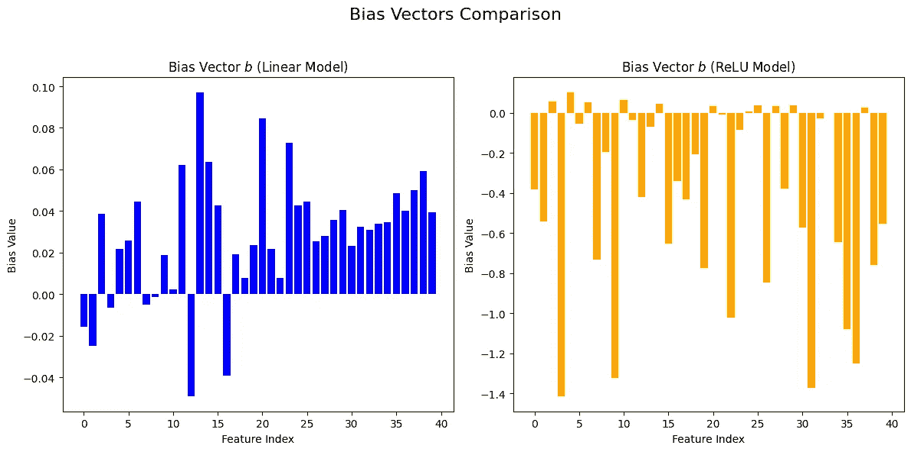
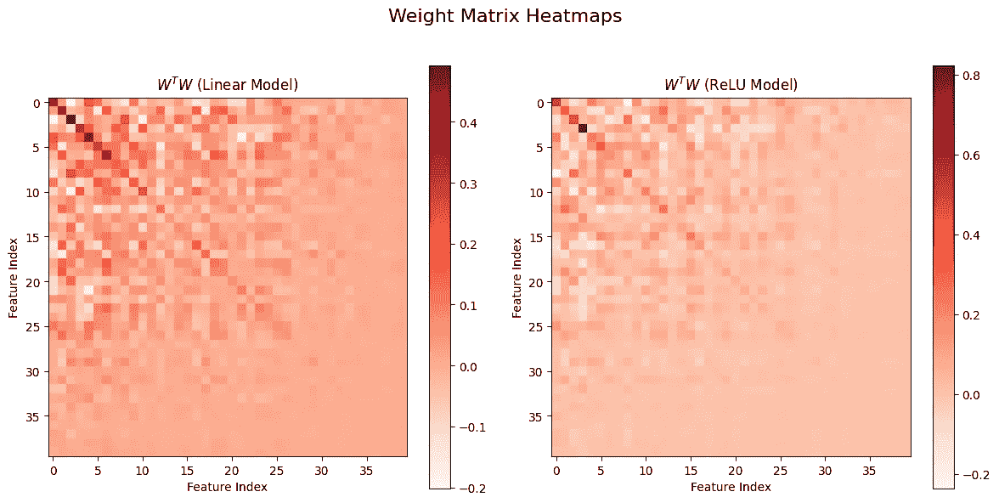
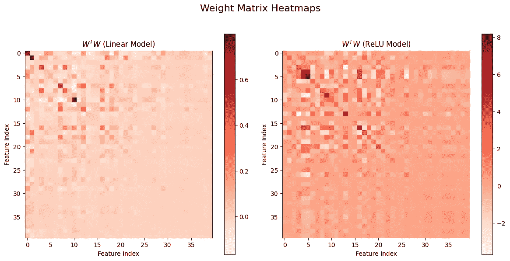

# 叠加现象：为何它使得神经网络难以解释

> 原文：[`towardsdatascience.com/superposition-what-makes-it-difficult-to-explain-neural-network-565087243be4?source=collection_archive---------0-----------------------#2024-12-29`](https://towardsdatascience.com/superposition-what-makes-it-difficult-to-explain-neural-network-565087243be4?source=collection_archive---------0-----------------------#2024-12-29)

## 当特征数大于模型维度时

[](https://medium.com/@vanillaxiangshuyang?source=post_page---byline--565087243be4--------------------------------)[](https://towardsdatascience.com/?source=post_page---byline--565087243be4--------------------------------) [Shuyang Xiang](https://medium.com/@vanillaxiangshuyang?source=post_page---byline--565087243be4--------------------------------)

·发布于 [Towards Data Science](https://towardsdatascience.com/?source=post_page---byline--565087243be4--------------------------------) ·7 分钟阅读·6 天前

--

# 介绍

如果神经网络的世界能够呈现一对一的关系，那将是理想的：每个神经元只会激活一个且仅一个特征。在这样的世界中，模型的解释将是直观的：这个神经元会对狗耳特征激活，而那个神经元会对汽车轮子激活。不幸的是，实际情况并非如此。实际上，一个具有维度 *d* 的模型往往需要表示 *m* 个特征，其中 *d < m*。这时我们就会观察到叠加现象。

*有一个小的备注，关于一个评论：当 d > m 时，叠加现象仍然可能发生，但其解释和机制不同。隐藏层的更高维度为网络提供了更大的能力，但并未消除叠加现象——它只是允许在更大的表示空间内进行共享和独特特征的更丰富组合。*

在机器学习的背景下，叠加指的是一个神经元在模型中表示多个重叠的特征，而不是单一的、独特的特征。例如，InceptionV1 包含一个神经元，该神经元同时响应猫脸、汽车前端和猫腿[1]。这导致了我们所说的在同一神经元或电路中不同特征的激活叠加现象。

叠加现象的存在使得模型的可解释性变得具有挑战性，尤其是在深度学习模型中，隐藏层中的神经元表示的是模式的复杂组合，而不是与简单、直接的特征相关联。

在这篇博客中，我们将通过 Python 的详细实现展示一个简单的叠加现象示例，代码可以在这个[notebook](https://colab.research.google.com/drive/1WXHfWOjFBLN8T6E6QfkvsJ2v7ZoLY3qK#scrollTo=PAqPr42lwzVX)中找到。

# 超级叠加现象的发生：假设

本节的开始，我们将讨论“特征”这一术语。

在表格数据中，定义特征几乎没有歧义。例如，当使用表格数据集预测葡萄酒的质量时，特征可以是酒精百分比、生产年份等。

然而，在处理非表格数据（如图像或文本数据）时，定义特征的特点可能变得复杂。在这些情况下，特征的定义没有普遍公认的标准。从广义上讲，特征可以被认为是输入的任何属性，是大多数人能够识别的。例如，在一个大型语言模型（LLM）中，一个特征可能是某个词是否是法语词。

当特征数量超过模型维度时，就会发生叠加现象。我们声称，叠加现象发生的前提是必须满足两个必要条件：

1.  **非线性**：神经网络通常在每个隐藏层的末端包含非线性激活函数，如 sigmoid 或 ReLU。这些激活函数赋予网络将输入映射到输出的非线性方式，使得网络能够捕捉特征之间更复杂的关系。我们可以想象，如果没有非线性，模型将表现为简单的线性变换，其中特征仍然是线性可分的，无法通过叠加压缩维度。

1.  **特征稀疏性**：特征稀疏性是指只有少数特征为非零值的情况。例如，在语言模型中，许多特征不能同时存在：例如，同一个词不能同时是法语和其他语言。如果所有特征都是密集的，我们可以想象，由于重叠表示，模型解码特征会遇到很大的干扰。

# 简单示例：不同稀疏度下的线性与非线性

## 合成数据集

让我们考虑一个有 40 个特征的简单示例，其中每个特征的重要性线性递减：第一个特征的重要性为 1，最后一个特征的重要性为 0.1，其余特征的重要性在这两个值之间均匀分布。

我们然后使用以下代码生成一个合成数据集：

```py
def generate_sythentic_dataset(dim_sample, num_sapmple, sparsity): 
  """Generate synthetic dataset according to sparsity"""
  dataset=[]
  for _ in range(num_sapmple): 
    x = np.random.uniform(0, 1, n)
    mask = np.random.choice([0, 1], size=n, p=[sparsity, 1 - sparsity])
    x = x * mask  # Apply sparsity
    dataset.append(x)
  return np.array(dataset)
```

这个函数创建一个具有给定维度的合成数据集，在我们的例子中是 40 维。对于每个维度，都会从[0, 1]的均匀分布中生成一个随机值。稀疏度参数在 0 和 1 之间变化，控制每个样本中活跃特征的百分比。例如，当稀疏度为 0.8 时，每个样本中的特征有 80%的概率为零。该函数应用掩码矩阵来实现稀疏度设置。

## 线性和 ReLU 模型

现在我们想探讨基于 ReLU 的神经模型如何导致叠加现象的形成，以及稀疏值如何改变它们的行为。

我们将实验设置如下：我们将 40 维特征压缩到 5 维空间，然后通过逆过程重构向量。观察这些变换的行为时，我们期望看到在每种情况下的叠加现象。

为了做到这一点，我们考虑了两个非常相似的模型：

1.  **线性模型**：一个简单的线性模型，只有 5 个系数。回想一下，我们希望处理 40 个特征——远远超过模型的维度。

1.  **ReLU 模型**：与线性模型几乎相同，但在最后加入了一个 ReLU 激活函数，引入了一层非线性。

这两个模型都是使用 PyTorch 构建的。例如，我们使用以下代码构建 ReLU 模型：

```py
class ReLUModel(nn.Module):
    def __init__(self, n, m):
        super().__init__()
        self.W = nn.Parameter(torch.randn(m, n) * np.sqrt(1 / n))
        self.b = nn.Parameter(torch.zeros(n))

    def forward(self, x):
        h = torch.relu(torch.matmul(x, self.W.T))  # Add ReLU activation: x (batch, n) * W.T (n, m) -> h (batch, m)
        x_reconstructed = torch.relu(torch.matmul(h, self.W) + self.b)  # Reconstruction with ReLU
        return x_reconstructed 
```

根据代码，n 维输入向量 x 通过与一个 m×n 的权重矩阵相乘，被投影到一个低维空间中。然后，我们通过 ReLU 变换将其映射回原始特征空间，并通过偏置向量进行调整，从而重构原始向量。线性模型的结构与此类似，唯一的区别是重构过程仅使用线性变换，而不是 ReLU。我们通过最小化原始特征样本与重构样本之间的均方误差来训练模型，并且该误差会根据特征重要性进行加权。

# 结果分析

我们使用不同的稀疏值（0.1、0.5 和 0.9，从较少稀疏到最稀疏）训练了这两个模型，并观察到了一些重要的结果。

首先，无论稀疏性水平如何，ReLU 模型都比线性模型“压缩”特征更好：线性模型主要捕捉具有最高特征重要性的特征，**ReLU 模型通过叠加的形式聚焦于不太重要的特征**——在这种情况下，一个模型维度代表多个特征。让我们通过以下可视化来观察这种现象：对于线性模型，偏置值在前五个特征中最小（如果你不记得了：特征重要性是根据特征顺序定义的线性递减函数）。相反，ReLU 模型的偏置没有显示出这种顺序，且通常会被进一步减少。



作者提供的图像：重构偏置

另一个重要且有趣的结果是：当特征的稀疏性水平较高时，更容易观察到叠加现象。为了对这一现象有一个印象，我们可以可视化矩阵 W^T@W，其中 W 是模型中的 m×n 权重矩阵。可以将矩阵 W^T@W 解释为输入特征如何投影到低维空间的数量：

特别地：

1.  W^T@W 的对角线表示低维变换空间中每个特征的“自相似性”。

1.  矩阵的非对角线部分表示不同特征之间的相关性。

现在，我们通过可视化之前构建的线性模型和 ReLU 模型在两个不同稀疏性水平（0.1 和 0.9）下的 W^T@W 值来进行比较。你可以看到，当稀疏性值高达 0.9 时，非对角元素相比稀疏性为 0.1 时变得更大（实际上你在两个模型的输出之间看不到太多差异）。这一观察结果表明，当稀疏性较高时，不同特征之间的相关性更容易被学习到。



作者提供的图像：稀疏性为 0.1 的矩阵



作者提供的图像：稀疏性为 0.9 的矩阵

# 结论

在这篇博客文章中，我做了一个简单的实验，通过比较具有较少维度而特征较多的线性模型和 ReLU 模型，来介绍神经网络中叠加的形成。我们观察到，ReLU 激活引入的非线性，加上适度的稀疏性，可以帮助模型形成叠加。

在现实应用中，这些应用比我的简单示例要复杂得多，叠加是表示神经模型中复杂关系的重要机制，特别是在视觉模型或大型语言模型（LLM）中。

# 参考文献

[1] 放大：电路介绍。 [`distill.pub/2020/circuits/zoom-in/`](https://distill.pub/2020/circuits/zoom-in/)

[2] 具有叠加的玩具模型。 [`transformer-circuits.pub/2022/toy_model/index.html`](https://transformer-circuits.pub/2022/toy_model/index.html)
